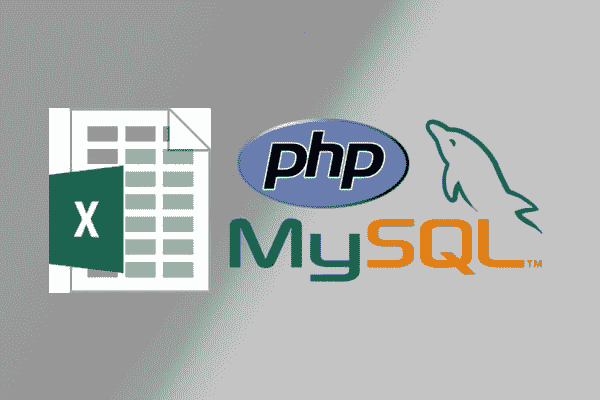

# PHP 如何使用 PHP XLSX 阅读器和 Excel XLSX 转换器将 Excel 导入 MySQL

> 原文：<https://dev.to/mega6382/how-can-php-import-excel-to-mysql-using-an-php-xlsx-reader-and-excel-xlsx-converter-2293>

[](https://res.cloudinary.com/practicaldev/image/fetch/s--6SG8ohka--/c_limit%2Cf_auto%2Cfl_progressive%2Cq_auto%2Cw_880/https://cdn-images-1.medium.com/max/600/0%2ABgL1kH6oowWVmshI.png)

### XLSX 是什么

XLSX 是一种用于创建 Excel 电子表格的文件格式。它最初是由微软在 Excel 2007 中推出的。它是基于 XML 的，这使得在应用程序之间传输数据更加容易。

XLSX 文件以单元格的形式在工作表中存储数据。单元格包含在行和列中，这些行和列可以具有单元格数据的多种属性，如样式、格式、对齐等..

XLSX 实际上是一个简单的 ZIP 存档。它包含多个 XML 文件，这些文件包含电子表格属性的所有信息。

### 解析 PHP 中的 XLSX

用 PHP 解析 XLSX 有多种方法。正如上面提到的，XLSX 文件是基于 XML 的 ZIP 存档。

您只需要提取 ZIP 文件内容文件，并使用任何 XML 解析器解析它们。但是使用现成的 XLSX 解析器更容易，因为它可能包含更多的功能。使用 PHP 解析 XLSX 的流行包很少:

1.  电子表格 _Excel_Reader

2.  PHPExcel

3.  [SimpleXLSX](https://www.phpclasses.org/package/6279-PHP-Parse-and-retrieve-data-from-Excel-XLS-files.html)

在本文中，我更多地关注于 [SimpleXLSX 包](https://www.phpclasses.org/package/6279-PHP-Parse-and-retrieve-data-from-Excel-XLS-files.html)以及如何使用它来解析 XLSX 文件并将其数据导入 MySQL 数据库。

使用 SimpleXLSX 包，您可以从电子表格中以行的形式获取数据。您可以将这些信息用于自己的目的。

### 在 MySQL 中导入 XLSX 的方法

由于 XLSX 文件包含多个文件，因此不能直接导入 MySQL。所以推荐的方法是将 XLSX 文件转换成 CSV 文件，然后导入到 DB 中。

还有一个在线工具可以用来做这件事。您只需上传 XLSX 文件，它就会为其创建 insert 语句。

还有大量的桌面软件，如 Excel2MySQL、Navicat、MySQL for Excel、Mr. Data Converter 等..您也可以使用 PHP 中的 XLSX 解析器来完成这项工作。在下一节中，我将更详细地介绍这种方法。

### 通过 PHP 在 MySQL 中导入 XLSX

正如我上面提到的，您可以使用用 PHP 编写的 XLSX 解析器将 XLSX 文件数据导入 MySQL 数据库。您可能想知道为什么要大费周章地使用解析器，而将 XLSX 导入 MySQL 数据库还有其他更简单的方法。

这种方法有很多用途，包括将用户提供的 XLSX 文件自动导入数据库。这可以通过几种方式使用 SimpleXLSX 来完成。

第一种方法是在 PHP 中解析 XLSX 文件，然后将其更改为 CSV，并导入到 MySQL 中，这可以使用类似下面的代码来完成:

```
<?php

    include 'simplexlsx.class.php';

    $xlsx = new SimpleXLSX( 'countries_and_population.xlsx' );
    $fp = fopen( 'file.csv', 'w');
    foreach( $xlsx->rows() as $fields ) {
        fputcsv( $fp, $fields);
    }
    fclose($fp); 
```

Enter fullscreen mode Exit fullscreen mode

使用上面的代码，您可以将 XLSX 文件解析为 CSV 文件，然后您可以轻松地将 CSV 文件导入 MySQL 数据库。

另一种方法是将 XLSX 文件解析成一个数组，并使用 mysqli 或 PDO 扩展将其导入 db。您可以通过使用类似下面的代码来做到这一点:

```
<?php

    include 'simplexlsx.class.php';

    $xlsx = new SimpleXLSX( 'countries_and_population.xlsx' );
    try {
       $conn = new PDO( "mysql:host=localhost;dbname=mydb", "user", "pass");
       $conn->setAttribute( PDO::ATTR_ERRMODE, PDO::ERRMODE_EXCEPTION);
    }
    catch(PDOException $e)
    {
        echo $sql . "<br>" . $e->getMessage();
    }
    $stmt = $conn->prepare( "INSERT INTO countries_and_population (rank, country, population, date_of_estimate, powp) VALUES (?, ?, ?, ?, ?)");
    $stmt->bindParam( 1, $rank);
    $stmt->bindParam( 2, $country);
    $stmt->bindParam( 3, $population);
    $stmt->bindParam( 4, $date_of_estimate);
    $stmt->bindParam( 5, $powp);
    foreach ($xlsx->rows() as $fields)
    {
        $rank = $fields[0];
        $country = $fields[1];
        $population = $fields[2];
        $date_of_estimate = $fields[3];
        $powp = $fields[4];
        $stmt->execute();
    } 
```

Enter fullscreen mode Exit fullscreen mode

### 下载 SimpleXLSX 包

解析 XLSX 文件相当容易。SimpleXLSX 包提供了一种简单的方法来读取和转换任何 XLSX 文件，因此可以用 PHP 应用程序需要的任何方式处理它，甚至可以将数据插入到 MySQL 数据库中。

您可以下载压缩格式为[的 SimpleXLSX 包](https://www.phpclasses.org/package/6279-PHP-Parse-and-retrieve-data-from-Excel-XLS-files.html#download)，或者按照[下载页面](https://www.phpclasses.org/package/6279-PHP-Parse-and-retrieve-data-from-Excel-XLS-files.html#download)中的说明使用 composer 工具安装它。

与其他 PHP 开发人员分享这篇文章，他们可以从这些信息中受益。如果您有问题，请在下面发表评论