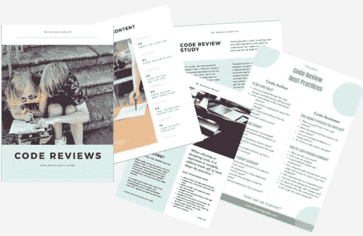
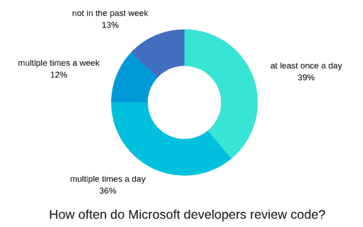
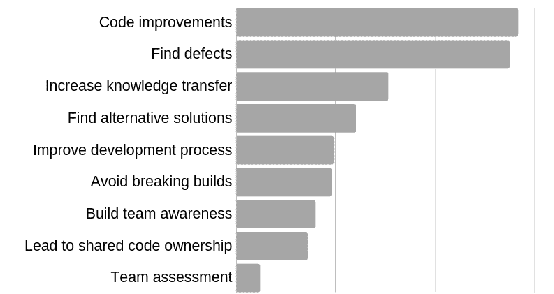
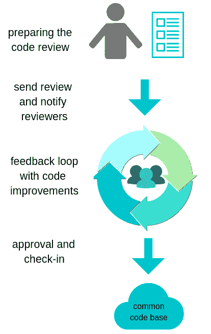
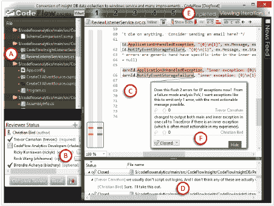

# 代码评审在微软是如何工作的

> 原文：<https://dev.to/mgreiler/how-code-reviews-work-at-microsoft-4igc>

您是否曾经想过，全球最大的软件公司之一是如何通过代码审查来确保高质量代码的？

我也是。这就是为什么我们和我的同事一起调查了微软是如何进行代码审查的。这是惯例吗？开发人员需要做代码审查吗？他们使用哪些工具？

让我们在这篇文章中找到答案，这篇文章是关于代码评审 的大型博客文章系列的一部分，向您展示了[代码评审最佳实践](https://www.michaelagreiler.com/code-review-best-practices/)、[代码评审陷阱](https://www.michaelagreiler.com/code-review-pitfalls-slow-down/)、[谷歌代码评审](https://www.michaelagreiler.com/code-reviews-at-google/)以及更多。

首先，让我给你一些关于微软的重要信息。微软大约有 14 万名员工。其中大约 44%是工程师，这意味着超过 60，000 名员工。Office、Visual Studio 或 Windows 等几个产品是由成千上万的工程师开发的，他们同时使用同一个代码库。

我说这些是为了让你对协调和管理软件开发过程的含义有一些了解和认识。正如您所想象的，确保不同子团队开发的代码能够完美地协同工作是一项艰巨的任务。代码审查在微软发挥了很大的作用，以允许如此大规模的顺利合作。

## 在微软，代码评审是开发过程中不可或缺的一部分

当谈到微软的代码审查时，一个重要的事实是它是一个被高度采用的工程实践。成千上万的工程师认为这是一个伟大的最佳实践。大多数高绩效团队花大量时间进行代码评审。

* * *

在微软，代码审查是一项被广泛采用的工程实践，并被视为最佳实践。

[点击推文](https://twitter.com/intent/tweet?url=https://www.michaelagreiler.com/code-reviews-at-microsoft-how-to-code-review-at-a-large-software-company/&text=%20At%20Microsoft%2C%20code%20reviewing%20is%20a%20highly%20adopted%20engineering%20practice%20and%20perceived%20as%20a%20great%20best%20practice.%20%20&via=mgreiler&related=mgreiler)

* * *

我为我的电子邮件订阅者准备了一本独家的[代码评审电子书](https://www.michaelagreiler.com/code-review-e-book/)，帮助你记住代码评审的最佳实践。我还添加了其他关于代码审查的深刻见解和总结。立即获取 12 页的代码评审洞察。还不是订户？报名就好。

<figure> 

<figcaption>[独家代码评论最佳实践电子书](https://www.michaelagreiler.com/code-review-e-book/)送给我的订阅者。</figcaption>

</figure>

## 在微软调查代码审查

因为代码评审在微软开发过程中扮演着如此重要的角色，所以它是我们深入挖掘并真正理解这种实践的优点和缺点的理想目标。[在微软的一项大规模代码评审研究中，](https://www.michaelagreiler.com/wp-content/uploads/2019/03/Code-Reviewing-in-the-Trenches-Understanding-Challenges-Best-Practices-and-Tool-Needs.pdf)我们采访、观察和调查了 900 多名开发人员，了解他们的代码评审实践。

我们的目的是了解在微软代码评审是如何进行的。我们想知道，哪些[代码评审陷阱](https://www.michaelagreiler.com/code-review-pitfalls-slow-down/)开发人员在进行代码评审时会面临，以及他们开发了哪些[代码评审最佳实践](https://www.michaelagreiler.com/code-review-best-practices/)来克服这些挑战。

## 你能从微软的代码评审实践中学到什么？

大部分经验教训对于小型团队和组织来说，就像对于大型团队和组织一样有价值。如果您的团队还没有进行代码审查，我将我们的发现提炼出来，向您展示这种实践的好处。我还解释了代码评审生命周期是怎样的，这样您就可以将这种实践结合到您自己的开发过程中。

如果您的团队已经进行了代码评审，您可以将您的实践与微软的代码评审实践进行比较。你的代码评审生命周期看起来不同吗？在接下来的文章中，你将从[代码审查陷阱](https://www.michaelagreiler.com/code-review-pitfalls-slow-down/)和[代码审查最佳实践](https://www.michaelagreiler.com/code-review-best-practices/)中学习。有了这些信息，您就可以开始查看您的团队是否已经实现了我所介绍的所有最佳实践并克服了挑战。但是，让我们开始吧:

## 微软工程师多久进行一次代码评审？

在这项研究中，36%的开发人员说他们一天进行多次代码审查。另外 39%的开发人员说他们每天至少做一次代码审查。12%的人每周进行多次代码审查，只有 13%的人说他们在过去一周没有进行代码审查。

<figure> 

<figcaption>
微软开发人员多久审查一次代码？</figcaption>

</figure>

这意味着微软的开发人员在代码审查上花费了大量的时间。因此，确保这段时间花得有价值是很重要的。但是，代码审查提供了哪些好处呢？

* * *

微软的开发人员在代码审查上花费了大量的时间。

[点击推文](https://twitter.com/intent/tweet?url=https://www.michaelagreiler.com/code-reviews-at-microsoft-how-to-code-review-at-a-large-software-company/&text=Developers%20at%20Microsoft%20spend%20a%20significant%20amount%20of%20their%20time%20on%20code%20reviews.%20%20&via=mgreiler&related=mgreiler)

* * *

## 代码评审提供了哪些好处？

开发人员提到的代码评审的好处的最重要的原因是提高代码质量和发现代码中的缺陷。代码审查的另一个重要好处是知识转移。

知识转移意味着团队成员审查彼此的代码，熟悉代码库的大部分。但是，这也意味着[代码审查最佳实践](https://www.michaelagreiler.com/code-review-best-practices/)是在团队内部开发的。另一个好处是，新的团队成员和初级开发人员可以在审查或获得反馈的同时学习和提高他们的编码技能。

如果开发人员在代码评审期间讨论备选解决方案，这不仅会改进代码库，还会对所有相关人员产生学习效果。因此，学习、指导和自我提高都是代码审查在微软被视为有益实践的原因。

<figure> 

<figcaption>代码评论的好处</figcaption>

</figure>

* * *

开发人员做代码评审是为了改进代码，发现缺陷，但主要是为了增加团队成员之间的知识转移和学习效果。

[点击推文](https://twitter.com/intent/tweet?url=https://www.michaelagreiler.com/code-reviews-at-microsoft-how-to-code-review-at-a-large-software-company/&text=Developers%20do%20code%20reviews%20to%20improve%20the%20code%2C%20to%20find%20defects%2C%20but%20mostly%20to%20increase%20the%20knowledge%20transfer%20amongst%20team%20members%20and%20for%20the%20learning%20effects.&via=mgreiler&related=mgreiler)

* * *

## 但是一个开发人员通常如何进行代码评审呢？

代码审查可以用许多方式来执行。有时，这就像一个开发人员走到另一个开发人员的办公桌前一起看一些代码一样非正式。其他时候，团队以小组的形式一起评审代码。但是你在微软遇到的最有可能的情况是代码评审是在工具的帮助下完成的。

## 微软的代码审查通常是通过内部工具来完成的

有各种各样的代码审查工具可用，在微软，团队可以自由选择他们的工具。2016 年，89%的开发者表示要使用 CodeFlow 代码评审工具。稍后，我将详细解释微软的这个代码审查工具。从那以后，随着 Git 的兴起，工具领域发生了变化。一旦有更新的数据，我会尽快添加进去。但是，让我们考虑一个典型的审查情况:

让我们想象一个微软的开发人员，让我们称她为 Rose。Rose 刚刚完成了一个专题的一部分，现在希望得到同事的反馈。

## Rose 如何在微软开始代码评审？

嗯，如前所述，Rose 准备接受一些反馈。因此，她首先准备代码以供审查。这一步包括她打开代码审查工具，这允许她预览代码变更。代码审查工具执行一些不同的任务，帮助 Rose 确切地看到她做了哪些更改。

在仔细审阅这些更改后，她准备了一个小纸条，告诉审阅者她做了什么以及为什么要这样做。这个注释帮助评审者理解代码变更的目的和动机。现在代码可以发送给评审人员了。

## Rose 如何挑选合适的代码评审人员？

许多有经验的开发人员知道谁应该进行代码审查。然而，对于团队中的新人，或者对于新的工作领域，选择可能会有点棘手。如果 Rose 不知道应该添加谁，她会查看团队政策或询问她的同事。她还可以使用代码评审工具的推荐功能，这有助于根据对代码库的经验和知识来选择评审者。

## 谁是相关审核人？

Rose 选择她认为可以为这段代码贡献知识的评审员。评审者通常是其他开发人员，但是也可以包括其他利益相关者，比如开发-运营工程师、UI 专家或者经理。一些评审者是因为他们的专业知识而被挑选出来的，其他的是为了随时了解即将到来的变化。

<figure> 

<figcaption>
一段代码复习的常见步骤</figcaption>

</figure>

## Rose 向她的同事寻求反馈

一旦每个人都被选中，Rose 发送代码评审(通过按发送按钮😄！代码评审工具自动发送通知，告知每个人代码评审已经创建。显然，通知会发送给所有审阅者。但是，其他团队的经理或产品经理等其他相关方通常也会被添加到通知列表中，并在每次评审时被自动通知。这些通知让他们留在循环中。他们不需要执行审查。

## 接收反馈是一个反复的过程

一旦 Rose 的同事有时间，他们会查看代码审查。每个评审者都可以注释代码并添加评论。一旦完成注释，评审者就将注释后的代码发送回 Rose。Rose 现在可以处理注释，并准备一个新的改进版本的代码。

评审人员通常会寻找这样的东西:代码看起来没有错误吗？有建筑问题吗？是否存在遗漏注释、拼写错误等小问题？不是所有的评论都同样有价值。但是，有几个最佳实践可以提升代码评审注释的价值。

## 罗斯准备了新的改进版代码

Rose 通过修正和处理建议来处理反馈。如果 Rose 发现有一些误解或其他有争议的问题，她可能会走向一位同事，当面讨论这个问题。这有时比通过工具更容易和更个人化。

无论如何，一旦她完成了所有反馈的工作，她就将代码的新版本发送给评审人员。这个新的改进版本被称为修订版。

如果需要，她将收到进一步的反馈。这种循环是否会持续几次取决于变化的类型及其质量。对于简单和小的代码变更，通常只需要一次代码审查修订。对于其他更复杂的变更或有问题的代码中的变更，可能需要多次迭代。

这是完全正常的，也是部分可取的，这个代码评审反馈周期在作者和代码评审者之间引发了一些讨论。

## 所有审核人批准和升检-在代码中

在这个评审周期之后，评审人员将代码标记为 ok，Rose 最终可以将代码签入到公共代码库中。

一些团队有政策，允许开发人员在实际评审完成之前签入代码。这通常仅限于小的和琐碎的变更，以便允许异步评审和加速开发。

我描述的所有步骤都是微软典型的代码评审生命周期的一部分，由所有团队执行。根据团队的政策，团队对每一步都更加严格或严谨。

## 不是所有的团队都一样

你可以想象，不是所有的 60，000 名工程师，也不是所有的数千个团队都这样做。微软的一些团队在代码评审生命周期中需要额外的步骤或工具。我想给你一个简短的概述，团队添加到代码评审过程中的一些额外的步骤。

## 代码评审包括测试结果

你最不希望的就是浪费时间去检查“自动可检测”的错误代码。我的意思是，如果您可以运行自动化测试，并意识到代码没有按预期工作，那么，这就是您应该做的:在评审之前运行测试。

这就是为什么一些团队要求每次代码评审都提交测试结果。这样，没有人会忘记运行测试。并且它保证了对于给定的代码变更，测试已经实际运行并通过。

其他团队甚至更进一步，以这样的方式配置代码评审工具，对于开发人员提交的每个代码评审，都会触发一个构建。该构建包含了确切的变更，并且还开始了一系列的自动化测试。这个构建和这些测试的结果被附加到代码评审中。以这种方式配置可以确保代码更改已经用公共代码库中的最新代码更改进行了测试。

## 代码评审包括用户界面

如果更改影响了用户界面，要求开发人员提交截图也是一个明智的想法。通过这种方式，代码审查者可以在不运行代码的情况下看到代码更改的效果。第二，代码审查者可以在自己的机器上运行代码时发现差异。

## 代码评审包括静态分析

静态分析工具的好坏取决于它们的配置，但是，就样式问题而言，它们可以为代码审查人员节省大量时间。微软的一些团队使用自动静态和动态分析工具作为专门的机器人审查者。这些机器人评论代码样式和其他静态问题。因此，为人类代码审查人员腾出时间来执行更有趣的任务。

## 微软的代码审查工具

多年来，微软代码评审的事实标准之一是一个叫做 CodeFlow 的内部工具。这是一个复杂的代码审查工具，它支持开发人员并指导他们完成代码审查的所有步骤。CodeFlow 在代码准备期间提供帮助，自动通知审阅者，并具有丰富的评论和讨论功能。

CodeFlow 是一个 UI 繁重的工具，很像 Word 或 PowerPoint，正如你在下面的截图中看到的。

<figure> 

<figcaption>代码流截图(2016 年)
</figcaption>

</figure>

### CodeFlow 的接口说明

如果你愿意，你可以跳过这一步，但是对于所有感兴趣的人来说，我将带你浏览 CodeFlow 的界面。查看截图，在左边(A)您可以看到所有受影响的文档。

同样在左侧，您可以看到(B)分配给该审阅的审阅者列表及其状态(例如，已签署或待定)。活动文档显示在编辑器(C)中。在底部，您可以看到(D)所有文档的注释列表。

另一方面，在活动文档(F)中是一个单独的注释。该注释与代码的具体部分相关(例如，一行中的一个单词)。最后，在顶部，您可以看到代码评审的整体状态。在这种情况下，已完成。前面的数字表示不同的版本。在这次审查中，共进行了五次修订。

## 评论功能

CodeFlow 最好的特性之一是它的注释功能。

代码评审者可以非常精确地选择她想要评论的代码部分。例如，审阅者甚至可以只突出显示一行中的一两个字符，而不是突出显示一整行。然后，审阅者可以对该选择附加注释。

代码作者或其他评审者被告知这个评论，并且可以围绕这个评论以线索的形式开始对话。

## 讨论功能

这种评论功能感觉像是在社交媒体平台上发表评论，比如 Twitter 或脸书。因此，CodeFlow 中的评论体验感觉非常自然，允许进行丰富的对话和讨论。另一个好处是可以给每个评论线程分配一个状态。例如，状态可以是“不会修复”、“已解决”或“打开”。

## 代码评审版本之间的比较

一个有用的特性是可以选择两个不同的代码审查版本，并比较它们之间的差异。这意味着您可以确切地看到代码评审作者在一个代码评审版本和另一个代码评审版本之间执行了哪些变更。这对于跟踪审查的进展非常方便。

## 代码审查分析工具

开发人员在微软花了大量的时间进行代码审查。为了确保这段时间用得其所，微软有自己的代码审查分析平台。

这个平台存储了所有的代码评审数据，从被评审的代码、参与代码评审的开发人员，到开发人员的所有评论。甚至每个修订版的代码变化都可以追溯。

这个[代码评审数据是微软几个关于代码评审的实证研究](https://queue.acm.org/detail.cfm?id=3292420)的基础。许多产品团队也使用它来跟踪他们的生产力，并了解他们自己的代码评审实践。此外，我在[这个关于微软](https://www.michaelagreiler.com/code-review-blog-post-series/)代码评审的博客系列中分享的许多见解都来自于对这些代码评审数据的研究和分析。

## 微软代码审查的未来

随着微软参与并收购 GitHub，变革不可避免。例如，微软内部大量采用 Git 作为源代码控制工具，这种变化是显而易见的。但是，这也意味着在微软，以拉请求形式的代码审查正在上升。

我肯定会计划在以后使用拉请求来处理代码审查。

## 想要更多关于代码评审的信息吗？

查看[已被证实的代码评审最佳实践](https://www.michaelagreiler.com/code-review-best-practices/)，了解你应该避免哪些[代码评审陷阱](https://www.michaelagreiler.com/code-review-pitfalls-slow-down/)，以及如何[通过大量反馈提升你的代码评审价值](https://www.michaelagreiler.com/great-code-review-feedback/)。

为了**跟上潮流**并且从不错过一篇博客文章，**在我的电子邮件列表中注册**。另外，[让我们在推特上联系一下](https://twitter.com/mgreiler)。

我为我的电子邮件订阅者准备了一本独家的[代码评审电子书](https://www.michaelagreiler.com/code-review-e-book/)，帮助你记住代码评审的最佳实践。我还添加了其他关于代码审查的深刻见解和总结。现在就获取 12 页的代码评审洞察。还不是订户？报名就好。

<figure> 

<figcaption>[独家代码评论最佳实践电子书](https://www.michaelagreiler.com/code-review-e-book/)送给我的订阅者。</figcaption>

</figure>

**信用到期时的信用:**

我想提一下我在微软和维多利亚大学的同事们，他们也参与了这项研究:克里斯·伯德、T2、亚采克·切沃恩卡、T4、劳拉·麦克劳德和玛格丽特·安妮·斯托里。我喜欢和你一起做这个 

微软的帖子[代码审查如何工作最先出现在](https://www.michaelagreiler.com/code-reviews-at-microsoft-how-to-code-review-at-a-large-software-company/)[的麦克凯拉医生](https://www.michaelagreiler.com)上。