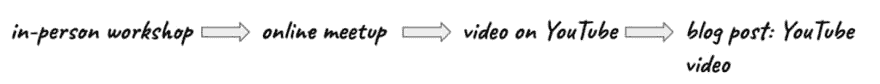
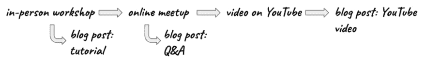
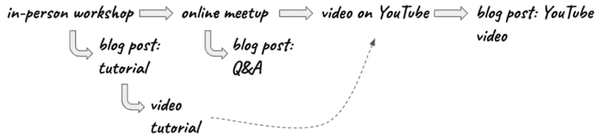
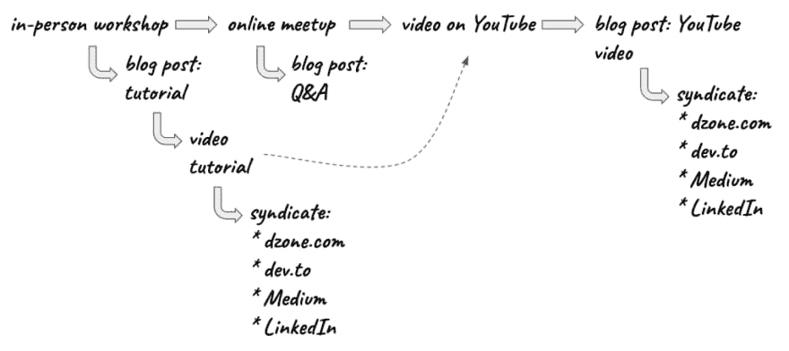
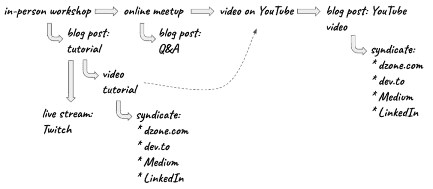
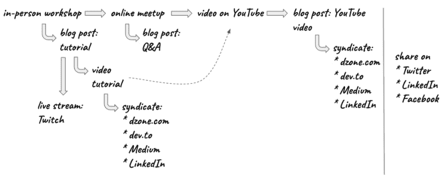

# 内容如何创造内容

> 原文：<https://dev.to/ibmdeveloper/how-content-creates-content-3edj>

许多开发者倡导项目的很大一部分是内容。内容可以是教程、博客帖子、视频和实践研讨会等形式。提出内容想法并不总是容易的。在这篇博文中，我将分享一些如何简化内容创作的想法。

IBM 开发人员 SF 团队主持每周的活动。我们至少举办一次现场活动和一次在线活动(网络研讨会/在线会议)。对于每个面对面的研讨会，我们都会举办一次在线活动。通常最好在现场活动之后举办在线活动，因为无法参加现场活动的人可以观看在线版本(但其他方式也可以)。现场活动约两小时，在线活动通常为 40 分钟。所以是的，内容会有所不同，但基础是一样的。这是第一个通过实践研讨会轻松创建在线活动内容的例子。

我们在 Crowdcast 上举办我们的[在线活动，活动被自动记录，并且在活动结束后几分钟就可以获得记录。该视频可以下载并上传到您的 YouTube 频道。就在那里，你有另一个内容。你也可以把视频拍下来，用它写一篇博文。在博文中嵌入视频，并简短描述你所涉及的内容。那是另一个内容思路。](https://www.crowdcast.io/ibmdevelopersf)

下面是一个如何开始的例子:

这是很好的考虑这一切从一个单一的内容块。

大多数在线活动的结尾都有问答环节。即使你能回答所有的问题，由于时间的限制，你的回答可能会很短，也不是很详细。活动结束后，你可以回答这些问题，并在博客上发布更详细的答案。也有可能你不知道一两个问题的答案。你可以告诉观众去看看你的博客，在那里你会公布所有问题的答案，以及你不知道答案的问题。

我们举办的现场活动通常都是动手型活动。这意味着开发人员带着他们的笔记本电脑，他们编码、构建和部署应用程序。您可以采取研讨会的步骤，并将其作为教程发布在博客上。那是另一个内容。

现在，您可以更进一步，从教程创建一个视频教程。我知道这非常类似于在线聚会，但视频教程将只显示如何建立解决方案的步骤。这将是一个非常技术性的视频。你也可以根据视频写一篇博文。

您创建的所有这些精彩内容都可以整合到许多其他平台上。例如，如果你第一次在自己的博客上发表文章，那么你可以联合[dzone.com](http://dzone.com)、[发展到](http://dev.to)、Medium 和 LinkedIn。LinkedIn 内置了一个不错的[发布平台](https://www.linkedin.com/post/new)(除了常规的社交媒体分享之外)。当然，你可以选择在哪里和从哪里联合。

假设你也想在 Twitch 上做直播。例如，您可以学习教程并在 Twitch 上实时构建应用程序:

事实上，您创建的所有内容都可以在各种社交媒体渠道上分享:

我希望这能有所帮助，并证明一个单独的内容可以产生更多的内容。请记住，这只是为您的程序定制的模板。顺序可以很容易地改变，箭头基本上可以从和到任何地方。您可以轻松添加其他资源，如 GitHub、Stack Overflow、您的公司博客和其他资源。