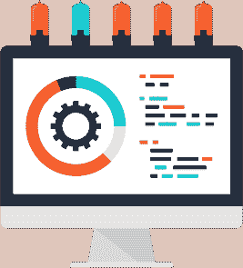

# 开发人员应该如何使用 DBaaS(数据库即服务)来优化他们的应用程序开发

> 原文：<https://dev.to/scalegrid/how-devops-should-use-dbaas-database-as-a-service-to-optimize-their-application-development-1783>

[数据库即服务](https://scalegrid.io/) (DBaaS)在整个科技界迅速流行起来。这些软件平台解决方案帮助用户轻松管理他们的数据库操作，而不必真正理解任何抽象概念。这使得开发人员、DBA 和 DevOps 工程师能够快速实现备份自动化，创建新的 SQL 和 NoSQL 集群，并监控其应用程序的数据库性能，而无需任何内部数据库专业知识。

DBaaS 属于[平台即服务](https://scalegrid.io/blog/the-future-of-the-application-stack/) (PaaS)的范畴，其中平台本身实际上是一个或多个数据库。这对于 DevOps 来说是一个很好的选择，因为它允许更高的开发灵活性、生产率和安全性。

一般来说，灵活性和可伸缩性在开发和技术领域变得越来越重要，我们都知道这个世界发展得有多快。企业需要新的方法来跟上竞争的步伐，开发人员正在寻找一种简单的自助式数据库管理模式，以优化他们的应用程序开发。让我们来分解一下各自的优势，这样您就可以[决定 DBaaS 是否适合您的 DevOps 团队。](https://scalegrid.io/blog/how-devops-should-use-dbaas-database-as-a-service-to-optimize-their-application-development%E2%80%8B/)

## 1。外包安全和管理

在这个时代，外包越来越普遍。2017 年，[64%的外包收入来自信息技术(IT)外包。开发人员也在利用这一点，以便专注于生产力和新项目。](https://www.statista.com/statistics/189800/global-outsourcing-industry-revenue-by-service-type/)

维护数据库是一项很大的任务。您需要处理备份、恢复、优化、升级、创建和修补问题。如果你没有一个专门的团队来维护你的数据库，这可能是相当压倒性的。如果没有合适的工具，光是监控就可能需要整个团队的努力。查看这篇文章，了解更多关于需要关注的关键数据库监控指标的信息。即使你有一个专门的团队，你的发展速度可能比你预期的要快，你需要额外的人手。所有这些都可以通过完全托管的 DBaaS 平台实现自动化。

除了管理职责，外包数据库管理也有助于安全措施。如今，安全性在您的应用程序开发过程中至关重要，因为我们越来越多地听说新公司和应用程序被网络犯罪分子入侵。不用说，这会对您的品牌声誉产生不利影响，这就是为什么您必须采取一切措施来加强应用程序的安全性。大多数 DBaaS 平台都具有强大的安全功能，可以帮助您立即增强防御能力，例如 SSL 加密、本地 SSD 支持和 IP 白名单来管理您的访问控制。检查虚拟专用云(VPC/VNET)支持以保护您的数据免受互联网、安全组支持和完全数据库超级用户访问的影响也很重要，以便您始终拥有对集群的管理控制。

安全和管理外包是一种有效的方式，可以让您更专注于对公司重要的事情，而不是占用新产品创新时间的日常任务。您不能忽视安全和管理任务，这是 DBaaS 如此成功的众多原因之一。

## 2。在云端省钱

如果您需要快速扩展数据库和存储，不受管理的基于云的服务可能会变得非常昂贵。类似地，购买昂贵的内部硬件既昂贵又笨重，并且需要专业的内部专业知识。让您的软件经得起未来考验的唯一方法是准备好按需增长。

借助 DBaaS，您只需在实际需要时投入所需的资源。企业过早扩展并在新软件、硬件或容量上损失数千美元的日子已经一去不复返了，因为您还没有做好准备，或者可能很快就无法满足需求。DBaaS 是一种可以随公司规模而扩展的东西，无论公司是大是小。此外，您不必担心数据库的维护投资，这可以节省员工的人事成本。

## 3。跟踪您的数据和使用情况

数据库即服务还提供了对您的部署的[性能的难以置信的洞察力。通过将数据库托管在云中，您可以从一个管理控制台随时快速访问有关性能、使用情况、空间和资源消耗的所有信息。大多数 DBaaS 提供商提供集群性能的仪表板视图以及实时警报，让您随时了解部署的运行状况。](https://scalegrid.io/blog/meltdown-performance-impact-on-mongodb-aws-azure-digitalocean/)

这是保持你的使用更加有效和高效的简单方法。虽然您不再承担管理组织中所有数据库的重任，但您仍然拥有完全的控制权，这对于正在优化空间、服务和插件等的开发运维团队来说非常重要。

## 4。构建您的可扩展性和可用性

再说一次，在当今的开发世界中，可伸缩性就是一切。您需要按需可扩展性，而这正是 DBaaS 最基本的层面。当您的数据库容量无法满足需求时，无需任何复杂的流程或停机时间即可轻松扩展。手动扩展您的数据库服务器以添加更多 CPU、内存或磁盘空间是一个非常耗时的过程，许多 DevOps 团队在快速开发新应用时都没有这个时间。有了 DBaaS 合作伙伴，您只需点击一下鼠标即可无缝扩展您的服务器，平台将自动处理繁琐的后续工作，以确保整个部署的平稳升级。

准备健康的生产部署的另一个方面是确保云中的高可用性。这是保护您的数据免受任何潜在故障影响的重要配置，因此您的应用程序保持在线并可供您的用户使用。与往常一样，管理和维护高可用性框架需要仔细的规划和设计，对于缺乏这方面专业知识的人来说，这是一项复杂的任务。出于这个原因，DevOps 喜欢 DBaaS，因为您可以通过副本集分发数据，副本集中的节点位于云区域的不同可用性区域。因此，如果一个节点出现故障，您的副本集会自动接管，让您的应用程序保持在线，而不会出现任何宕机。

## DBA as 的崛起

在接下来的几年里，DBaaS 有望在开发运维团队中变得更加普遍。随着组织继续需要更多的数据库类型，如 [MongoDB](https://scalegrid.io/mongodb.html) 、 [Redis](https://scalegrid.io/redis.html) 、 [MySQL](https://scalegrid.io/mysql.html) 和 [PostgreSQL](https://scalegrid.io/postgresql.html) ，以及更强的创新推动以确立其市场地位，将数据库管理外包给 DBaaS 解决方案成为一个容易的决策。当事情出错时(当事情顺利时)，有专家在你身边只会帮助你成长。

考虑你组织的技术系统。如果您计划在未来增加您的[技术堆栈，现在是时候外包您的数据库托管和管理，以确保您的基础设施的连续性和兼容性。对于 DBaaS，您有很多选择，并且像这个行业的大多数一样，不存在一刀切的做法。立即做出改变，在竞争中获得优势。](https://scalegrid.io/blog/the-future-of-the-application-stack/)

这篇文章是博客青蛙的温迪·德斯勒写的。