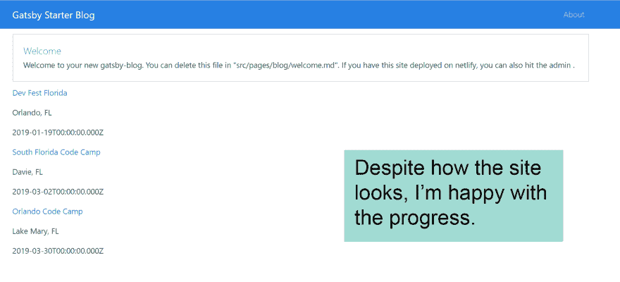

# 你如何开始你的副业？

> 原文：<https://dev.to/_codingblocks/how-do-you-start-your-side-projects-3n82>

我有一个小项目需要完成，为即将到来的关于 [JAMstack](https://jamstack.org/) 的演示做准备。因为我是从零开始这个项目的，所以我决定记录这个过程，这样我就可以*看到*我是如何度过我的时间的。

**下面是视频:**

[https://www.youtube.com/embed/eb5wg80FQXM](https://www.youtube.com/embed/eb5wg80FQXM)

我开始尝试为演示和编码会议定义我的目标。然后我花了一些时间安装需求并设置了 [Github](https://github.com/codingblocks/dev-conferences) 和 [Netlify](https://www.netlify.com/) 。我最终收集了一些数据，并把它们放入索引页面，完成了我晚上的计划目标。

### 原来如此！

现在不要误会我的意思，这个项目看起来很糟糕，而且它仍然充满了所有的示例代码，这些代码来自我选择的的[启动器。但是因为我完成了我的训练目标，我对进步感到高兴。](https://github.com/konsumer/gatsby-starter-bootstrap-netlify)

我看了看我在那大约 2 个小时里写了多少实际代码: [22 行](https://github.com/codingblocks/dev-conferences/commit/8e00e091684c5221c7e0e59a7bf29639264239f0)，其中很多都是花括号！我预计我的大部分时间会花在设置我的新电脑和与第三方服务和文档的互动上，但看到这个数字令人沮丧。尤其是当我对达到今晚的目标感觉如此之好的时候。

那么我是在自欺欺人吗？我对项目感觉良好是因为项目的进展还是因为我勾选了一些框？我是在欺骗自己吗？

### ...也许吧？

也许我通过检查我自己制作的盒子错误地触发了我的[多巴胺奖励系统](https://www.psychologytoday.com/us/blog/wired-love/201507/the-dopamine-reward-system-friend-or-foe),但是我确实认为这个项目的骨骼是坚实的，我处在一个很好的位置，可以迭代到最终状态。

不幸的是，准时且不超出预算在软件开发中并不常见，所以我打算享受这段时间。

* * *

所以，你怎么看，这看起来像你如何开始你的副业吗？

PS:你可以看看[站点现在是什么样子](https://cocky-nightingale-7abbdc.netlify.com/)，或者在 [github、](https://github.com/codingblocks/dev-conferences)上克隆这个项目