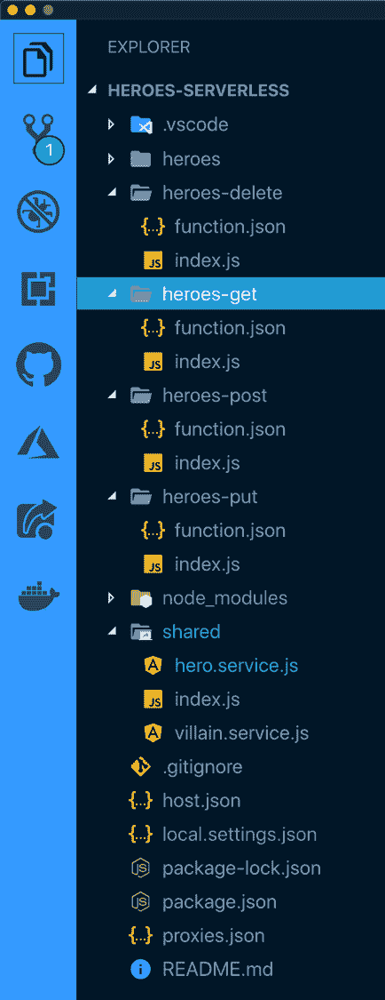

# 当你把你的 API 从 Express 转移到无服务器函数时，你是如何组织你的代码的？

> 原文：<https://dev.to/azure/how-do-you-structure-your-code-when-moving-your-api-from-express-to-serverless-functions-30bc>

有很多文章展示了如何将无服务器功能用于各种目的。很多都涵盖了如何入门，非常有用。但是，当您希望像对 Node.js Express APIs 那样更好地组织它们时，该怎么做呢？

关于这个话题有很多要谈的，但是在这篇文章中，我想特别关注一种组织代码的方法。添加评论，让我知道你还对哪些领域感兴趣，我会考虑在未来涵盖这些领域。

以下是我推荐的一些*入门*资源:

*   [你的第一个带有 VS 代码函数扩展的 Azure 函数](https://code.visualstudio.com/tutorials/functions-extension/getting-started?wt.mc_id=devto-blog-jopapa)
*   [Azure 功能概述](https://docs.microsoft.com/en-us/azure/azure-functions/functions-overview?wt.mc_id=devto-blog-jopapa)
*   [开发者指南](https://docs.microsoft.com/en-us/azure/azure-functions/functions-reference?wt.mc_id=devto-blog-jopapa)
*   [GitHub Repo 中的示例代码](https://github.com/johnpapa/heroes-serverless?wt.mc_id=devto-blog-jopapa)
*   [用于 Cosmos DB 的 JavaScript SDK](https://docs.microsoft.com/en-us/azure/cosmos-db/sql-api-nodejs-get-started?wt.mc_id=devto-blog-jopapa)

## 为什么要构建你的代码？

您可以将所有的函数逻辑放在一个文件中。但是你想这么做吗？共享逻辑呢？测试？调试？可读性？这就是拥有一个模式或结构能有所帮助的地方。有很多方法可以做到这一点。除了我上面提到的，一致性是我的主要目标。

下面是一个非常标准的功能应用程序:

```
FunctionApp
 | - host.json
 | - myfirstfunction
 | | - function.json
 | | - index.js
 | | - ...
 | - mysecondfunction
 | | - function.json
 | | - index.js
 | | - ...
 | - sharedCode 
```

这是我的结构看起来的样子，只是为了英雄 API。

[](https://res.cloudinary.com/practicaldev/image/fetch/s--U2Hl_SQw--/c_limit%2Cf_auto%2Cfl_progressive%2Cq_auto%2Cw_880/https://thepracticaldev.s3.amazonaws.com/i/07y8kaeg3k6g0gnw2kgo.png)

## 你的切入点

您的函数的入口点在一个名为`index.js`的文件中，该文件位于与您的函数同名的文件夹中。

这个函数本身是不言自明的。当这个函数被调用时，上下文被传递给它。上下文可以访问请求和响应对象，这非常方便。然后我调用异步操作来获取我的数据并设置响应。

```
// heroes-get/index.js
const { getHeroes } = require('../shared/hero.service');

module.exports = async function(context) {
  context.log(
    'getHeroes: JavaScript HTTP trigger function processed a request.'
  );
  await getHeroes(context);
}; 
```

> 另一种方法是将`context.res`和/或`context.req`传递给服务。如何选择，由你自己决定。我更喜欢把`req`和`res`放进去，因为它们对我来说更熟悉。但是通过`context`也可以访问其他功能，比如`context.log`。这里没有对错，选择你的冒险，始终如一。

## 数据访问服务

当你创建第一个 Azure 函数时，“hello world”函数通常会返回一个静态字符串消息。在大多数 API 中，在返回响应之前，您需要与另一个数据库或 web 服务进行对话来获取/操作数据。

在我的例子中，我得到了一个英雄列表。所以我将大部分数据访问服务委托给一个名为`hero.service.js`的 Node.js 模块。为什么要这么做？简而言之，组织我的代码(在本例中是数据访问服务),使其干燥(不要重复自己),并隔离责任，使其更容易伸缩、扩展、调试和测试。

`hero.service.js`模块首先获取对容器(包含我的数据库数据的存储单元)的引用。为什么要抽象出来？好问题...我把它抽象成一个共享模块，这样我就可以重用那个逻辑。我将需要获得所有类型的容器，而获得容器需要使用一些特定于数据库的连接 API 来访问数据库。我们一会儿会更仔细地看一下。

`getHeroes`服务接受上下文并使用析构将响应对象放入变量`res`。然后，它尝试获取英雄，当成功时，它将他们添加到响应中。当它失败时，它会以一个错误作为响应。

```
// shared/hero.service.js
const { heroes: container } = require('./index').containers;

async function getHeroes(context) {
  let { req, res } = context;
  try {
    const { result: heroes } = await container.items.readAll().toArray();
    res.status(200).json(heroes);
  } catch (error) {
    res.status(500).send(error);
  }
} 
```

## 共享数据库模块

数据访问服务模块`hero.service.js`从共享数据库模块导入。这个模块是连接数据库的神奇之处。在这个例子中，我通过 npm 中的 Node.js SDK 使用了 [Azure 的 CosmosDB。](https://docs.microsoft.com/en-us/azure/cosmos-db/sql-api-nodejs-get-started?wt.mc_id=devto-blog-jopapa)

注意，代码是通过 Node.js 环境变量读入秘密的。那么它仅仅从适当的数据库中导出容器。我可以使用不同的环境变量，而不需要改变代码。

```
// shared/index.js
const cosmos = require('@azure/cosmos');

const endpoint = process.env.CORE_API_URL;
const masterKey = process.env.CORE_API_KEY;
const databaseDefName = 'vikings-db';
const heroContainerName = 'heroes';
const villainContainerName = 'villains';
const { CosmosClient } = cosmos;

const client = new CosmosClient({ endpoint, auth: { masterKey } });

const containers = {
  heroes: client.database(databaseDefName).container(heroContainerName),
  villains: client.database(databaseDefName).container(villainContainerName)
};

module.exports = { containers }; 
```

## 你的路线是什么？

我不希望我的 API 是`/api/heroes-get`，但是当执行`GET`动作时，我更喜欢`/api/heroes`，所以我改变了它。我的函数在路径`/heroes-get/index.js`中，在同一个文件夹中，有一个`function.json`文件。这个文件是您配置函数行为的地方。我想改变的关键是路由别名。请注意，我通过在下面的代码块中设置`route: heroes`对此进行了更改。

现在我的终点是`api/heroes`。

```
//  function.json  {  "disabled":  false,  "bindings":  [  {  "authLevel":  "anonymous",  "type":  "httpTrigger",  "direction":  "in",  "name":  "req",  "methods":  ["get"],  "route":  "heroes"  },  {  "type":  "http",  "direction":  "out",  "name":  "res"  }  ]  } 
```

## 有什么意义？

组织代码和隔离逻辑只会让你的生活更容易，如果它有一些切实的积极影响的话，所以让我们来探索一下。当你写下一个更新英雄的函数时，这个函数看起来像下面的代码。

```
const { putHero } = require('../shared/hero.service');

module.exports = async function(context) {
  context.log('putHero: JavaScript HTTP trigger function processed a request.');
  await putHero(context);
}; 
```

有没有注意到它看起来和获取英雄的功能很像？有一种模式正在形成，这是一件好事。这里最大的不同是代码在`hero.service.js`模块中调用`putHero`。让我们仔细看看。

更新英雄的逻辑是孤立的。隔离是`hero.service.js`的主要工作之一，还有获取英雄的逻辑。

展望未来，删除、插入和任何其他操作的逻辑也可以放在这个模块中，并导出供其他函数使用。这使得将这种结构扩展到其他动作和模型变得相对简单。

```
// shared/hero.service.js
const { heroes: container } = require('./index').containers;

async function getHeroes(context) {
  // ...
}

async function putHero(context) {
  const { req, res } = context;
  const hero = {
    id: req.params.id,
    name: req.body.name,
    description: req.body.description
  };

  try {
    const { body } = await container.items.upsert(hero);
    res.status(200).json(body);
    context.log('Hero updated successfully!');
  } catch (error) {
    res.status(500).send(error);
  }
} 
```

## 更无服务器

分享你的兴趣，当我写更多关于无服务器的帖子时，我会记住它们的！与此同时，如果您想要一些*入门*资料，这里还有这些资源:

*   [你的第一个带有 VS 代码函数扩展的 Azure 函数](https://code.visualstudio.com/tutorials/functions-extension/getting-started?wt.mc_id=devto-blog-jopapa)
*   [Azure 功能概述](https://docs.microsoft.com/en-us/azure/azure-functions/functions-overview?wt.mc_id=devto-blog-jopapa)
*   [开发者指南](https://docs.microsoft.com/en-us/azure/azure-functions/functions-reference?wt.mc_id=devto-blog-jopapa)
*   [GitHub Repo 中的示例代码](https://github.com/johnpapa/heroes-serverless?wt.mc_id=devto-blog-jopapa)
*   [用于 Cosmos DB 的 JavaScript SDK](https://docs.microsoft.com/en-us/azure/cosmos-db/sql-api-nodejs-get-started?wt.mc_id=devto-blog-jopapa)

## 功劳与感谢

感谢 [Marie Hoeger](https://twitter.com/_mhoeger) 审阅这篇文章的内容并接受我的反馈。你绝对应该[在推特上关注玛丽](https://twitter.com/_mhoeger)！