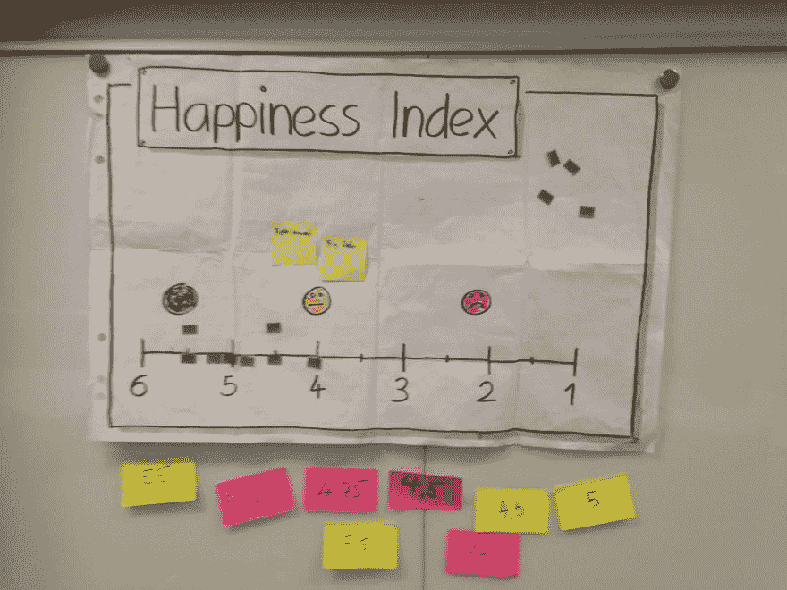
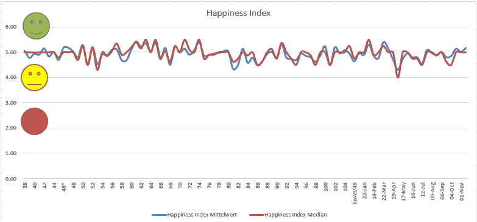

# 你的团队或者你的队友有多开心？

> 原文：<https://dev.to/rueedlinger/how-happy-is-your-team-or-your-teammates-3pgj>

# 幸福指数作为回顾会中的开场白

我知道有很多资源、游戏和想法来开始或组织一次回顾。例如:

*   [http://www.funretrospectives.com/](http://www.funretrospectives.com/)
*   [https://retromat.org/](https://retromat.org/)
*   [http://tastycupcakes.org/](http://tastycupcakes.org/)

但是我个人喜欢以一个**幸福指数**作为破冰活动的开始。它给你一个团队目前快乐程度的概览。

## 什么是幸福指数？

也许你可能听说过《世界幸福报告》。《世界幸福报告》是一项关于国民幸福的年度调查，根据各国的幸福水平进行排名。

基本上是同样的想法，但在这种情况下，每个团队成员都要对自己最近几天的快乐程度进行排名。正如你所看到的，这是非常个人化的，不一定与上周的结果、迭代、冲刺或者其他什么相关。

## 收集数据并对异常值进行注释

我通常以“你有多幸福”这个问题开始。然后，每个团队成员都要对最后几天进行评分，并把它写在便利贴上。在评估过去几天的情况时，我们使用便笺来避免认知偏差。

我收集便利贴，并将评级写在活动挂图上。我使用 6 到 1 的评分表。其中 6 是最高等级，1 是最低等级。这导致了以下规模:

*   6(优秀)，
*   5(好)，
*   4(足够)，
*   3(坏)，
*   2(非常差)和
*   1(大灾难)。

我鼓励团队与其他人分享他们进行个人评定的动机。我的目标是让每个人都了解具体评级的含义。

值得一提的有趣案例是异常值。例如，这些可以是成功的故事，经验教训或与一些障碍斗争的故事。我做了一些笔记，并把它们放在活动挂图上，这样我们就能够重现具体评级的含义。

作为团队，我们决定是否应该继续，并讨论一些如何提高团队快乐的想法。当整体评分非常低，或者某人对当前情况不满意，希望与团队一起寻找解决方案时，可能会出现这种情况。为了开始讨论，我通常会问**“作为一个团队，我们能做些什么来获得更好的评分？”**。

如果没有紧急的主题需要解决，我们将继续使用常见的回顾格式，如 4L、3S 等。(参见[http://www.funretrospectives.com/](http://www.funretrospectives.com/)

## 结论

我喜欢快乐指数，因为它是一个很好的对话开端，易于执行，是一个方便的工具，可以跟踪团队在特定时期内的快乐程度。

但对我来说最重要的一点是，它给了团队中的每个人解决个人问题或分享成功故事的机会。

