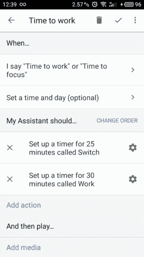
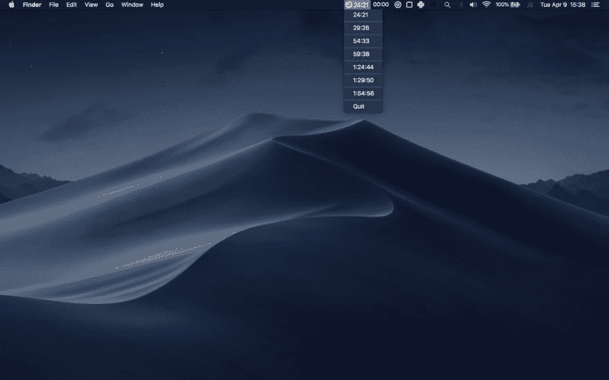
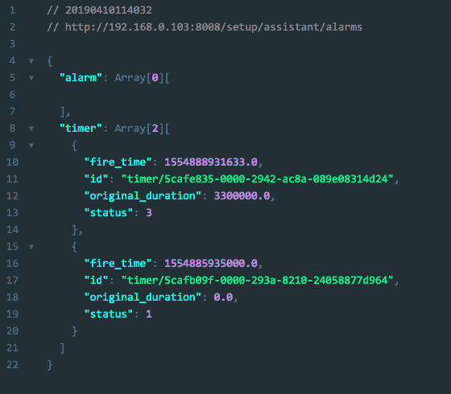

# 我是如何用这个智能家居组合来自动化我的生产力的

> 原文：<https://dev.to/rohovdmytro/how-i-am-automating-my-productivity-with-this-smart-home-setup-15pk>

你曾经使用过计时器来改善你的工作流程吗？我有。设定时间界限对我来说很有效，但是管理计时器就不那么愉快了。

这种情况一直持续到我发现一个更好的方法来支持我的家庭自动化设置的生产力！

这篇文章是系列文章的一部分，在这里我分享了我关于番茄工作法的经验，以及围绕编码、生产力、专注、日志、健康等等建立良好习惯的经验。你可以看看它们[来窃取我的经验]((https://blog.swingpulse.com/pomodoro))。

### 值得注意

大多数时候我在家工作。将我的经历作为灵感来源，将其应用于您的个人工作流程。这不是一步一步的指示。这是一个公开共享的用例，有一些开源代码。

### TL；速度三角形定位法(dead reckoning)

为了以最少摩擦的方式管理我的番茄闹钟，我使用谷歌家庭助手程序和一个桌面应用程序在状态栏中查看这些计时器。

# 头顶上有计时器

我真的很喜欢一个让环境变得对我有利的主意。想法很简单。

> 我可以用一种鼓励我积极行为的方式来组织环境，而不是用意志力去抗争。

关于我以前使用定时器的经历，我能说些什么？

### 管理计时器有点麻烦

加载应用程序、拿起手机、滑动、点击、手势、热键——一切都很简单。但还是我和生产力之间的一些附加动作。

### 躲避逃生舱口

> 我曾经以摩擦为借口打破番茄工作法。

管理自己是一个挑战。当我有一个具有挑战性的番茄大战时，我很容易把挫折作为一个出口。忽略我笔记本电脑上弹出的计时器尤其容易。

去年，我找到了一个更好的方法，对我来说很好，没有这些问题。

# 自动化公式

这是我想出来的公式:Google Home + Pomodoro Technique +电子 App。

> 我已经设置了我的 Google Home 助手来创建我的 pomodoros，并编写了一个应用程序来在 Mac OS 状态栏中显示这些计时器。

这个设置对我来说已经运行了一年了。

### 声音对于这个用例来说非常自然

我发现对我来说，用语音设置定时器是最方便、最省事的方式。只需要把我的屁股动作和我的声音指令同步就行了。别无其他。

### 声音是承诺

一旦一个惯例开始，我就在做一个承诺。出于某种原因，语音命令是我开始工作的一个很好的触发器。

## 设置谷歌家庭自动化

谷歌助手有一个功能叫套路。基本上，你是绑定一个关键字短语太多的行动。所以我设置了一个 Google Home Assistant 例程，通过一个命令创建多个定时器。

在我的例子中，我使用了三个不同的关键词。他们每个人都创造了不同数量的番茄时段——1 时段、2 时段和 4 时段。

这些命令是:

> 嘿，谷歌！该工作了。
> 
> 嘿，谷歌！该努力工作了。
> 
> 嘿，谷歌！是时候努力工作了。

[](https://res.cloudinary.com/practicaldev/image/fetch/s--CpI4Rk4k--/c_limit%2Cf_auto%2Cfl_progressive%2Cq_auto%2Cw_880/https://blog.swingpulse.com/static/be0fb9aff38d3b1c7bf63f6f9c98fbcb/337b6/timers-start.png)

有一天，这将意味着谷歌自己开始做我需要的事情，但目前这项工作是我的一部分。

# 在状态栏显示计时器

要知道还剩多少时间，我可以直接问我的谷歌助手。但是为了更快地获取信息，我做了这个:

[](https://res.cloudinary.com/practicaldev/image/fetch/s--w7gN777Q--/c_limit%2Cf_auto%2Cfl_progressive%2Cq_auto%2Cw_880/https://blog.swingpulse.com/static/5e2aaae521636eebd6b192db3995335a/8d0ff/timers-demo.png)

我会分享一些代码。我们的目标不是成为一个详细的指南，而是概述如何为您的工作流复制类似的东西。

### 获取数据

有一个 URL 可以获取从 google assistant 创建的计时器的 JSON 数据。

```
const URL = `http://${DEVICE_IP_ADDRESS}:8008/setup/assistant/alarms` 
```

Enter fullscreen mode Exit fullscreen mode

JSON 的回应是:

[](https://res.cloudinary.com/practicaldev/image/fetch/s--TR5idtpT--/c_limit%2Cf_auto%2Cfl_progressive%2Cq_auto%2Cw_880/https://blog.swingpulse.com/static/4c269ec5ccc46a63b6cfa2ef366c11b1/02744/timers-json.png)

我们可以从手机应用程序的设备设置屏幕或通过扫描您的本地网络来获取 ip 地址。

### 显示数据

如何处理这些数据由我决定。我决定用一个在菜单栏显示计时器的电子应用程序。我已经开源了这个项目。

我称之为[聚焦子](https://blog.swingpulse.com/focutron)。😄

请记住代码极其丑陋。而且它对用户不友好，可能会有错误。欢迎拉请求！

# 这就行了

我真的很喜欢我的设置，它被证明为我工作了大约一年！你可以偷着改编给自己用。调优环境是一个非常强大的概念。现在，我通过语音设置计时器，没有任何摩擦，并且可以通过应用程序快速查看。不错！

您想到了什么用例？

附:请订阅我的博客，不要错过好东西。也来[推特打个招呼](https://twitter.com/rogovdm)！