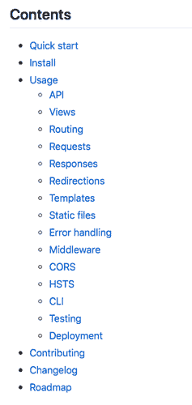
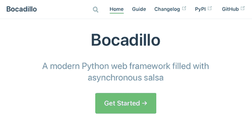
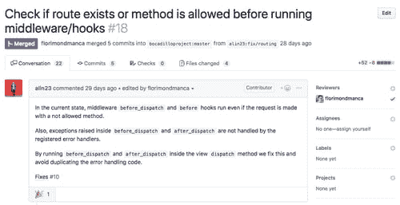

# 我是如何构建 Python Web 框架并成为开源维护者的

> 原文：<https://dev.to/bocadillo/how-i-built-a-python-web-framework-and-became-an-open-source-maintainer-3okd>

*本文最初发表于 [blog.florimond.dev](https://blog.florimond.dev/how-i-built-a-web-framework-and-became-an-open-source-maintainer) 。*

我已经有一段时间没有写博客了。实际上，快两个月了。那么，我去过哪里？

首先，我工程研究的最后一年占用了我比我想象中更多的时间。不过，我不是在抱怨——我已经学到了大量有趣而有用的东西，既有理论上的，也有实践上的。另外，我想借此机会充实地度过这最后一年。

故事的另一面是——我一直致力于构建 [Bocadillo](https://bocadilloproject.github.io) ，一个开源的异步 Python web 框架。这一冒险开始于我学习 web 框架内部的一种方式，到目前为止一直令人兴奋不已。

这意味着，因为一天只有 24 小时，我不得不暂时把写博客放在一边。但现在我在度假，我终于可以花时间反思一下发生了什么。🥳

在这篇博文中，我想把我对构建一个 web 框架的整个过程的想法写在纸上，尤其是对启动一个开源项目的想法。在这个过程中，我已经学到了很多东西，从编程技术到项目管理和开发工具，所以我想与你分享我的经验！

菜单上有什么？

*   [什么是博卡迪略？](#what-is-bocadillo):介绍博卡迪略，以建立一些背景。
*   [这一切背后的故事](#the-story-behind-it-all):我来告诉你它是如何成为我的第一个开源项目的故事！
*   [启动自己的开源项目的技巧](#tips-to-start-your-own-open-source-project):我从经验中收集的一系列**技巧**。

首先，让我向你介绍博卡迪略！(我保证，这将是简短而甜蜜的。)

## 什么是博卡迪略？

##  [博卡迪略项目](https://github.com/bocadilloproject) / [博卡迪略](https://github.com/bocadilloproject/bocadillo)

### (无需维护)面向所有人的快速、可扩展和实时的 web APIs

<article class="markdown-body entry-content container-lg" itemprop="text">

# 通知；注意

博卡迪略现在**无人维护**。这个存储库应该很快归档。我们建议用户迁移到其他支持良好的替代品，如 [Starlette](https://www.starlette.io) 或 [FastAPI](https://fastapi.tiangolo.com) 。更多信息请见 [#334](https://github.com/bocadilloproject/bocadillo/issues/334) 。

* * *

[](https://github.com/bocadilloproject/bocadillo/blob/master/.github/banner.png?raw=true)

[](https://travis-ci.org/bocadilloproject/bocadillo)[](https://codecov.io/gh/bocadilloproject/bocadillo)[](https://pypi.org/project/bocadillo)[T11】](https://github.com/ambv/black)

* * *

文档:[https://bocadillo project . github . io](https://bocadilloproject.github.io)

* * *

Bocadillo 是一个 **Python 异步 web 框架**,它使得构建高性能和高度并发的 web APIs 变得有趣，并且每个人都可以访问。

## 要求

Python 3.6 以上版本

## 装置

```
pip install bocadillo
```

Enter fullscreen mode Exit fullscreen mode

## 例子

```
from bocadillo import App, configure

app = App()
configure(app)

@app.route("/")
async def index(req, res):
    res.json = {"hello": "world"}
```

Enter fullscreen mode Exit fullscreen mode

将此另存为`app.py`，然后启动一个[uvicon](https://www.uvicorn.org)服务器(热重装启用！):

```
uvicorn app:app --reload
```

Enter fullscreen mode Exit fullscreen mode

打个招呼！

```
$ curl http://localhost:8000
{"hello": "world"}
```

Enter fullscreen mode Exit fullscreen mode

准备好开始了吗？[访问文档网站](https://bocadilloproject.github.io)。

## 变更日志

博卡迪略的所有变化都记录在…

</article>

[View on GitHub](https://github.com/bocadilloproject/bocadillo)

### 电梯间距

Bocadillo 是一个**现代 Python web 框架**，它为使用**异步编程**构建高性能 web 应用和服务提供了一个合理的工具包。它与 Python 3.6+兼容，并得到了 MIT 的许可。

想开始吗？[阅读文档](https://bocadilloproject.github.io)！

### 关键人物

博卡迪略最初的承诺是在 2018 年 11 月 3 日。截至 12 月 21 日，即一个半月后，博卡迪略的情况如下:

*   在[bocadillo project/bocadillo](https://github.com/bocadilloproject/bocadillo)repo 上有 500 多个提交和 31 颗星——请随意添加您的！
*   到 [PyPI](https://pypi.org/project/bocadillo) 的 10 个版本—最新版本是 v0.7
*   由 [PePy](https://pepy.tech/project/bocadillo) 测量的 8k+下载量
*   大约 30 页的[文档](https://bocadilloproject.github.io)！
*   2 个开源贡献者——欢迎其他人！🥳

这些数字当然是非常适度的，但我已经很满意了。当然，如果你想支持博卡迪略，你可以:

*   [启动回购](https://github.com/bocadilloproject/bocadillo)
*   [成为投稿人](https://github.com/bocadilloproject/bocadillo/blob/master/CONTRIBUTING.md)
*   [在 Twitter 上关注博卡迪略](https://twitter.com/bocadillopy)

此外，如果你已经尝试过 Bocadillo，请通过 Twitter 或 [Gitter](https://gitter.im/bocadilloproject/bocadillo) 聊天室与我们联系——我很乐意收到你的来信！

### 哲学

就哲学而言，Bocadillo 对初学者来说是友好的，但它的目标是给超级用户他们需要的灵活性。它关注**开发者体验**，同时鼓励最佳实践。

此外，博卡迪略不是极简主义者(但也不是乳齿象)。这个想法是包括**一组精心挑选的内置电池**，带有合理的默认值，这样你就可以**解决常见问题**而**马上就能工作**。

### 目标

我的目标是人们拥抱异步 Python 的新可能性，Bocadillo 成为帮助人们更容易、更有效地解决现实世界问题的工具。

要达到这个目标还有很多工作要做，但是马拉松已经开始了！

说到 *async* Python，让我来回答一个你可能已经问过自己的问题…

### 什么跟异步？

通常，一个 web 应用程序实例花费大量(如果不是大部分)的请求处理时间来等待 I/O 完成——API 调用、数据库查询、文件系统操作。等等。这些操作中的大多数都是*阻塞*，如果多个客户端请求服务器，这通常会限制性能。

像 Bocadillo 这样的异步框架的想法是构建不会阻塞 I/O 操作的应用程序。为了实现这一点，我们利用了**异步编程**和 Python 语言的最新补充，如 [asyncio](https://docs.python.org/3/library/asyncio.html) 和[async/await](https://www.python.org/dev/peps/pep-0492/)——分别来自 Python 3.4+和 3.6+。这使得我们可以把处理一个请求看作是一个“预定”在不久的将来运行的任务，即当 CPU 可用时。

因此，除了更好地利用 CPU，这种架构还有一个非常有趣的优势——我们现在可以**同时处理多个请求***。*

 *(注:我没有把*写成并行*，因为 async 还是用单线程。[并发不是并行](https://www.youtube.com/watch?v=cN_DpYBzKso)。)

随着并发客户端数量的增加，这一特性最终会使**的吞吐量和性能**更加稳定。根据我自己的(有待公布的)基准测试，无论是与 10 个还是 10，000 个客户对话，Bocadillo 都能保持稳定的处理速度。另一方面，像 Flask 或 Django 这样的“同步”框架在高并发设置中显示出每秒请求数的显著下降。

渴望了解更多关于 Python 异步编程的知识吗？以下是我推荐的几个演讲，或许可以按这个顺序观看:

*   [面向完全初学者的异步 Python](https://www.youtube.com/watch?v=iG6fr81xHKA)，Miguel Grinberg，Pycon 2017。
*   [Python 3.5 中的 Async/await 及其为何牛逼](https://www.youtube.com/watch?v=m28fiN9y_r8&t=132s)，Yuri Selivanov，EuroPython 2016。
*   [异步中的恐惧与等待:通往协程之梦核心的野蛮之旅](https://www.youtube.com/watch?v=E-1Y4kSsAFc)，大卫·比兹利，2016 年。

### 实现

Bocadillo 是建立在速度快如闪电的 ASGI 网络服务器 Uvicorn 和 ASGI 工具包 Starlette(T2)的基础上的。两者都是由 Django REST 框架的核心贡献者 [Tom Christie](https://github.com/tomchristie) 创建的。

**注意** : [ASGI](https://asgi.readthedocs.io) 是 WSGI 的异步等价物，即 web 服务器应该如何与*异步* Python web 应用进行通信的规范。

### 特性

【Bocadillo 已经拥有的东西:请求、响应、视图(基于功能和基于类)、路由和路由参数、媒体类型、重定向、模板、静态文件、后台任务、CORS、HSTS、GZip、“配方”(又称蓝图)、中间件、钩子，甚至 CLI。还有更多正在发布中！

不过，Bocadillo 有一件事*还没有*具备，那就是**数据库层**。我构建的大多数 web 应用程序或 API 都需要以某种方式保存数据，所以我相信这一点(或者至少是关于如何集成异步数据库层的官方建议，比如[乌龟 ORM](https://tortoise-orm.readthedocs.io/en/latest/) )应该在某个时候进入框架。

### 您好，世界！

让我们以传统的“Hello，World”脚本结束吧！

```
# api.py from bocadillo import API

api = API()

@api.route("/")
async def hello(req, res):
    res.text = "Hello, World!"

if __name__ == "__main__":
    api.run() 
```

Enter fullscreen mode Exit fullscreen mode

## 一切背后的故事

好了，别再给博卡迪略投球了！现在你知道它是什么了，我想和你分享促使我写这篇博文的故事。

它是如何以及为什么开始的？最有意义的事件是什么？让我们来解决这个问题。

### 边做边学的项目

Bocadillo 开始是作为一种让我了解更多关于 web 框架内部的方式。在使用各种 Python 和 JS web 框架近 2 年后，我想回到幕后。我想知道 T2 实际上是如何运作的。

需要说明的是，博卡迪略一开始并没有一个非常详细的计划。见鬼，我甚至没有想过是否需要一个(其他的)Python 异步 web 框架。我最想学的就是 T1。

### 让我们重新发明轮子，并尽快发布它

因此，在 11 月 3 日，我实现了如此常见的功能，感觉就像**重新发明轮子**。这些特性包括请求、响应、视图、路由或应用服务器。“数百个 web 框架已经解决了这些问题”，我想…

但我并不在乎。作为 [@funkybob](https://dev.to/funkybob) 好心的[跟我调侃](https://twitter.com/BunkyFob/status/1059960013689516032):

> 重新发明轮子是一种很棒的学习方式……有时你学到的只是你现有的框架为你做了多少。

一个支持重新发明轮子的有力论据让我意识到姜戈是一个绝对的庞然大物。

无论如何，这个最初的努力让我在 11 月 4 日在 PyPI 上发布了 [v0.1](https://pypi.org/project/bocadillo/0.1.0/) 。**在最初提交**的两天后，人们已经可以`pip install bocadillo`构建一个最小的异步 web 应用。(谁说 Python 打包很痛苦？🐍)

### 第一个潜在的迹象

在 v0.1 发布后，我继续实现更多的特性，比如新类型的响应或错误处理。

11 月 6 日，v0.2.1 出来了。那时我开始意识到 Bocadillo 是我的第一个全面开放源代码项目的一个很好的候选人。这个想法似乎对我很有吸引力，所以我就去做了！

那时，我还没有透露任何关于博卡迪略的事情，甚至对朋友也没有，所以我想先宣布一下。我选择在推特上做这件事。

因为 Bocadillo 最初的代码设计和实现从 [Responder](https://python-responder.org) 、Kenneth Reitz 自己的异步框架[那里获得了很多灵感，所以我决定大声喊出来](https://twitter.com/kennethreitz/status/1059942147342942209)。

<figure>

[](https://res.cloudinary.com/practicaldev/image/fetch/s--O8UCeKaR--/c_limit%2Cf_auto%2Cfl_progressive%2Cq_auto%2Cw_880/https://florimondmanca-personal-website.s3.amazonaws.com/media/markdownx/22e7446d-09a0-4508-b5a1-3c2c5a629a53.png)

<figcaption>The first announcement about Bocadillo on Twitter, and Kenneth Reitz's answer. ❣️</figcaption>

</figure>

肯尼斯的回答和他转发声明后即将到来的反应让我认为**博卡迪略实际上有潜力**。

仅仅一天，回购就获得了 20 颗星(已经是个人记录了！)而且，虽然它可能看起来微不足道，但我认为它真的很酷。

如果你想让博卡迪略家喻户晓，你也可以让它成为明星并传播这个消息！

所以，在 v0.2 发布后，我觉得有动力继续在 Bocadillo 上工作，并添加更多的功能。

直到我意识到一些事情…

### 单据在哪里？就像，*真正的*医生？

对我来说很清楚:我想让 Bocadillo 成为我的第一个开源项目。我想认真对待*这件事*，以便从这个过程中学到尽可能多的东西。

所以，从一开始，我就写了一份内容丰富的*自述*，策划了一个*变更日志*(在[的帮助下保留一个变更日志](https://keepachangelog.com))并添加了*投稿*指南。随着越来越多的版本在 11 月 6 日至 11 月 18 日之间发布，我更新了变更日志，并在 repo 的自述文件中记录了新功能。

然而很快，这变得不切实际。自述文件越来越大，很难浏览，即使有目录。

<figure>

[](https://res.cloudinary.com/practicaldev/image/fetch/s--AV9IUxSq--/c_limit%2Cf_auto%2Cfl_progressive%2Cq_auto%2Cw_880/https://florimondmanca-personal-website.s3.amazonaws.com/media/markdownx/f8afa87e-0fd0-432c-b11b-1ef77a12e2bb.png)

<figcaption>The table of contents for the repo on November 17th. See that "Usage" section growing to an astronomical size?</figcaption>

</figure>

这时我意识到**我需要适当的文件**。

如果你仔细想想，**好的文档是让人们使用你所构建的东西的必要条件*。考虑到博卡迪略当时的规模，这份冗长的自述并不是一份好文件。***

 *然后，我突然想到——我使用和喜爱的许多大型开源工具、库或框架都有一个**文档站点**。

这促使我在 11 月 18 日发布了 v0.5，并增加了一个重要内容:一个全新的[文档网站](https://bocadilloproject.github.io)，它是我和 [VuePress](https://vuepress.vuejs.org) 一起创建的，并托管在 [GitHub 页面](https://pages.github.com)上。

<figure>

[](https://res.cloudinary.com/practicaldev/image/fetch/s--rND3xJPK--/c_limit%2Cf_auto%2Cfl_progressive%2Cq_auto%2Cw_880/https://florimondmanca-personal-website.s3.amazonaws.com/media/markdownx/140491ee-272e-43a7-86a9-c18721022f9f.png)

<figcaption>Bocadillo's documentation site home page (end of November, 2018).</figcaption>

</figure>

关于良好文档的必要性——[mason ite](https://masoniteframework.gitbooks.io)框架的创建者 Joe Mancuso 曾经与我分享了这条伟大的建议:

> 如果没有记录，它就不存在。

这就是为什么我非常认真地对待文档并努力使它尽可能好——你也应该这样对待你正在做的每个项目。

然后，在建立 docs 网站的时候，我做出了我现在认为对任何开源项目来说都非常重要的一步…

### 让博卡迪略自立

在发布文件之前，我将 Bocadillo 从个人回购转移到了它自己的 GitHub 组织，即 [BocadilloProject](https://github.com/bocadilloproject) 。

当时的主要动机是我可以使用该组织的 GitHub Pages 域`bocadilloproject.github.io`进行文档处理。它肯定比`florimondmanca.github.io/bocadillo`更干净、更容易使用。🙃

然而，这也带来了积极的影响，让博卡迪略拥有了自己的网络空间。它不再与我的个人 GitHub 账户挂钩——这个组织是 Bocadillo 源代码的新家。

后来，当我意识到 Bocadillo announcements 正在接管我的个人 Twitter 账户时，我创建了一个专门的 Twitter 账户。

要点是:**开源项目存在于它的创造者之外是很重要的**。

现在，回到这个故事——11 月 18 日，我建立了一个 docs 网站，人们可以访问它。接下来呢？

### 开辟发展进程

直到 11 月 20 日，我跟踪积压和进展的方式是通过一个私人的 Trello 板。

这对我来说非常实用:我使用 Trello 做很多事情。但我意识到，参与回购的人不知道接下来会发生什么，也不知道他们可能会做出什么贡献。

事实上，从访问者的角度来看，我认为回购看起来就像任何其他个人项目一样——没有问题，没有公关，只是一个人的大量承诺——而不是*而不是*一个社区驱动的努力，也就是我希望博卡迪略成为的样子。

因此，根据我一个密友的建议，并受到 Dhanraj Acharya 的这篇文章的启发，我决定在 T2 公开开发过程。

我把我所有的 Trello 卡都转换成了 GitHub 问题，并给它们添加了有意义的标签(见 Dave Lunny 的 [Sane GitHub 标签](https://medium.com/@dave_lunny/sane-github-labels-c5d2e6004b63))和描述。我认为回购现在为项目提供了更好的可见性，并让新来者感到更受鼓舞。

我从中了解到**开源不仅仅是开放源代码**。你也必须对开发过程持开放态度。

我现在希望，随着回购充满了问题和公共公关，它将吸引其第一批开源贡献者。

剧透:的确如此！

### 耶！第一批投稿人！

大约与此同时，随着博卡迪略的规模不断扩大，我开始感到需要外部建议。我担心我可能做出了错误的设计决策，或者代码本来可以做得更好。简言之，**我需要贡献者**。

幸运的是，还是在 11 月 20 日，我非常高兴地欢迎了回购的第一份贡献，即阿林·帕奈提乌对新“挂钩”功能的 [PR #3](https://github.com/bocadilloproject/bocadillo/pull/3) 的评论。

阿林帮我解决了最初我自己都不确定的一些问题，并提出了让它变得更加有用的建议。他甚至分叉回购，并向我发送了一个不同的炫耀修复。

后来，在 11 月 23 日，阿林得到了他的第一次公关合并。博卡迪略正式迎来了它的第一位贡献者！🎉

<figure>

[](https://res.cloudinary.com/practicaldev/image/fetch/s--vQOlSCOg--/c_limit%2Cf_auto%2Cfl_progressive%2Cq_auto%2Cw_880/https://florimondmanca-personal-website.s3.amazonaws.com/media/markdownx/e338cd3d-ca39-4e06-b176-d5ab87a2fa22.png)

<figcaption>Screenshot of PR #18.</figcaption>

</figure>

尽管我很激动，我还是被感动了。

更重要的是，阿林还留在那里。在 v0.7 版本中，阿林贡献了两个新特性(GZip 和 ASGI 中间件)，代码合并时间可能不到几个小时。谢谢阿林，太棒了！

### 进入维护模式

从 11 月底开始，项目进度有所放缓。一方面，我有点赶学校项目和考试的日程，但这并不能解释一切。我经历了一些别的事情。

你看，一开始，向 Bocadillo 提交代码感觉很容易。几乎没有任何遗产，所以这很令人兴奋，我有很多想法。一切都有待去做。

但随着更多功能的加入，它开始变得沉重。发布需要更长的时间——现在需要一周而不是几天。测试、重构和文档成为开发过程的主要部分。另外，我现在还管理着博卡迪略的在线形象。

不要误解我，我不是在抱怨。事实上，我喜欢我能够通过最初的激励，进入**维护模式**。此外，对于一个试图获得动力并接触社区的项目来说，这绝对是一个正常的转变。

我现在很享受在博卡迪略工作，不需要像开始时那样花很多时间。这让我想到了下一点…

### 不是短跑，是马拉松

我最近注意到我对这个项目的态度发生了变化。

我现在对项目增长缓慢的想法感到更加平静，而不是急于尽快推出新功能，并希望突然出现一批用户，群发明星，热爱这个框架并要求更多。

这源于这样一个事实:维护一个开源项目是一场马拉松，而不是短跑。

换句话说，成功应该永远是副产品，而不是目标。

你可能已经注意到，Bocadillo 的目标声明并没有提到名气，也没有提到用户数量的门槛。它只是说，我希望博卡迪略能帮助一些人解决问题。如果至少有一个人是这样，我会认为这是一个胜利。如果很多人都是这种情况，我只会认为这是一种副作用。

<figure>

[](https://res.cloudinary.com/practicaldev/image/fetch/s--EF6-_9jk--/c_limit%2Cf_auto%2Cfl_progressive%2Cq_auto%2Cw_880/https://images.unsplash.com/photo-1455849318743-b2233052fcff%3Fixlib%3Drb-1.2.1%26auto%3Dformat%26fit%3Dcrop%26w%3D1350%26q%3D80)

<figcaption>Two person standing on gray tile paving. @goian, unsplash.com</figcaption>

</figure>

这就是博卡迪洛建筑背后的故事！从这些讨论中，你可能已经注意到，到目前为止，我一直很喜欢这种体验，实际上，我现在确信，当我决定克服对判断的恐惧并构建自己的 web 框架时，我做出了正确的决定。这让我想到了这篇博文的最后一部分。

## 启动自己的开源项目的技巧

如果我想让你从这篇文章中学到什么，那就是:

> 开源是一种很棒的学习方式。你应该今天就开始你自己的项目！

“听起来很棒”，你想，“但是我应该怎么做呢？有什么建议吗？”

嗯，我确实有一些。😋

首先也是最重要的是，**尽可能多地学习**，并确保**玩得开心**。开源永远不应该成为一个负担，如果它成为了负担，试着找到你可以开始委托或依靠社区来推动项目前进的方法。

至于其他的，请做好准备——分类要点在前面！

**注意**:如果你不确定如何实现以下任何一项和/或想看看我在实践中是如何使用或配置这些工具的，请随意查看 [Bocadillo 的 repo](https://github.com/bocadilloproject) 并复制你感兴趣的部分——毕竟它是开源的！

### 项目定义

*   决定**你想要建造什么**。
*   决定**为什么**你想要建立它——尽管它不一定要深入或抽象，但有一个明确的动机来源会有所帮助。
*   想想**范围**和**设计理念**:这将有助于做出明智的设计决策，并防止功能蔓延。
*   决定你的目标是谁:你的用户是 web 开发人员、系统管理员还是项目经理？
*   明确定义**用户技能期望**:你的用户应该熟悉什么，熟悉多少？
*   决定**你将如何**分发你的项目(例如一个 PyPI 包)。

### 营销&传播

*   建立一个**身份**:至少一个名字和一个标语。让它们简短、吸引人、容易记住。在任何地方展示它们(回购、PyPI 页面、文档网站……)。
*   创建一个**视觉识别**:这是你的标志和图形宪章。有一个还可以的临时 logo 总比没有 logo 好。
*   确定一个**入口点**，即一个人们可以查找你的项目的自然在线位置。它可以是 GitHub repo、docs 网站或任何看起来合适的网站，但它应该存在。(对于博卡迪略，我相信这是 docs 网站。)
*   给你的项目**一个自己的生命**:创建一个独立的 GitHub 组织或社交媒体账户是个好主意。
*   使用**社交媒体**交流新闻、公告和提示，并开始召集项目周围的人(我使用 Twitter 来做这件事)。
*   为人们提供查看**的方法，比如路线图、问题列表、变更日志中的“未发布”部分等。**

### 社区

*   实施**开源最佳实践**:一份合适的*自述*，投稿指南、行为准则、问题/公关模板等(使用 GitHub 的清单！).这将使回购更受潜在贡献者的欢迎，并表明你关心社区。
*   支持他人，善待他人。感谢他们的提问。提供有用的资源。
*   为非正式讨论创造一个场所可能是个好主意。我最近决定尝试一个聊天室。

### 项目管理

*   使用 **GitHub issues** 列出您的待办事项。这样，当你想知道你下一步应该做什么的时候，就拿起一张票开始做吧！
*   设置有意义的问题标签(见 [Sane GitHub 标签](https://medium.com/@dave_lunny/sane-github-labels-c5d2e6004b63))。
*   您还可以建立一个 **GitHub 项目**来在看板中显示您的问题和 PRs。

### 代码质量

*   设置一个 **CI/CD 管道**。
*   在**测试**中不要手软——除了确保你的软件按照预期工作，它们还会帮助你和每个人发现回归，并在做出改变时充满信心(我使用 [pytest](https://pytest.org) 作为测试框架)。
*   测量**测试覆盖率**(我使用 [pytest-cov](https://pypi.org/project/pytest-cov/) 进行 pytest/coverage.py 集成，使用 [CodeCov](https://codecov.io) 进行覆盖率报告)。
*   在合并前强制 **PRs 通过测试**。
*   每个 PR 应该包含所有 3 个项目:代码，测试和文件。
*   使用**代码格式化程序**来减少代码评审中的语法/代码风格噪音(我使用固执己见的[布莱克](https://github.com/ambv/black)格式化程序和[预提交](https://pre-commit.com)钩子)。
*   如果你没有其他审核人，**给自己做 PRs**，让他们安顿下来，稍后再回来。更容易看出几天后代码是不是乱糟糟的。

### 文档

*   写一份清晰而信息丰富的自述文件,至少包括项目描述、安装说明、快速入门示例以及文档链接或用户可以了解更多信息的链接。
*   **[保留一个变更日志](https://keepachangelog.com)** ，以后你会感谢自己的。
*   如果你要构建的不仅仅是一个简单的库，构建一个 **docs 站点**(我使用 [VuePress](https://vuepress.vuejs.org) 作为静态站点生成器)。
*   **组织你的文档**:教程、讨论、操作方法、参考(提示:我使用 [PydocMd](https://github.com/NiklasRosenstein/pydoc-markdown) 直接从我的 Python 文档字符串生成 Markdown API 参考)。
*   记住:**没有记载的，就不存在**。
*   将漂亮的**徽章**添加到你的自述文件中(例如使用 [shields.io](https://shields.io) )。

### 版本控制和发布

*   使用**语义版本**(参见[永远](https://semver.org))。
*   使用 [bumpversion](https://pypi.org/project/bumpversion/) 等工具自动化**版本碰撞**。
*   自动化**发布管道**。我使用 [TravisCI](https://travis-ci.org) 向 PyPI 发布带标签的提交。
*   设立**特放分支**。例如，我使用`release/docs`进行文档部署，使用`release/test`进行发布来测试 PyPI。

* * *

## 成就解锁？

这篇博文现在就要结束了，我们收工吧！

虽然 Bocadillo 开始是作为我学习更多关于 web 框架内部的一种方式，但是**它已经变成了一个成熟的开源项目**。

随着所有已经投入到构建框架、记录框架、配置回购和管理发布的努力，**我现在开始认为自己是一名开源维护者**——我认为这是一次非常丰富的经历！

尽管我为自己迄今为止所取得的成就感到自豪，但所有这一切也非常令人羞愧。我现在意识到管理一个开源项目是多么具有挑战性，更不用说围绕它建立一个社区了。**太难了！**

也就是说，我确实相信你应该努力去做，开始你自己的开源项目。它可以是一个简单的工具或库，或者是一个完整的应用程序框架——不管怎样，在这个过程中你都会**学到很多东西**。

当然，如果你想寻找构建一个开源项目或设置工具的想法，请随时查看 Bocadillo repo。在 [opensource.guide](https://opensource.guide) 上也有大量的资源，所以也来看看这个网站吧！

感谢您通读这篇文章！一如既往，非常感谢您的反馈。特别是，我想听听**你自己关于维护开源项目的故事**。另外，如果这篇文章给了你灵感，一定要留下评论！❣️

祝大家节日快乐。✌️

## 保持联系！

如果你喜欢这篇文章，你可以在 Twitter 上找到我，获取更新、公告和新闻。🐤**