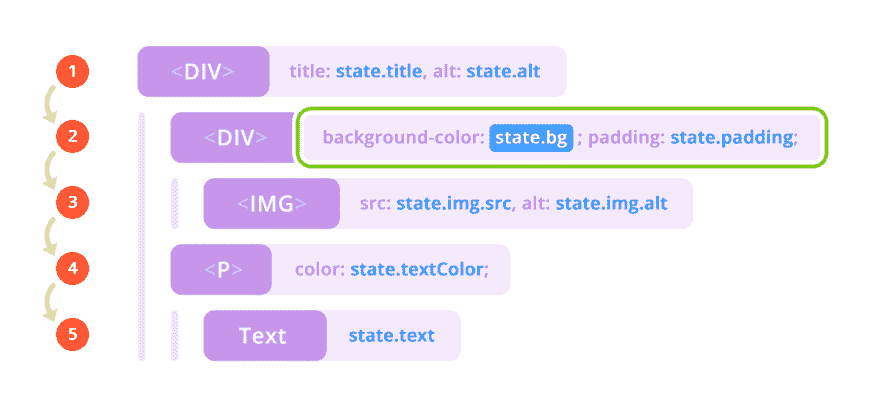
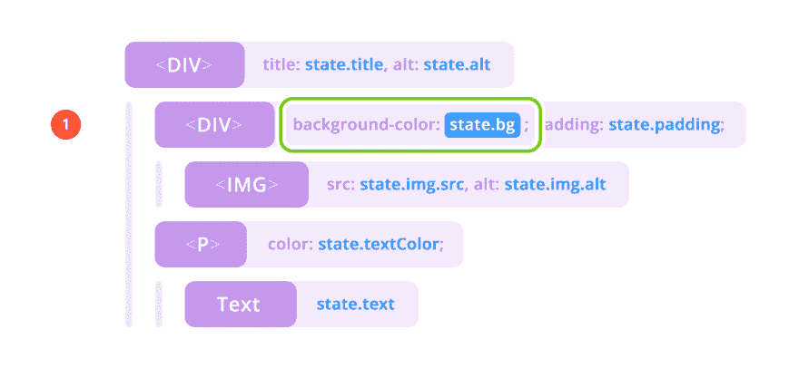

# 我如何构建一个超快的 JS/TS 框架

> 原文：<https://dev.to/pxyup/how-i-built-a-super-fast-js-framework-4agb>

# 其他框架如何操作？

如果我们根本不使用虚拟 DOM，而是使用真实 DOM 会怎么样？要回答这个问题，我们首先需要了解大多数框架是如何工作的，为了更好地说明这一点，我举了一个小例子。

紫色是 DOM/VDOM 节点，蓝色=状态，红色=差异，绿色=修补。我应该解释一下这幅图中发生了什么。所以大多数有状态和 DOM 的框架，当状态中的某些东西被修改时，都是这样的。在本例中，state.bg 已更改。所以现在我们遍历所有的节点(这 5 个步骤)并渲染它们。如果某些东西被改变了，那么在渲染的东西进入实际的 DOM 的地方就会发生修补(绿色动作)。好吧，这很酷，但是当只有 state.bg 改变时，为什么我们需要迭代每一个节点(注意，这里出现了那些相互竞争的不同算法，有些确实不同)？！..

所以回到我最初的问题“为什么我们需要虚拟 DOM？”答案是更快地遍历所有 DOM。好吧，如果我们不迭代呢？

# 乌托邦的做法

但是我想告诉你，在我的头脑中，它应该是这样工作的，不需要微分，不需要迭代，也不需要节点。

因此，在这种乌托邦的方式下，我们改变了相同的 state.bg，并且没有迭代(因此不需要虚拟 DOM)，只有一个渲染(单个红点)，只有一个单个参数/属性/节点被修改，这受到 state.bg 改变的影响。更少不必要的迭代，虚拟节点不必要的内存使用，更少的渲染=更快。

# 动机

*1。小束尺寸*
许多现代框架都非常大。老实说，我不认为应用程序“Hello World”的重量应该超过 10kb。
为了解决这个问题，我决定使用声明性的方式来描述组件。这对应用程序的最终大小有积极的影响，并允许您直接在组件模板中使用树抖动。
T5 操场

*2。真正的反应式*
我真的很想实现 VueJS 中的反应式。如果你改变了某个东西的实体，那么页面上的数据也会改变，如果你改变了数据，实体也会改变。
[游乐场](https://stackblitz.com/edit/typescript-ddsu5c)

*3。纯可重用组件*
任何框架都应该能够创建生命周期感知的组件。这消除了代码的重复，并允许组件在几个地方重用。
[游乐场](https://stackblitz.com/edit/typescript-cf54fk)

*4。条件渲染和列表渲染指令*
我真的很喜欢 ReactJS，非常直爽，第一次相识，真是太棒了。但是，如果您需要嵌套的条件呈现，您将不得不使用组件包装器或者创建难以阅读的三元表达式。
[游乐场](https://stackblitz.com/edit/typescript-gssmle)

# 基准程序

[游乐场](https://stackblitz.com/edit/typescript-p35cgr)

## 另一个框架

React(Stack)—[https://claudiopro . github . io/React-Fiber-vs-Stack-demo/Stack . html](https://claudiopro.github.io/react-fiber-vs-stack-demo/stack.html)
React(Fiber)—[https://radi.js.org/fiber/Fiber%20Example.htm](https://radi.js.org/fiber/Fiber%20Example.htm)
stencil . js—[https://stencil-fiber-demo.firebaseapp.com/perf.html](https://stencil-fiber-demo.firebaseapp.com/perf.html)

# 性能测试

1.  [https://pxyup.github.io/Revact/](https://pxyup.github.io/Revact/)-尝试节流 x6 次。
2.  [https://raw git . com/krausest/js-framework-benchmark/master/web driver-ts-results/table . html](https://rawgit.com/krausest/js-framework-benchmark/master/webdriver-ts-results/table.html)(旧名 faster-dom)

# 链接

1.  [https://github.com/PxyUp/Revact](https://github.com/PxyUp/Revact)-来源
2.  [https://pxyup.github.io/Revact/](https://pxyup.github.io/Revact/)-演示
3.  https://github.com/RyuuGan/html2FastDom-Html 传输器