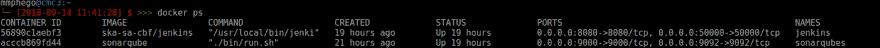
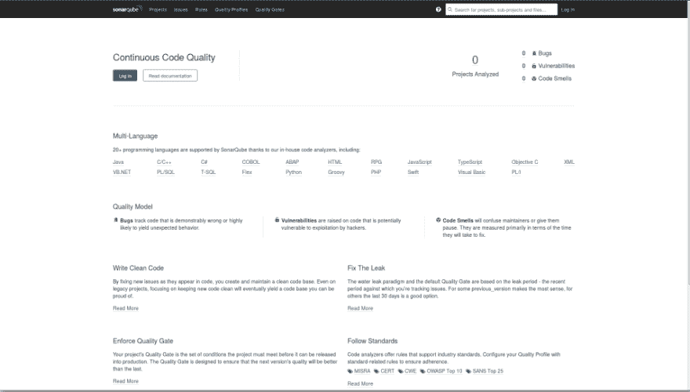
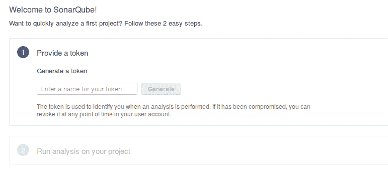
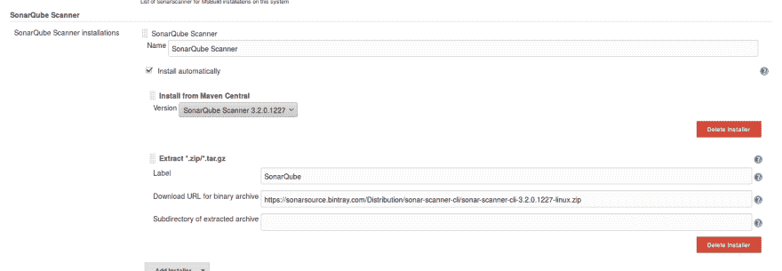
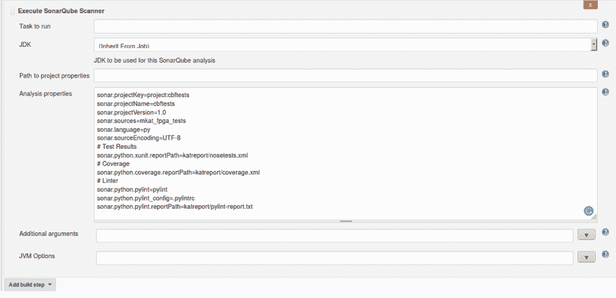
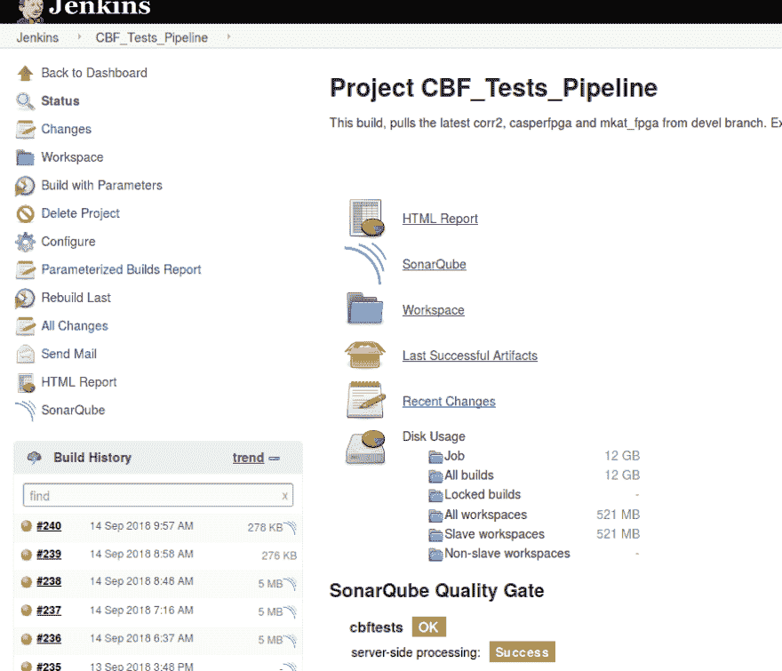
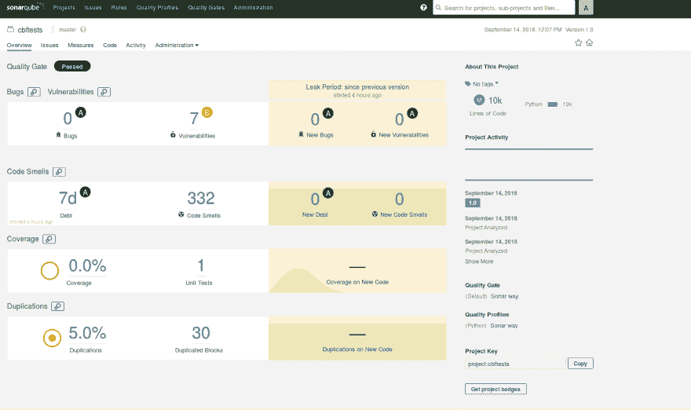

# 我如何用 Jenkins 和 Docker 为 Python 代码分析配置 SonarQube

> 原文：<https://dev.to/mmphego/how-i-configured-sonarqube-for-python-code-analysis-with-jenkins-and-docker-28fm>

* * *

*最初发布于 2018 年 9 月 14 日[blog.mphomphego.co.za](https://blog.mphomphego.co.za/blog/2018/09/14/How-I-configured-SonarQube-for-Python-code-analysis.html)。*
*我决定把它上传到 [dev.to](//dev.to) ，因为它得到了我博客的大量喜爱。*

* * *

作为该系列的一部分，*我如何在 Docker 容器*中配置 Jenkins CI 服务器——我想实现某种持续的代码质量，并将其集成到我的持续测试环境中，在这篇文章中，我将记录我如何配置 [SonarQube](https://www.sonarqube.org/) 来持续检查代码质量(当谈到代码质量时，我有强迫症)，我们将在我们的本地 Git 存储库上执行测试。

## sonar cube 是什么？

[**Sonar cube**](https://www.sonarqube.org/)(原 Sonar)是 SonarSource 开发的一个开源平台，用于持续检查代码质量，通过静态分析代码来执行自动审查，以检测 20 多种编程语言上的 bug、代码气味和安全漏洞。SonarQube 提供关于重复代码、编码标准、单元测试、代码覆盖率、代码复杂性、注释、错误和安全漏洞的报告。

## 先决条件

在我们继续之前，请确保:

*   Java 8 已安装
*   Docker 和 Jenkins(*>2.9 版*)均已配置

## 运行 SonarQube 服务器

SonarQube 可以作为一个独立的服务器使用，它的配置简单而直接。在这篇文章中，我将使用默认设置的官方 SonarQube Docker 图片。

服务器以这种方式启动，默认情况下你可以用密码 *admin* 作为 *admin* 登录，密码稍后可以更改，更多详细信息请阅读[声纳认证文档](https://docs.sonarqube.org/display/SONAR/Authentication)

```
# This will download the latest sonarqube build and run it on localhost:9000
$ docker run -d --name sonarqube -p 9000:9000 -p 9092:9092 
```

确认服务器已启动，

[](https://res.cloudinary.com/practicaldev/image/fetch/s--QKo3ybuQ--/c_limit%2Cf_auto%2Cfl_progressive%2Cq_auto%2Cw_880/https://blog.mphomphego.co.za/assets/sonarqube_server.png)

跑步，

[](https://res.cloudinary.com/practicaldev/image/fetch/s--aBfYUtAo--/c_limit%2Cf_auto%2Cfl_progressive%2Cq_auto%2Cw_880/https://blog.mphomphego.co.za/assets/sonarqube-running.png)

一旦这一点得到确认:

*   打开你的浏览器，前往*[http://localhost:9000](http://localhost:9000)*，你应该看到 SonarQube 的主页
*   使用**管理员** / **管理员**登录，并按照提示进行操作。

    *   遵循所有提示并保存您的令牌以备将来使用。
*   进入**管理**标签- > **市场** - > **已安装**

*   确认 [SonarPython](https://www.sonarsource.com/products/codeanalyzers/sonarpython.html) 插件已安装，如果没有安装，请安装。

*   如果需要，重新启动 SonarQube 服务器。

## 在 Jenkins 上配置声纳扫描仪

另一种方法是从你的本地机器上运行 SonarScanner，但是这篇文章是关于我们在 Jenkins 上运行扫描器的。

### 安装

1.  我们需要为詹金斯安装声纳插件
2.  在浏览器上打开 Jenkins CI 服务器，并以管理员身份登录。
3.  转到:**管理詹金斯**->-**管理插件**->-**可用**
    *   如果找不到，搜索并安装*‘声纳’*
    *   [下载最新的 Sonar.hpi 插件](https://updates.jenkins-ci.org/download/plugins/sonar/)
    *   选择**高级** - > **上传插件** - > **重启詹金斯**
4.  在 Jenkins 上配置您的 [**SonarQube 服务器**](https://docs.sonarqube.org/display/SCAN/Analyzing+with+SonarQube+Scanner+for+Jenkins)
5.  进入**管理詹金斯**->-**配置系统**
6.  向下滚动到**sonar cube 服务器**部分
7.  Enable: *启用 SonarQube 服务器配置作为构建环境变量的注入*
8.  点击**添加 sonar cube**，添加提示您输入的值
9.  名称:SonarQube
10.  获得服务器验证令牌，如果您没有令牌，请阅读[用户指南-用户令牌](https://docs.sonarqube.org/display/SONAR/User+Token)

### 启用 SonarQube 扫描仪分析

为了用[sonar cube 扫描器](https://docs.sonarqube.org/display/SCAN/Analyzing+with+SonarQube+Scanner+for+Jenkins#AnalyzingwithSonarQubeScannerforJenkins-TriggeringaSonarAnalysiswiththeSonarRunner)触发 sonar cube 分析，我们需要在 Jenkins 全局配置中定义 sonar cube 扫描器实例。

*   打开您的 Jenkins CI 服务器，以管理员身份登录
*   转到:**管理詹金斯**->-**全球工具配置**
*   向下滚动到**声纳立方体扫描仪**配置部分
*   点击**添加 SonarQube 扫描仪**并
*   启用:**自动安装**或选择指向已安装的 SonarQube 扫描仪版本(取消选中“*自动安装*”)或告诉 Jenkins 从远程位置获取安装程序(选中“*自动安装*”)
*   保存并退出

[](https://res.cloudinary.com/practicaldev/image/fetch/s--2B8eAR1N--/c_limit%2Cf_auto%2Cfl_progressive%2Cq_auto%2Cw_880/https://blog.mphomphego.co.za/assets/sonarqube-scanner.png)

## 配置詹金斯构建

1.  一旦我们配置了 sonar cube，我们现在就可以运行 sonar cube 构建了
2.  去你詹金斯大楼，
3.  **配置** - > **构建环境** - >启用:**准备 SonarQube 扫描仪环境**
4.  -> **构建**->-**添加构建步骤**->-**执行 SonarQube 扫描器**

5.  现在我们需要将执行器指向一个带有项目属性的路径，或者添加我们自己的分析属性。

    *   创建*声纳扫描器属性*
    *   让 *JDK:继承约伯*

```
 sonar.projectKey=
        sonar.projectName=
        sonar.projectVersion=1.0
        sonar.sources=
        sonar.language=py
        sonar.sourceEncoding=UTF-8
        # Test Results
        sonar.python.xunit.reportPath=nosetests.xml
        # Coverage
        sonar.python.coverage.reportPath=coverage.xml
        # Linter (https://docs.sonarqube.org/display/PLUG/Pylint+Report)
        #sonar.python.pylint=/usr/local/bin/pylint
        #sonar.python.pylint_config=.pylintrc
        #sonar.python.pylint.reportPath=pylint-report.txt 
```

*   *我的个人属性* 

1.  一旦声纳扫描仪配置完毕，我们还需要一些工具。SonarQube scanner 不会执行我们的测试或生成覆盖信息。为此，我们需要使用 xunit 和覆盖率插件进行 nosetests 。这些工具可以简单地通过添加另一个**构建步骤**来安装:
    *   选择**添加构建步骤**->-**执行 Shell** ，添加如下代码

```
#!/bin/bash
set -e
pip install nose coverage nosexcover pylint 
```

1.  安装完成后，您需要执行 nosetests 来运行您的单元测试，并生成与源代码相关的信息。下面的代码运行测试运行程序，生成[覆盖信息](https://coverage.readthedocs.io/en/coverage-4.5.1a/)，并生成 SonarScanner 将使用的 XML 测试报告:

```
#!/bin/bash
set -e
nosetests -sv --with-xunit --xunit-file=nosetests.xml --with-xcoverage --xcoverage-file=coverage.xml 
```

**注意:**在这篇文章中，覆盖率被忽略了！

1.  确认在您的构建中配置了 SonarQube。

    [](https://res.cloudinary.com/practicaldev/image/fetch/s--YKSRRwvA--/c_limit%2Cf_auto%2Cfl_progressive%2Cq_auto%2Cw_880/https://blog.mphomphego.co.za/assets/sonarqube-builder.png)

    保存、执行您的构建并检查日志。

2.  下面是我的日志样本。

```
# sample of my logs
Using config file /home/cbf-test/jenkinsswarm/fsroot/sharedspace/CBF_Tests/.pylintrc
[CBF_Tests] $ /home/cbf-test/jenkinsswarm/fsroot/tools/hudson.plugins.sonar.SonarRunnerInstallation/SonarQube_Scanner/bin/sonar-scanner -Dsonar.host.url=http://cmc3.cbf.mkat.karoo.kat.ac.za:9000 ******** -Dsonar.sourceEncoding=UTF-8 -Dsonar.sources=mkat_fpga_tests -Dsonar.language=py -Dsonar.python.pylint_config=.pylintrc -Dsonar.python.xunit.reportPath=katreport/nosetests.xml -Dsonar.python.coverage.reportPath=katreport/coverage.xml -Dsonar.projectVersion=1.0 -Dsonar.projectKey=project:cbftests -Dsonar.python.pylint=pylint -Dsonar.python.pylint.reportPath=katreport/pylint-report.txt -Dsonar.projectName=cbftests -Dsonar.projectBaseDir=/home/cbf-test/jenkinsswarm/fsroot/sharedspace/CBF_Tests
INFO: Scanner configuration file: /home/cbf-test/jenkinsswarm/fsroot/tools/hudson.plugins.sonar.SonarRunnerInstallation/SonarQube_Scanner/conf/sonar-scanner.properties
INFO: Project root configuration file: /home/cbf-test/jenkinsswarm/fsroot/sharedspace/CBF_Tests/sonar-project.properties
INFO: SonarQube Scanner 3.2.0.1227
INFO: Java 1.8.0_181 Oracle Corporation (64-bit)
INFO: Linux 3.16.0-0.bpo.4-amd64 amd64
INFO: User cache: /home/cbf-test/.sonar/cache
INFO: SonarQube server 7.1.0
INFO: Default locale: "en_ZA", source code encoding: "UTF-8"
INFO: Publish mode
INFO: Load global settings
INFO: Load global settings (done) | time=76ms
INFO: Server id: AWXSwbh2tGn7YMopyR4P
INFO: User cache: /home/cbf-test/.sonar/cache
INFO: Load plugins index
INFO: Load plugins index (done) | time=64ms
INFO: Load/download plugins
INFO: Load/download plugins (done) | time=17ms
INFO: Process project properties
INFO: Load project repositories
INFO: Load project repositories (done) | time=61ms
INFO: Load quality profiles
INFO: Load quality profiles (done) | time=20ms
INFO: Load active rules
INFO: Load active rules (done) | time=1319ms
INFO: Load metrics repository
INFO: Load metrics repository (done) | time=73ms
INFO: Project key: project:cbftests
INFO: Project base dir: /home/cbf-test/jenkinsswarm/fsroot/sharedspace/CBF_Tests
INFO: -------------  Scan cbftests
INFO: Load server rules
INFO: Load server rules (done) | time=755ms
INFO: Base dir: /home/cbf-test/jenkinsswarm/fsroot/sharedspace/CBF_Tests
INFO: Working dir: /home/cbf-test/jenkinsswarm/fsroot/sharedspace/CBF_Tests/.scannerwork
INFO: Source paths: mkat_fpga_tests
INFO: Source encoding: UTF-8, default locale: en_ZA
INFO: Language is forced to py
INFO: Index files
INFO: 8 files indexed
INFO: Quality profile for py: Sonar way
INFO: Sensor Python Squid Sensor [python]
WARN: No report was found for sonar.python.coverage.reportPath using pattern katreport/coverage.xml
INFO: Sensor Python Squid Sensor [python] (done) | time=2093ms
INFO: Sensor PythonXUnitSensor [python]
INFO: Processing report '/home/cbf-test/jenkinsswarm/fsroot/sharedspace/CBF_Tests/katreport/nosetests.xml'
INFO: Sensor PythonXUnitSensor [python] (done) | time=171ms
INFO: Sensor SonarJavaXmlFileSensor [java]
INFO: Sensor SonarJavaXmlFileSensor [java] (done) | time=0ms
INFO: Sensor Zero Coverage Sensor
INFO: Sensor Zero Coverage Sensor (done) | time=49ms
INFO: Sensor CPD Block Indexer
INFO: Sensor CPD Block Indexer (done) | time=0ms
INFO: Calculating CPD for 8 files
INFO: CPD calculation finished
INFO: Analysis report generated in 149ms, dir size=1 MB
INFO: Analysis reports compressed in 134ms, zip size=279 KB
INFO: Analysis report uploaded in 61ms
INFO: ANALYSIS SUCCESSFUL, you can browse http://cmc3.cbf.mkat.karoo.kat.ac.za:9000/dashboard/index/project:cbftests
INFO: Note that you will be able to access the updated dashboard once the server has processed the submitted analysis report
INFO: More about the report processing at http://cmc3.cbf.mkat.karoo.kat.ac.za:9000/api/ce/task?id=AWXXjJ8rerXxRcU6yHMA
INFO: Task total time: 6.356 s
INFO: ------------------------------------------------------------------------
INFO: EXECUTION SUCCESS
INFO: ------------------------------------------------------------------------
INFO: Total time: 7.620s
INFO: Final Memory: 26M/2339M
INFO: ------------------------------------------------------------------------ 
```

## 解读 SonarQube 的结果

一旦我们确认我们的 SonarQube 构建已经执行，我们需要前往[http://localhost:9000/dashboard/index/**project key**](http://localhost:9000/dashboard/index/**projectName**)

[](https://res.cloudinary.com/practicaldev/image/fetch/s--HyXSCTfa--/c_limit%2Cf_auto%2Cfl_progressive%2Cq_auto%2Cw_880/https://blog.mphomphego.co.za/assets/sonarqube-project.png)

在项目的仪表板上，您可以看到与单元测试覆盖相关的度量标准(在本例中是*，它没有通过*)、单元测试成功、代码重复等等。

## 结论

SonarQube server 和 SonarQube Scanner 提供了一种简单而有效的方法，只需要几个额外的包就可以检查单元测试实际测试的内容。这只是 SonarQube 实际能做的事情的皮毛。在以后的文章中，我将研究其他一些 SonarQube 指标，以及它们如何帮助提高代码质量。
阅读更多关于[索纳库](https://docs.sonarqube.org/display/SONAR/Documentation/)的信息

## 引用

*   [https://en.wikipedia.org/wiki/SonarQube](https://en.wikipedia.org/wiki/SonarQube)
*   [https://docs.sonarqube.org/display/SONAR/Documentation/](https://docs.sonarqube.org/display/SONAR/Documentation/)
*   [https://www.sonarqube.org/](https://www.sonarqube.org/)
*   [https://hub . docker . com/_/声纳 qube/](https://hub.docker.com/_/sonarqube/)
*   [https://docs.sonarqube.org/display/SONAR/Authentication](https://docs.sonarqube.org/display/SONAR/Authentication)
*   [https://www . sonar source . com/products/code analyzer/sonar python . html](https://www.sonarsource.com/products/codeanalyzers/sonarpython.html)
*   [https://docs . sonar cube . org/display/SCAN/Analyzing+with+sonar cube+Scanner](https://docs.sonarqube.org/display/SCAN/Analyzing+with+SonarQube+Scanner)
*   [https://updates.jenkins-ci.org/download/plugins/](https://updates.jenkins-ci.org/download/plugins/)
*   [https://docs . sonar cube . org/display/SCAN/Analyzing+with+sonar cube+Scanner+for+Jenkins](https://docs.sonarqube.org/display/SCAN/Analyzing+with+SonarQube+Scanner+for+Jenkins)
*   [https://docs.sonarqube.org/display/SONAR/User+Token](https://docs.sonarqube.org/display/SONAR/User+Token)
*   [https://nose.readthedocs.io/en/latest/man.html](https://nose.readthedocs.io/en/latest/man.html)
*   [https://coverage.readthedocs.io/en/coverage-4.5.1a/](https://coverage.readthedocs.io/en/coverage-4.5.1a/)