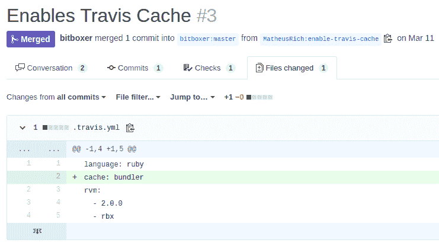
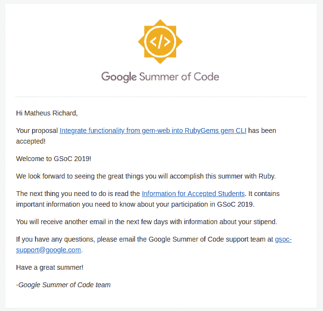

# 我是如何被 2019 年 GSoC 录取的

> 原文：<https://dev.to/matheusrich/how-i-got-accepted-to-gsoc-2019-127h>

## 我的背景

Ruby 是我最喜欢的编程语言。从 2016 年开始，我几乎每天都在用它，无论是大学项目还是工作。我喜欢它的简单、清晰、优雅和美丽。看看下面的代码片段:

```
my_list = []

if my_list.empty?
  puts "It's empty"
end
## No unnecessary braces, semicolons, etc 
```

Enter fullscreen mode Exit fullscreen mode

## 选择项目

我开始了 web 开发，并很快发现了 Ruby on Rails，最终 Ruby 成为了我的主要工具之一。这就是我在 GSoC 之前寻找项目时选择 [Ruby Org](//httpst//summerofcode.withgoogle.com/organizations/5542255322988544/) 的原因。

我浏览了它的[想法列表](https://github.com/rubygsoc/rubygsoc/wiki/Ideas-List)，发现了一些不错的项目。引起我注意的一个是[将 gem-web 的功能集成到 RubyGems 的 gem CLI](https://github.com/rubygsoc/rubygsoc/wiki/Ideas-for-RubyGems#integrate-functionality-from-gem-web-into-rubygems-gem-cli) 。这似乎是我的一个项目:有点在我的领域，但具有挑战性。我想更多地了解这个项目，这样我就可以写一份更好的提案。

## 第一次投稿

我看了看 [gem-web](https://github.com/bitboxer/gem-web/) 的，看看是什么样子，做点贡献。因为没有问题，我看了它的文件。

提高 travis 是一个简单的开始方式，所以这是我对 gem-web 的第一个贡献。这很重要:**不要害怕开源项目**。这个贡献是如此简单！看一看，就一行字:

[](https://res.cloudinary.com/practicaldev/image/fetch/s--mgWJUI2l--/c_limit%2Cf_auto%2Cfl_progressive%2Cq_auto%2Cw_880/http://matheusrich.github.io/assets/img/first-pr.png)

为了适应代码库，我认为添加一些测试会很好，所以我[首先添加了 Simplecov](https://github.com/bitboxer/gem-web/pull/5) ，之后我会在 gem-web 缺乏的地方编写测试。

我必须研究一点 gem-web 的测试结构(用 [Rspec](https://rspec.info/) 写的)，rubygems 的代码(特别是[命令类](https://github.com/rubygems/rubygems/blob/master/lib/rubygems/command.rb))和 gem-web 本身。这是我第三次[投稿](https://github.com/bitboxer/gem-web/pull/6)的途径。

## 我的提议

有了从我的稿件中获得的知识，我能够写一份建议书。Ruby 为学生提供了一个[应用程序模板，所以我回答了问题，并写下了我开发过程的路线图。我听从了一位前 GSoCer 的建议，让**花时间从社区**(特别是非 linux 用户)获得反馈，所以我添加了这些“反馈时刻”。我还添加了一个**应急时间**，因为作为软件开发人员，我们知道:*“Sh！*t 发生。这是我的提案草稿。](https://github.com/rubygsoc/rubygsoc/wiki/Student-Application)

提案完成后，我将它发送给导师，并等待反馈(实际上他们说我的提案很好，所以草案和最终的 PDF 之间没有变化)。

## 项目编号 5260793296191488

嗯，如你所知(标题已经宠坏你了)，我[被 GSoC](https://summerofcode.withgoogle.com/projects/#5260793296191488) 录取了；)这是我收到的一封很好的电子邮件:

[](https://res.cloudinary.com/practicaldev/image/fetch/s--8UJlfA0l--/c_limit%2Cf_auto%2Cfl_progressive%2Cq_auto%2Cw_880/http://matheusrich.github.io/assets/img/gsoc.png)

## 最后的想法

是的，我很高兴成为这个项目的一部分。我自我感觉很好，因为有时候我们觉得自己做不了某些事情，而我证明了自己是错的。嗯，我第一次尝试就被录取了，所以我对 GSoC 不是很有经验，但这里有一些提示可能会对你有所帮助:

**我的提示:**

*   **选择你喜欢的组织/项目/语言**。
    *   你不会想从事与你没有任何联系的工作。
*   **早点开始！**
    *   可以看 [Google 的学生指南](https://google.github.io/gsocguides/student/index)，看往届学生的文章(像这篇)等。
*   **了解你的项目！**
    *   你要写一份建议书，所以了解你的项目将有助于你说服公司你是合适的人选。欢迎投稿！
*   **与导师和社区互动**
    *   通过 IRC 频道、Slack、Rocket.chat、电报组甚至电子邮件与他们取得联系！没有人比他们更适合帮助你迈出第一步。
*   语法上使用！
    *   由于英语不是我的第一语言，我一直使用[语法](https://www.grammarly.com/)来帮助我写更好的文章。试试看！
*   被拒绝了？
    *   有太多的人在被录取之前被 GSoC 拒绝了好多次！不要让这个打倒你！是时候思考你本可以做得更好的地方了(问导师)，现在就开始改进吧！阅读谷歌关于被拒的指南。
*   不要放弃！
    *   就是不要！我知道这很难，但你会成功的！

好了，暂时就这样了。这篇课文比我预期的要长。下一篇文章将是关于我在 GSoC 的第一步。保持沉默，我们走吧！

[](https://res.cloudinary.com/practicaldev/image/fetch/s--iO1sKXyS--/c_limit%2Cf_auto%2Cfl_progressive%2Cq_66%2Cw_880/http://matheusrich.github.io/assets/img/letsgo.gif)