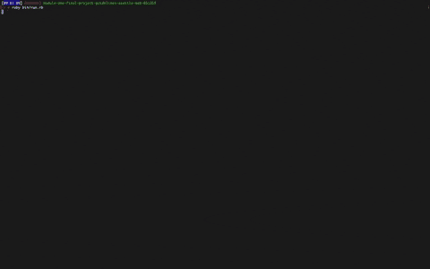

# 我是如何学会不再担心并热爱 MVP 的

> 原文：<https://dev.to/austinbh/how-i-learned-to-stop-worrying-and-love-the-mvp-2mj0>

当我第一次开始研究编码训练营时，我不知道这是不是我想做的事情。几个月后，我找到了几个我感兴趣的不同的，但我仍然感到不确定。即使在熨斗学校注册了软件工程课程后，我也不确定自己的决定。

随着我对 Ruby 和面向对象的了解越来越多，我对这些材料和我理解它们的能力越来越有信心，但是仍然缺少一些东西。我没有那个“啊哈”的时刻，我知道我做出了正确的决定。直到上周我们开始着手我们的 CLI 应用项目，我才确定这是我想做的事情。

当我的项目伙伴 RJ 和我开始计划如何分工以及我们想用什么主题时，我开始考虑不仅仅是完成作业。我开始考虑如何将我们的想法简化为一个最小可行产品。

在阅读了“最小可行产品”和这种产品开发策略的好处之后，我向 RJ 提出了我们应该从哪里开始的最新建议。我们开始计划一个特定于我们项目的 MVP，并确定实现它需要做些什么。

当想象我们项目的 MVP 是什么样子时，我开始考虑不仅仅是写作方法。我开始考虑通过创建一个工作版本，然后在这一周的剩余时间里继续构建，我们可以节省多少时间。我希望我们能够在前几天完成我们的 MVP，然后在最后两天开始增加更多的复杂性。

幸运的是，由于这种协调的计划和准备，我们能够在第一天完成我们的 MVP。因为我们有一周的剩余时间来添加它，所以“完成”项目的压力要小得多，我们有时间来改进一个工作应用程序。

尽管它只是一个简单的 CLI 应用程序，但这个项目向我证明，在开始之前花一些时间来计划它可以完全改变您处理项目的方式。我不知道我是否会喜欢从事 CLI 应用程序的工作，或者我是否会喜欢这个编码训练营。然而，在做出一些有用的东西，并把它变成外观和功能都好得多的东西之后，我可以说我做出了正确的选择，不能等待接下来的事情！

你可以在 Github 上找到我和 RJ 的项目