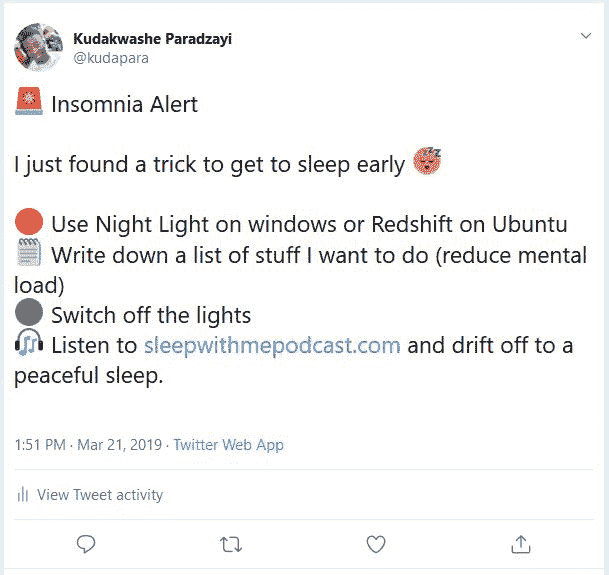

# 我如何设法控制我的失眠

> 原文：<https://dev.to/kudapara/how-i-managed-to-control-my-insomnia-3j25>

我已经和失眠斗争了一段时间了，我很难入睡。早上醒来时我会很累，这会打乱我的一天。

我在互联网上搜索，令人惊讶的是，这是一个影响开发人员的常见问题。在做了大量的调查后，我发现了一些导致失眠的问题。

1.  **蓝光**——许多专家研究发现(查看这篇[哈佛文章](https://www.health.harvard.edu/staying-healthy/blue-light-has-a-dark-side))蓝光是导致睡眠不足的主要原因。对我来说，蓝光的主要来源是我的笔记本电脑，因为我的大部分编码& twitter 的东西都在里面。
2.  害怕做不到事情 -我是一名学生，同时也做一些自由职业项目。放学后，我会准备晚餐，并准备投入下一个项目或完成一个我会更早开始的项目。因此，在这样做的同时，我会构建一个在编程过程中积累的所有上下文的心理图表，而我担心的是，一旦我睡觉，我会丢失所有这些信息。所以我会继续下去。
3.  怕黑——我这么说很尴尬，但我有点怕黑，会试着开着灯睡觉。我怀疑这是我不能早睡的一大原因。

就这样持续了很长一段时间，直到有一天我在公交车上听 [@mijustin](https://twitter.com/mijustin) 的播客 [saas.transistor.fm](https://saas.transistor.fm/episodes/how-to-grow-your-audience) 时听到他建议[跟我睡播客](https://www.sleepwithmepodcast.com/)。我试了一晚上，很容易就睡着了，连我自己都很惊讶。

我开始对睡眠不足的原因做更多的研究，因为在我有了和我一起睡的经历之前，我以为我得了不治之症。我发现睡觉前写下你的想法有助于减轻精神负担，可以让你的大脑在睡觉时得到休息。下面是一条推特，总结了是什么帮助我睡得更早更久。

我希望这篇文章能帮助更多可能面临同样问题的人。睡个好觉是迈向美好一天的一步。

和平✌️