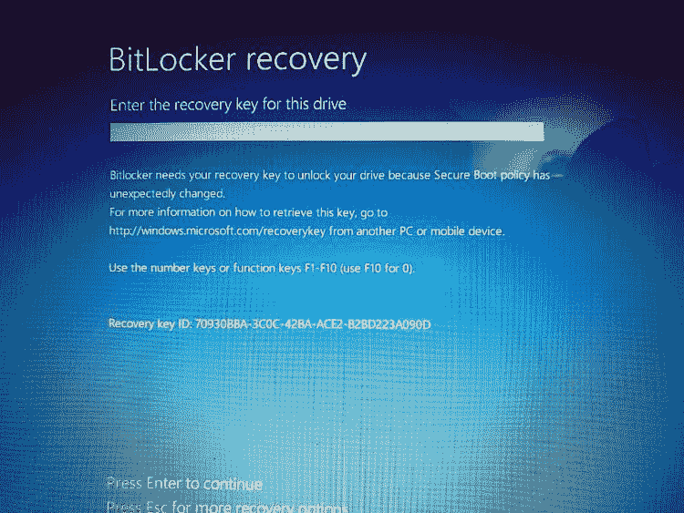
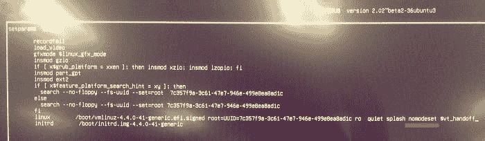

# 我是如何在新的 XPS 15 上安装 Windows 10 和[X]Ubuntu 的

> 原文：<https://dev.to/mmphego/how-i-managed-to-install-xubuntu-alongside-windows-10-on-my-new-xps-15-435e>

* * *

*最初发布于[blog.mphomphego.co.za](https://blog.mphomphego.co.za/blog/2019/02/24/How-I-managed-to-install-Xubuntu-alongside-Windows10-on-my-new-XPS15.html)2019 年 2 月 24 日*

* * *

在使用了将近 4 年的戴尔 Latitude E5540 之后，我该升级了。
嗯，我必须说，这台笔记本电脑已经达到了它的目的，除了电池寿命和导致我的系统一次又一次冻结的故障磁盘，我喜欢它的每一分钟。

无论如何，我决定订购一台[戴尔 XPS 15 9570](https://www.dell.com/en-us/shop/dell-laptops/xps-15/spd/xps-15-9570-laptop) 。从 16Gb 内存到 512Gb 固态硬盘，不要忘了英特尔酷睿 i7 CPU，这是一款令人惊叹的笔记本电脑。我只是想用我的脏手去抓它。

新的笔记本电脑的问题是，由于 EUFI 模式而不是 BIOS 的高安全级别，以及 Windows Bitlocker/secureboot 相关的问题，让 Ubuntu 与 Windows 一起安装有点棘手。

我在网上/YouTube 上看过很多关于在 Windows 10 的不同 XP 上安装不同版本的 Ubuntu 的教程，然而并不是所有的都有效，要么你彻底清除 Windows 然后安装 Ubuntu，要么冒着破坏 Windows 安装的风险——这太糟糕了！！！



长话短说，我最后一次使用微软 Windows 是在 Windows Vista 发布的时候，从那时起我就一直是一个 Linux 重度用户，我选择双引导而不是完整的系统范围的 Linux 安装的唯一原因是 Windows 上的视频编辑工具和游戏——所以我喜欢...


闲话少说，让我开始谈正事吧。

## 准备

首先，你需要下载一个 Ubuntu ISO 并刻录到你的 u 盘上。你可以在这里找到 Ubuntu 版本列表[，我更喜欢](https://www.ubuntu.com/download/flavours) [XUbuntu](https://xubuntu.org/) ，使用[蚀刻机](https://www.balena.io/etcher/)将 ISO 烧录到 USB 的指令在这里。

在您的 Windows 10 中:

### 分区存储驱动器

*   点击`start menu`。
*   键入`disk management`并打开`Disk Management`。
*   选择`Windows partition`(最可能是最大的一个)。
*   右键点击并选择`"Shrink Volume"`。
*   收缩到所需的量。(我为 Ubuntu 缩减了 200GB)
*   查看是否显示了`"Unallocated space"`的分区。

### 启用 AHCI 模式

为了安装 Ubuntu 或任何 Linux 发行版，你需要将存储驱动器设置为 [AHCI 模式](https://forums.crucial.com/t5/SSD-Archive-Read-Only/Why-do-i-need-AHCI-with-a-SSD-Drive-Guide-Here-Crucial-AHCI-vs/td-p/57078)。

*   点击`start menu`，搜索并运行命令提示符作为`admin`。
*   运行:`bcdedit /set {current} safeboot minimal`
*   重启。
*   当您看到戴尔徽标时，点击`F2`，直到它加载 BIOS/UEFI 设置。
*   在`Settings`下，选择`System Configuration`，然后选择`SATA Operation`，启用`AHCI`模式。
*   按“应用”，“另存为自定义用户设置？”然后“退出”。
*   Windows 将引导至`Safemode`并要求您登录。
*   再次打开命令提示符为`admin`(**Windows+R**，键入`cmd`，按 **Ctrl+Shift+Enter**
*   运行:`bcdedit /deletevalue {current} safeboot`
*   重启。

## 安装 Ubuntu

如果你遵循了所有的说明，我们现在已经准备好安装 Ubuntu 了。

*   显然将`Ubuntu USB`插入 XPS 并重启。
*   看到戴尔徽标时，点击`F12`。
*   选择一个带有“UEFI: Vendor blablabla”字样的文件，然后按回车键。
*   选择“不安装就尝试 Ubuntu”选项[暂时不要点击`ENTER`！]
*   按下`e`
*   找到带有`quiet splash`的那一行，并在其后添加`nomodeset`。



*   按`F10`保存。
*   在桌面上找到`Ubuntu installer`并启动它。
*   安装时选择`"Enable Insecure Boot mode"`，**记住密码**。
*   完成安装并重新启动

重启后，你会看到一个蓝屏 [`"Perform MOK management"`](https://www.rodsbooks.com/efi-bootloaders/secureboot.html) ，按任意键，

*   选择`Change Secure Boot State`
*   输入您的密码，然后`Continue Boot`。

之后，计算机将重新启动，你会看到`Grub screen`提示你启动选项。

*   将鼠标悬停在选项`"Ubuntu"`上
*   按下`e`
*   在单词`quiet splash`后，添加`nouveau.modeset=0`。
    *   详细说明可以在[这里](https://www.dell.com/support/article/za/en/zabsdt1/sln306327/manual-nomodeset-kernel-boot-line-option-for-linux-booting?lang=en)找到
*   按`F10`保存。

引导进入 Ubuntu，打开你的终端，将参数`nouveau.modeset=0`添加到`grub`中的 Linux 内核命令。让它永久化。

```
echo 'GRUB_CMDLINE_LINUX="nouveau.modeset=0' | sudo tee -a /etc/default/grub
sudo update-grub2 
```

## 安装 Ubuntu 后

成功安装 Ubuntu 后，你需要更新软件包并为你的机器安装一些驱动程序，但是这可能会非常繁琐。因此，随着时间的推移，我对在全新安装后安装软件包感到恼火，然后我编写脚本来自动安装。

在 [GitHub](https://github.com/mmphego/new-computer) 上查看，阅读 [README.md](https://github.com/mmphego/new-computer/blob/master/README.md) ，随时欢迎投稿。

该脚本将安装各种软件包以及 [XPS 15 调整](https://github.com/JackHack96/dell-xps-9570-ubuntu-respin)。

要运行安装，请输入命令并按照提示进行操作。

```
bash -c "$(curl -L https://git.io/runme)" 
```

## 结论

双启动 Windows 和 Linux 本身就是一个挑战，我花了一些时间让一切都工作起来，最终这一切都是值得的。Dell XPS 15 是一款非常棒的笔记本电脑，我需要一段时间来适应使用 Latitude。我希望这篇文章是有帮助的。

### 延伸阅读&参考

*   [https://medium . com/@ Peter pang _ 84917/personal-experience-of-installing-Ubuntu-18-04-lts-on-XPS-15-9570-3 e 53 b 6 cfeefe](https://medium.com/@peterpang_84917/personal-experience-of-installing-ubuntu-18-04-lts-on-xps-15-9570-3e53b6cfeefe)
*   [https://medium . com/@ jthegedus/Ubuntu-18-04-lts-on-a-Dell-XPS-15-db 4d CEE 9 a2 f 9](https://medium.com/@jthegedus/ubuntu-18-04-lts-on-a-dell-xps-15-db4dcee9a2f9)
*   [https://medium . com/@ tomwwright/better-battery-life-on-Ubuntu-17-10-4588 b7f 72 def](https://medium.com/@tomwwright/better-battery-life-on-ubuntu-17-10-4588b7f72def)
*   [https://medium . com/@ kemra 102/Linux-on-the-Dell-XPS-15-919 e6d 472 aa 3](https://medium.com/@kemra102/linux-on-the-dell-xps-15-919e6d472aa3)