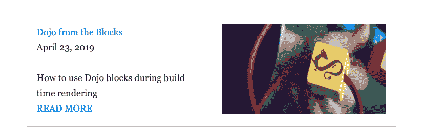
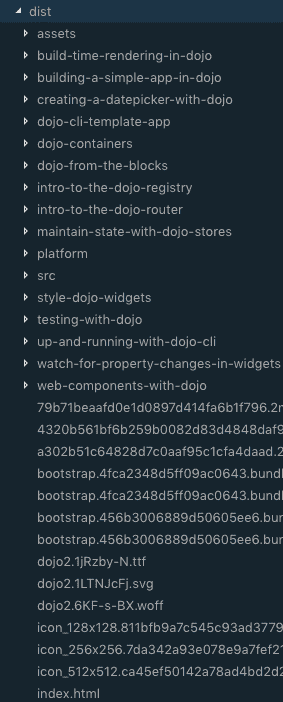

# 我如何使用 Dojo 将我的博客转移到静态站点

> 原文：<https://dev.to/odoenet/how-i-moved-my-blog-to-a-static-site-using-dojo-d0d>

我已经展示了如何使用 [dojo 块](https://learn-dojo.com/dojo-from-the-blocks)和[构建时渲染](https://learn-dojo.com/build-time-rendering-in-dojo)来创建静态网页。这是非常强大的，因为这意味着你*可以*建立一个完整的网站，而不必用 API 和数据库调用来支持它。当然，这对于需要动态数据或处理授权的 web 应用程序来说并不理想，但是对于内容相当静态的情况来说是理想的，比如文档或我的博客！这正是像《盖茨比》这样的电影所要做的。构建静态站点生成器的所有部分都在 dojo 中，您只需要将它们放在一起。

## 解析

我深受 dojo 团队正在用 [dojo/site](https://github.com/dojo/site) 为下一个 [dojo](http://dojo.io/) 文档静态构建页面的启发。我大量借用了他们的块来解析 markdown 到虚拟 dom 节点，因为我发现我正在重新创建轮子。

我的静态站点生成器的主要目标是将 markdown 解析为页面，特别是博客页面。这个过程中的核心工具是[统一](https://github.com/unifiedjs/unified)和[备注](https://github.com/remarkjs/remark)。如果你已经用 gatsby 建立了站点，你可能会对它们很熟悉，因为它们在 gatsby 插件中被大量使用。

下面是一个用于解析 markdown 的代码块示例。

```
// Converts markdown to VNodes in hyperscript
export const toVNodes = (content: string) => {
  let counter = 0;
  const pipeline = unified()
    .use(markdown as any, { commonmark: true })
    .use(externalLinks, { target: "_blank", rel: ["nofollow"] })
    .use(frontmatter, "yaml")
    .use(remark2rehype)
    .use(slug)
    .use(rehypePrism);

  const nodes = pipeline.parse(content);
  const result = pipeline.runSync(nodes);
  return toH(
    (tag: string, props: any, children: any[]) =>
      v(tag, { ...props, key: counter++ }, children),
    result
  );
}; 
```

Enter fullscreen mode Exit fullscreen mode

此块函数使用`unified`来解析降价文件。解析这个文件的结果是一个 [markdown 抽象树](https://github.com/syntax-tree/mdast)，然后通过一系列 remark 插件将 markdown 转换成一个产品，然后我们可以用[retype](https://github.com/rehypejs/rehype)和其他一些 retype 插件解析成 HTML。一旦完成，我们可以使用 [hast-to-hyperscript](https://github.com/syntax-tree/hast-to-hyperscript) 将该产品转换为 hyperscript，使用内置的 dojo 虚拟 dom 工具来产生所需的节点。

## 路由

我不仅仅是为这个博客建立一个静态的站点生成器。我正在将现有的 wordpress 博客移植到一个静态网站。所以我想确保所有现有的链接仍然可以工作，所以我必须模仿现有的结构。为此，我的路线看起来像这样。

```
export default [
  {
    path: "/{path}",
    outlet: "blog",
    defaultRoute: true
  }
]; 
```

Enter fullscreen mode Exit fullscreen mode

路径的根将会是`/`，博客文章链接将会转到`/{path}`。我希望主页包含一个带有发布日期和描述的博客帖子列表。所以我做了一个卡片小部件来显示这些。

```
export default class Card extends WidgetBase<CardProperties> {
  protected render() {
    const { title, date, description, path, cover_image } = this.properties;
    return (
      <section classes={[css.root]}>
        <div classes={[css.column]}>
          <Link
            to="blog"
            params={{
              // markdown is in a posts/ folder with extension .md
              // so clean that up
              path: path.replace("posts/", "").replace(".md", "")
            }}
          >
            {title}
          </Link>
          <p>{dateFormatter(new Date(date))}</p>
          <span>{description}</span>
          <br />
          <Link
            to="blog"
            params={{
              path: path.replace("posts/", "").replace(".md", "")
            }}
          >
            READ MORE
          </Link>
        </div>
        <div classes={[css.column]}>
          
        </div>
      </section>
    );
  }
} 
```

Enter fullscreen mode Exit fullscreen mode

我用每篇博文的元数据来制作这些卡片。我使用了很多 [dev.to](https://dev.to) 所使用的元数据的前端内容，因为这将使我更容易在那里交叉发布。*就像我在做这个帖子一样！*

结果是一张看起来像这样的卡片。

[](https://res.cloudinary.com/practicaldev/image/fetch/s--7whHtILH--/c_limit%2Cf_auto%2Cfl_progressive%2Cq_auto%2Cw_880/https://thepracticaldev.s3.amazonaws.com/i/yb1sfsiloso8nbvasiuk.png)

## 模板

博客文章被表示为模板。在这种情况下，他们可以为主页或整个博客文章呈现卡片样式。博客文章模板如下所示。

```
export default class BlogPost extends WidgetBase<PostProperties> {
  protected render() {
    let { excerpt = false, path } = this.properties;
    if (!path.includes(".md")) {
      path = `${path}.md`;
    }
    // compile the blog post content
    const post: any = this.meta(Block).run(compileBlogPost)({
      path
    });
    if (post) {
      const date = dateFormatter(new Date(post.meta.date));
      // if displayed as a card, just return the content in card format
      if (excerpt) {
        return <Card path={path} {...post.meta} />;
      }
      // or return the content as a full blog post
      return (
        <Content key={post.meta.title}>
          {!excerpt && }
          <Link
            to="blog"
            params={{
              path: path.replace("posts/", "").replace(".md", "")
            }}
          >
            <h2>{post.meta.title}</h2>
          </Link>
          <p>
            {post.meta.author} | {date}
          </p>
          {post.content}
        </Content>
      );
    }
  }
} 
```

Enter fullscreen mode Exit fullscreen mode

这个结果看起来就像我的博客一样。

## 建筑

为了构建静态页面，我需要正确地配置我的`.dojorc`,为我所有的博客文章提供路径。注意，`"."`是我如何告诉 dojo build-time-render 构建一个静态索引页面的。

```
{  "build-app":  {  "build-time-render":  {  "root":  "root",  "paths":  [  "build-time-rendering-in-dojo",  "building-a-simple-app-in-dojo",  "build-static-site-with-dojo",  "creating-a-datepicker-with-dojo",  "dojo-cli-template-app",  "dojo-containers",  "dojo-from-the-blocks",  "intro-to-the-dojo-registry",  "intro-to-the-dojo-router",  "maintain-state-with-dojo-stores",  "style-dojo-widgets",  "testing-with-dojo",  "up-and-running-with-dojo-cli",  "watch-for-property-changes-in-widgets",  "web-components-with-dojo",  "."  ],  "puppeteerOptions":  {  "args":  ["--no-sandbox",  "--disable-setuid-sandbox"]  }  }  }  } 
```

Enter fullscreen mode Exit fullscreen mode

我计划用一个我可以在构建运行之前运行的脚本来自动化对`.dojorc`的更新，但是我还没有做到那一步。

一旦构建完成，结果就是一个静态网站，我构建的每个页面都有子目录。

[](https://res.cloudinary.com/practicaldev/image/fetch/s--uSEQiq65--/c_limit%2Cf_auto%2Cfl_progressive%2Cq_auto%2Cw_880/https://thepracticaldev.s3.amazonaws.com/i/kjbdb5qcznjno2u8o4r6.png)

这意味着即使有人网速很慢或者 javascript 加载不正确，我的站点仍然是可见的，包括我站点的路线。

## 部署

由于我的站点不需要进行任何 API 调用，也不需要依赖服务器来进行任何服务器端渲染，因此可以很容易地部署到您喜欢的任何数量的主机服务上。为了记录在案，我试着部署到 [zeit](https://zeit.co/) 和 [netlify](https://www.netlify.com/) 上，它们一开始看起来都工作得很好。然而，看起来我的`dist`目录的子目录不会被部署，所以除了主页面之外的其他页面的链接将不起作用。如果我从主页链接到一个页面，dojo 路由可以正常工作，但是使用 URL 时就不行了。我确定我只是没有正确配置一些东西，但是我不清楚我做错了什么。

所以在一天结束时，我部署到 [aws s3](https://aws.amazon.com/s3/) 。虽然，s3 的配置并不完全是*简单*，我知道足够拖放文件夹，我甚至可以从 github 建立一个管道。我可能需要给我的帖子添加一个`published`标签，就像 [dev.to](https://dev.to/) 做的那样，这样我就可以将正在进行的帖子推送到 github，而不用将它们部署到网站的其他地方。

随着这个项目的进行，我还想做更多的事情！

## 用于 web 应用程序

我的博客不是一个成熟的 web 应用程序，但这并不意味着你不能使用 dojo 的相同的静态站点生成工具来构建一个*主要是*的静态站点，它还将从外部来源获取数据，并使用它们来构建强大的 web 应用程序。静态站点生成工具只是 dojo 内置的强大功能系统的一部分。

## 自己试试

如果您想亲自尝试这个 dojo 静态站点生成器，可以使用下面的命令快速入门。

```
npx degit odoe/btr-site my-awesome-site 
```

Enter fullscreen mode Exit fullscreen mode

您可以在这里查看这个入门项目！

##  [闻](https://github.com/odoe) / [ btr 站点](https://github.com/odoe/btr-site)

### 用 Dojo 构建的模板静态博客站点

<article class="markdown-body entry-content container-lg" itemprop="text">

# 道场 BTR 静态博客

这个项目是用[Dojo CLI](https://github.com/dojo/cli)&[Dojo CLI create app 命令](https://github.com/dojo/cli-create-app)生成的。

博客网站模板，大量复制了受 T2 道场/网站回购影响的网站模板。仍在进行中。

[演示](https://odoe.github.io/btr-site/output/dist)

## 建设

运行`npm run build`或`dojo build --mode dist`(`mode`选项默认为`dist`)为项目创建一个生产构建。构建的工件将被存储在`output/dist`目录中。

## 开发构建

运行`npm run build:dev`或`dojo build --mode dev`为项目创建一个开发构建。构建的工件将被存储在`output/dev`目录中。

## 开发服务器

运行`npm run dev`或`dojo build --mode dev --watch file --serve`来创建一个开发构建并启动一个开发服务器。默认情况下，服务器在端口`9999`上运行，导航到`http://localhost:9999/`。

要改变发展的港口…

</article>

[View on GitHub](https://github.com/odoe/btr-site)

## 总结

我从这个项目中获得了很多乐趣，并学到了很多关于 unified、remark、rehype 和其他插件如何工作的知识，以及如何真正使用 dojo 块来做一些有趣的事情。我可能没有 wordpress 所有的功能，但我不认为我完全需要它们。wordpress 能告诉我的任何实质性的东西，我都可以从 google analytics 上得到，而且我更喜欢在 markdown 上发布。在数字海洋账单上省几块钱也无妨:)