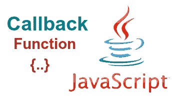

# 我如何构建我的 JavaScript 代码

> 原文：<https://dev.to/budyk/how-i-structure-my-javascript-code-3p2h>

正确地构造 JavaScript 代码对于使我们的代码干净、易于理解和维护非常重要。如果你在一个团队中工作，你还需要有一个“事实上的”格式，每个人都应该遵循。

[](https://res.cloudinary.com/practicaldev/image/fetch/s--b6PsU8v1--/c_limit%2Cf_auto%2Cfl_progressive%2Cq_auto%2Cw_880/https://thepracticaldev.s3.amazonaws.com/i/huo81nmj1zd8f93wghnq.png)

当构建一个 web 应用程序时，我通常使用这些结构。

### 使用 VanillaJS

```
!(function(window, document, M, undefined) {
  'use strict';

   // local vars...

   const session = {};
   const PI = 3.14;

   // local functions...

   function render() {
     // ...
   }

   // elems...

   const btnSave = document.getElementById('save');
   const btnCancel = document.getElementById('cancel');

   // events listener...

   btnSave.addEventListener('click', function() {
     //...
   });

   btnCancel.addEventListener('click', function() {
     //...
   });

})(this, document, MyLib); 
```

### 使用 jQuery

```
!(function(window, document, $, undefined) {
  'use strict';

   // local vars...

   const session = {};
   const PI = 3.14;

   // local functions...or use Class

   function render() {
     return $.ajax({
        url: SITE_URL + 'form/fetch',
        data: {
          page: page, search: search
        },
        method: 'GET'
      });
   }

   // events listener...

   $("#btnSave").click(function() {
     //...
     render().done(response => {
       console.log(response);
     }).fail((x, h, r) => {
       console.log('Error' + r);
     });
   });

   $("#btnCancel").click(function() {
     //...
   });

})(this, document, jQuery); 
```

### 带 ES6 级

```
!(function(window, document, M, undefined) {
  'use strict';

   // Class...

   /**
    * CLass Environment
    */
   class CL_Environment {
    constructor() {}

    /**
     * Get data environment
     * @param {object} filter
     * @param {number} page
     * @param {callback} next 
     * @return {Promise} Object
     */
    async getEnvironment(filter = {}, page = 1, next) {
      try {
        let params = Utils.buildQueryParam(Object.assign(filter, {
          page: page
        }));
        const environment = await fetch(SITE_URL + 'environment/fetch' + params, {
          method: 'GET',
          headers: {
            'X-Requested-With': 'XmlHttpRequest'
          }
        });
        const result = await environment.json();
        return next(result);
      } catch (error) {
        console.error(error);
        return next(false);
      }
    }

   }

   // local vars...
   const Environment = new CL_Enviroment();
   const session = {};
   const PI = 3.14;

   // local functions...

   function render() {
     // ...
   }

   // elems...

   const btnSave = document.getElementById('save');
   const btnCancel = document.getElementById('cancel');

   // events listener...

   btnSave.addEventListener('click', function() {
     Environment.getEnvironment({}, 1, result => {
       // ..
     });
     //...
   });

   btnCancel.addEventListener('click', function() {
     //...
   });

})(this, document, MyLib); 
```

如果你看到上面的例子，所有的都被包装在 life 中(直接调用函数表达式)，这是一个好的实践，因为 life 中的所有代码都是私有的，从外面是不可访问的，所以它不会污染全局命名空间，你也不必担心你的朋友的代码会覆盖你的。

如果你正在创建库，你可以使用通用的设计模式，比如 UMD(通用模块定义)，或者简单地使用一个显示模块模式。