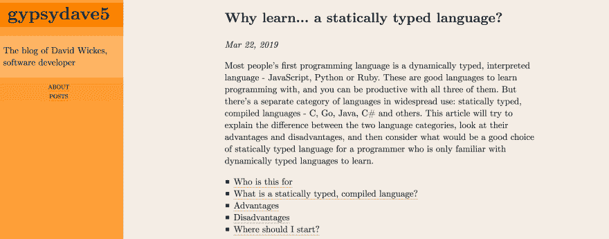

# 这些天我是如何写博客的

> 原文：<https://dev.to/gypsydave5/how-i-write-blog-posts-these-days-204g>

iread

 [## 我如何写在线文章

### 约翰爸爸 1914 年 4 月 1 日阅读

#devrel #vscode #markdown #discuss](/azure/how-i-write-online-articles-1lfb)

并意识到我做事情的方式与约翰完全不同，因此需要一个单独的职位。所以，按照某种模糊的顺序，这里是我如何为 Dev.to 和我自己的博客写一篇文章。

## 1。编辑:Vim

我用 Vim 写我的减价。或者 Evil 模式下的 Emacs，只是 Emacs 中的 Vim 仿真。

为什么？嗯，我发现在 Vim 中操纵文本——任何文本——都非常快捷和容易。移动段落、改变单词、删除句子——Vim 知道自然语言的结构，这使得使用它编辑博客文章变得很容易。但这是我的经历，从我职业生涯开始就一直使用它。你要么喜欢 Vim，要么不喜欢——这真的没那么重要。

为什么使用 Emacs 而不仅仅是 Vim？这取决于我是否打开了终端或 Emacs。

## 2。格式:降价

降价既美妙又可怕。奇妙的是，它无处不在，可读，可写，并且支持你想要用于技术写作的结构，比如代码块。可怕是因为没有标准——在解析器的另一端得到的 HTML 在解析器之间是不一致的。

你觉得这不会太麻烦吗？当我在 Dev.to 上发帖时，我必须将一个段落中的所有行连接成一行，因为 Markdown 解析器将一个段落中的所有换行符都视为硬换行符。 [1](#fn1)

正是这种不一致性解析器让我避免(或者至少不依赖)Markdown linters 和 previewers。我倾向于等到文章接近完成的时候，再来看看第五阶段是什么样子的(见下文)。

不过，利大于弊，所以降价。

### 3。语法和拼写:拼写，风格和措辞

像这样的降价帖子可以发送到 [`aspell`](http://aspell.net/) ，这是一个方便的交互式可扩展拼写检查器。Vim 和 Emacs 中都有 aspell 的良好编辑器集成。

[`style`和`diction`](https://www.gnu.org/software/diction/diction.html) 是一对检查语法错误和可读性的工具。`diction`挑选陈词滥调、重复词和潜在的拼写错误。有时候这是错误的，但是它让你思考你是否可以把事情说得更好，所以这是一个很好的开始。

`style`通过一系列分数来描述你的文档的可读性——例如 [Flesch-Kinkaid](https://en.wikipedia.org/wiki/Flesch%E2%80%93Kincaid_readability_tests) 。这是有趣的信息。

### 4。存储:公共 GitHub

我在 GitHub 上保持我的帖子[。如果有人发现了错误，那么至少这样他们可以打开一个拉取请求。](https://github.com/gypsydave5/gypsydave5.github.io)

### 5。我的站点:静态站点+ GitHub 页面

我一直使用 GitHub Pages 作为静态网站来托管我的博客。这是一个非常简单的托管解决方案，你可以用它和任意数量的静态站点生成器来把你的 Markdown 变成 HTML。

我写了自己的静态站点生成器，因为我发现我尝试的每一个对我来说都太忙了。对我来说,*还是*太忙了，我认为它可能会被废弃，而代之以 [Pandoc](https://pandoc.org/) 和一些 Bash 脚本作为粘合剂，但写起来很有趣。如果我是你，我就不会用它。

这里还有一些我写的关于 [Lambda 演算](http://blog.gypsydave5.com/posts/2017/9/13/lambda-calculus-2---church-numbers/)的帖子的 [MathJax](https://www.mathjax.org/) ，这有点多余，因为我不是数学家，它只是给页面增加了一堆 JavaScript。但事实也的确如此🤷‍♀️.

我有一个[可怕的 bash 脚本](https://github.com/gypsydave5/gypsydave5.github.io/blob/source/publish.sh)来发布博客，它发布后看起来[像这样](http://blog.gypsydave5.com/):

我喜欢橙色。

### 6。添加到开发目标:复制并粘贴

嘿，有用。 [2](#fn2)

### 7。开发人员为封面图片:摩西

我的个人网站没有放封面图片的地方，但是 Dev.to 有，所以我觉得有必要在那里放些东西。

我写的东西给人的感觉就像一个愤怒的老人从山上下来，向所有人大喊，让他们停止崇拜虚假的偶像， [3](#fn3) 所以摩西的照片总是成为合适的封面图像。通常都是一些打碎平板电脑和看起来很生气的事情，但是这一次我变得更加平和，所以这是*劳伦斯·阿尔玛·达德玛[的](https://en.wikipedia.org/wiki/Lawrence_Alma-Tadema)*寻找摩西。

* * *

1.  要不是 Vim 的`vip J`会很烦。 [↩](#fnref1)

2.  还被 Vim 弄得更精彩:`:% y +` [↩](#fnref2)

3.  至少`style`的配乐是这么说的。 [↩](#fnref3)