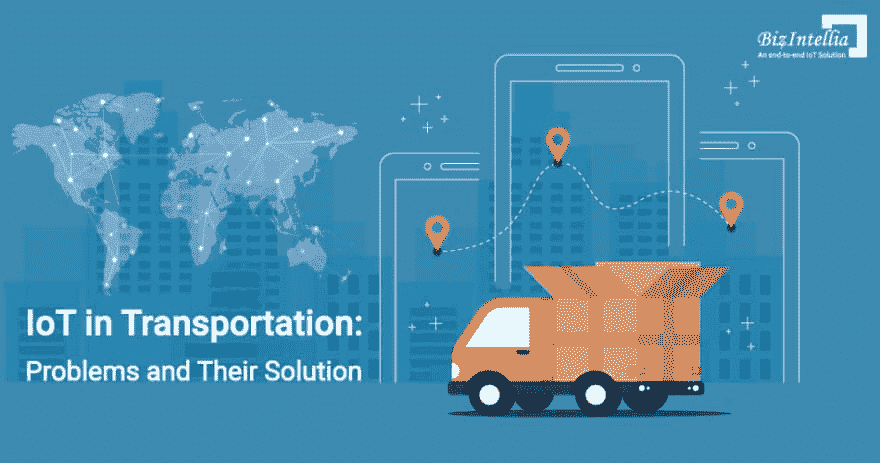

# 物联网如何成为交通行业的一站式解决方案？

> 原文：<https://dev.to/skyakashsoni/how-iot-became-a-one-stop-solution-for-transportation-industry-12ld>

物联网已经越来越多地应用于几乎每个行业，交通运输也不例外。因为人们在从一个地方旅行到另一个地方时经历了许多问题和挑战，所以一个完整的集成解决方案总是必不可少的。许多组织开发了产品来根除这些问题，但它们并没有成为可持续的解决方案。

重要的是要认识到，人们不是为他们的问题购买任何产品或技术，他们购买的是问题的解决方案。物联网也是如此。

物联网不是银弹或另一种赚钱方式。它应被视为尖端技术中的另一种工具或解决方案，从而为客户提供更多价值。考虑物联网时，应该更加注重解决客户问题。

让我们看看物联网是如何解决消费者面临的问题的:

### 1.传统的运输系统降低了卡车的运行效率-

卡车运输业是全球经济的重要组成部分。根据美国卡车运输协会的数据，在美国，超过 70%的货运吨位是由卡车拖车运载的，这些卡车拖车将货物从制造厂运送到仓库，再运送到零售店。事实上，在某些地区，这个数字甚至更高。中国 75%的货物运输依靠卡车，欧盟国家近 3/4 的货物运输是通过卡车完成的。由于对卡车和拖车的依赖程度如此之高，公司非常有效地管理车队以实现低成本和高生产率是非常重要的。例如，在美国，据报道，供应链是一个巨大的需求，但不断增加的挑战和复杂性使压力变得更大。传统的卡车运输系统需要不同的流体才能正常运行，但泄漏问题带来了许多问题，如空调损失、发动机过热等，这些问题后来降低了车辆的运行效率。

采用尖端数字技术，如[物联网智能交通](https://www.biz4intellia.com/iot-in-transportation/)、车队管理等，可以释放无缝机遇，提高生产力。在过去的几年里，物联网已经根除了所有问题，并利用车辆、驾驶员行为和拖车信息的实时信息改进了整个流程。通过在交通领域实施物联网，运营效率低下不再是一个挑战。每当出现燃料泄漏或偷窃时，就会向相应的经理发出警报。物联网传感器可以通过分析数据来监控车辆性能，从而提高运营效率。物联网改变了交通行业的面貌，从而给日常运营带来了巨大的变化。

### 2.能源消耗不断增加，拥堵问题开始出现-

美国每年使用其总能源的 28%来将货物和人员从一个地方运送到另一个地方。交通部门包括多种交通方式，如私人车辆、卡车和公共交通。传统的运输系统需要消耗大量的能源来进行高效的路线管理。但在物联网的帮助下，可以决定优化和高效的路线，从而消耗能量和节省时间。不仅如此，一个大约。车辆产生的 175 克碳排放被消除。传统的 GPS 技术涉及跟踪时间和物理位置，因此消耗更多的能量并且不能给出期望的输出。物联网设备可以实时监控驾驶员的行为，例如驾驶路线、驾驶员的刹车习惯等。传统交通系统在路线管理过程中消耗大量能源，而物联网在传统交通系统中的应用根除了这些问题。物联网传感器不再需要人工监控，从而降低了能耗。随着时间的推移和修改，人工监控变得越来越困难。物联网支持的温度、压力、热量和湿度传感器以非常高效的方式利用能源，为企业增加了巨大的价值。

### 3.跟踪公共交通变得很困难-

公共交通的主要挑战之一是获得车辆的实时位置，并知道它何时到达特定的站点。物联网允许跟踪车辆的实时位置。各区在他们的车辆上安装 GPS 系统(通过互联网连接)。这些 GPS 数据被进一步发送到中央指挥中心。一旦数据被中央指挥中心接收，数据和信息被进一步发送到乘客的具有互联网功能的设备。因此，乘客可以了解车辆的实时信息。

不仅如此，许多不可预见/意外事件，如气候条件、道路封闭、交通堵塞等。扰乱公共交通系统。物联网有一个独特的功能，可以根除这个问题。物联网在公共交通中的实施使得重新安排路线或找到优化的路线成为可能，从而帮助乘客做出替代安排。乘客会收到实时警报，通知下一站或任何其他路线。物联网实现了更好的交通系统，从而为不可预见的情况制定了可持续的计划。

几乎每个人都喜欢感觉特别。关于乘客的个人信息，如乘客在哪里、乘客经常走哪条路线、乘客的旅行习惯等。已经在 IoT 的帮助下处理好了。物联网已经能够向乘客发送个性化的出行信息。

### 4.基础设施成本的增加和更多的损害-

传统的交通系统，尤其是超载的交通系统，会给道路带来很大的压力，从而极大地影响基础设施的成本。因此，要对车辆信息进行全面检查，如重量、尺寸、运输的货物、车辆类型等。是非常必要的。通过物联网和智能设备，在装卸过程中检查车辆重量成为现实。超载车辆将被识别出来，从而减少对道路和基础设施的破坏。可以在分析大量数据后接收实时警报，从而可以提前做出决策，提高效率。

政府通过使用集成的[物联网解决方案](https://www.biz4intellia.com/)和使用先进的分析技术来更好地优化道路管理，改造了他们的道路。随着道路管理充分利用物联网，城市现在变得更加智能。从而给公民带来更好和健康的生活。事实上，更好的道路管理已被视为一门科学，它提供了关键数据，并提供了城市间的有效改善。

### 5.没有预警和停车位不可用-

无论你是开自己的车还是乘坐公共交通工具进城，找到路边或公共停车场总是一个挑战。不幸的是，随着人口和车辆的不断增加，这个问题变得很严重。最近的一项研究表明，美国驾车者平均每年花费 17 个小时和 97 美元寻找停车位。物联网根除了这个问题，开发了一个高性价比的智能停车解决方案。物联网集成系统不仅解决了停车问题，还减少了污染。

智能交通系统告知车辆和驾驶员的实时信息。该系统的工作方式是通过发送警报提前告知道路上的潜在危险。随着实时停车系统得到良好管理，物联网交通对停车系统产生了重大影响。此外，多层停车系统降低了运营和维护成本。物联网传感器有助于了解实时数据，从而提高驾驶和停车的安全性、效率和舒适度。

底线是:

这是什么意思？最终，我们的目标是了解消费者的问题，并创造出能够为他们提供解决方案的产品。因此，首先要了解消费者的需求，为他们提供解决方案，而不是技术。