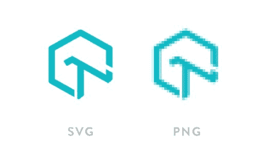

# 现代电子商务网站是如何建立的？

> 原文：<https://dev.to/lambdatest/how-modern-e-commerce-websites-are-built-2ibb>

在一个致力于数字化现代生活各个方面的世界里，电子商务巨头的出现是很自然的事情。从世界各地涌入的新技术导致了前端和后端的发展。不断增长的流量和更激烈的竞争给这些网站带来了提高效率的压力。在这篇博客中，我们将探索电子商务网站的成功之道。更重要的是，开发人员在开发电子商务网站时应该关注哪些方面。

## 速度

如果你的网站加载时间超过 5 秒，那么你已经落后于一半的竞争对手。现代网络冲浪者的平均注意力持续时间约为 6 秒，如果你的网站在此之前没有开始变得有意义，那么游戏甚至在开始之前就已经输了。这就是互联网用户的行为。因此，在开发以用户为中心的网站时，缩短网站的加载时间变得极其重要，这也是行业中最大的障碍之一。

这些网站有如此多的后端数据，使得网站所有组件的集成非常缓慢。大量的交通使事情变得更加复杂。现在有多种方法可以用来提高页面速度，包括压缩，减少资源，优化图像，优化交付，缓存等。它需要一个整体来讨论所有可能的解决方案。然而，我们将更多地研究其中最简单和最重要的，如缓存和 Webpack。

## 缓存

访问一个网站可以比作多米诺骨牌倒下，你的请求被浏览器接受，然后浏览器检查缓存是否存在。如果存在，它会将缓存数据发送给用户，否则它会从链接服务器获取必要的资源。当缓存成为问题时，最新的浏览器提供了很多支持。

几乎所有主要的电子商务网站都使用 Service Worker (SW)来缓存基于各种资源(如图像、API 数据等)的不同信息块。Myntra 从一开始就明确启动了软件实施。

虽然 SW-toolbox 非常有效，但是，它是一个非常大的但是，仍然有浏览器不支持 SW。Safari、UCweb 等浏览器对闪电般的高速缓存构成了威胁，为了解决这一问题，并为 SW 带来替代方案，本地存储应运而生。本地存储用于缓存，而不是在 SW 中缓存。事实上，开发 LambdaTest 的主要动机之一是开发一个[跨浏览器测试](https://www.lambdatest.com/?utm_source=devto&utm_medium=organic&utm_campaign=jul06_sd&utm_term=sd&utm_content=webpage)平台，在那里你可以测试你的网站缓存是否如预期的那样工作。
缓存确实为这些网站提供了尚未开发的速度，但随之而来的是一系列问题。最大的问题是减少和压缩包(HTML，CSS & JS)
以确保网页的快速加载。

LambdaTest 提供最先进的基于云的软件测试平台，支持各种自动化框架，如 [Selenium](https://www.lambdatest.com/selenium?utm_source=devto&utm_medium=organic&utm_campaign=sep15_sd&utm_term=sd&utm_content=webpage) 、 [Cypress testing](https://www.lambdatest.com/cypress-testing?utm_source=devto&utm_medium=organic&utm_campaign=sep15_sd&utm_term=sd&utm_content=webpage) 、[剧作家](https://www.lambdatest.com/playwright-testing?utm_source=devto&utm_medium=organic&utm_campaign=sep15_sd&utm_term=sd&utm_content=webpage)、[端到端测试](https://www.lambdatest.com/learning-hub/end-to-end-testing?utm_source=devto&utm_medium=organic&utm_campaign=sep15_sd&utm_term=sd&utm_content=learning_hub)等等。

## Webpack

Webpack 单枪匹马解决了很多问题。使用这种技术，网站能够更有效地压缩它们的包。让您了解一下，Myntra 能够将他们的包负载从 350 kb gzipped 减少到 100 kb gzipped。Webpack 有太多的好处，加上构建系统中集成的 webpack 分析器，它有助于密切关注包的大小。另一个额外的好处是能够立即修复大小，而不是等到开发结束。

Tresshaking 是 webpack 的一个受欢迎的特性，它极大地帮助了自动抑制包中未使用的 JS 和 CSS 部分。JS 开发人员大部分时间都在使用大型库，大部分都没有使用。树抖动有效地消除了这部分，以进一步压缩包的大小。Webpack 3 补充了 Babel，消除了由于 ES6/5 浏览器支持而产生的差异。当 Webpack 进入等式时，整个传输过程变得更快。

CSS 包的大小减少了 10 kb，压缩成 6-10 页，包括核心 CSS，包括按钮，文本，主题等。

## UI & UX

结合起来，它们可以成就或打破你成为成功的电子商务网站的梦想。简单的用户界面确实更有效率，但是必须有一些“独特的东西”附在上面。在设计你的网站时，最重要的是你要记住后端的数据海洋。用户界面不能阻碍网站的加载时间(通常是这样)。

## 自定义网页字体(Ebay)

Ebay 希望定制网络字体，以吸引更多用户访问他们的网站，但在这一过程中，他们遭遇了重重障碍。制作网络字体很容易，只是集成引起了关注。普通的系统字体执行起来简单快捷，但是定制字体带来了交付独特用户界面的责任。第一个问题当然是性能，因为现在 CSS 包增加了，但是他们设法解决了。其次，FOUT(非样式文本的闪现)和 FOIT(不可见文本的闪现)暴露了各种浏览器不支持这种字体或缺乏对这种进步的支持的问题。

为了解决这个问题，公司采取的策略是在用户第一次访问网站时向用户提供系统字体，然后在第二次访问时(缓存存在)用 web 字体处理他。此外，为了解决浏览器问题，CSS 字体渲染被提出，其中添加了一个名为 Font-display 的新的@fontface 描述符。微小的内联 CSS 和 JS 片段被偷偷放入页眉和页脚，以合并字体解码器逻辑。在解析数据时，检查字体显示标志，如果不存在 API 支持，则将其保存在高速缓存中，如果不存在浏览器支持，则将其存储在本地存储器中以供进一步使用。

***看看这个:[修改标题](https://www.lambdatest.com/lt-debug/modify-headers?utm_source=devto&utm_medium=organic&utm_campaign=jul06_sd&utm_term=sd&utm_content=webpage) - LT Debug 允许你修改你最喜欢的网页上的流量标题，删除标题，停止在线跟踪来测试你的站点。***

## 图像解析

图像绝对是互联网上最大的资产，占了一半以上的字节。电子商务网站是图像驱动的。你不会买你看不到的产品，最重要的是图片。它们有需要显示给用户的高分辨率图像，这又是一个障碍。SVG(可缩放矢量图形)代替普通 png 格式的引入在某种程度上减轻了服务器的负担。与普通的 png 文件相比，svg 文件的大小非常小，这使得图像更容易被解析成组件代码。

有时候，当你点击一个产品，有一个非常低分辨率的灰色图像，逐渐成为你的产品的高分辨率图像，这是另一种称为惰性加载的进步。惰性加载基本上是“按需”加载，即对象被分成多个部分，在用户需要时加载。这有助于减轻初始负荷。我们将在接下来的博客中讨论这一点以及帮助图像加载的最新云技术。

***看看这个:[阻塞请求](https://www.lambdatest.com/lt-debug/block-requests?utm_source=devto&utm_medium=organic&utm_campaign=jul06_sd&utm_term=sd&utm_content=webpage) - LT Debug 允许你基于你指定的 URL 特定过滤条件阻塞 HTTP 请求。***

## 顾客满意度

客户是上帝，你必须通过部署你的策略来打动他们。人们更喜欢提供更多互动界面的网站。例如，在一个电子商务网站中，搜索栏优化成为用户寻找的关键方面。Flipkart 和亚马逊都有很好的搜索栏体验，但是 Flipkart 把你的搜索产品分成了更多的类别。现在相关性扮演了下一个角色，几乎所有这些网站都有无限滚动。
产品细节、图片、评论等在定义和设定标准方面起着非常重要的作用。

## 渐进式网络应用

假设使用 SW 你需要从头开始构建你的站点作为 PWA，但事实并非如此。PWA 绝对是未来，它们释放了网络技术未开发的潜力，并赋予你与本地应用竞争的无限力量。所有的电子商务巨头都推出了他们的 PWA，无论是 Flipkart，全球速卖通，亚马逊等。要了解更多关于 PWA 的信息，请参考 PWA 上的[博客。](https://www.lambdatest.com/blog/testing-a-progressive-web-application-with-lambdatest/?utm_source=devto&utm_medium=organic&utm_campaign=jul06_sd&utm_term=sd&utm_content=blog)

***你知不知道你可以[对所有网络请求节流网速](https://www.lambdatest.com/lt-debug/throttle-response?utm_source=devto&utm_medium=organic&utm_campaign=jul06_sd&utm_term=sd&utm_content=webpage)。选择任何一个网址减速，其他的保持正常速度。所需 URL*T5 的控制延迟(毫秒)**

## 测试你的现代网站

对于电子商务来说，时间就是金钱。你的网站应该可以在所有的浏览器和设备上运行。人们已经开始使用手机，这种转变使得网站优先在移动平台上工作。测试变得至关重要，因为你的站点地图很有可能在不同的设备上有所不同。我们在 LambdaTest 为您配备了诸如响应截图、实时浏览器测试等工具，以检查您的
站点是否运行正常。UI 中的任何异常都可以通过我们的可视化 UI 测试来检测和标记。有了 LambdaTest，你可以很容易地跟踪你的网站的测试，甚至 bug 跟踪已经减少到只需一次点击。无论什么样的项目管理工具，我们都为其提供集成。查看 LambdaTest，免费订阅，让我们为您简化测试。此外，LambdaTest 提供最先进的基于云的软件测试平台，支持各种自动化框架，如 [Selenium](https://www.lambdatest.com/selenium?utm_source=medium&utm_medium=organic&utm_campaign=sep15_sd&utm_term=sd&utm_content=webpage) 测试、 [Cypress 测试](https://www.lambdatest.com/cypress-testing?utm_source=medium&utm_medium=organic&utm_campaign=sep15_sd&utm_term=sd&utm_content=webpage)、[剧作家](https://www.lambdatest.com/playwright-testing?utm_source=medium&utm_medium=organic&utm_campaign=sep15_sd&utm_term=sd&utm_content=webpage)、[端到端测试](https://www.lambdatest.com/learning-hub/end-to-end-testing?utm_source=medium&utm_medium=organic&utm_campaign=sep15_sd&utm_term=sd&utm_content=learning_hub)等等。虽然这些库有数不清的替代品，但重要的是理解您的需求，然后考虑选择。