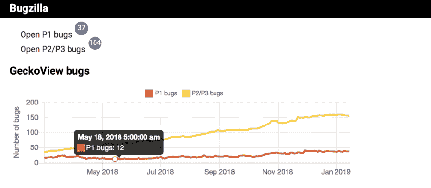
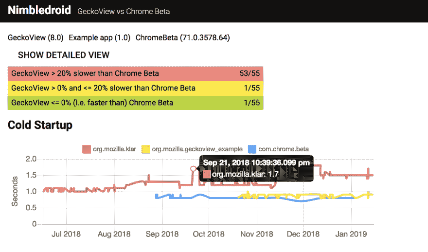
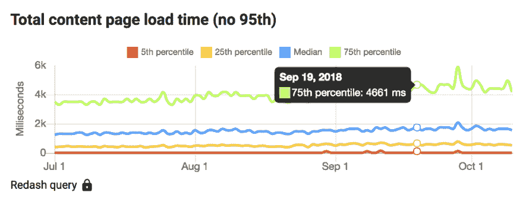

# Mozilla 如何保护 Firefox 的健康——以及你能从中学到什么

> 原文：<https://dev.to/aimenbatool/how-mozilla-takes-care-of-firefox-s-health-and-what-you-can-learn-from-it-2fln>

目前，作为我在 Mozilla 的[拓展实习的一部分，我正在开发一个](https://dev.to/aimenbatool/how-i-got-a-remote-paid-internship-with-mozilla-through-outreachy-23i5-temp-slug-1274240) [Firefox 健康仪表板](https://github.com/mozilla-frontend-infra/firefox-health-dashboard)。以下是我们打算在实习期间实现的[主要目标](https://github.com/mozilla-frontend-infra/firefox-health-dashboard/projects/2)。

*   向性能数据的图形显示添加新功能
*   将现有的 JS 团队(Firefox Performance)仪表板转移到健康仪表板
*   增强图表上的现有信息并修复一些错误

这篇文章的主要目的是向不在社区中并且不熟悉我们在 Mozilla 所做工作的人解释这个项目。目的是帮助新手和其他贡献者理解仪表板，这样他们就可以对这个开源项目有更多的了解。

<figure> 

<figcaption>照片由 [rawpixel](https://unsplash.com/photos/0-SGyQFiDRI?utm_source=unsplash&utm_medium=referral&utm_content=creditCopyText) 上 [Unsplash](https://unsplash.com/search/photos/health?utm_source=unsplash&utm_medium=referral&utm_content=creditCopyText)</figcaption>

</figure>

### 什么是火狐健康仪表盘？

Firefox health 是一个为项目经理和工程师创建仪表板的项目。它显示 Firefox 矩阵和见解，以帮助满足发布标准。它允许包含来自 Mozilla 的问题跟踪器(Bugzilla)、性能数据(Perfherder)、产品指标(遥测)和其他来源的数据/指标。所有数据都以图表的形式显示，使用开源图形库 ChartJS 来显示不同日期和平台的洞察力。

它以前被称为平台健康。它在 2018 年 1 月被重构为火狐健康仪表板。这种重构的主要变化之一是将后端与前端分离。这提高了代码的可维护性。

#### 技术:

[后端](https://github.com/mozilla/firefox-health-backend)是用 NodeJS 和 Koa 编写的。[前端](https://github.com/mozilla-frontend-infra/firefox-health-dashboard)是使用 ReactJS 和开源图形库 ChartJS 构建的。一些数据通过不同的库来自不同的主机。例如，perf-google 正在向 Mozilla 的 Perfherder 查询性能数据。关于报告的 bug 的信息来自 Bugzilla。因此，如果您计划在未来贡献一些时间，您需要了解上面提到的技术。

这个仪表板迎合了不同 Firefox 版本和设备的性能。但是今天我们要谈论的是 Firefox android 以及 Mozilla 的工程师们是如何关注它的性能的。

### Firefox Android 的数据/指标

目前，Firefox android 的数据来自不同的来源。为了更好地理解和分析，我们以图表的形式显示数据。你可以在健康仪表盘上看到对 [Firefox android 的所有见解。这里有一些关于 Firefox android 的资源和信息，可以帮助工程师提高浏览器的性能。](https://health.graphics/android)

#### Bugzilla:

Bugzilla 由 Mozilla 开发，是一个免费的开源工具，用于跟踪大型复杂应用程序中的 bug、问题和变更请求。成千上万的组织使用它来跟踪他们的产品性能。我们在健康仪表板中使用它来关注 Firefox Android 中突然出现的错误。

<figure> 

<figcaption>显示 Bugzilla</figcaption>

</figure>

中 bug 的图形

如上所述，我们使用 ChartJS 来显示数据。这里我们有一个图表，代表了 Bugzilla 网站上不同日期的 Firefox Android 报告的 bug 数量。带有 P1 标签的错误具有最高优先级。它们需要尽快修复。然后是优先级第二高的 P2 臭虫。P3 级别的错误优先级最低，工程师只要有时间就可以修复它们。这有助于开发人员和产品经理更有效地审查不同优先级的 bug，并根据优先级解决它们。

#### NimbleDroid:

在对 Firefox Android 进行测试后，我们使用一个名为 NimbleDroid 的第三方服务来获得一些数据见解。NimbleDroid 是一项针对 android 和 IOS 设备的功能性能测试服务。

> 监控移动应用的每个版本的每个关键用户流。在开发周期的早期查明降低用户体验的问题。与您的 CI 工作流无缝集成。—官方网站

<figure> 

<figcaption>展示 Nimbledroid</figcaption>

</figure>

给出的数据见解

#### 遥测:

遥测是一种工具，能够向 Mozilla 提供性能和使用信息，以帮助工程师和决策者测量 Firefox 在现实世界中的性能。它能够收集 Firefox 用户的性能、硬件、使用、定制和其他非个人信息，并每天将其发送给 Mozilla，以帮助工程师提高浏览器的质量和效率。

<figure> 

<figcaption>遥测图形视图</figcaption>

</figure>

对于 Android 设备，浏览器测量它在设备上加载内容页面所用的时间，并通过遥测技术报告回来。然后我们以图形的形式显示出来。例如，截图显示，75%的用户报告 2018 年 9 月 19 日的总内容页面加载时间为 4.9 秒。这些数据是从不同用户的不同设备上收集的。这有助于工程师密切关注浏览器的加载时间，以提高其速度并使其更有效。

#### Perfherder:

Perfherder 是一个帮助工程师可视化和分析性能数据的系统，这些数据是针对 Firefox 或 Firefox Android 等 Mozilla 产品运行的许多自动化测试产生的。Perfherder 是 Treeherder 项目的一部分。这是另一个登录 Mozilla 项目的仪表板。这个工具的主要目标是确保 Firefox 的性能随着时间的推移会越来越好。它通过报告回归来帮助开发人员理解他们的变更和潜在的修正。

在接下来的文章中，我们将讨论 Firefox Quantum 和 JS team dashboard。我们将看到这些工具如何提高 Firefox 浏览器的性能。

#### 投稿指南:

如果你关心 Firefox 的健康，或者有兴趣为这个项目做贡献，那么下面是方法。

*   在本地机器上克隆并设置[项目](https://github.com/mozilla-frontend-infra/firefox-health-dashboard)
*   跟随[自述](https://github.com/mozilla-frontend-infra/firefox-health-dashboard#firefox-health-dashboard)
*   如果你觉得开始太难，就从[好的首要问题](https://github.com/mozilla-frontend-infra/firefox-health-dashboard/issues?q=is%3Aissue+is%3Aopen+label%3A%22good+first+issue%22)开始

请继续关注，了解我们在 Mozilla 所做的更多令人惊叹的事情。

* * *