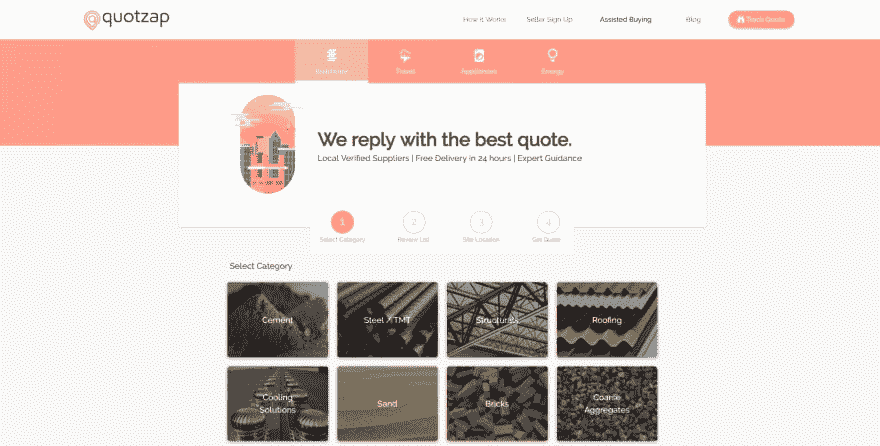
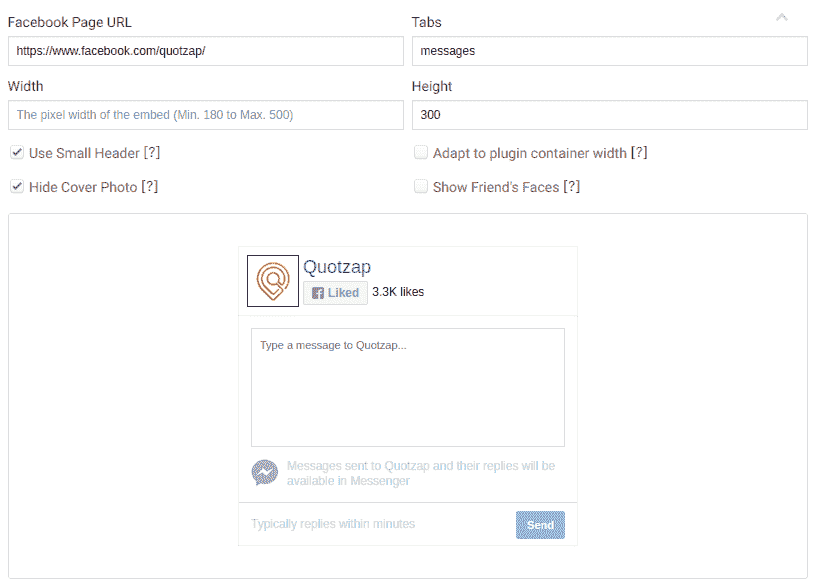
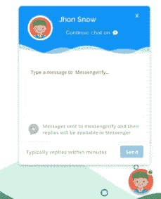
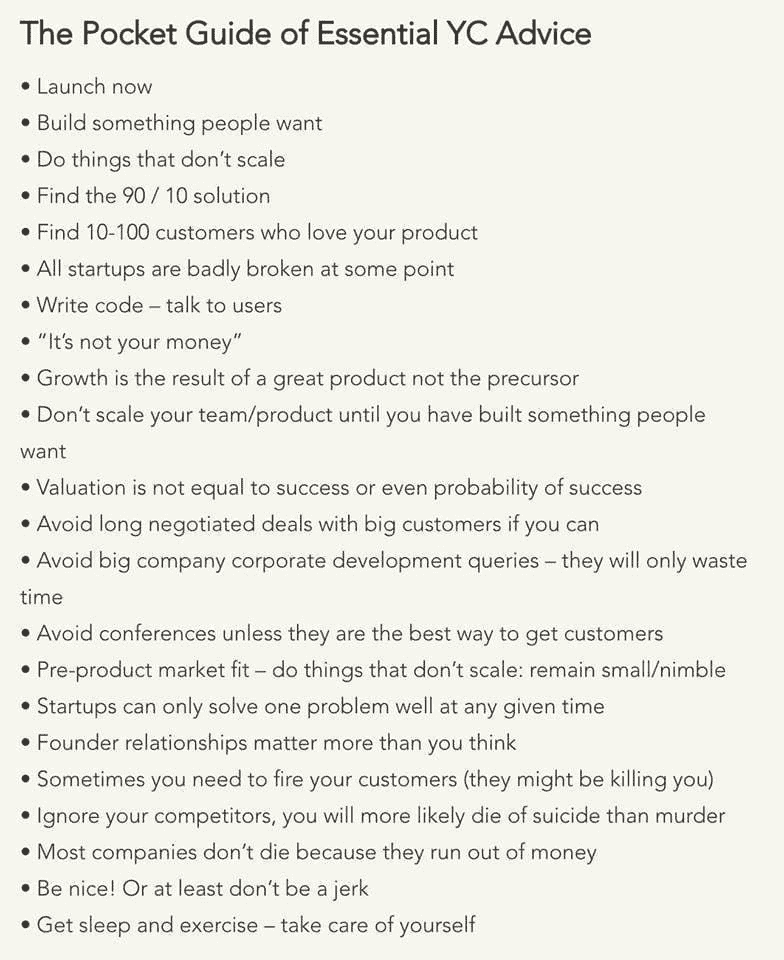
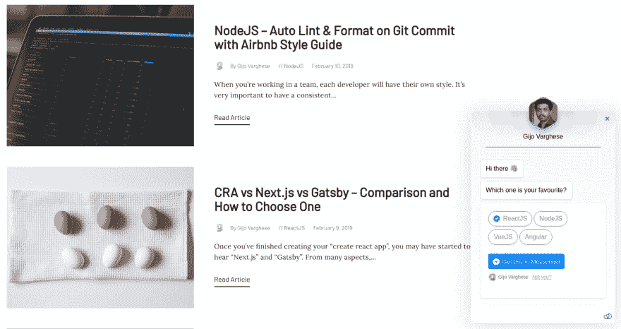
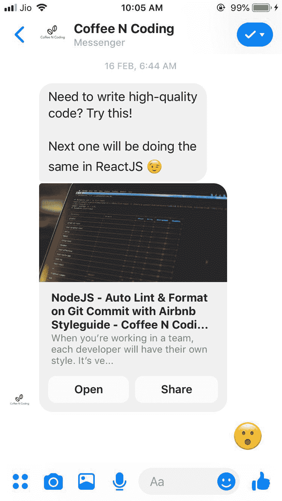

# 我的副业项目是怎么变成我全职创业的！

> 原文：<https://dev.to/gijovarghese/how-my-side-project-became-my-full-time-startup-934>

这是一个我为一个电子商务网站创建的副业项目的故事，这个项目后来变成了一个全职创业公司。

我希望每个开发者的梦想都是自己打造一个产品，并带着它生活。我是这样做的！

## 这一切是如何开始的

早在 2017 年，我就在一家名为 [Quotzap](https://quotzap.netlify.com/) 的初创公司工作。这是一个 RFQ(询价)平台，用户可以在这里请求建材
 的价格

为了获得更多的转化率，我们尝试了几个聊天工具，如 [Crisp](https://crisp.chat/en/) 、 [Intercom](https://intercom.com) 等。不出所料，用户输入了他们的电子邮件地址，并提出了一些疑问。事情进展顺利。但是...

### 我们遇到了一个问题

一旦我们回到网上，通过电子邮件回复这些对话，我们发现只有 10-30%的人会打开他们的电子邮件！

### 骇客！

所以我快速黑了一下。我使用了[脸书页面插件](https://developers.facebook.com/docs/plugins/page-plugin/)(一个 iframe)，用户可以直接从网站发送消息到页面

直接把它嵌入到网站上没有太多的转换，所以我在设计师的帮助下做了一个漂亮的包装。

### 结果？

由于用户不需要输入电子邮件地址，而且他们已经登录了脸书，他们更有可能提问。我们发送的回复被直接发送到他们的 Facebook Messenger。你猜怎么着？我们获得了 90%的打开率和 4-10 倍的转化率！

## 转折点！

我想为什么其他人不能从中受益呢？所以我把它做成一个插件，这样其他人就可以把它嵌入他们的网站。我提供了一个免费版本和一个定制的付费版本，价格为 29 美元。

Messengerify 诞生了！

那是我的 MVP(最小可行产品)。几周后，我启动了它 [ProductHunt](https://producthunt.com) ，结果令人惊讶。**我买了 500 多件东西，总共 5500 美元。**

## 花时间与客户交谈，少写代码

作为开发人员，我们的大部分精力将放在增加新功能上。相反，我们应该把更多的注意力放在与客户交谈上，并获得他们的反馈。

> Gijo Varghese@ gijovarghese 141我每天早上都要读这个！🙃2017 年 11 月 12 日上午 06:1014

我遵循了这些黄金法则，并为创作者将我的产品修改为 [MFY.im](https://mfy.im) 。

## 新的 MFY.im(以前的 Messengerify)

脸书不喜欢“信使”这个名字😢。于是我把它改名为 **MFY.im** 。最初的版本只是一个 MVP。在雇佣了几名工程师后，我对其进行了改进，专注于创造者(博客、YouTubers 等，我选择的利基)

我构建了两个部件(订阅框和角落部件),这样访问者可以很容易地订阅你的博客/youtube。之后，你可以在新的博客帖子/youtube 视频上向他们发送广播和自动消息

#### 订阅框

#### 角落小部件

#### 广播发送给信使

### 启动产品搜索

我今天刚开始上 PH。**如果您能抽出 1 分钟时间在 [ProductHunt](https://www.producthunt.com/posts/mfy-im) 中支持我并给我您对我的产品的反馈，那就太好了。**在 ProductHunt 中查看[mfy . im](https://www.producthunt.com/posts/mfy-im)

如果你不知道 [ProductHunt](https://producthunt.com) ，它是一个每天展示顶级(5-10 个)产品的网站。

如果你已经开发了一个产品，一定要在 PH 中发布它。我也正在写一篇关于如何在 ProductHunt 中发布的博文！