# 神经网络是如何工作的？让我们把它弄清楚

> 原文：<https://dev.to/liashchynskyi/how-neural-network-works-lets-figure-it-out-32o0>

嘿，怎么了😁在我的前一篇文章中，我描述了如何只用 JavaScript 从零开始构建神经网络。今天，应一些人的要求，我将尝试解释神经网络的数学原理。兄弟，你终于会明白那个怪物的面具下是什么了！

> 首先，我要告诉你另一个秘密:没有魔法，只有数学😵

这篇文章是根据我的[上一篇](https://dev.to/liashchynskyi/creating-of-neural-network-using-javascript-in-7minutes-o21)写的。如果你还没有读，是时候去读了！我将使用相同的公式并尝试解释它们。我们走吧！

# 准备

我将再次求解[异或](https://en.wikipedia.org/wiki/Exclusive_or)😅这不是玩笑，兄弟！有许多数据科学书籍都是从解决这个问题开始的😎我再一次提醒你 XOR 输入表。

| 输入 | 输出 |
| --- | --- |
| 0 0 | Zero |
| 0 1 | one |
| 1 0 | one |
| 1 1 | Zero |

为了证明这一点，让我们使用下面的神经网络结构。

[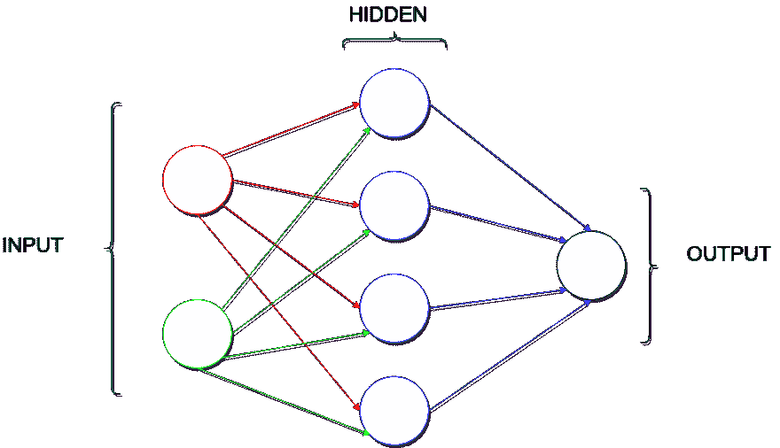](https://res.cloudinary.com/practicaldev/image/fetch/s--Nwk2n7DA--/c_limit%2Cf_auto%2Cfl_progressive%2Cq_auto%2Cw_880/https://thepracticaldev.s3.amazonaws.com/i/dm64r9dy05x6avibjne1.png)

这里我们在输入层有 **2** 个神经元，在隐藏层有 **4** ，在输出层有 **1** 。

# 权重初始化

神经网络训练的主要目标是调整权重以最小化输出误差。在大多数情况下，权重是随机初始化的，在神经网络训练期间，这些权重通过反向传播算法进行调整。

因此，让我们从`[0, 1]`范围内随机初始化权重。

[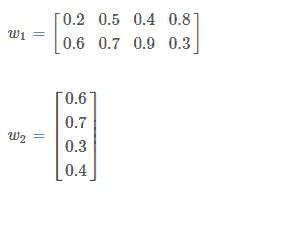](https://res.cloudinary.com/practicaldev/image/fetch/s--kWy188bJ--/c_limit%2Cf_auto%2Cfl_progressive%2Cq_auto%2Cw_880/https://thepracticaldev.s3.amazonaws.com/i/y0793jdwexq8fmaiyxu6.png)

从图形上看，是这样的。

[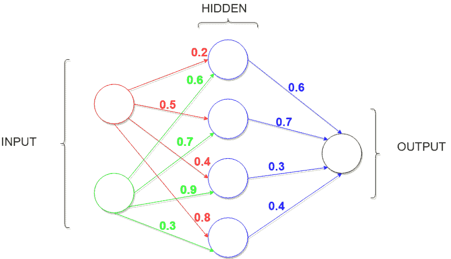](https://res.cloudinary.com/practicaldev/image/fetch/s--Lf8s1kL4--/c_limit%2Cf_auto%2Cfl_progressive%2Cq_auto%2Cw_880/https://thepracticaldev.s3.amazonaws.com/i/ezn0gdd7qink1sd0avpr.png)

# 正向传播

好，让我们来计算神经元的输入。为了节省时间，我将只使用一个输入用例:`0`和`1`，因此输出将是`1`。

公式:
[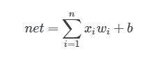](https://res.cloudinary.com/practicaldev/image/fetch/s--KvVKZrs---/c_limit%2Cf_auto%2Cfl_progressive%2Cq_auto%2Cw_880/https://res.cloudinary.com/practicaldev/image/fetch/s--vfh3zNSz--/c_limit%252Cf_auto%252Cfl_progressive%252Cq_auto%252Cw_880/https://cdn-images-1.medium.com/max/800/1%252AdMljfH2anWtmEbSPkZfBXA.png)

所以，对于隐藏层的第一个神经元:

```
net1_h = 0 * 0.2 + 1 * 0.6 = 0.6

/**

1..n, n = 2 (2 neurons in the input layer)

0 value of the first input element
1 value of the second input element

0.2 the weight from first input neuron to first hidden
0.6 the weight from second input neuron to first hidden

Understand, bro? 😏 

*/ 
```

Enter fullscreen mode Exit fullscreen mode

对于第二个和其他:

```
net2_h = 0 * 0.5 + 1 * 0.7 = 0.7
net3_h = 0 * 0.4 + 1 * 0.9 = 0.9
net4_h = 0 * 0.8 + 1 * 0.3 = 0.3 
```

Enter fullscreen mode Exit fullscreen mode

现在，我们还需要一样东西——我们需要选择激活函数。我就用**乙状结肠**。
T3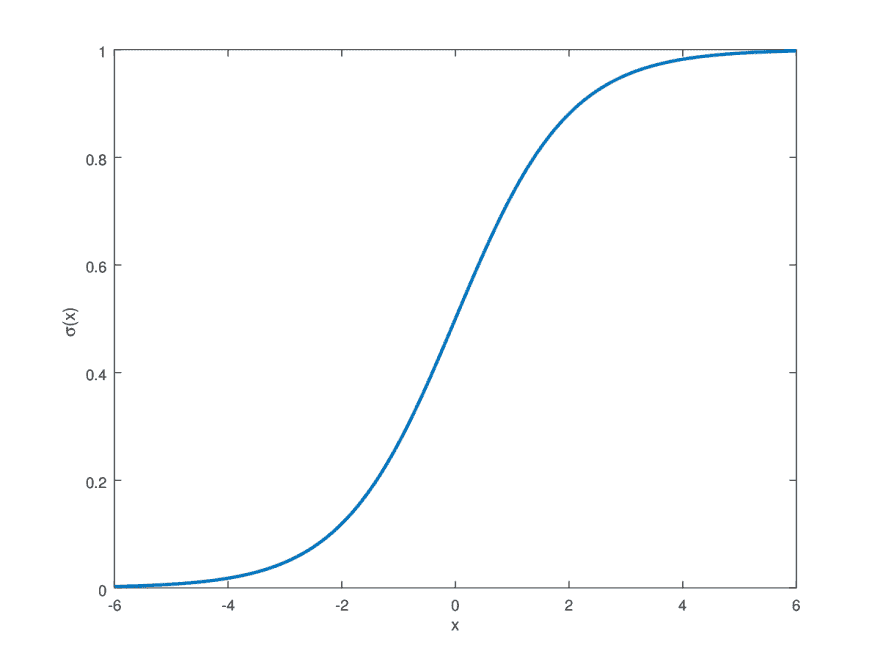T5】

公式及其导数:
[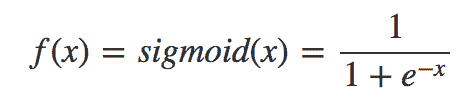](https://res.cloudinary.com/practicaldev/image/fetch/s--RYZHGGRj--/c_limit%2Cf_auto%2Cfl_progressive%2Cq_auto%2Cw_880/https://cloud.githubusercontent.com/assets/14886380/22743129/36eee4b6-ee54-11e6-8163-35c7c641d226.png)
[](https://res.cloudinary.com/practicaldev/image/fetch/s--DCufD-EJ--/c_limit%2Cf_auto%2Cfl_progressive%2Cq_auto%2Cw_880/https://cloud.githubusercontent.com/assets/14886380/22743164/58665ac0-ee54-11e6-91fb-8ec818752480.png)

```
f(x) = 1 / (1 + exp(-x))
deriv(x) = f(x) * (1 - f(x)) 
```

Enter fullscreen mode Exit fullscreen mode

因此，现在我们将我们的激活应用于每个计算的**净** :

```
output1_h = f(net1_h) = f(0.6) = 0.64
output2_h = f(net2_h) = f(0.7) = 0.66
output3_h = f(net3_h) = f(0.9) = 0.71
output4_h = f(net4_h) = f(0.3) = 0.57 
```

Enter fullscreen mode Exit fullscreen mode

我们已经得到了隐藏层中每个神经元的输出值。从图形上看，它是这样的:

[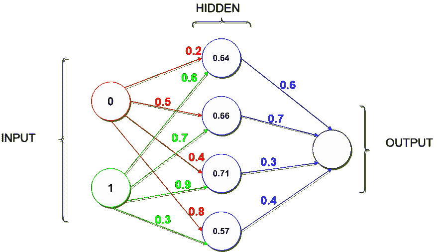](https://res.cloudinary.com/practicaldev/image/fetch/s--acahmi07--/c_limit%2Cf_auto%2Cfl_progressive%2Cq_auto%2Cw_880/https://thepracticaldev.s3.amazonaws.com/i/hjc86avcy0oq0djsvgk9.png)

现在，当我们得到隐藏层神经元的输出值时，我们可以计算输出层的输出值。

```
net_o = 0.64 * 0.6 + 0.66 * 0.7 + 0.71 * 0.3 + 0.57 * 0.4 = 1.28
output_o = f(net_o) = f(1.28) = 0.78 
```

Enter fullscreen mode Exit fullscreen mode

我们开始吧。

[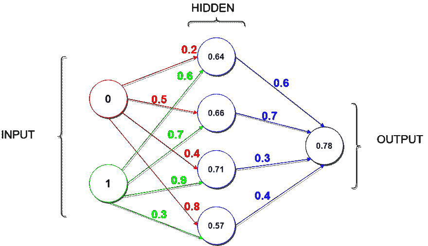](https://res.cloudinary.com/practicaldev/image/fetch/s--xnxvNwgN--/c_limit%2Cf_auto%2Cfl_progressive%2Cq_auto%2Cw_880/https://thepracticaldev.s3.amazonaws.com/i/isjgn4r97435xlhbc9ij.png)

# 反向传播

老弟，看产值。你看到了什么？`0.78`对吗？如果你还记得 XOR 表，你就会知道，对于这个例子`0 1`，我们应该得到`1`，但是我们得到了`0.78`。这叫做错误。让我们计算一下。

### 输出误差和增量

公式:

[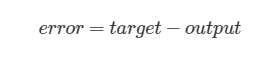](https://res.cloudinary.com/practicaldev/image/fetch/s--Y-NhWlTM--/c_limit%2Cf_auto%2Cfl_progressive%2Cq_auto%2Cw_880/https://res.cloudinary.com/practicaldev/image/fetch/s--ImwqldhQ--/c_limit%252Cf_auto%252Cfl_progressive%252Cq_auto%252Cw_880/https://cdn-images-1.medium.com/max/800/1%252A5yo4SajKz1QqXI8GiW0EoA.png)T3】

```
target = 1
error = target - output_o = 1 - 0.78 = 0.22 
```

Enter fullscreen mode Exit fullscreen mode

现在，我们需要计算 **delta 误差**。一般来说，这是你调整权重的值。

公式:

[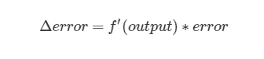](https://res.cloudinary.com/practicaldev/image/fetch/s--WdUY8dnD--/c_limit%2Cf_auto%2Cfl_progressive%2Cq_auto%2Cw_880/https://res.cloudinary.com/practicaldev/image/fetch/s--m6MFJQH1--/c_limit%252Cf_auto%252Cfl_progressive%252Cq_auto%252Cw_880/https://cdn-images-1.medium.com/max/800/1%252ApTQ8wJoGMxfDizlGuCwveg.png)

您可以使用[这个](https://keisan.casio.com/exec/system/15157249643425)位置进行 sigmoid 导数计算。

```
delta_error = deriv(output_o) * error = deriv(0.78) * 0.22 = 0.21 * 0.22 = 0.04 
```

Enter fullscreen mode Exit fullscreen mode

### 隐藏误差和增量

让我们对隐藏层中的每个神经元进行同样的操作。公式有点不同。

[](https://res.cloudinary.com/practicaldev/image/fetch/s--TK2RI41B--/c_limit%2Cf_auto%2Cfl_progressive%2Cq_auto%2Cw_880/https://res.cloudinary.com/practicaldev/image/fetch/s--xqQeyZlx--/c_limit%252Cf_auto%252Cfl_progressive%252Cq_auto%252Cw_880/https://cdn-images-1.medium.com/max/800/1%252AhwZatkVm0_B59j8xJmpNIg.png)

我们需要计算每个神经元的误差。记住，兄弟。我们开始吧！

```
error1_h = delta_error * 0.6 = 0.04 * 0.6 = 0.024
error2_h = delta_error * 0.6 = 0.04 * 0.7 = 0.028
error3_h = delta_error * 0.6 = 0.04 * 0.3 = 0.012
error4_h = delta_error * 0.6 = 0.04 * 0.4 = 0.016 
```

Enter fullscreen mode Exit fullscreen mode

又是三角洲！

[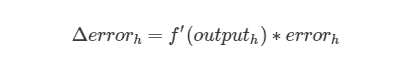](https://res.cloudinary.com/practicaldev/image/fetch/s--y_Fl8_QC--/c_limit%2Cf_auto%2Cfl_progressive%2Cq_auto%2Cw_880/https://res.cloudinary.com/practicaldev/image/fetch/s--G3le5qAp--/c_limit%252Cf_auto%252Cfl_progressive%252Cq_auto%252Cw_880/https://cdn-images-1.medium.com/max/800/1%252At-80Rqf-twKvFhZp7rtETA.png)T3】

```
delta_error1_h = deriv(output1_h) * error1_h = deriv(0.64) * 0.024 = 0.22 * 0.024 = 0.005
delta_error2_h = deriv(output2_h) * error2_h = deriv(0.66) * 0.028 = 0.224 * 0.028 = 0.006
delta_error3_h = deriv(output3_h) * error3_h = deriv(0.71) * 0.012 = 0.220 * 0.012 = 0.002
delta_error4_h = deriv(output4_h) * error4_h = deriv(0.57) * 0.016 = 0.23 * 0.016 = 0.003 
```

Enter fullscreen mode Exit fullscreen mode

### 时候到了！😎

现在，我们有所有的变量来更新权重。公式看起来像这样。

[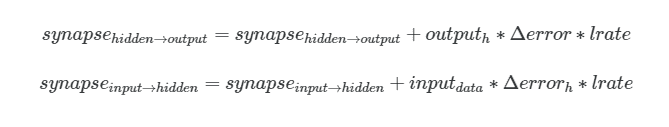](https://res.cloudinary.com/practicaldev/image/fetch/s--fV70lrnb--/c_limit%2Cf_auto%2Cfl_progressive%2Cq_auto%2Cw_880/https://res.cloudinary.com/practicaldev/image/fetch/s--yL45KIQZ--/c_limit%252Cf_auto%252Cfl_progressive%252Cq_auto%252Cw_880/https://cdn-images-1.medium.com/max/800/1%252AEaZ-DpsyZGQQQ538Nw85_A.png)

让我们从*隐藏*到*输出*开始。

```
learning_rate = 0.001

hidden_to_output_1 = old_weight + output1_h * delta_error * learning_rate = 0.6 + 0.64 * 0.04 * 0.001 = 0.6000256
hidden_to_output_2 = old_weight + output2_h * delta_error * learning_rate = 0.7 + 0.66 * 0.04 * 0.001 = 0.7000264
hidden_to_output_3 = old_weight + output3_h * delta_error * learning_rate = 0.3 + 0.71 * 0.04 * 0.001 = 0.3000284
hidden_to_output_4 = old_weight + output4_h * delta_error * learning_rate = 0.4 + 0.57 * 0.04 * 0.001 = 0.4000228 
```

Enter fullscreen mode Exit fullscreen mode

我们得到的值太接近旧的权重了。是因为我们选择的学习率太小了。这是一个非常重要的超参数。当你把它选得太小时——你的网络将训练多年😄否则，当它是一个很大的数字时，你的网络会训练得更快，但对于新数据，它的准确性可能会很低。所以你要选择正确。最佳值在`1e-3`和`2e-5`之间。

好，让我们对*输入*到*隐藏*突触做同样的操作。

```
//for the first hidden neuron
input_to_hidden_1 = old_weight + input_0 * delta_error1_h * learning_rate = 0.2 + 0 * 0.005 * 0.001 = 0.2
input_to_hidden_2 = old_weight + input_1 * delta_error1_h * learning_rate = 0.6 + 1 * 0.005 * 0.001 = 0.600005

//for the second one
input_to_hidden_3 = old_weight + input_0 * delta_error2_h * learning_rate = 0.5 + 0 * 0.006 * 0.001 = 0.5
input_to_hidden_4 = old_weight + input_1 * delta_error2_h * learning_rate = 0.7 + 1 * 0.006 * 0.001 = 0.700006

//for the third one
input_to_hidden_5 = old_weight + input_0 * delta_error3_h * learning_rate = 0.4 + 0 * 0.002 * 0.001 = 0.4
input_to_hidden_6 = old_weight + input_1 * delta_error3_h * learning_rate = 0.9 + 1 * 0.002 * 0.001 = 0.900002

//for the fourth one
input_to_hidden_7 = old_weight + input_0 * delta_error4_h * learning_rate = 0.8 + 0 * 0.003 * 0.001 = 0.8
input_to_hidden_8 = old_weight + input_1 * delta_error4_h * learning_rate = 0.3 + 1 * 0.003 * 0.001 = 0.300003 
```

Enter fullscreen mode Exit fullscreen mode

就是这样！最后😉

# 结论

哦，最后我们做了所有的数学工作！但是我们只对一个训练集做了这样的工作- `0`和`1`。对于我们解决的问题(异或)，我们有 **4** 个训练集(见上表)。这意味着您必须对每个训练集进行与我们刚才所做的相同的计算！Brrr，太可怕了😑太多的数学😆

因此，在机器学习中，当你对一个训练集进行一个正向传播步骤(从输入层到输出层)和一个反向传播步骤(从输出层到输入层)时，这被称为**迭代**。另一个重要术语是**纪元**。当你通过你的神经网络所有的训练集时，历元计数器是迭代的。在我们的例子中，我们有 4 个训练集。一次迭代意味着一个训练集通过神经网络。当所有的训练集通过一个网络，这里我们有一个纪元。然后: **4** 次迭代等于 **1** 个历元。明白吗，兄弟？🤗一般来说，时代越多，精度越高，时代越少，精度越低。

就是这样。没有魔法，只有数学。霍普，你已经明白了，兄弟😊再见！快乐编码😇