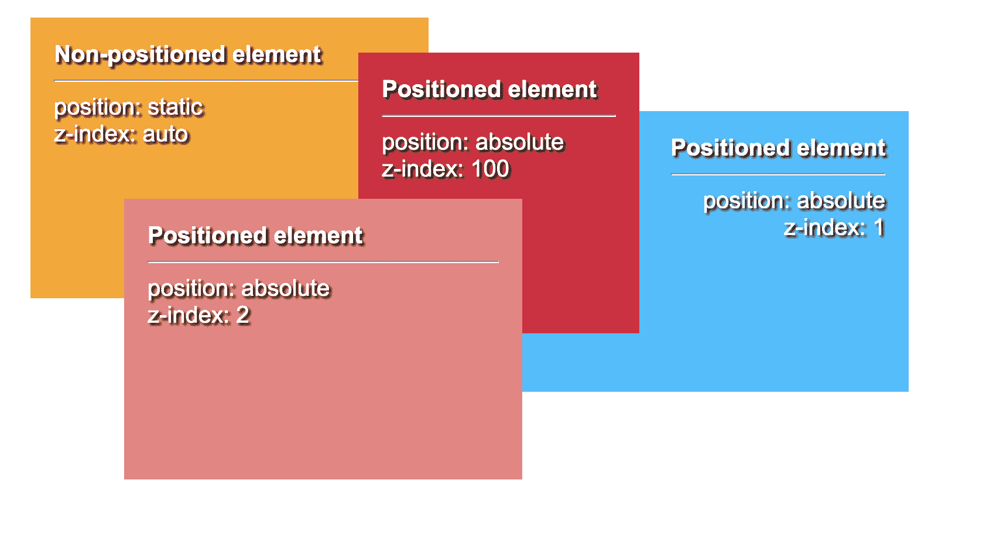
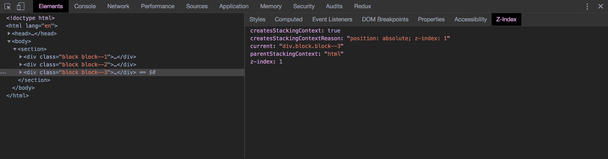

# CSS 堆栈上下文如何工作

> 原文：<https://dev.to/kabisasoftware/how-the-css-stacking-context-works-4pag>

任何使用过 HTML 和 CSS 的人都可能听说过或者使用过 z-index 属性。它所做的非常简单:它允许你管理所谓的“定位”HTML 元素的堆叠顺序。任何具有较高 z 索引号的元素都应该出现在具有较低 z 索引号的元素之上。然而，有时您会遇到 z-index 属性似乎没有任何作用的情况，并且它并不像看起来那样简单。在这些情况下，很可能您正在处理**堆叠环境中的差异。**

### 默认堆叠元素的规则

当没有应用定位元素时，元素堆叠顺序的基本规则如下:

*   当根元素被渲染时，它创建了**根(或全局)堆栈上下文。**
*   随后是**非定位**元素，其中**位置**值未指定。位置值默认为**静态**。
*   其次是**定位的**元素，都是具有除**静态**之外的位置属性的元素，比如**固定**、**绝对**、**粘滞**或**相对**。

都遵守文件中声明的顺序。

### 堆叠已定位的元素

当元素被定位时，它们出现在未定位的元素之上。许多布局由定位的元素组成，其中需要控制元素的堆叠顺序。一个常见的用例是，你想在页面的正常内容上面显示一个模态。为了控制堆叠顺序，z-index 用在**定位的**元素上。Z-index 不适用于非定位元素。将具有类似于**固定和粘性**或**绝对和相对**的值的位置属性与除**自动**之外的 **z 索引**值相结合，将创建一个**新的本地堆栈上下文**。

### 考虑(局部)堆栈上下文

现在事情变得更加棘手了。在元素上创建堆叠上下文时，该元素将成为其子元素的根堆叠上下文元素。文档可以有许多堆叠上下文，因此在其他堆叠上下文中有堆叠上下文并不罕见。这造成的问题是，新创建的堆叠上下文的子元素将不能在不同的堆叠上下文中的元素之上呈现。永远不会。即使当孩子将成为定位元素。即使有 z-index:999999；。

为了克服这个问题，您可以在当前的 DOM 层次结构中交换出这些子元素，并将它们放到根堆栈上下文(元素)的同一级别。定位的兄弟元素**可以用 z 索引属性**排序。然而，在更复杂的 DOM 结构中，许多元素存在于彼此之中，这可能包括对 CSS 甚至 JavaScript 的一些修改，可能会更复杂。

### 隐式创建堆叠上下文

另一件要提到的重要事情是，有更多隐含的方法来创建堆叠上下文。在这篇文章的前面，我提到了一种创建堆叠上下文的方法。还有更多 CSS 属性可以隐式地创建自己的堆栈上下文。不幸的是，没有一种清晰的方法可以一目了然地看出堆叠上下文是何时创建的。然而，有一个很酷的 Chrome 插件可以在识别堆叠上下文元素时提供一点帮助。它主要收集导致每个元素的堆叠上下文的属性，并输出有关元素的信息，如下所示(显示在 Z-index 选项卡的右列中):

也创建堆叠上下文的属性有(来源于 [MDN](https://developer.mozilla.org/en-US/docs/Web/CSS/CSS_Positioning/Understanding_z_index/The_stacking_context#The_stacking_context) ):

*   flex (flexbox)容器的子元素，z 索引值不是 auto。
*   是 grid(网格)容器的子元素，z 索引值不是 auto。
*   不透明度值小于 1 的元素。
*   mix-blend-mode 值不是 normal 的元素。
*   具有下列任意属性值的元素:
*   改变
*   过滤器
*   远景
*   剪辑路径
*   遮罩/遮罩-图像/遮罩-边框
*   隔离值为 isolate 的元素。
*   带有-webkit-overflow-scrolling 值触摸的元素。
*   具有 will-change 值的元素，指定将在非初始值上创建堆栈上下文的任何属性。
*   具有布局或绘画的包含值，或者包括其中之一的复合值的元素(即，contain: strict，contain: content)。

为什么这些特性会有这样的副作用还不清楚。

### 在使用 React 时求解

大多数 React 应用程序可以由那些更复杂的 DOM 层次结构组成，这不允许您如此容易地将元素与它们自己的堆栈上下文交换。然而，React 在 v16 中加入了一个名为“门户”的新功能。门户将允许您在 DOM 结构中的任何位置挂载任何 DOM 元素。React 在其文档中也提到了这一点:

门户的一个典型用例是当父组件具有溢出:隐藏或 z 索引样式，但您需要子组件在视觉上“突破”其容器时。比如对话框、悬浮卡、工具提示。”

### 总结

我希望这有助于您通过学习堆叠上下文以及它们与 z 索引交互的方式来防止将来的麻烦。以下是这篇文章的摘要:

*   应用某些 CSS 属性将允许您控制堆叠上下文。
*   将最大可能值数的 z 索引值应用于本地堆栈上下文不会使该元素出现在堆栈上下文在 DOM 中位置更高的其他元素之上。
*   z 索引仅在其自包含的堆叠上下文(全局或局部)中有意义
*   布局可以有许多并排的堆叠上下文，也可以在彼此内部堆叠上下文。

感谢阅读，祝你好运堆叠！