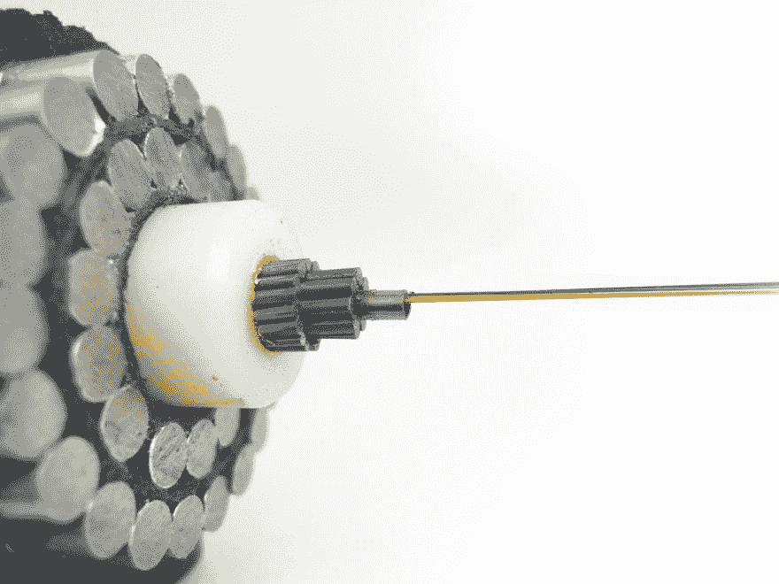

# 互联网如何穿越海洋

> 原文：<https://dev.to/adriennemiller/how-the-internet-travels-across-oceans-3a4e>

几天前，我在看 Avi Flombaum 的讲座，题目是“网络是如何工作的”,当他解释互联网如何穿越海洋时，我不得不暂停视频，并被吓坏了。简单来说，有数百条水下电缆被放置在海洋底部，以在国际上传输数据。

# 这不是魔法

我喜欢这种简单而又伟大的东西。不，不是卫星(嗯，有一些卫星...)或者说神奇的，就是我们安装的一堆物理线缆而已。

# 海底电缆

目前大约有 378 条水下电缆，总长超过 120 万公里，将世界大部分地区连接到互联网。

TeleGeography 提供了一个交互式的海底电缆地图，它显示了电缆的整体地图，并为你提供诸如特定电缆长度、所有者及其着陆点等信息。我强烈建议去看看。

# 线缆是用什么做的？

在其核心，这些电缆使用光纤发送光信号，激光以极高的速度从一端发射到另一端。真正起这种作用的玻璃纤维非常小，它们的直径和一根头发差不多，但是它们被几层保护层覆盖着。

尽管如此，海底的大部分电缆只有花园水管的大小。越浅的地方，保护层越厚，因为接触船只等的机会越大。当靠近海岸时，它们也会被埋起来，作为另一层保护。然而，在深海区域，电缆是用一种特殊的机器直接铺设在海底的。

# 线缆安装在哪里？

采取预防措施，为电缆找到最安全的路径，以避开有大量捕鱼或船只可能抛锚的区域。正是这些类型的人类活动对电缆造成了最大的损害。虽然每年大约有 100 起电缆故障，但你可能永远不会注意到，因为公司使用冗余电缆，所以总是有备份。

此外，电缆的铺设基于哪些位置可以相互通信。所以，你可以看到在澳大利亚和南美洲之间没有很多直线，但是相反，他们都有很多电缆连接到北美。这表明他们都需要发送和接收来自北美的信息。

# 快速事实

以下是一些额外的事实，以防你像我一样对这些电缆着迷:

-第一条海底电缆是 1866 年横跨大西洋的电报线。

-只需一艘船就能运送这些洲际连接所需的所有电缆。

-在海底每隔 50 英里就有一个称为中继器的区块，帮助放大光线，使其能够传播数千英里。

-2013 年，三名潜水者被抓到试图切断地中海的海底互联网电缆，导致互联网速度下降约一周。

-虽然鲨鱼偶尔会咬电缆，但它们并不被视为互联网的主要威胁。人类活动约占电缆损坏的 2/3。

你是什么时候知道世界是通过水下电缆连接的？我是最后一个知道这个的吗？我很乐意听到你对我们的水下系统的任何反馈或额外的事实！

资源:
[tele geography FAQ](https://www2.telegeography.com/submarine-cable-faqs-frequently-asked-questions)
[海底电缆图](https://www.submarinecablemap.com)
[历史频道](https://www.history.com/this-day-in-history/first-transatlantic-telegraph-cable-completed)
[有线](https://www.wired.com/2014/08/shark-cable/)
[加州潜水员](http://californiadiver.com/slow-internet-sharks-ships-have-an-appetite-for-undersea-fiber-optic-cables/)
[CBS 新闻](https://www.cbsnews.com/news/egypt-divers-caught-cutting-internet-cable/)