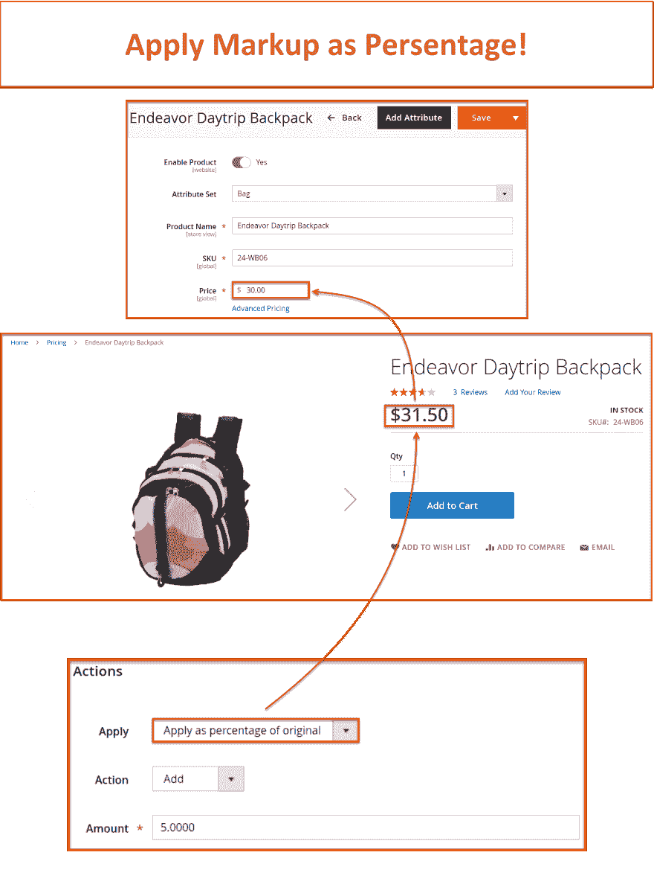
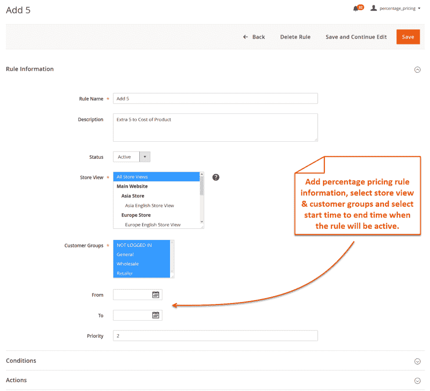

# 如何在 Magento 2 中将加价百分比添加到成本价

> 原文：<https://dev.to/simonwalkerfme/how-to-add-markup-percentage-to-cost-price-in-magento-2-3ol6>

如果你想在 Magento 2 中增加产品成本的百分比，那么 FME 的百分比定价是最好的扩展。您可以创建简单的规则，并将其分配给产品，以按百分比金额增加成本。

百分比定价扩展的一些关键特性:

*   设置百分比或固定加价
*   允许固定或百分比折扣
*   对特定产品应用百分比定价
*   通过商店视图和客户群限制定价
*   为定义的时间段安排定价
*   设置加价/折扣规则的时间段(开始和结束日期)

**产品演示** - [在 Magento 2 中增加产品成本的百分比加成](https://www.fmeextensions.com/cost-based-percentage-pricing-extension-magento-2.html)

查看有关 Magento 2 基于成本百分比定价示例的更多详情 **[点击](https://www.fmeextensions.com/blog/magento-2-percentage-pricing-use-cases-examples/)**

**产品成本加价**

**标记规则配置**
