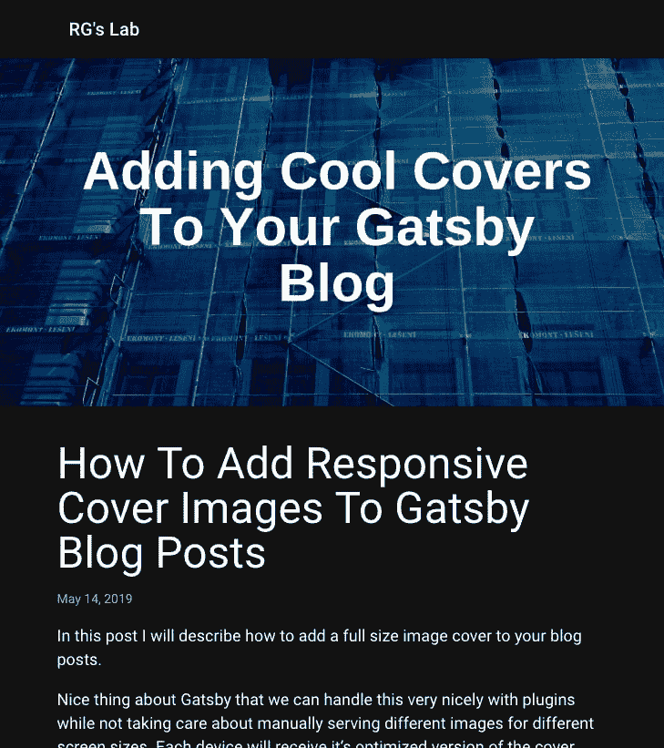

# 如何在盖茨比的博客文章中添加有针对性的封面图片

> 原文：<https://dev.to/rohovdmytro/how-to-add-responsive-cover-images-to-gatsby-blog-posts-2n2m>

在这篇文章中，我将描述如何给你的博客文章添加一个全尺寸的图片封面。

关于 Gatsby 的一件好事是，我们可以用插件很好地处理这个问题，而不需要为不同的屏幕尺寸手动提供不同的图像。每台设备都将收到其优化版本的封面。整洁！

这篇文章是 [10x Better Gatsby](https://blog.swingpulse.com/10x-better-gatsby) 系列的一部分，在这里我分享了我在调整、提升和调整 Gatsby 方面的个人经验。我会贴出更多关于调音盖茨比的好东西。看看吧！

### 假设

我会假设你已经设置了降价。这意味着您已经安装并配置了这个插件:

*   `gatsby-source-filesystem`
*   `gatsby-transformer-remark`

# 指令

## #1。编辑配置

确保你的配置中设置了插件。

```
// gatsby-config.js
module.exports = {
  /*
    ...
  */
  plugins: [
    /*
    ...
    */
    {
      resolve: `gatsby-transformer-remark`,
      options: {
        plugins: [
          {
            resolve: `gatsby-remark-images`,
            options: {
              maxWidth: 620,
            },
          },
        ],
      },
    },
    `gatsby-transformer-sharp`,
    `gatsby-plugin-sharp`,
    /*
      ...
    */
  ],
} 
```

Enter fullscreen mode Exit fullscreen mode

## #2。更新降价文件

把你的图片放在你的减价文件附近，并更新你的减价文件(在我的例子中是`post.md`)使`cover`字段指向一张图片。

```
---
title: 'How  Failing  With  Pomodoro  Technique  Made  Me  2x  Better  Programmer'
date: '2019-03-27'
cover: './cover.png'
--- 
```

Enter fullscreen mode Exit fullscreen mode

现在让我们更新我们的 GraphQL 查询。

## #3。更新 GraphQL 查询

`blog-post.js`

```
const query = graphql`
  query BlogPostBySlug($slug: String!) {
    markdownRemark(fields: { slug: { eq: $slug } }) {
      id
      html
      frontmatter {
        date(formatString: "MMMM DD, YYYY")
        title
        cover {
          publicURL
          childImageSharp {
            sizes(maxWidth: 2000) {
              ...GatsbyImageSharpSizes
            }
          }
        }
      }
    }
  }
` 
```

Enter fullscreen mode Exit fullscreen mode

现在，您可以编辑组件代码了。

## #4。更新 React 组件

确保您安装了`gatsby-image`。这是一个组件，将处理所有的响应魔术。

```
yarn add gatsby-image 
```

Enter fullscreen mode Exit fullscreen mode

为了显示完整尺寸的图像，我将数据传递给我的组件

```
<Layout
  location={props.location}
  title={siteTitle}
  cover={data.frontmatter.cover}
>
  {/* ... */}
</Layout> 
```

Enter fullscreen mode Exit fullscreen mode

然后我在我的布局组件中显示这些数据。

```
import Img from 'gatsby-image' 
```

Enter fullscreen mode Exit fullscreen mode

组件的使用非常简单。在我的`Layout.js` :
中，我是这样做的

```
!!cover ?  : null 
```

Enter fullscreen mode Exit fullscreen mode

# 结果

通过这些简单的步骤，你可以得到一个结果的例子。
[T3】](https://res.cloudinary.com/practicaldev/image/fetch/s--ANLj1wqQ--/c_limit%2Cf_auto%2Cfl_progressive%2Cq_auto%2Cw_880/https://cdn-images-1.medium.com/max/800/1%2A_XQ4NAPjbRbx1xTK8m_7gg.png)

现在，你可以满意你的酷炫外观的封面，这是优化加载速度为每一个设备。

嘿！这只是《比盖茨比好 10 倍》系列的一部分。让我分享给你你会欣赏的，看看吧！