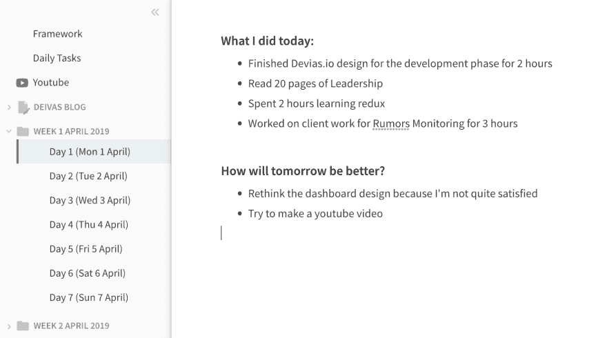
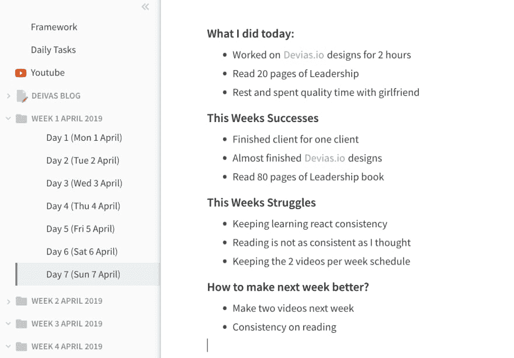

# 学习时如何做到始终如一？做这个练习。

> 原文：<https://dev.to/adrianmanea/how-to-be-consistent-when-learning-do-this-exercise-h0j>

我还做了一个关于这个话题的视频，所以如果你更喜欢看而不是读🤓[https://www.youtube.com/watch?v=vznNct98OqE](https://www.youtube.com/watch?v=vznNct98OqE)

学习一项新技能，尤其是编程，一致性是个大问题。这是我最喜欢的一本书里的一句话，应该能让你对我在这篇文章里要教你的东西有个大概的了解和总结

> “大多数愉快的活动都不是自然的；他们需要一种最初不愿意付出的努力。但一旦这种互动开始对这个人的技能提供反馈，它通常会开始产生内在的回报。”
> 米哈里·契克森米哈，[心流:最佳体验的心理学](https://www.goodreads.com/work/quotes/64339)

在这篇文章中，我将展示一个我每天都做的练习，它能让我的工作保持高效和一致。在我们开始之前，为了使这个练习正常进行，你需要知道两条规则。

## 第一法则。不要被社交媒体愚弄

所以让我们来了解一下背景。去年，我决定改变我的职业，我是一名网页设计师，我对我为客户创造的价值不太满意。也许我有过一些糟糕的客户体验，但现在回想起来，我很高兴我做到了。所以像任何其他自我思考的程序员一样，我们都有从朋友、同事或者(最坏的情况下)从社交媒体中学习的动机。这是因为没有人会记录(或在 instagram 上发布)当他们无法找到他们软件中的 bug 时幕后的沮丧，原因很明显。没有人喜欢看到人们发疯。那么，为什么许多开发人员会筋疲力尽呢？那是因为你创造了一个误导性的现实，你认为正常的程序员在这些职位上做什么，比如解决问题并立即获得他们的奖励，所以当你有沮丧和不舒服的时候，你会觉得自己像个骗子，因为你认为那不是一揽子计划的一部分。所以零规则(懂了吗？走向一致是找到你的动机，不是基于别人的生活方式，而是构建你自己的生活方式，没有限制和障碍。

## 第二法则。不要被自己骗了

好吧，这听起来有点俗气，但和我呆在一起。我注意到了一些我的很多朋友不久前犯过的错误。我们都在欺骗自己，把时间花在了一个项目或学习一项新技术上。我们在欺骗自己，我们在“磨”，我们在“挤”，但事实是，没有人真正诚实地对待我们投入到那个特定项目中的时间。这还不是最糟糕的。通过欺骗我们自己，我们在某件事情上投入了大量的努力(即使辛苦了一整天，仅仅花了一个小时在“VSCode”上)，我们最终会筋疲力尽，因为我们看不到*反馈*和*奖励*。你知道那句话吗，假装直到你成功？这也适用，如果你告诉你的大脑你一周花了 50 个小时学习网络开发却没有任何进展，它可能真的会相信你。这就是挫折出现的时候。

### 演习

记录你进步的最实际的方法是记录每天的进步和工作。去年，我可能会把这归为“蹩脚”一类，但如果你真的想看到你进步的真实数据，那就使用科技或纸笔。所以用一个叫做 [Coda](http://coda.io?ref=devias-io) 的免费应用程序来写日记，就像我这里的一样:

Coda 允许你创建文件夹，所以我用这个功能来组织我的每周进度。规则很简单。我有**每日文档**并且在周末我有**每周文档。**这种组织技巧是我从一个叫[的 YouTuber 用户那里学来的](https://www.youtube.com/channel/UCN7dywl5wDxTu1RM3eJ_h9Q)

#### 日常文档

这是一个简单而有效的练习。每天这样做的人比不这样做的人进步快。这是一个没有商量余地的步骤，需要 10 分钟。

每天，回答:

1.  你在项目上取得了什么进展(客户工作、学习等)
2.  关于这些任务，你做得好的是什么？为什么？(*这个必须是* *输入* *相关——不是结果*)
3.  你在这些任务中遇到了什么困难？什么在逼近你？你如何克服它，你将如何阻止自己在未来受到这种阻碍？
4.  明天会怎样更好？

#### 每周文档

在每个周末，坐下来仔细阅读你的每周记录。你注意到了什么模式？你造了什么声势？这就是你如何识别在这个游戏中不适合你的行为和心理模式，并加倍下注那些适合你的行为和心理模式。

当你回顾这一周的时候，想想是什么让它成功了，是什么让下一周更加成功。然后计划你的一周。

如果你是认真的，我甚至不需要说服你去尝试。对我来说，这很有效，我以前从未如此依赖数据来衡量自己的工作效率。