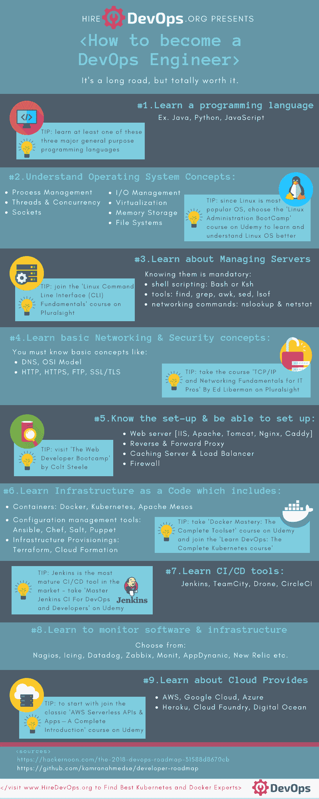

# 如何成为 DevOps 工程师

> 原文：<https://dev.to/simon_sugob/how-to-become-devops-engineer-4lbj>

DevOps 工程师是公司的重要组成部分。傀儡实验室的运营主管凯尔西·海托华称他们为“特种部队”。他说**‘devo PS 工程师浓缩了深厚的知识和多年的实践经验’。**

如果你想得到一些关于如何成为 DevOps 工程师的建议——不要拐弯抹角——看看这篇文章，但是首先，看这个带声音的[视频](https://youtu.be/Heu2sI0wLgk)!

## 如何成为 DevOps 工程师——为什么现在这么热门？

DevOps 正在革新工作场所。根据 [IDC 估计](https://www.idc.com/getdoc.jsp?containerId=US43722718)，全球 **DevOps 软件市场将在 2022 年达到 66 亿美元，而 2017 年为 29 亿美元。这是一个令人印象深刻的数字。**

> 雇佣 DevOps@ hiredevops全球 devo PS 软件预测，2018–2022:初始预测先看[idc.com/getdoc.jsp?con…](https://t.co/OK00ETzVto)19:33PM-2018 年 10 月 29 日00

根据[实际上是](http://www.indeed.com/jobtrends/q-Devops.html)的数据，DevOps 工作机会的数量从 2012 年的不到 1%增加到 2017 年的超过 24%。DevOps 工程师在 2016 年 Indeed 报告中被评为第三大最受欢迎的技术职位，也是第二大最难填补的技术职位。

在即将到来的 2019 年，我们可以期待 DevOps 世界的哪些趋势？下面是来自皮蒂安的格雷格·贝克的[“devo PS:2019 年及以后的五大趋势”](https://blog.pythian.com/devops-five-trends-2019-beyond/):

DevOps 将最终成为主流

高管们开始参与进来

安全正成为优先考虑的问题

• Kubernetes Is King

管道正在走向成熟

——————————————-

点击[此处](https://blog.pythian.com/devops-five-trends-2019-beyond/)查看全文。

我认为要结束这一段，你绝对应该读一读 Roushan Kumar 对什么是“DevOps”以及“DevOps”如何工作的回答。在 Quora 上。这是一本非常好的读物。

## 如何成为 DevOps 工程师——一页硬技能指南

既然你已经知道为什么这么多工程师努力想知道如何成为 DevOps 工程师，那么是时候与你分享一份关于如何成为 DevOps 工程师的单页指南了。我们在两篇文章的基础上对其进行了阐述:

由 [Kamran Ahmed](https://github.com/kamranahmedse) 撰写的全面的[开发者路线图](https://github.com/kamranahmedse/developer-roadmap)

[javinpaul](http://javarevisited.blogspot.com/)撰写的《成为 DevOps 工程师的图解指南及相关课程链接》。

点击[链接](https://www.dropbox.com/s/4d9me1wez0687t1/HireDevOps_%20How%20to%20become%20DevOps%20Engineer_2019%20Roadmap%20with%20links%20to%20Courses.pdf?dl=0)下载 PDF。

## 如何成为 DevOps 工程师——软技能也很重要

除了艰苦的技术技能，开发工程师还应具备协作、多任务处理能力，并始终将客户放在第一位。
他们来了:

好奇心&同理心:根据西格勒的说法，好奇心和同理心可能是潜在 DevOps 工程师能够展示的最有价值的两种软技能特质。

**客户第一的思维**:一个伟大的 DevOps 工程师总是关心为客户提供价值，并希望了解和衡量他们的工作是如何推进的，[木偶](https://puppet.com/)的首席产品官 Omri Gazitt 说。

**沟通&协作**:能够与不同的利益相关者进行有效沟通，并了解当前的挑战和组织中的“大局”，这是能够建立实施文化转变的战略的第一步。

**灵活性**:保持冷静的头脑、应付不断变化的工作量并保持灵活性是 DevOps 工程师角色成功的关键之一。

Gidron 说，由于 DevOps 结合了多学科团队和应用程序的需求，一名成功的 DevOps 工程师不能忽视企业层面的 DevOps 和数字化转型的大背景。

**决策**:在繁忙的环境中，快速做出正确决策的能力，同时牢记大局目标，是雇主在 DevOps 工程师中寻找的极其可取的特质。

——————————
来源:

[https://www . tech Republic . com/article/10-每个开发工程师成功所需的关键技能/](https://www.techrepublic.com/article/10-critical-skills-that-every-devops-engineer-needs-for-success/)

[https://tech beacon . com/5-ways-make-yourself-market-devo PS-engineer](https://techbeacon.com/5-ways-make-yourself-marketable-devops-engineer)

[https://www . networkers technology . com/traits-successful-devo PS-engineer>](https://www.networkerstechnology.com/traits-successful-devops-engineer%3E)

## 如何成为 DevOps 工程师——简短回顾

**如何成为一名优秀的 DevOps 工程师？**最好的总结被**帕万贝拉加蒂**在他的文章[“如何成为一名成功的 DevOps 工程师”](https://www.linux.com/blog/how-be-successful-devops-engineer)中捕捉到。

**他列出了成为优秀 DevOps 工程师的 5 个重点领域:**

1.  了解 DevOps 的基本概念，并进入几乎自动化一切的思维模式
2.  了解不同的 DevOps 工具，如 AWS，GitHub，Puppet，Kubernetes，Docker，Chef，Ansible，Terraform，JIRA，Slack 等。
3.  组织范围内的运营思维
4.  端到端协作并帮助他人解决问题
5.  成为脚本大师:Bash、Powershell、Perl、Ruby、JavaScript、Python 等。以便编写代码来自动化可重复的过程。———————————

其他资源:

[如何作为 DevOps 工程师建立成功的职业生涯-免费 PDF](https://www.techrepublic.com/resource-library/whitepapers/how-to-build-a-successful-career-as-a-devops-engineer/)

[如何成为 DevOps 工程师:备忘单](https://www.techrepublic.com/article/how-to-become-a-devops-engineer-a-cheat-sheet/)

[开发管理员必须改掉的 10 个坏习惯](https://www.techrepublic.com/article/10-bad-habits-devops-admins-must-break/)

点击查看更多 DevOps 相关资料[。](https://www.hiredevops.org/news/)