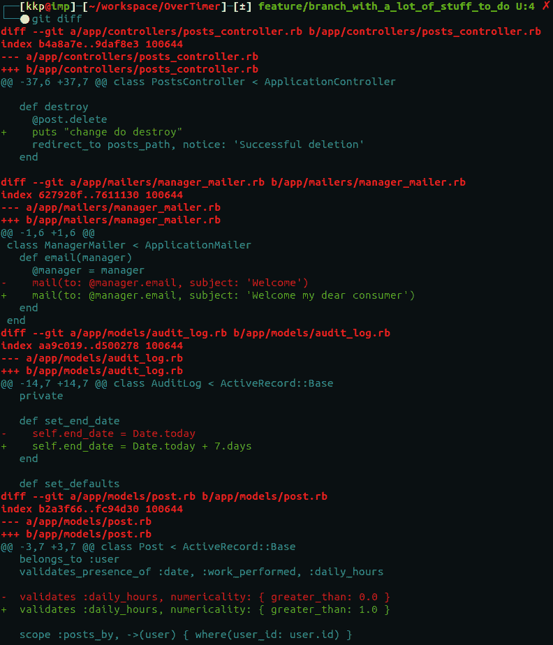
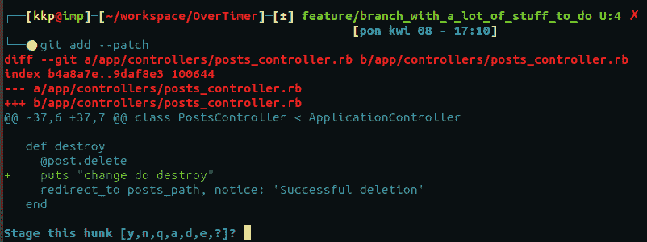
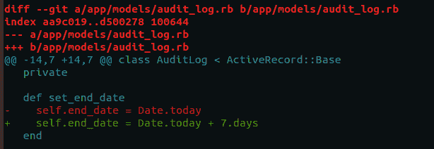
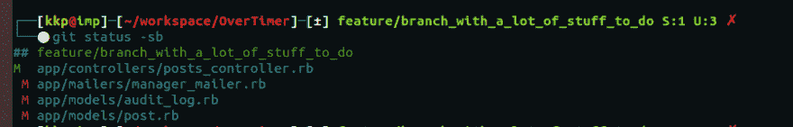
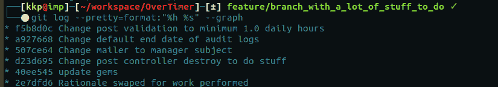

# 如何更好地组织 git 提交

> 原文：<https://dev.to/2nit/how-to-better-organize-your-git-commits-bkb>

Git 是一款令人钦佩的软件。这可能是我编程生涯中迄今为止看到的最好的一个。我认为这是我印象最深刻的事情之一，因为当我学到新东西的时候，它经常会引导我去做另一件新的事情。这种不断探索的过程在我的日常工作流程和业余编程训练中非常自然地发生，因为我在迄今为止的所有项目中使用 git 作为我的版本控制系统，老实说，我发现很多人将他们的 git 工作限制在非常基本的命令子集，这有点可悲。在我亲自遇到的或者只是碰巧在网上读到他们的工作流的许多程序员中，我看到除了用于基本工作流的基本命令之外，对 git 缺乏兴趣。这没什么不好，但我认为这有点可惜，浪费了学习有趣和有用的东西的机会。

许多人限制自己使用 git 的基本工作流程如下:

*   **git clone** 和 **git init** 来获得一个现有的项目或者创建一个新的项目

*   *git branch _ name**(或 **git checkout -b branch_name**

*   **git rebase** 用一些其他分支变更来更新分支

*   **git 拉至...**井从远程拉起

*   **git push** 将您的更改发送到远程

*   **git merge** - to merge...

*   一些助手命令像状态、**差异**、**日志**

*   而且很明显**git add；git commit -m 'message'** 准备您的更改并提交它们

老实说，对于一个完全功能性的项目来说，这通常就足够了，如果没有人犯一些错误，你可以只用那些命令从一无所有变成一个功能完整的 **git** 库。如果你和你的团队可以创建一个新的项目，并且创建一个可读的、合理的**‘git tree’**只用那些命令，那么棒极了，没有人犯错误，没有人强行推动旧的分支，没有人合并合并冲突，没有人用错误的分支重建基础，等等。

无论如何，我想鼓励你检查一下，也许使用一个有趣的选项传递到 **git add** 。最近了解了一下，真的喜欢上了。

## **补充什么。**还要做什么？

我们应该尽快检查一下，对吗？不要太深入 git 的内部工作原理，因为这不是我们在这里的原因。补充(咄！)更改您指向的“.”指示当前已更改但未从我们当前所在的目录转移的所有内容。所以在主项目目录中会添加所有嵌套在其中的内容。也可以通过某个文件路径)到一个神奇的地方叫做**索引**。索引是您的更改在变成真正的提交之前要去的地方。当您提交时，您接受索引更改并将其提交。在实际执行某项操作之前，您可能会认为索引是一种检查点。实际上， **git index** 实际上是一个二进制文件，在你的 repo 的一个隐藏的 git 文件夹中，但是现在这并不重要。

## 为什么你应该把你的变更分成许多次提交

所以想象你刚接到一个新任务，你估计它是一个至少需要 3-4 天工作的任务。大量新文件，对现有文件的大量更改，任务涉及大量业务更改和许多逻辑上独立的组件。如果你是一个好的 git 工作者，你会知道像这样的任务应该由许多提交组成。这些提交中的每一个都应该为您的项目引入新的业务或逻辑变更。您希望以一种方式推动您的更改，使人们能够轻松地键入 **git log** ，然后查看您最近的几次提交，并立即知道从业务角度添加了什么，以及为什么以这种方式添加(例如通过提交描述)。如果你在一个复杂的代码上投入两天艰苦、紧张的工作，处理大量的问题，这种投入很可能不会非常明确或有帮助。这甚至会让其他人感到困惑。大批量变更的实现方式通常是一系列较小的提交(或者至少一个具有更明确描述的提交，如果变更确实紧密相关的话)

你可能认为这是显而易见的，但相信我，它不是。我看到高级开发人员提交了相当于两周的工作，并告知他们开始开发该特性的日期。哦，我的上帝，这么多的“热修复”提交与“修复 2”或“修复错误 _4”的描述。这是一种非常糟糕的做法。我认为，当我们在终端中输入 **git log** 时，我们向下滚动一点，我们应该可以很好地描述我们的应用程序发生了什么变化，为什么会这样变化，等等。如果我们编写代码的方式能让其他人明白易懂，为什么我们不能以同样的方式对待我们的 git 树呢？在那些信息中只是简单的英语(或任何其他语言)。

## 那么 add - patch 是做什么的呢？

当你使用 **git add 时。**一切都在眨眼之间完成，但 **git add - patch** 需要一段时间，并给你更多的工作(万岁，更多的工作与 git，对不对？).好吧，我们将在一些遗留的 rails 应用程序上工作，并对它做一些修改。假设我们正在开发一个新的分支，在那里我们有很多不同的变更要做，它们都与委托我们进行变更的客户相关联。它们来自一个工单(任务),应该同时部署到生产环境中。但是从我们的角度来看，这些变化并没有太大的联系。让我们来看看这些变化中的 **git diff** 。

因此，对欢迎新用户进入系统的邮件程序进行了更改，对 **Post** 模型的验证进行了更改，对 **AuditLog** 模型的某个方法进行了更改，这可能会影响其数据，最后，对**Post control**r delete action 进行了更改(请记住，这些更改只是被嘲笑，它们做不了多少并不重要，重要的是它们代表了不同的业务和逻辑更改，并且可以很容易地显示出来供我解释)。

对于这种情况，我们有两种方法。我们可以做加法。；git commit 然后命名 commit，并在描述中加入我们具体更改了什么。但是为了让 git 消息易于阅读，它们应该限制在 50 个字符以内。用 50 个字符描述 4 个不同概念的变化可能会很困难。尤其是如果我们有一些更大的改变，会占用 4 个以上的文件。

让我们最后使用**添加补丁**

好的，我们只看到了一点变化，控制器的变化。我们有一个提示。git 在问我们什么，这整个 **hunk** 是什么？**大块**是当你使用 **git diff** 时，你单独看到的被修改的代码。我们将会谈论更多关于**帅哥**以及 git 如何看待他们。现在，我们只是添加它，顺其自然。y 型 **y 型**

又一个**猛男**。嗯，我们不要上演这个了，好吗？类型 **n**

再说一次，我们不想要这个**大块**...我们现在不想要任何其他的**大块头**加入，我们已经加入了一个，对此我们很高兴。键入 q 表示我们应该跳过这个和所有其他还没有添加的**大块**。我们可以使用 **d** 只从当前文件中跳过**大块**。

好的，我们有 4 个修改过的文件，其中一个是暂存的。让我们提交并查看我们的日志。

看起来不错，对吧？好的，让我们使用 **git add - patch** 提交所有其他的修改，看看我们的最终产品。

现在，我们对提交有了更清晰的认识。你可能会问自己，“好吧，我只是正确地计划我的工作流，一起做所有的业务和逻辑变更，提交它们，并转移到下一批连接的变更”。当然，这听起来不错，如果你能做到这一点，那么对你有好处。但是现实验证了像这样的陈述和其他勇敢的陈述，比如“我们稍后将重构它”。事实上，我们中的大多数人在有限的时间内面对一个新的大功能时，会直接投入进去，开始构建直到完成。创建一个新的分支并工作，直到它准备好提交给其他人进行代码审查。 **- patch** 的伟大之处不仅在于将您的工作分成逻辑批处理(以提交的形式)的能力，还在于对您的代码进行更加彻底、逐步的审查。一旦你掌握了它的窍门，它不会花费你太多的时间，可能会为你以后节省很多工作。它还将帮助其他人理解正在发生的事情(当提交被很好地分开时，通过提交而不是通过整个分支的代码审查更容易)。

