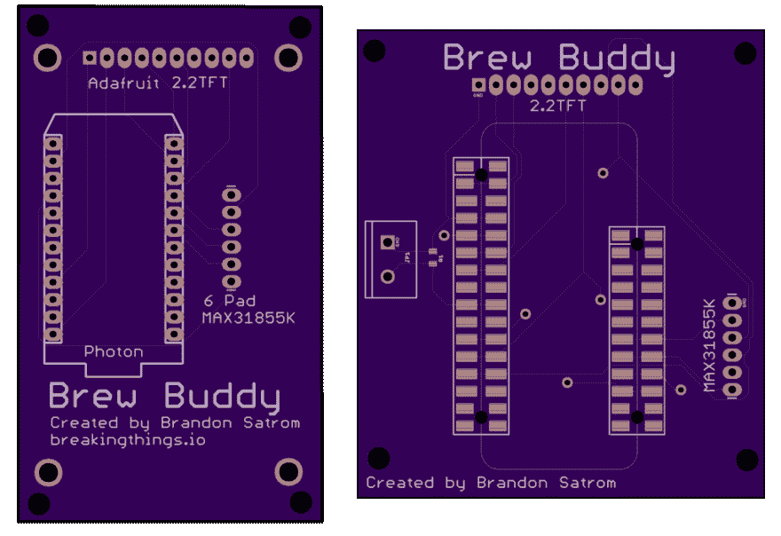
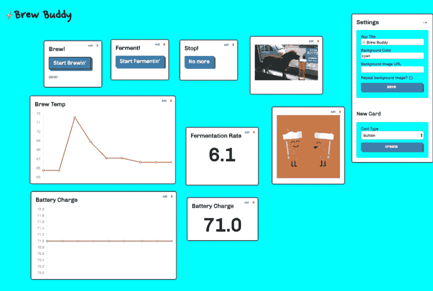
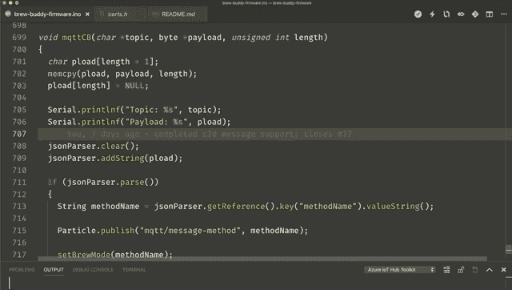
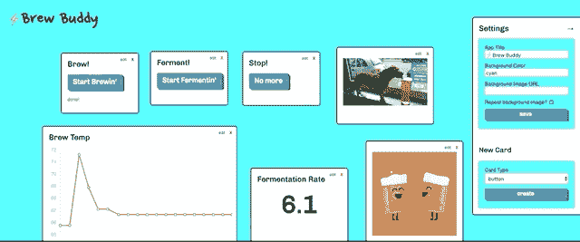
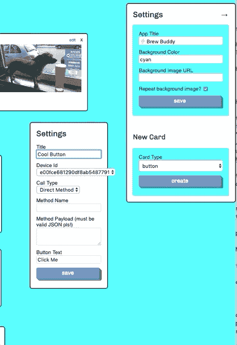
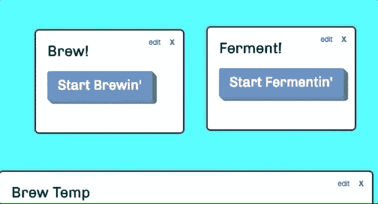
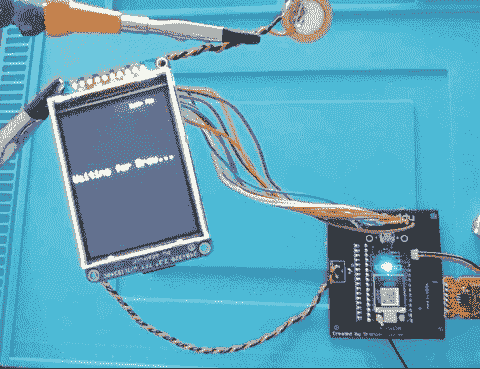

# 如何为您的粒子动力酿造项目构建控制面板

> 原文：<https://dev.to/particle/how-to-build-a-control-panel-for-your-particle-powered-brewing-projects-28m5>

几周前，我[详述了我的一个基于光子的项目——Brew Buddy——升级到新粒子氩的过程](https://dev.to/particle/upcycling-an-old-homebrewing-project-with-a-particle-argon-587k)。我介绍了创建一个新的试验板原型，添加一些光子版本中没有的新功能，以及转换固件以与 Argon 一起工作的过程。

在这篇文章中，我将介绍项目的后半部分:从原型到 PCB 和基于云的控制面板。与这个项目的第一部分一样，我已经在 Twitch 上直播了我在这个项目上的所有工作，所以如果你想观看回放，或者加入我未来的项目，请访问我的页面并关注我以获得通知。

### 用 Eagle 和 OSH park 设计新 PCB

有能力试验一个新项目是令人惊讶的，但一旦我让一切正常工作，我就迫不及待地想摆脱那一窝电线，用一个别致的、定制设计的印刷电路板(PCB)取代它们。我最初的 Brew Buddy 项目在其早期经历了几次 PCB 修订，所以当然我必须为这个基于氩的迭代旋转另一个板。

<figure>[](https://res.cloudinary.com/practicaldev/image/fetch/s--Dy3ZUJud--/c_limit%2Cf_auto%2Cfl_progressive%2Cq_auto%2Cw_880/https://blog.particle.io/wp-content/uploads/2019/03/BoardIterations.png) 

<figcaption>我用了多年的 Brew Buddy 定制 PCB 的各种迭代。</figcaption>

</figure>

#### 在 Autodesk Eagle 中创建 PCB

有许多设计 PCB 的工具，包括 KiCAD 等免费工具和 Altium 和 OrCAD 等高端工具。我倾向于在 Autodesk Eagle 中进行 PCB 设计。这是一个强大的工具，需要一点学习曲线(就像它的所有同类工具一样)，但是一旦你掌握了它，它会使你的试验板原型变成一个有趣和有益的过程。

因为我的光子项目已经有了 PCB 的现有版本，所以我的过程相对简单:

*   用氩气代替光子
*   将引脚重新布线到氩气上的正确位置
*   在 Adafruit TFT 分线点上为 SD 卡芯片选择添加一个额外的引脚
*   添加压电盘(和电阻器)

在制作定制的 PCB 时，你可以用危险的化学物质蚀刻自己的 PCB，或者让专业制作人员以合理的价格处理这个过程。对于最终 PCB 的数字设计，您将创建两个关键资产:原理图和布局。原理图是电路板的逻辑设计，旨在显示电路板上元件之间所有电气连接的位置。这是我的原理图在这个项目中改变前后的视图:

<figure>[](https://res.cloudinary.com/practicaldev/image/fetch/s--Pcgk3h7w--/c_limit%2Cf_auto%2Cfl_progressive%2Cq_auto%2Cw_880/https://blog.particle.io/wp-content/uploads/2019/03/BBSchematic-1024x423-test-1024x423.png) 

<figcaption>一个并排比较的沏哥们示意图。</figcaption>

</figure>

布局描述了元件在 PCB 上的物理位置。它与逻辑、原理图设计紧密耦合，因此连接在逻辑上是有效的，但布局布线是放置元件并在元件之间绘制铜线的地方。这是 PCB 物理布局的前后视图:

<figure>[](https://res.cloudinary.com/practicaldev/image/fetch/s--pAYmOLni--/c_limit%2Cf_auto%2Cfl_progressive%2Cq_auto%2Cw_880/https://blog.particle.io/wp-content/uploads/2019/03/BBLayout-1024x703.png) 

<figcaption>一个并排比较的沏哥们儿版面</figcaption>

</figure>

我的新 Brew Buddy PCB 更大，部分是为了容纳更大的氩气，也是为了给新的压电腾出空间。我本可以把它做得小一点，但是那样我就没有借口再转一次板子了，不是吗？

四步迁移中最耗时的是第一步:从光子迁移到氩需要重新映射每个逻辑和物理连接。Eagle 确实有一个交换部件工具，使这变得稍微容易一些，但本着小心和彻底的精神，我没有使用它，以便我可以验证每个连接。

总而言之，这部分过程只花了我几个小时。如果你有兴趣看这个过程是如何进行的，我在 Twitch 上直播了它，你可以在下面找到录音。

[https://www.youtube.com/embed/AQd3qdI9BUE](https://www.youtube.com/embed/AQd3qdI9BUE)

#### 从奥什公园订购多氯联苯

电路板设计完成后，该订购 PCB 了。这些天有一群伟大的在线 PCB 工厂，但我个人最喜欢的是奥什公园。它们便宜，快速，如果你喜欢紫色，你会喜欢它们的印刷电路板。

从 OSH Park 订购 PCB 很简单。你只需要将 Eagle `.brd`文件拖到“让我们开始吧”拖放区，OSH Park 就会读取该文件，生成图层说明，并给你一个价格估计。如果您有一个包含 Gerber 文件的 Zip 文件(一组代表预制 PCB 中各层的独立文件，发音像婴儿食品),您也可以上传这些文件。

OSH park 还允许您公开您的多氯联苯，供他人消费甚至订购。如果你想自己看看，这是我给酿酒伙伴的。

一旦我订购了 PCB，我就通过在基于网络的控制面板上工作来消磨等待的时间，我们将在这篇文章的其余部分讨论这一点。当 PCB 在一周左右后到达时，我对组装(通常称为 PCBa)和测试进行了实时流传输，您可以在下面查看。

[https://www.youtube.com/embed/33dgf-r6pe4](https://www.youtube.com/embed/33dgf-r6pe4)

### 用 Azure IoT 和 electric io 构建基于 web 的控制面板

对于这个项目的“云”部分，我想建立一个控制面板，而不仅仅是一个仪表板。我希望能够在 brew 监控状态(酿造与发酵)之间移动，并从同一个界面触发操作，在该界面上我可以查看应用程序的图表、图形和当前状态。有了 Azure 物联网中心和一个名为 [electric io](https://github.com/noopkat/electric-io) 的伟大开源项目，我就能做到这一点。

<figure>[](https://res.cloudinary.com/practicaldev/image/fetch/s--hiafUdkv--/c_limit%2Cf_auto%2Cfl_progressive%2Cq_auto%2Cw_880/https://blog.particle.io/wp-content/uploads/2019/03/Screenshot-2019-03-27-08.40.58-1024x689.png) 

<figcaption>我的电动 io 仪表盘为 Brew Buddy</figcaption>

</figure>

整个过程由以下步骤组成:

*   将我的项目连接到 Azure 物联网中心
*   配置电气 io 以显示设备数据
*   将 MQTT 添加到我的固件中，以接收来自 Azure 的云到设备(C2D)消息
*   配置电气 io 以发送 C2D 消息

第一步在我们关于设置 Azure 物联网中心与粒子设备云集成的文档中有广泛的介绍，所以我在这里不再重复。此外，来自微软的 Paul DeCarlo 在最近的博客文章中谈到了第二步，所以我也将忽略这一部分。这个项目的关键和独特之处在于第三步和第四步，这使我能够将电动 io 从仪表板变成真正的控制面板。

#### 使用 MQTT 监听 Azure IoT Hub 消息

[Particle Device Cloud to Azure IoT Hub integration](https://docs.particle.io/tutorials/integrations/azure-iot-hub/)让你在 Particle Device 和 Azure 之间建立快速、无痛的连接。它允许您像在任何其他项目中一样使用 Particle.publish API，并将数据直接传输到 Azure。

为了将 Azure 添加到设备通信中，我们需要在固件中做更多的工作。Azure 物联网中心支持两种与物联网中心直接集成的模式:一种语言 SDK，或者通过 MQTT 或 AMQP 直接实现 pub/sub。对于这个项目，我选择使用 MQTT。

对于粒子设备，有两个很棒的 MQTT 库可供选择， [MQTT](https://github.com/hirotakaster/MQTT) 用于基本支持，而 [MQTT-TLS](https://github.com/hirotakaster/MQTT-TLS) 用于需要安全的、基于证书的 MQTT 连接。Azure IoT Hub 需要一个安全的连接，所以我安装了 MQTT-TLS 库，并将其包含在我的项目中:

```
#include “MQTT-TLS.h” 
```

要创建基于 TLS 的连接，您还需要一个客户端证书，Microsoft 在其 SDK 中提供了该证书。我从他们的 GitHub repo 中获取了 DigiCert Baltimore 根证书，并在我的项目中创建了一个名为`certs/h`的新文件，我将它包含在 MQTT 库 include 之后。

```
#include "certs/certs.h" 
```

下一步是为所有 MQTT 入站消息声明一个回调函数，并创建一个 MQTT 客户机。我为回调创建了一个转发声明，并根据在线文档配置了客户端 URI 和端口。请确保将`{your hub name}`字符串替换为您自己的 Azure 物联网中心的名称，您可以在您帐户的 Azure 门户中找到该名称。

```
void mqttCB(char \*topic, byte \*payload, unsigned int length);
MQTT client("{your hub name}.azure-devices.net", 8883, mqttCB); 
```

下一步是在项目启动时连接到 Azure MQTT 服务器。在`setup`函数中，我启用了 TLS 并传入了我之前下载并创建的证书。然后，我用我的设备 ID ( `deviceID = System.deviceID();`)以及用户名和密码调用了`connect`方法。

```
client.enableTls(certificates, sizeof(certificates));
client.connect(deviceID, "{your hub name}.azure-devices.net/" + deviceID, 
  "SharedAccessSignature {your SAS Token here}"); 
```

在 Azure 物联网 hub 的情况下，你提供的用户名应该是你的 Hub 端点——就像`myhub.azure-devices.net—plus`你的 Particle deviceID。

对于密码， [Azure 要求](https://docs.microsoft.com/en-us/azure/iot-hub/iot-hub-devguide-security)您提供 SharedAccessSignature，即 SAS 令牌。你可以用 Azure [device explorer](https://github.com/Azure/azure-iot-sdk-csharp/blob/master/tools/DeviceExplorer) 、 [Azure CLI](https://docs.microsoft.com/en-us/cli/azure/ext/azure-cli-iot-ext/iot/hub?view=azure-cli-latest#ext-azure-cli-iot-ext-az-iot-hub-generate-sas-token) 或 [Azure IoT Tools for VS Code](https://marketplace.visualstudio.com/items?itemName=vsciot-vscode.azure-iot-tools) 为你自己的 hub 生成这些，我就是这么做的。我已经在 VSCode 中用 Particle Workbench 构建了我的应用程序，所以很简单！

<figure>[](https://res.cloudinary.com/practicaldev/image/fetch/s--hRCD2Zu6--/c_limit%2Cf_auto%2Cfl_progressive%2Cq_66%2Cw_880/https://blog.particle.io/wp-content/uploads/2019/03/VSCode.gif)

<figcaption>Azure 物联网中心 VSCode 扩展在行动</figcaption>

</figure>

下一步是检查`isConnected`方法，以确定我是否成功地与 Azure IoT Hub 建立了 MQTT 连接。在这两种情况下，我都添加了一些 Particle.publish 调用，以便我可以从控制台对此进行复查。

如果我得到一个肯定的结果，是时候建立一个订阅。Azure IoT Hub 提供了两种在嵌入式设备上接收通信的方式，直接方法调用(总是发送响应)和云到设备(或 C2D)消息，后者的功能更像一劳永逸的消息。我决定用 C2D 的消息。要接收这些内容，MQTT 客户机需要订阅`devices/{deviceID}/messages/devicebound/#`主题过滤器。

```
if (client.isConnected())
{ 
  Particle.publish("mqtt/status", "connected");
  bool msgSubResult = client.subscribe("devices/" + deviceID + 
    "/messages/devicebound/#", MQTT::QOS0);

  Particle.publish("mqtt/message-sub-result", msgSubResult 
    ? "subscribed to hub messages" 
    : "subscription failed");
}
else
{
  Particle.publish("mqtt/status", "failed");
} 
```

设置好订阅后，最后一步是定义回调。在电子 io 方面，我的计划是向设备发送一个有效载荷，其中至少包含一个名为`methodName`的属性，该属性对应于设备上的酿造模式，如“brew”、“ferment”或“stop”。在固件方面，这意味着我需要接收和解析有效载荷来提取`methodName`。谢天谢地，有一个很棒的 [JsonParserGenerator 库](https://github.com/rickkas7/JsonParserGeneratorRK)就是为了这个目的。

```
void mqttCB(char \*topic, byte \*payload, unsigned int length)
{ 
  char pload[length + 1]; 
  memcpy(pload, payload, length); 
  pload[length] = NULL; 

  jsonParser.clear(); 
  jsonParser.addString(pload); 

  if (jsonParser.parse()) { 
    String methodName = 
      jsonParser.getReference().key("methodName").valueString(); 

    Particle.publish("mqtt/message-method", methodName); 

    setBrewMode(methodName); 
  }
} 
```

该方法获取有效负载字节数组，将其转换为字符数组，将其加载到`jsonParser`中，并在调用`setBrewMode`函数之前从有效负载中提取`methodName`，该函数【基于模式字符串触发若干操作】(http://([https://github . com/bsatrom/brew-buddy/blob/master/brew-buddy-firmware/src/brew-buddy-firmware . ino # L365](https://github.com/bsatrom/brew-buddy/blob/master/brew-buddy-firmware/src/brew-buddy-firmware.ino#L365))。

有了 MQTT，我能够将我的电动 io 仪表板变成控制面板了！

#### 从电力 IO 向粒子动力项目发送信息

电 Io 提供了一个按钮类型，可以很方便的调用函数和发送消息。只需在卡类型下拉列表中选择“按钮”，然后单击“创建”

<figure>[](https://res.cloudinary.com/practicaldev/image/fetch/s--qcoPx6ev--/c_limit%2Cf_auto%2Cfl_progressive%2Cq_66%2Cw_880/https://blog.particle.io/wp-content/uploads/2019/03/CreateButton.gif) 

<figcaption>在电 io</figcaption>

</figure>

中创建新的按钮卡

一旦你创建了一个按钮，你需要选择呼叫类型。如果在 Azure IoT 设备上调用一个直接方法，您将需要指定 methodName 和一个可选的有效负载。对于一个消息，这就是我所使用的，没有方法名，但是你需要指定一个有效载荷。在下面的例子中，我定义了一个有效负载`{‘methodName’: ‘brew’}`来告诉我的设备进入酿造模式。

<figure>[](https://res.cloudinary.com/practicaldev/image/fetch/s--6AnufWE---/c_limit%2Cf_auto%2Cfl_progressive%2Cq_66%2Cw_880/https://blog.particle.io/wp-content/uploads/2019/03/BrewMessage.gif) 

<figcaption>定义按钮呼叫类型和有效载荷</figcaption>

</figure>

保存按钮设置后，卡片会变成只有一个标题和按钮。要测试，我可以直接点击！

<figure>[](https://res.cloudinary.com/practicaldev/image/fetch/s--ZBYFAb5T--/c_limit%2Cf_auto%2Cfl_progressive%2Cq_66%2Cw_880/https://blog.particle.io/wp-content/uploads/2019/03/StartBrew.gif) 

<figcaption>用电 io 触发 C2D 消息</figcaption>

</figure>

如果固件端的所有配置都正确，我将看到我的设备响应来自 Azure IoT 的入站消息！

<figure>[](https://res.cloudinary.com/practicaldev/image/fetch/s--EszqgtY9--/c_limit%2Cf_auto%2Cfl_progressive%2Cq_66%2Cw_880/https://blog.particle.io/wp-content/uploads/2019/03/StartBrewDevice.gif) 

<figcaption>收到消息时开始酝酿！</figcaption>

</figure>

### 接下来是什么？

作为一个永无止境的修补者，我永远不会声称一个项目已经完成，但我对这个项目在新粒子硬件和利用一个可爱的、基于云的控制面板方面感觉很好。

我认为下一个合乎逻辑的步骤是酿造一些啤酒！

如果你有兴趣了解我组装定制 PCB 和构建 Azure IoT Hub 与 MQTT 集成的细节，你可以查看下面的实时视频。我在周一和周四在 Twitch 上流式传输我的物联网构建，所以一定要关注并加入我，获得更多粒子动力的乐趣！

*   [第 5 部分–PCB 焊接和组装](https://youtu.be/33dgf-r6pe4)
*   [第 6 部分–实施睡眠模式和发酵支持](https://youtu.be/t-lQW4xnHA4)
*   [第 7 部分–将 Brew Buddy 与 Azure IoT Hub 和电子 io 集成](https://youtu.be/GVgVbZCyZ5w)
*   [第 8 部分–为 Brew Buddy 固件添加 MQTT 支持](https://youtu.be/eJM_d4UVQ9Y)
*   [第 9 部分–添加 MQTT 支持(续)](https://youtu.be/GJ9Qs-vwPyU)
*   [第 10 部分-在电气 io 中实现 C2D 消息支持](https://youtu.be/ZMyPXpL0l44)
*   [第 11 部分——在电力 io 中实现 C2D 消息支持(续)](https://youtu.be/Iol2KemBENE)

帖子[如何为你的粒子动力酿造项目](https://blog.particle.io/2019/03/27/how-to-build-a-control-panel-for-your-particle-powered-brewing-projects/)建造控制面板最先出现在[粒子博客](https://blog.particle.io)上。