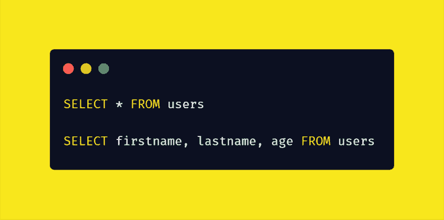
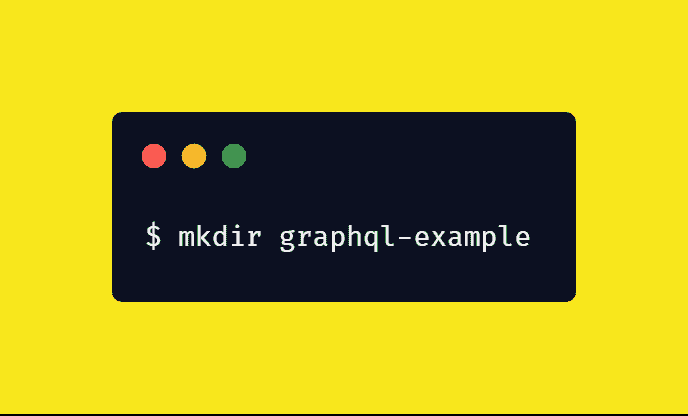
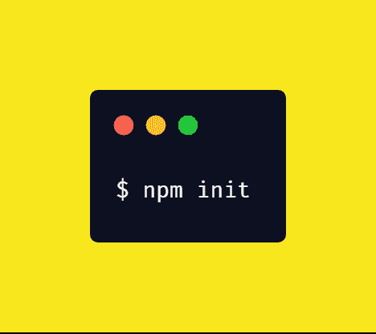
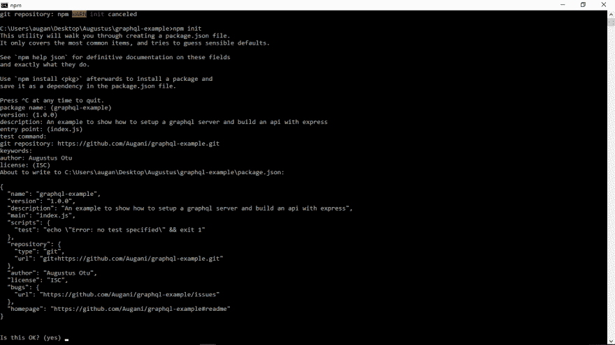
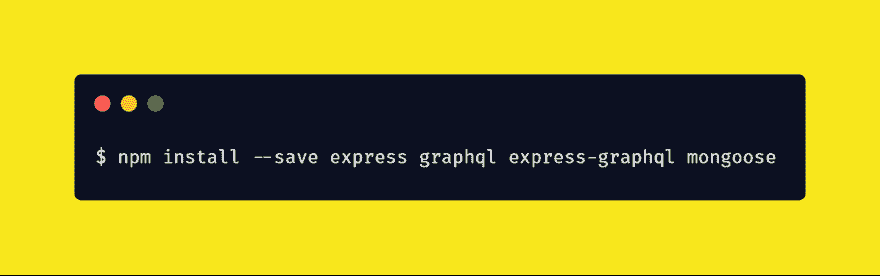
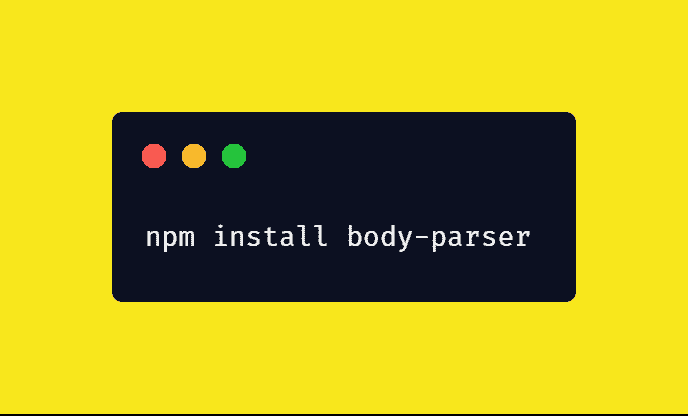
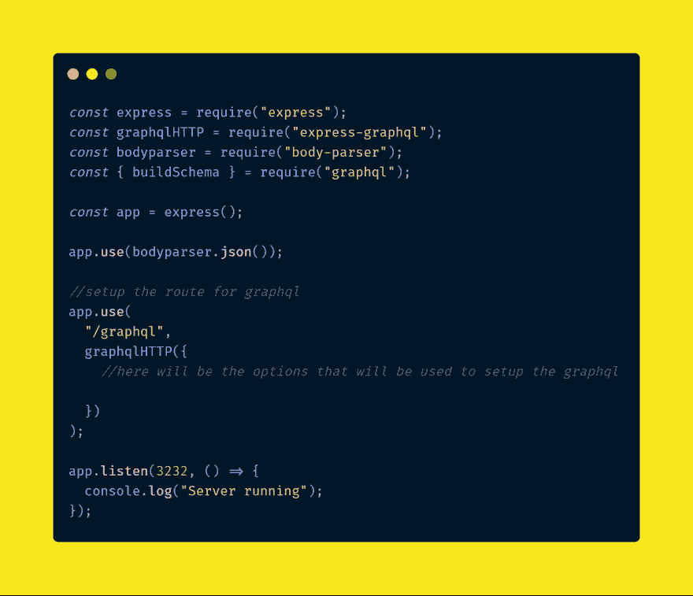
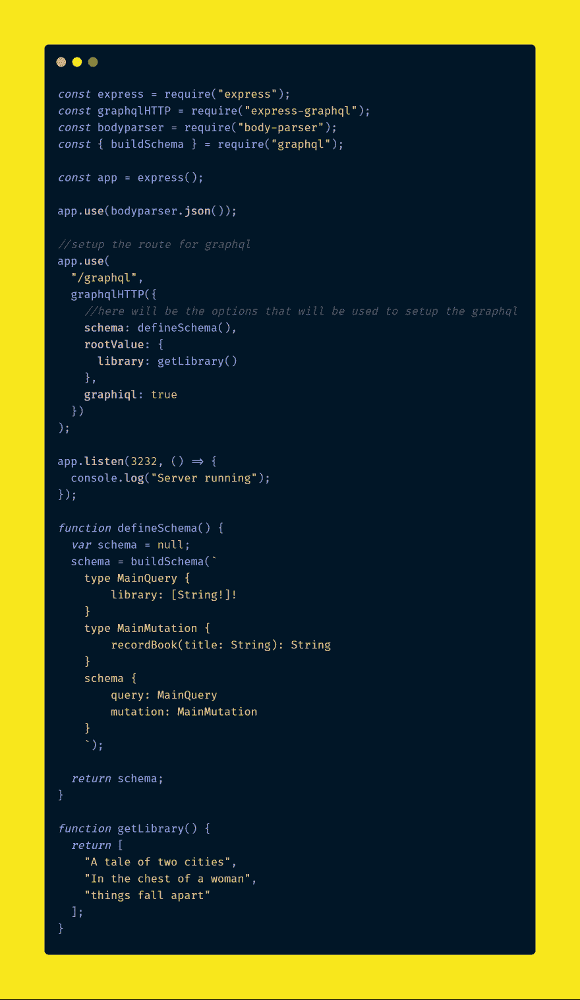
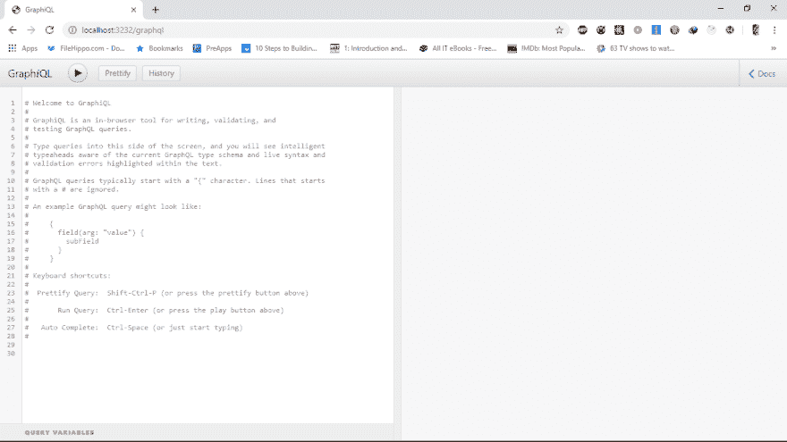
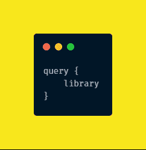

# 如何从头构建一个 graphql api

> 原文：<https://dev.to/augani/how-to-build-a-graphql-api-from-scratch-19c0>

我在网上看过很多关于如何构建 graphql api 的教程，我必须说缺少一样东西，基础。所以我现在要做的是把这个教程分成两部分。第 1 部分将讨论什么是 graphql，并继续使用 express 和 graphql 设置一个简单的服务器。

你在本教程中学到的不仅仅是 javascript 的人，因为我会确保带你了解基础知识，你可以继续下去，看看其他语言的库，并开始建立在这里获得的知识。

第 2 部分将是一个高级部分，我们将实际构建一个完整的 api，并用 postman 和 graphiql 接口进行测试。在本教程结束时，我希望你能够为你正在开发的任何应用程序或你想要开始的新项目构建自己的 api。所以让我们开始吧。

Graphql 只是一种查询语言，适用于您正在构建的任何 api。当我说查询语言时，我的意思是，一种与 api 本身交互的方式，而不是我们过去所知道的数据库，当我们听到“查询”这个词时。如果你已经编程很久了，我知道你在使用 SQl(标准查询语言)数据库如 MYSQL 和 POSTGRESQl 时会遇到 query。我们用上面提到的标准语言来查询数据库，比如

我想你应该还记得类似的事情，现在我们可以在需要的时候选择我们需要的数据。当使用 SQL 从数据库中检索数据时，我们可以灵活地得到我们所需要的，而不是更多。然而，如果您熟悉 rest apis，您会意识到当您向端点发送 GET 或 POST 请求时，数据通常以 JSON 格式提供给您。REST api 发送的大部分数据不会被客户端使用，但是会消耗带宽。这是 graphql 正在解决的问题之一，它允许您像查询 SQl 一样查询 api。现在您已经了解了它的工作原理，我将带您了解在使用 graphql 时最常用的术语。

使用 graphql 时，您对单个端点的所有请求都是 post 请求。我知道您想知道如何像在 REST 架构中那样获取数据。这就引出了术语“查询”。Query 用于从 api 获取数据。但是如果你不能在服务器端操作数据，那么 api 还有什么用呢，这就引出了术语“突变”。突变就像 rest 架构中的 POST、DELETE、PUT。还有其他一些术语，如订阅和片段，但出于本教程的目的，我们将重点关注查询和变异，但也可以在他们的页面上随意阅读它们，[了解有关 Graphql 的更多信息](https://graphql.github.io/learn/queries)

既然你已经知道了这些术语，让我们马上看一些代码。我最喜欢的部分。我假设你知道一点 js 和 node。如果没有，请留下评论，我的下一篇文章将带您了解 node 的基础知识。首先，我们使用 node 和 express 创建一个服务器。你可以在任何你满意的工作区创建一个新的文件夹，所以打开你的目录或者使用 cmd 创建一个新的

为应用程序创建目录后，在地址栏中运行“cmd ”(假设您在 windows 上打开该文件夹中的命令行。

让我们用 npm init 启动一个新项目

使用缺省值，最后，您应该会得到这样的结果

然后，让我们在同一个目录下运行以下命令，安装我们需要的所有包

您还可以安装 body-parser 包，将我们的请求转换成 json

Express 是最受欢迎的节点框架，graphql 是我们刚刚谈到的，express-graphql 包含一些重要的模块，我们将使用它们来构建我们的服务器和 api，mongoose 将帮助我们轻松连接到我们的 mongodb 数据库。

然后，您可以使用您最喜欢的 IDE 打开新创建的项目，并创建一个名为 index.js 的新文件(如果您使用 npm init 的默认值，或者您在 package.json 文件中命名为 main 的任何文件)。创建文件后，我们用 express 在这个文件中创建一个简单的服务器。大约

现在您已经用 graphql 设置了 express 服务器。Express 用于启动我们的服务器，我们需要来自 express graphql 的 graphql http 作为 api 的中间件。它将处理所有发送给 graphql 路由的请求。在导入的 graphqlhttp 模块中，我们将给出 graphql 将要使用的选项。其中一些是模式，它将让 graphql 知道我们将如何查询我们的数据，以及我们希望我们的数据是什么样的。另一个选项也是根值，它将采用我们所有的解析器，这些函数将允许我们在 graphql 中创建和操作数据。另一个有用的选项是“graphql ”,当我们在浏览器中导航到“graph QL”路径时，它将使我们能够使用一个接口与我们的 api 进行交互。因此，让我们现在添加选项

在上面的要点中，我们可以看到 schema 和 graphiql 选项现在被添加到我们的代码中。该模式是 graphql 成功运行所必需的，因为这是 graphql 理解我们对即将构建的 api 的请求的唯一方式。所以我创建了一个名为 defineSchema 的函数，它基本上定义了我们的模式。在模式中，我们有从 graphql 包中导入的“buildSchema”。这将使用我们给它的字符串构建我们的模式。

MainQuery 是一个 GraphQL 对象类型，它有一个名为 library 的字段。library 字段是字符串，这意味着只有字符串会出现在该字段中，后面的感叹号表示它不可为空。因此，每当我们向 api 查询 library 时，就会出现一个空数组来显示它是空的，或者 api 会根据该字段的内容给出一个字符串数组。

还有一个 getlibrary 函数可以获取图书馆中的书籍，现在它只是一个数组，因为我们还没有连接数据库。查询中的模式名称应该与 rootValue 中的功能键名称相匹配，这将有助于 graphql 知道您想要什么并准确地得到它。所以我们添加到查询中的模式类型越多，我们添加到 rootValue 中的函数就越多。Schema 定义数据，rootValue 为我们提供数据。

因此，如果您使用 node 启动服务器并导航到 graphql 路径，您应该会看到这个简单的接口，它允许您与刚刚创建的 api 进行交互。目前，它没有做太多，但我希望您理解它是如何工作的。这应该是您在“/graphql”路线上看到的内容

现在让我们查询我们新的 graphql api，并使用 graphql 模式语言获取我们图书馆中的书籍。

从这个查询和花括号来看，下一层是我们的 rootValue 中声明的名称，这是获取数据的函数。如果您在新的 graphql explorer 中输入代码，您应该调用 getlibrary 函数，并将图书作为数据返回。因此，使用同样的方法，我们可以声明另一个模式和根值，并轻松地查询它，这就是 graphql 的强大之处。我希望你喜欢这个教程，今天学到了一些东西。将继续下一部分，我们将实际构建一个功能完整的 api，在这里我们存储和检索来自 mongodb 数据库的数据。下一篇文章再见。如有任何问题或评论，请通过 twitter @AugustusOtu 与我联系。分享到你的圈子。

快乐编码....再见