# 如何建立一个伟大的技术组合

> 原文：<https://dev.to/emmabostian/how-to-build-a-great-technical-portfolio-53bb>

作品集是你的代表，通常是招聘人员对你和你的作品的第一印象。因此，你必须建立一个包含你和你的作品的最佳作品集。

让我们来看看我关于建立一个伟大的技术投资组合的一些建议。

注:这些建议是基于我的个人经验。有很多方法可以建立一个伟大的投资组合，所以把这些作为指导方针，而不是一成不变的规则。如果你有适合你的不同方法，请在下面分享吧！

作品集解释了你是什么样的人，以及你有什么样的技能。它们也是展示你的开发技能的好方法！有几个关键的东西你应该纳入，以确保你的投资组合是一流的。

[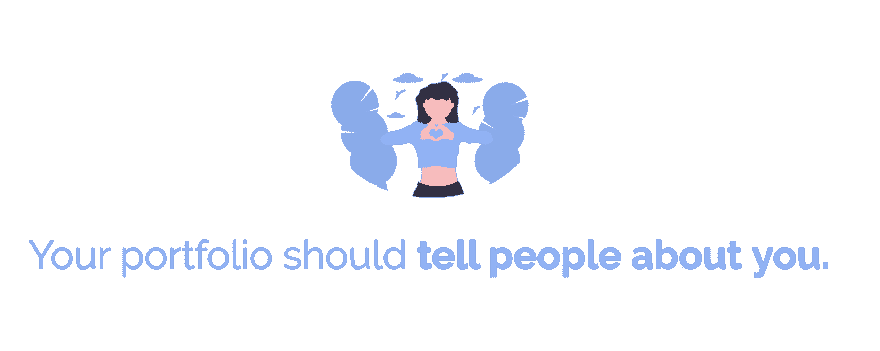](https://res.cloudinary.com/practicaldev/image/fetch/s--P1yI0bpr--/c_limit%2Cf_auto%2Cfl_progressive%2Cq_auto%2Cw_880/https://cdn-images-1.medium.com/max/1600/1%2AQwuxRwkuK51Jqo__qiWwxw.png)

投资组合是你闪耀的方式！你喜欢做什么来娱乐？简而言之，你的人生故事是什么？你希望人们了解你什么？

通过加入一些个人因素，你让潜在的雇主了解了和你一起工作是什么感觉！

这是我作品集“关于”页面的一小段。请点击查看完整页面[。](https://emmawedekind.com/about)

[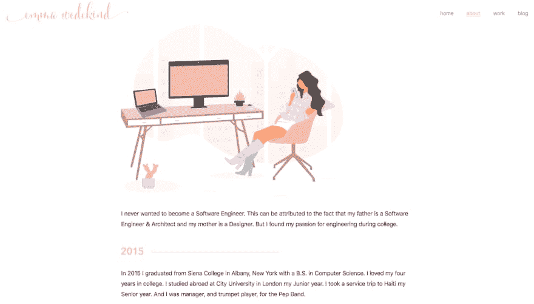](https://res.cloudinary.com/practicaldev/image/fetch/s--tsehUf-B--/c_limit%2Cf_auto%2Cfl_progressive%2Cq_auto%2Cw_880/https://cdn-images-1.medium.com/max/2000/1%2ATeeg9QFL7tiz73TIotr9vw.png)

[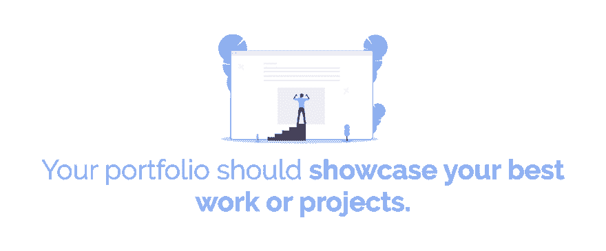](https://res.cloudinary.com/practicaldev/image/fetch/s--HmSiDOMT--/c_limit%2Cf_auto%2Cfl_progressive%2Cq_auto%2Cw_880/https://cdn-images-1.medium.com/max/1600/1%2ASl41Z6PD1GZYnL5yFdqBkA.png)

如果你有任何你引以为豪的项目或工作，并且证明了你的编码或设计能力，你的文件夹就是展示它们的地方。

许多公司生产专有(机密)作品，因此你可能想知道如何将这些作品纳入公共投资组合。

不幸的是，答案是……你不能。我的建议是有两到三个展示你能力的兼职项目。我知道这对每个人来说都不可行，但是当你的工作是机密的时候，你能做的就不多了。

要展示你的作品，描述你使用的技术，你在项目中的角色(如果适用)，附上一两张截图，并发布代码链接(如果可以的话)。

以下是我如何布置我的投资组合中的工作部分。你可以在这里查看整个页面。

[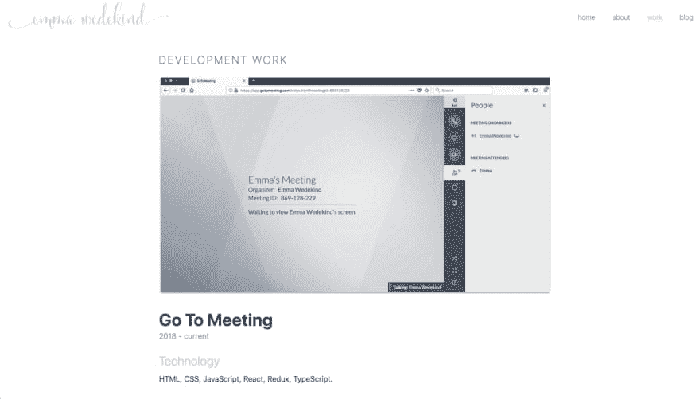](https://res.cloudinary.com/practicaldev/image/fetch/s--iDg4U923--/c_limit%2Cf_auto%2Cfl_progressive%2Cq_auto%2Cw_880/https://cdn-images-1.medium.com/max/2000/1%2AigzfRC9dan8PhJ4dW4rvPw.png)
[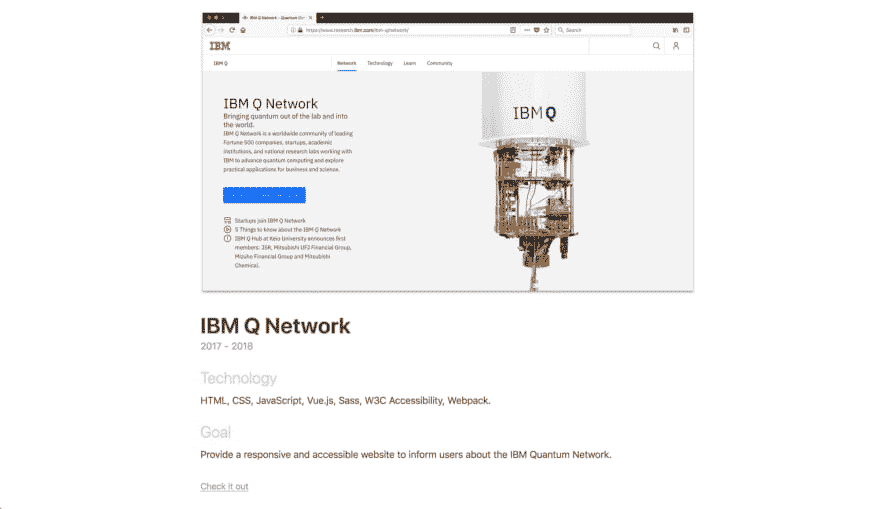T6】](https://res.cloudinary.com/practicaldev/image/fetch/s--8meZmkvV--/c_limit%2Cf_auto%2Cfl_progressive%2Cq_auto%2Cw_880/https://cdn-images-1.medium.com/max/2000/1%2A9ktiyivt0gsyjIjYSmX3jA.png)

[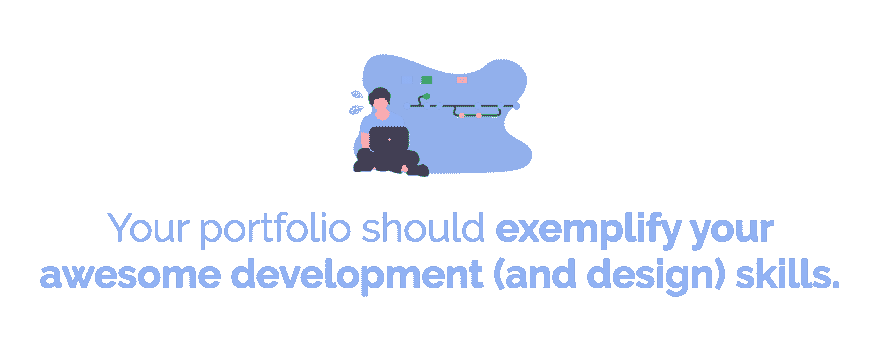](https://res.cloudinary.com/practicaldev/image/fetch/s--Ju06C6If--/c_limit%2Cf_auto%2Cfl_progressive%2Cq_auto%2Cw_880/https://cdn-images-1.medium.com/max/1600/1%2A0ElG9UzMar5a5frEOKDKHA.png)

抓住雇主眼球的一个好方法是把你的作品集作为副业。我使用 Gatsby 和 React.js 来构建我的作品集，仅仅是因为我想尝试一个站点生成器并展示我的 React 技能。

在建立之前，我还用草图设计了我的整个作品集。我建议画出一个你希望如何显示你的信息的层次结构。

查看“我应该使用什么技术来构建我的投资组合？”一节，了解更多关于建立投资组合的不同方法的详细信息！

[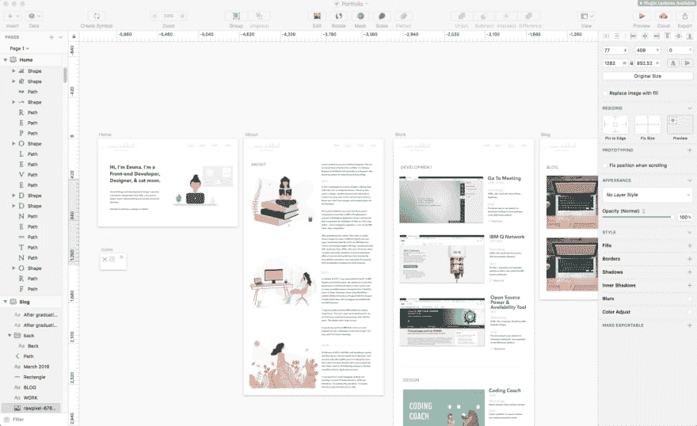](https://res.cloudinary.com/practicaldev/image/fetch/s--Zj-gGNHI--/c_limit%2Cf_auto%2Cfl_progressive%2Cq_auto%2Cw_880/https://cdn-images-1.medium.com/max/2000/1%2ACmxgy2t-9MCRIED6MeAQ2w.png)

[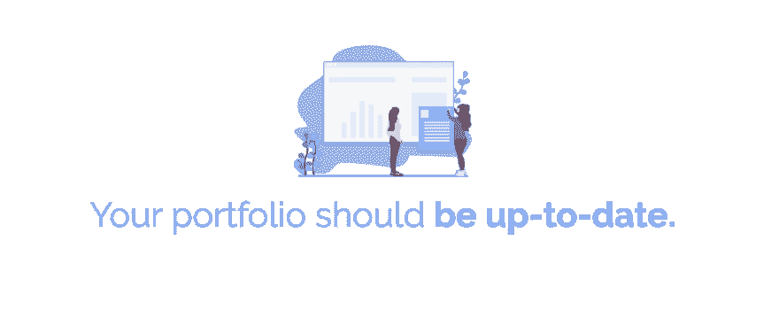](https://res.cloudinary.com/practicaldev/image/fetch/s---aQWPOcO--/c_limit%2Cf_auto%2Cfl_progressive%2Cq_auto%2Cw_880/https://cdn-images-1.medium.com/max/1600/1%2A0laJ39UwuKyXyNMn_XoHMg.png)

招聘人员和潜在雇主可能会搜索你的文件夹，即使你已经多年没有更新了。因此，尽可能保持您的信息最新是非常重要的。

如果你承担了新的角色，更新你的投资组合。如果你开发了一个很酷的新应用，更新你的作品集！

你希望这能代表你和你目前的技能。因此，重要的是你要构建一些易于维护并且经得起时间考验的东西。

[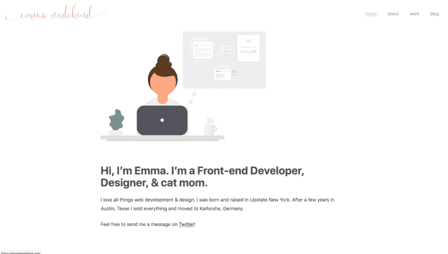](https://res.cloudinary.com/practicaldev/image/fetch/s--wx4J0fHP--/c_limit%2Cf_auto%2Cfl_progressive%2Cq_auto%2Cw_880/https://cdn-images-1.medium.com/max/2000/1%2ATjI4J_KlR96i_KUuHcnItQ.png)

[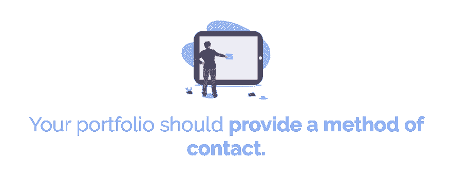](https://res.cloudinary.com/practicaldev/image/fetch/s--KuObXSuC--/c_limit%2Cf_auto%2Cfl_progressive%2Cq_auto%2Cw_880/https://cdn-images-1.medium.com/max/1600/1%2A6NpUilEGJ6gJ15HtuoW0EQ.png)

你应该在你的作品集里提供一种联系方式。老实说，此时此刻，我还没有列出我的联系方式(真可耻！).

如果你不提供联系方式，招聘人员就无法就潜在职位与你联系。

因此，附上你的社交媒体的链接(如果你把它作为主要的交流方式)、你的电子邮件或电话号码(如果你不介意接到很多电话)。

给他们一些联系你的方法。

设计投资组合可能是最困难的任务，尤其是如果你是一个后端开发人员或者几乎没有设计经验。

当我建立一个网站或应用程序时，我使用 [dribbble](https://dribbble.com/) 作为灵感和调色板。此外，您可以查看 Wix 和 Squarespace，看看它们的一些模板。我不是建议你抄袭别人的设计，但这是一个获得灵感的好起点。

我建议保持设计相当简单。你想要从现在起五年甚至十年后看起来都很好的东西。选择简单但容易理解的颜色。使用适当大小的可读字体。

它也有助于写出一个信息架构。你想了解你的投资组合的哪些信息？你想要它怎么布置？单页？多条路线？在编码之前做出这些决定，你将会节省大量的时间。

如果需要图形，我推荐 [unDraw](https://undraw.co/illustrations) 。它们可以免费使用，并且易于定制！

[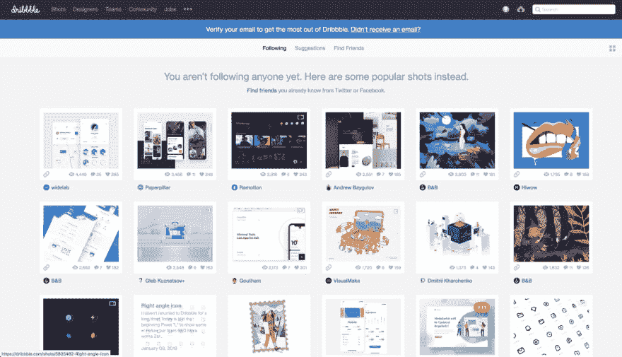](https://res.cloudinary.com/practicaldev/image/fetch/s--0m0xrAkv--/c_limit%2Cf_auto%2Cfl_progressive%2Cq_auto%2Cw_880/https://cdn-images-1.medium.com/max/1600/1%2Af0c_5CoTFVYw9e4rLqncsA.png)

有许多不同的技术，你可以选择建立自己的投资组合。让我们来看看后端和前端开发人员的一些选择。

# 后端开发者

如果你是一个后端开发人员，或者不习惯构建 UI，你有几条路可以走。

### 1。利用 CMS

内容管理系统(CMS)管理数字内容的创建和维护。

WordPress 是最受欢迎的内容管理系统之一，对于那些不太习惯构建自己的 UI 的开发者来说是一个很好的选择。

[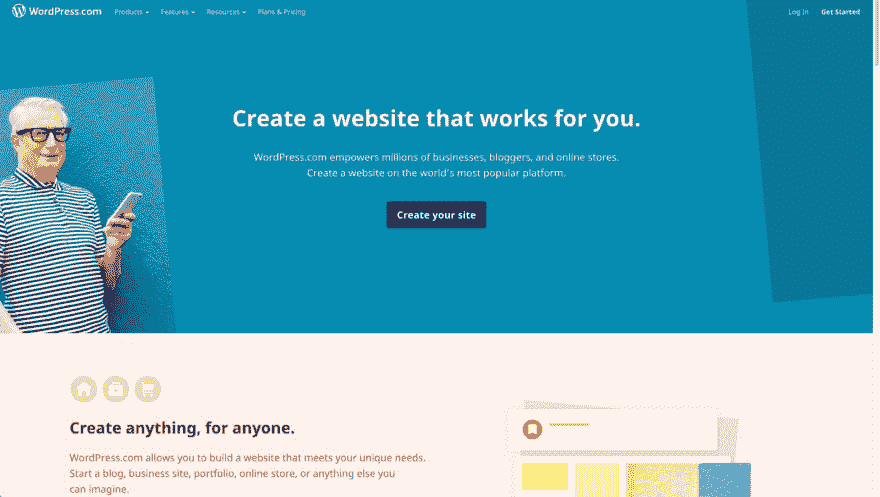](https://res.cloudinary.com/practicaldev/image/fetch/s--Is3VfWwu--/c_limit%2Cf_auto%2Cfl_progressive%2Cq_auto%2Cw_880/https://cdn-images-1.medium.com/max/1600/1%2A55xlnO0PkA666iAaRWO5IQ.png)

### 2。使用普通的 HTML & CSS

如果你知道一点基本的 web 开发，一个很好的扩展方法是使用普通的 HTML 和 CSS 来构建你的网站。如果这不是你的强项，不要觉得你需要在 UI 的设计/风格上走极端。但是用 HTML 和 CSS 建立你的网站显示了你在舒适区之外学习技能的能力。

你不需要有 JavaScript 来创建一个令人敬畏的投资组合！

### 3。使用 CSS 框架

如果你对基本的 HTML 和 CSS 相当熟悉，但是想要一个更一致的 UI，你可能想看看 CSS 框架。

CSS 框架使得设计元素更加容易和快捷。重要的是要注意，如果你申请的是前端开发人员的角色，使用 CSS 框架可能不是最好的选择，因为雇主会寻找一个擅长开发 CSS 的开发人员。但是对于后端开发人员来说，这可能是一个很好的选择。

我推荐去看看[基础](https://foundation.zurb.com/)、[布尔玛](https://bulma.io/)、[语义](https://semantic-ui.com/)，或者[引导](https://getbootstrap.com/)。

[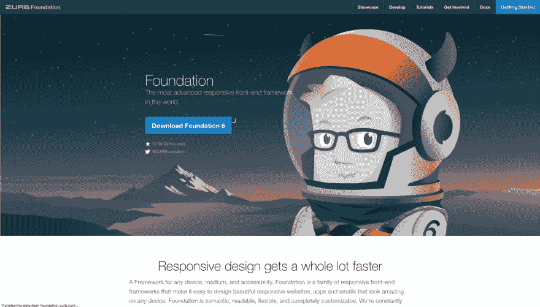](https://res.cloudinary.com/practicaldev/image/fetch/s--7h69feo0--/c_limit%2Cf_auto%2Cfl_progressive%2Cq_auto%2Cw_880/https://cdn-images-1.medium.com/max/1600/1%2AJFpMuMNalECUElF32lGI_Q.png)

### 4。使用网站构建器

如果你只是想尽可能快地让你的内容上线，你也可以使用 Wix 或 Squarespace 这样的网站构建器。

这使得部署网站变得非常快速和容易。您甚至可以集成一个自定义域。

然而，如果你申请的是前端开发人员的职位，我建议不要使用网站创建平台。这是一个展示你的开发技能的机会！要么做大，要么回家！

[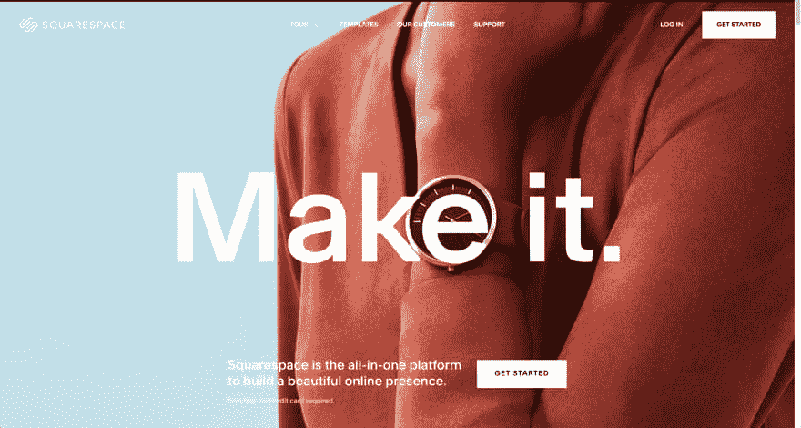](https://res.cloudinary.com/practicaldev/image/fetch/s--zLxo7sk1--/c_limit%2Cf_auto%2Cfl_progressive%2Cq_auto%2Cw_880/https://cdn-images-1.medium.com/max/1600/1%2AjimZSkCicvHz2nTNn2nkOQ.png)

# 前端开发者

如果你是一个前端开发人员，有更多的选择来建立你的网站。

### 1。使用普通的 HTML，CSS，& JavaScript

一个简单的香草网站永远不会出错。如果你不想或不需要，没有必要使你的投资组合的架构过于复杂。你从零开始建立自己的网站，这个简单的事实向潜在雇主表明，你愿意花一些额外的时间来展示你的技能。

### 2。使用 JavaScript 框架

您可能希望通过利用框架或库，将作品集作为练习(和展示)您的 JavaScript 能力的一种方式。我建议选择一门你熟悉的课程(或者选择一门你一直想学的课程！)或者与你想找的角色类型相关的。

通常，这些框架或库都有一个 CLI，您可以使用它来创建一个启动项目。这些可以节省您设置环境的大量时间，并让您不必自己编译、最小化和 lint 代码。

### 3。使用静态站点生成器

随着流行的库和框架(React、Vue、Angular 等)的采用，静态站点生成器在技术行业越来越臭名昭著。).我用 Gatsby:React 的站点生成器建立了我的作品集。

[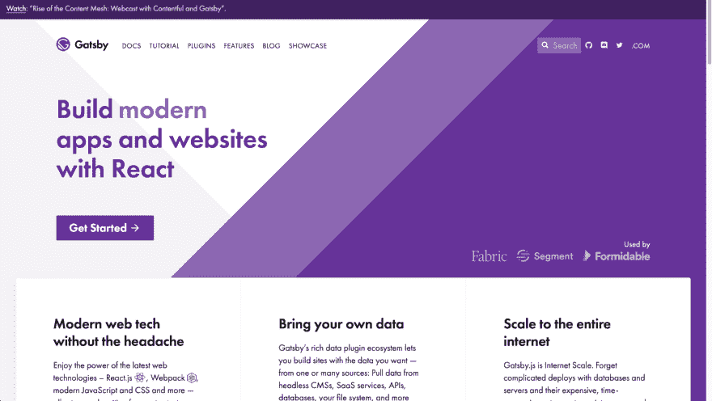](https://res.cloudinary.com/practicaldev/image/fetch/s--N5WvCbVN--/c_limit%2Cf_auto%2Cfl_progressive%2Cq_auto%2Cw_880/https://cdn-images-1.medium.com/max/1600/1%2ANEjBEikVF9dkgtEff8XWCQ.png)

有许多不同的站点生成器可供选择，例如 React 应用程序的 Next.js 和 Vue.js 的 VuePress。

这些提供了许多好处，例如用于图像优化的插件、移动友好的响应能力和可访问性。

**编写自己的作品集的技巧**

*   确保你的代码以一种深思熟虑和有效的方式组织起来。将所有内容放入一个页面非常容易(你也可以做到)，但是将不同的部分/内容放入本地 web 组件或 HTML 页面会有很大的不同。
*   确保你的 CSS 整洁有序。尝试使用更现代的 CSS 来定位元素(比如 Flexbox 或 CSS-Grid over floats)。这表明您掌握了最新的规格。
*   利用语义 HTML。将您的代码组织成一个层次结构，并定义主要区域。使用这些地标区域(`<section>`、`<nav>`、`<header>`、`<aside>`、`<body>`等)。)来表示你的投资组合的重要里程碑。尽量少用`
`和``。

我总是建议在你的文件夹中包含以下部分:

*   **关于**:你是谁？你业余时间喜欢做什么？有什么有趣的事实吗？
*   **工作/项目/技能**:你都用过哪些技术？你建过哪些项目？
*   **博客(可选)**:如果你有博客，就在这里展示吧。
*   **联系方式**:招聘人员怎么联系？

还是那句话，这是我个人的偏好。你可能只想创建一个登陆页面，它可以连接到不同的平台(社交媒体、GitHub 等)。)

* * *

你的作品集应该是你的代表。投资组合没有放之四海而皆准的方法。把它变成你的！

我希望这个博客是有用的，并会鼓励你建立一个可怕的组合来展示你的工作。如果你有任何问题，不要犹豫，在 Twitter 上联系！编码快乐！