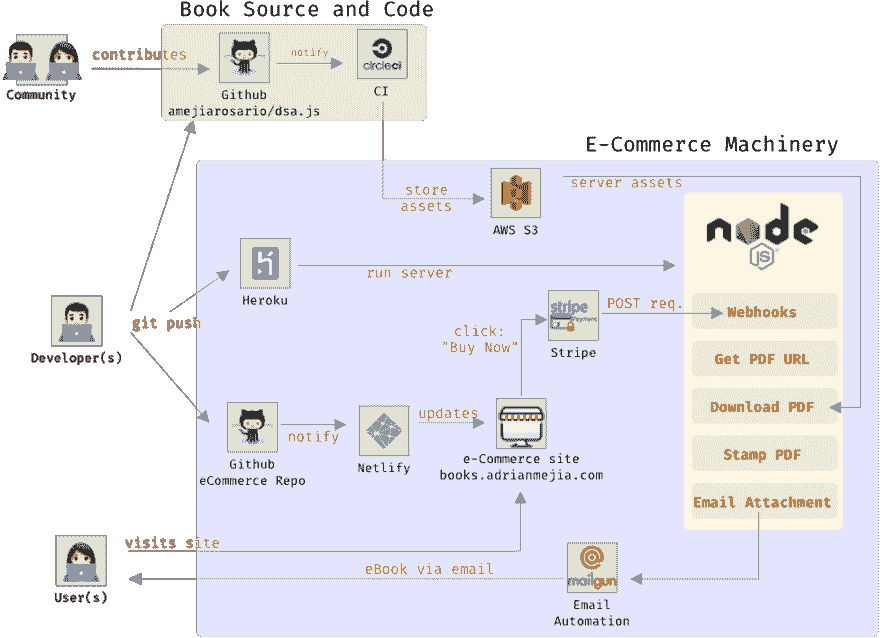
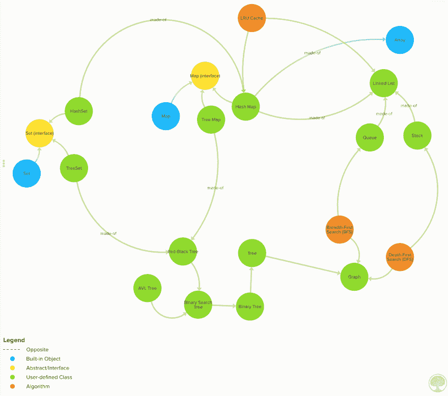

# 如何免费建立 Node.js 电子商务网站

> 原文：<https://dev.to/amejiarosario/how-to-build-a-node-js-ecommerce-website-for-free-2o97>

经营一家销售数字商品的网上商店比以往任何时候都容易。由于对开发者慷慨的免费计划，你不需要花一毛钱来为大量用户运营你的电子商务网站。在这篇文章中，我将回顾我是如何组织[books.adrianmejia.com](https://books.adrianmejia.com)来销售我的电子书的。

一个 10，000 英尺的视图描述应该是这样的:

液体错误:内部

**TL；DR:** 电子商务网站最终堆栈如下:

*   Node.js(后端处理:支付 webhooks)
*   Stripe(支付网关)
*   Heroku(运行服务器代码)
*   Netlify(宿主静态文件)
*   亚马逊 S3(主机资产)
*   CircleCI(测试代码并生成资产)
*   邮件枪(电子邮件平台)

下图显示了各部分如何相互作用:

[](https://res.cloudinary.com/practicaldev/image/fetch/s--exPQrL9T--/c_limit%2Cf_auto%2Cfl_progressive%2Cq_auto%2Cw_880/https://adrianmejia.cimg/e-commerce-app-nodejs3.png)

## 自动生成资产(PDF)

我有 Github 存储库，里面存放着本书的文档和代码:

##  [阿梅加罗萨里奥](https://github.com/amejiarosario)/[DSA . js-数据-结构-算法-javascript](https://github.com/amejiarosario/dsa.js-data-structures-algorithms-javascript)

### 🥞JavaScript + eBook 中解释和实现的数据结构和算法

<article class="markdown-body entry-content container-lg" itemprop="text">

[](https://user-images.githubusercontent.com/418605/59557258-10742880-8fa3-11e9-84fb-4d66a9d89faa.png)

# JavaScript 中的数据结构和算法

[](https://app.circleci.com/pipelines/github/amejiarosario/dsa.js-data-structures-algorithms-javascript)[](https://badge.fury.io/js/dsa.js)[](https://dsajs-slackin.herokuapp.com)

> 这是 DSA.js book 的编码实现和 NPM 包的回购。

> 在这个库中，您可以找到 JavaScript 中算法和数据结构的实现。这些材料可以作为开发人员的参考手册，或者您可以在面试前刷新特定主题。还有，你可以找到更高效解决问题的思路。

[](https://user-images.githubusercontent.com/418605/46118890-ba721180-c1d6-11e8-82bc-6a671428b422.png)

## 目录

*   [安装](https://raw.githubusercontent.com/amejiarosario/dsa.js-data-structures-algorithms-javascript/master/#installation)
*   [特性](https://raw.githubusercontent.com/amejiarosario/dsa.js-data-structures-algorithms-javascript/master/#features)
*   [里面有什么](https://raw.githubusercontent.com/amejiarosario/dsa.js-data-structures-algorithms-javascript/master/#whats-inside)
    *   [<g-emoji class="g-emoji" alias="chart_with_upwards_trend" fallback-src="https://github.githubassets.cimg/icons/emoji/unicode/1f4c8.png">📈</g-emoji>算法分析](https://raw.githubusercontent.com/amejiarosario/dsa.js-data-structures-algorithms-javascript/master/#-algorithms-analysis)
    *   [<g-emoji class="g-emoji" alias="pancakes" fallback-src="https://github.githubassets.cimg/icons/emoji/unicode/1f95e.png">🥞</g-emoji>线性数据结构](https://raw.githubusercontent.com/amejiarosario/dsa.js-data-structures-algorithms-javascript/master/#-linear-data-structures)
    *   [<g-emoji class="g-emoji" alias="evergreen_tree" fallback-src="https://github.githubassets.cimg/icons/emoji/unicode/1f332.png">🌲</g-emoji>非线性数据结构](https://raw.githubusercontent.com/amejiarosario/dsa.js-data-structures-algorithms-javascript/master/#-non-linear-data-structures)
    *   [<g-emoji class="g-emoji" alias="hammer_and_pick" fallback-src="https://github.githubassets.cimg/icons/emoji/unicode/2692.png">⚒</g-emoji> 算法技巧](https://raw.githubusercontent.com/amejiarosario/dsa.js-data-structures-algorithms-javascript/master/#%E2%9A%92-algorithms-techniques)
*   [预定](https://raw.githubusercontent.com/amejiarosario/dsa.js-data-structures-algorithms-javascript/master/#book)
*   [常见问题解答](https://raw.githubusercontent.com/amejiarosario/dsa.js-data-structures-algorithms-javascript/master/#faq)
*   [支持](https://raw.githubusercontent.com/amejiarosario/dsa.js-data-structures-algorithms-javascript/master/#support)
*   [执照](https://raw.githubusercontent.com/amejiarosario/dsa.js-data-structures-algorithms-javascript/master/#license)

## 装置

您可以克隆回购协议或安装来自 NPM 的代码:

```
npm install dsa.js
```

Enter fullscreen mode Exit fullscreen mode

然后您可以将它导入到您的程序或 CLI 中

```
const { LinkedList, Queue, Stack } = require('dsa.js');
```

Enter fullscreen mode Exit fullscreen mode

所有公开的数据结构和算法的完整列表[见](https://raw.githubusercontent.com/amejiarosario/dsa.js-data-structures-algorithms-javascript/master/src/index.js)。

## 特征

算法是一种…

</article>

[View on GitHub](https://github.com/amejiarosario/dsa.js-data-structures-algorithms-javascript)

每当我(或社区中的某个人)做出更改时，就会触发 CI 上的一些流程，运行所有测试并生成新的更新文档，并将其存储到 AWS S3。

自动生成资产很有用，因为我希望每个购买者都能获得最新的副本。

## 托管电子商务网站

我总是想尝试新的 JavaScript/CSS 框架。但是，我忍住了诱惑，问自己:卖书的页面需要动态吗？没有。所以，如果我使用普通的 CSS 和 HTML 会更有效率。我就是这么做的。静态页面还有一个优势，那就是可以从 CDN 缓存和提供服务。

我用 Netlify 免费托管静态网站。一个单独的`git push`将在选择的域名上更新站点(例如[books.adrianmejia.com](https://books.adrianmejia.com))。它还使用全球 CDN，因此您的页面在世界任何地方都能更快地加载！

## 处理付款

接下来的部分是添加一个`Buy`按钮。Stripe 提供了一个有用的结帐页面，他们自己托管该页面，并在处理信用卡时考虑 PCI 合规性。所以，我用了那个，他们为我处理付款。

但是我怎么知道顾客是买了我的书还是分心了呢？为此，我需要一个服务器来监听支付网络挂钩。在条带配置页面中，您告诉他们在发生特定事件时发送一个包含客户信息的 POST 请求(webhook)。

下面是一个简单的 webhook 服务器的代码

```
const express = require('express');
const bodyParser = require('body-parser');

const app = express();
const port = process.env.PORT || 5000;

app.use(bodyParser.json());

app.listen(port, () => {
  console.log(`Listening for webhooks: http://localhost:${port}`);
});

app.post('/webhook', async (req, res) => {
  const event = req.body;

  res.sendStatus(200);

  if (event.type === 'payment_intent.succeeded') {
    // TODO: send event to RabbitMQ instead of generating the PDF here.
    // It's not good practice to block a request handler with long processes
    const { sendPdfToBuyer } = require('./process-pdf');
    sendPdfToBuyer(event);
  }
});

// all other routes, prevent node crashing for undefined routes
app.route('*', async (req, res) => {
  res.json({ ok: 1 });
}); 
```

Enter fullscreen mode Exit fullscreen mode

这就把我们带到了下一部分，Node.js 服务器负责剩下的部分。

# 后端处理

我创建了一个 Node.js 服务器来监听 webhook 请求。当一个顾客为这本书付款时，一个包含详细信息的事件被发送到这个服务器，文档管道被启动。

服务器首先从 AWS S3 存储桶下载这本书，最新的原始文档在那里。后来，服务器使用一个库，允许操作 PDF 并在电子书上添加买家的印章。最后，将材料附加到电子邮件中并通过电子邮件发送。

```
async function sendPdfToBuyer(webhookEvent) {
  const email = webhookEvent.data.object.charges.data.map(d => d.billing_details.email).join(', ');
  const pdfUrl = await getLatestPdfUrl();
  const fileName = pdfUrl.split('/').pop();
  const pdfBuffer = await downloadPdf(pdfUrl);
  const stampedPdfPath = await stampedPdfWithBuyerData({ pdfBuffer, email, fileName });
  await sendEmail({ stampedPdfPath, email, fileName });
} 
```

Enter fullscreen mode Exit fullscreen mode

## 发送邮件

发送电子邮件比我想象的要复杂一些。

### DNS 设置和认证

首先，我使用的是我的域名，所以我必须设置 DNS 来使它工作。然而，我注意到我发给自己的所有测试邮件都被收进了垃圾邮件。

阅读更多关于这个话题的内容，我意识到我必须使用 SPF 和 DKIM 来验证电子邮件，我仍然不知道它们的细节，但它们允许电子邮件提供商(Gmail，Yahoo)验证你是你所说的那个人。它们也是使用电子邮件服务提供的 DNS 设置进行设置的。

我最初用 Sendgrid 设置了这个设置，但是仍然把我的邮件放在垃圾文件夹里。我搬到了 Mailgun，得到了更好的结果。出于某种原因，`hotmail.com`总是会拒绝这些邮件。据我所知，除非你为一个专用的 IP 地址付费，否则电子邮件服务提供商会在许多账户中使用一个“共享”的 IP 地址。如果出于某种原因，该 IP 获得了坏名声，那么你的电子邮件将进入垃圾邮件文件夹，即使你以前从未发送过电子邮件！我通过开一个支持票解决了这个问题，在他们改变了 IP 地址后，它在任何地址都能正常工作。

### 邮件模板

最后与邮件相关的部分是做一个模板。我以前从未做过。电子邮件模板的 HTML 和网页 HTML 的区别在于，在电子邮件中，你应该把所有的东西都嵌入到邮件本身中。垃圾邮件过滤器不喜欢外部链接加载额外的资源。所以，每一个 CSS 都应该是内联的，也必须是负责任的。

好了，现在你有了:一个电子商务商店，它收集付款并将数字商品发送给买家。让我们结束谈论维护费用。

## 经营电子商务商店的成本

这是每月费用的明细:

*   托管静态网站: **$0** (如果您使用 Netlify 或 Github 页面)
*   支付网关: **$0** (如果你出售的东西不是$0，Stripe 将只收取 2.9%的费用)
*   node . js server:**$ 0**(Heroku、AWS、Google Cloud 等很多都有针对开发者的免费计划)
*   邮箱服务: **$0** (Mailgun 和 Sendgrid 都有免费计划。前者允许你每月给 10K 发邮件)

总计为: **$0** /月。

注意:像任何网站一样，如果你想像我一样使用自定义域名，你必须支付大约 1 美元/月的费用。