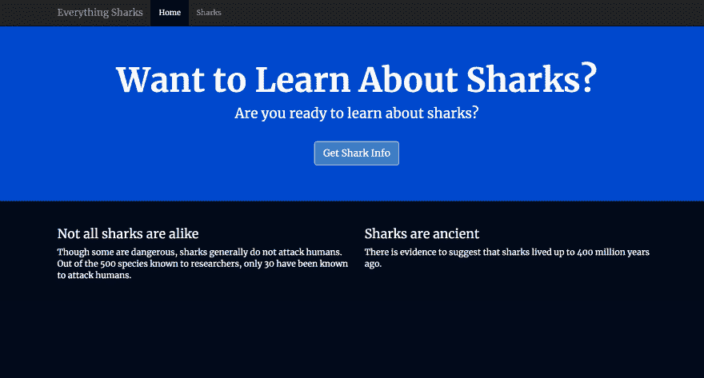
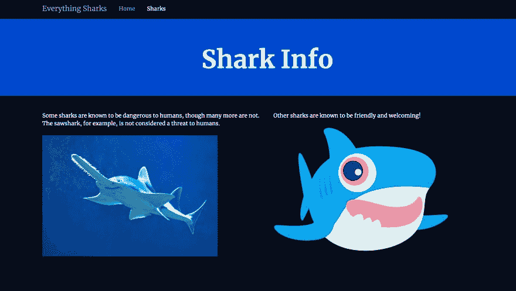

# 如何用 Docker 构建 Node.js 应用程序

> 原文：<https://dev.to/digitalocean/how-to-build-a-nodejs-application-with-docker-29h9>

### 简介

Docker 平台允许开发者将应用打包并作为 T2 容器运行。容器是一个运行在共享操作系统上的独立进程，为虚拟机提供了一个轻量级的替代方案。尽管容器并不新鲜，但它们提供了好处——包括进程隔离和环境标准化——随着越来越多的开发人员使用分布式应用程序架构，这些好处变得越来越重要。

当使用 Docker 构建和扩展应用程序时，起点通常是为您的应用程序创建一个映像，然后您可以在容器中运行它。该映像包括您的应用程序代码、库、配置文件、环境变量和运行时。使用映像可以确保容器中的环境是标准化的，并且只包含构建和运行应用程序所必需的内容。

在本教程中，您将为一个使用 [Express](https://expressjs.com/) 框架和 [Bootstrap](https://getbootstrap.com/) 的静态网站创建一个应用程序映像。然后，您将使用该映像构建一个容器，并将其推送到 [Docker Hub](https://hub.docker.com/) 供将来使用。最后，您将从 Docker Hub 存储库中提取存储的映像，并构建另一个容器，演示如何重新创建和扩展您的应用程序。

## 先决条件

要学习本教程，您需要:

*   一台 Ubuntu 18.04 服务器，按照本[初始服务器设置指南](https://www.digitalocean.com/community/tutorials/initial-server-setup-with-ubuntu-18-04)进行设置。
*   Docker 安装在您的服务器上，遵循[如何在 Ubuntu 18.04](https://www.digitalocean.com/community/tutorials/how-to-install-and-use-docker-on-ubuntu-18-04) 上安装和使用 Docker 的步骤 1 和 2。
*   Node.js 和 npm 已安装，请遵循这些关于安装由 NodeSource 管理的 PPA 的说明。
*   码头中心账户。关于如何设置的概述，请参考[Docker Hub 入门简介](https://docs.docker.com/docker-hub/)。

## 步骤 1 —安装您的应用程序依赖项

要创建图像，首先需要制作应用程序文件，然后可以将这些文件复制到容器中。这些文件将包括应用程序的静态内容、代码和依赖项。

首先，在非根用户的主目录中为您的项目创建一个目录。我们称我们的为`node_project`，但是你可以随意用别的东西来代替它:

```
mkdir node_project 
```

导航到此目录:

```
cd node_project 
```

这将是项目的根目录。

接下来，用项目的依赖项和其他标识信息创建一个 [`package.json`](https://docs.npmjs.com/files/package.json) 文件。用`nano`或者你喜欢的编辑器:
打开文件

```
nano package.json 
```

添加有关项目的以下信息，包括其名称、作者、许可证、入口点和依赖项。请确保将作者信息替换为您自己的姓名和联系方式:

`~/node_project/package.json`

```
{
  "name": "nodejs-image-demo",
  "version": "1.0.0",
  "description": "nodejs image demo",
  "author": "Sammy the Shark <sammy@example.com>",
  "license": "MIT",
  "main": "app.js",
  "keywords": [
    "nodejs",
    "bootstrap",
    "express"
  ],
  "dependencies": {
    "express": "^4.16.4"
  }
} 
```

该文件包括项目名称、作者和共享它所使用的许可证。Npm [建议](https://docs.npmjs.com/files/package.json#name)让你的项目名称简短并具有描述性，避免在 [npm 注册表](https://www.npmjs.com/)中出现重复。我们在 license 字段中列出了 [MIT license](https://opensource.org/licenses/MIT) ，允许自由使用和分发应用程序代码。

此外，该文件还指定:

*   `"main"`:应用程序的入口点`app.js`。接下来您将创建这个文件。
*   `"dependencies"`:项目依赖关系——在这种情况下，Express 4.16.4 或更高版本。

尽管这个文件没有列出一个存储库，但是你可以按照这些指南在[中添加一个存储库到你的`package.json`文件](https://docs.npmjs.com/files/package.json#repository)中。如果您正在对应用程序进行版本控制，这是一个很好的补充。

完成更改后，保存并关闭文件。

要安装项目的依赖项，请运行以下命令:

```
npm install 
```

这将把您在`package.json`文件中列出的包安装到您的项目目录中。

我们现在可以继续构建应用程序文件了。

## 第二步——创建应用文件

我们将创建一个网站，为用户提供关于鲨鱼的信息。我们的应用程序将有一个主入口点、`app.js`和一个包含项目静态资产的`views`目录。登陆页面`index.html`，将为用户提供一些初步的信息，以及一个链接到更详细的鲨鱼信息页面`sharks.html`。在`views`目录中，我们将创建登陆页面和`sharks.html`。

首先，在主项目目录中打开`app.js`来定义项目的路线:

```
nano app.js 
```

文件的第一部分将创建 Express 应用程序和路由器对象，并将基本目录、端口和主机定义为变量:

`~/node_project/app.js`

```
var express = require("express");
var app = express();
var router = express.Router();

var path = __dirname + '/views/';
const PORT = 8080;
const HOST = '0.0.0.0'; 
```

`require`函数加载`express`模块，然后我们用它来创建`app`和`router`对象。`router`对象将执行应用程序的路由功能，当我们定义 HTTP 方法路由时，我们将把它们添加到这个对象中，以定义我们的应用程序将如何处理请求。

文件的这一部分还设置了几个变量，`path`、`PORT`和`HOST`:

*   `path`:定义基础目录，该目录将是当前项目目录下的`views`子目录。
*   `HOST`:定义应用程序将绑定并监听的地址。将此设置为`0.0.0.0`或所有 IPv4 地址符合 Docker 默认的将容器暴露给`0.0.0.0`的行为，除非另有指示。
*   `PORT`:告诉 app 监听并绑定到端口`8080`。

接下来，使用`router`对象为应用程序设置路由:

`~/node_project/app.js`

```
...

router.use(function (req,res,next) {
  console.log("/" + req.method);
  next();
});

router.get("/",function(req,res){
  res.sendFile(path + "index.html");
});

router.get("/sharks",function(req,res){
  res.sendFile(path + "sharks.html");
}); 
```

`router.use`函数加载一个[中间件函数](https://expressjs.com/en/guide/writing-middleware.html)，它将记录路由器的请求并将它们传递给应用程序的路由。这些在后续函数中定义，这些函数指定对基本项目 URL 的 GET 请求应该返回`index.html`页面，而对`/sharks`路由的 GET 请求应该返回`sharks.html`。

最后，安装`router`中间件和应用程序的静态资产，并告诉应用程序监听端口`8080`:

`~/node_project/app.js`

```
...

app.use(express.static(path));
app.use("/", router);

app.listen(8080, function () {
  console.log('Example app listening on port 8080!')
}) 
```

完成的`app.js`文件将如下所示:

`~/node_project/app.js`

```
var express = require("express");
var app = express();
var router = express.Router();

var path = __dirname + '/views/';
const PORT = 8080;
const HOST = '0.0.0.0';

router.use(function (req,res,next) {
  console.log("/" + req.method);
  next();
});

router.get("/",function(req,res){
  res.sendFile(path + "index.html");
});

router.get("/sharks",function(req,res){
  res.sendFile(path + "sharks.html");
});

app.use(express.static(path));
app.use("/", router);

app.listen(8080, function () {
  console.log('Example app listening on port 8080!')
}) 
```

完成后，保存并关闭文件。

接下来，让我们向应用程序添加一些静态内容。首先创建`views`目录:

```
mkdir views 
```

打开登陆页面文件，`index.html` :

```
nano views/index.html 
```

将以下代码添加到文件中，这将导入 Boostrap 并创建一个[大屏幕](https://getbootstrap.com/docs/4.0/components/jumbotron/)组件，该组件带有一个到更详细的`sharks.html`信息页面的链接:

`~/node_project/views/index.html`

```
<!DOCTYPE html>
<html lang="en">

<head>
    About Sharks
    <meta charset="utf-8">
    <meta name="viewport" content="width=device-width, initial-scale=1">
    <link rel="stylesheet" href="https://stackpath.bootstrapcdn.com/bootstrap/4.1.3/css/bootstrap.min.css" integrity="sha384-MCw98/SFnGE8fJT3GXwEOngsV7Zt27NXFoaoApmYm81iuXoPkFOJwJ8ERdknLPMO" crossorigin="anonymous">
    <link href="css/styles.css" rel="stylesheet">
    <link href="https://fonts.googleapis.com/css?family=Merriweather:400,700" rel="stylesheet" type="text/css">
</head>

<body>
    <nav class="navbar navbar-dark bg-dark navbar-static-top navbar-expand-md">
        <div class="container">
            <button type="button" class="navbar-toggler collapsed" data-toggle="collapse" data-target="#bs-example-navbar-collapse-1" aria-expanded="false"> <span class="sr-only">Toggle navigation</span>
            </button> <a class="navbar-brand" href="#">Everything Sharks</a>
            <div class="collapse navbar-collapse" id="bs-example-navbar-collapse-1">
                <ul class="nav navbar-nav mr-auto">
                    <li class="active nav-item"><a href="/" class="nav-link">Home</a>
                    </li>
                    <li class="nav-item"><a href="/sharks" class="nav-link">Sharks</a>
                    </li>
                </ul>
            </div>
        </div>
    </nav>
    <div class="jumbotron">
        <div class="container">
            <h1>Want to Learn About Sharks?</h1>
            <p>Are you ready to learn about sharks?</p>
            <br>
            <p><a class="btn btn-primary btn-lg" href="/sharks" role="button">Get Shark Info</a>
            </p>
        </div>
    </div>
    <div class="container">
        <div class="row">
            <div class="col-lg-6">
                <h3>Not all sharks are alike</h3>
                <p>Though some are dangerous, sharks generally do not attack humans. Out of the 500 species known to researchers, only 30 have been known to attack humans.
                </p>
            </div>
            <div class="col-lg-6">
                <h3>Sharks are ancient</h3>
                <p>There is evidence to suggest that sharks lived up to 400 million years ago.
                </p>
            </div>
        </div>
    </div>
</body>

</html> 
```

这里的顶层[导航栏](https://getbootstrap.com/docs/4.0/components/navbar/)允许用户在**主页**和**鲨鱼页面**之间切换。在`navbar-nav`子组件中，我们使用 Bootstrap 的`active`类向用户指示当前页面。我们还指定了静态页面的路径，这些路径与我们在`app.js`中定义的路径相匹配:

`~/node_project/views/index.html`

```
...
<div class="collapse navbar-collapse" id="bs-example-navbar-collapse-1">
   <ul class="nav navbar-nav mr-auto">
      <li class="active nav-item"><a href="/" class="nav-link">Home</a>
      </li>
      <li class="nav-item"><a href="/sharks" class="nav-link">Sharks</a>
      </li>
   </ul>
</div>
... 
```

此外，我们在大屏幕的按钮中创建了一个链接，链接到我们的鲨鱼信息页面:

`~/node_project/views/index.html`

```
...
<div class="jumbotron">
   <div class="container">
      <h1>Want to Learn About Sharks?</h1>
      <p>Are you ready to learn about sharks?</p>
      <br>
      <p><a class="btn btn-primary btn-lg" href="/sharks" role="button">Get Shark Info</a>
      </p>
   </div>
</div>
... 
```

标题中还有一个指向自定义样式表的链接:

`~/node_project/views/index.html`

```
...
<link href="css/styles.css" rel="stylesheet">
... 
```

我们将在这一步的最后创建这个样式表。

完成后，保存并关闭文件。

应用程序登录页面就绪后，我们可以创建我们的鲨鱼信息页面`sharks.html`，它将为感兴趣的用户提供更多关于鲨鱼的信息。

打开文件:

```
nano views/sharks.html 
```

添加以下代码，该代码导入 Bootstrap 和自定义样式表，并向用户提供关于某些 sharks 的详细信息:

`~/node_project/views/sharks.html`

```
<!DOCTYPE html>
<html lang="en">

<head>
    About Sharks
    <meta charset="utf-8">
    <meta name="viewport" content="width=device-width, initial-scale=1">
    <link rel="stylesheet" href="https://stackpath.bootstrapcdn.com/bootstrap/4.1.3/css/bootstrap.min.css" integrity="sha384-MCw98/SFnGE8fJT3GXwEOngsV7Zt27NXFoaoApmYm81iuXoPkFOJwJ8ERdknLPMO" crossorigin="anonymous">
    <link href="css/styles.css" rel="stylesheet">
    <link href="https://fonts.googleapis.com/css?family=Merriweather:400,700" rel="stylesheet" type="text/css">
</head>
<nav class="navbar navbar-dark bg-dark navbar-static-top navbar-expand-md">
    <div class="container">
        <button type="button" class="navbar-toggler collapsed" data-toggle="collapse" data-target="#bs-example-navbar-collapse-1" aria-expanded="false"> <span class="sr-only">Toggle navigation</span>
        </button> <a class="navbar-brand" href="/">Everything Sharks</a>
        <div class="collapse navbar-collapse" id="bs-example-navbar-collapse-1">
            <ul class="nav navbar-nav mr-auto">
                <li class="nav-item"><a href="/" class="nav-link">Home</a>
                </li>
                <li class="active nav-item"><a href="/sharks" class="nav-link">Sharks</a>
                </li>
            </ul>
        </div>
    </div>
</nav>
<div class="jumbotron text-center">
    <h1>Shark Info</h1>
</div>
<div class="container">
    <div class="row">
        <div class="col-lg-6">
            <p>
                <div class="caption">Some sharks are known to be dangerous to humans, though many more are not. The sawshark, for example, is not considered a threat to humans.
                </div>
                
            </p>
        </div>
        <div class="col-lg-6">
            <p>
                <div class="caption">Other sharks are known to be friendly and welcoming!</div>
                
            </p>
        </div>
    </div>
</div>

</html> 
```

注意，在这个文件中，我们再次使用了`active`类来表示当前页面。

完成后，保存并关闭文件。

最后，通过首先在`views`目录:
中创建一个`css`文件夹，创建您在`index.html`和`sharks.html`中链接的定制 CSS 样式表

```
mkdir views/css 
```

打开样式表:

```
nano views/css/styles.css 
```

添加以下代码，它将为我们的页面设置所需的颜色和字体:

`~/node_project/views/css/styles.css`

```
.navbar {
    margin-bottom: 0;
}

body {
    background: #020A1B;
    color: #ffffff;
    font-family: 'Merriweather', sans-serif;
}

h1,
h2 {
    font-weight: bold;
}

p {
    font-size: 16px;
    color: #ffffff;
}

.jumbotron {
    background: #0048CD;
    color: white;
    text-align: center;
}

.jumbotron p {
    color: white;
    font-size: 26px;
}

.btn-primary {
    color: #fff;
    text-color: #000000;
    border-color: white;
    margin-bottom: 5px;
}

img,
video,
audio {
    margin-top: 20px;
    max-width: 80%;
}

div.caption: {
    float: left;
    clear: both;
} 
```

除了设置字体和颜色，该文件还通过指定 80%的`max-width`来限制图像的大小。这将防止它们在页面上占据比我们想要的更多的空间。

完成后，保存并关闭文件。

准备好应用程序文件并安装了项目依赖项后，您就可以启动应用程序了。

如果您遵循了先决条件中的初始服务器设置教程，您将拥有一个仅允许 SSH 流量的活动防火墙。要允许到端口`8080`的流量，请运行:

```
sudo ufw allow 8080 
```

要启动应用程序，请确保您位于项目的根目录:

```
cd ~/node_project 
```

用`node app.js` :
启动应用程序

```
node app.js 
```

将您的浏览器导航至`http://your_server_ip:8080`。您将看到以下登录页面:

[](https://res.cloudinary.com/practicaldev/image/fetch/s--s7z9Y6wk--/c_limit%2Cf_auto%2Cfl_progressive%2Cq_auto%2Cw_880/https://assets.digitalocean.com/articles/docker_node_image/node_image_landing.png)

点击**获取鲨鱼信息**按钮。您将看到以下信息页面:

[](https://res.cloudinary.com/practicaldev/image/fetch/s--4RAcH1Yi--/c_limit%2Cf_auto%2Cfl_progressive%2Cq_auto%2Cw_880/https://assets.digitalocean.com/articles/docker_node_image/shark_info_page.png)

现在您已经有了一个启动并运行的应用程序。准备好之后，通过键入`CTRL+C`退出服务器。我们现在可以继续创建 docker 文件，它将允许我们根据需要重新创建和扩展这个应用程序。

## 步骤 3 —编写 Dockerfile 文件

Dockerfile 指定了在执行应用程序容器时，它将包含哪些内容。使用 docker 文件允许您定义容器环境，并避免依赖关系或运行时版本的差异。

遵循[这些关于构建优化容器的指导方针](https://www.digitalocean.com/community/tutorials/building-optimized-containers-for-kubernetes)，我们将通过最大限度地减少图像层的数量并将图像的功能限制在一个单一的目的——重新创建我们的应用程序文件和静态内容——来使我们的图像尽可能高效。

在项目的根目录下，创建 Dockerfile:

```
nano Dockerfile 
```

Docker 图像是使用一系列相互构建的分层图像创建的。我们的第一步将是为我们的应用程序添加*基础映像*，这将形成应用程序构建的起点。

让我们使用 [`node:10-alpine`图像](https://hub.docker.com/_/node/)，因为，在撰写本文时，这是 Node.js 的[推荐 LTS 版本。`alpine`图像来自](https://nodejs.org/en/) [Alpine Linux](https://alpinelinux.org/) 项目，将帮助我们缩小图像尺寸。有关`alpine`映像是否是您项目的正确选择的更多信息，请参见 [Docker Hub 节点映像页面](https://hub.docker.com/_/node/)的**映像变体**部分下的完整讨论。

添加以下`FROM`指令来设置应用程序的基本映像:

`~/node_project/Dockerfile`

```
FROM node:10-alpine 
```

这个映像包括 Node.js 和 npm。每个 Dockerfile 文件必须以一个`FROM`指令开始。

默认情况下，Docker 节点映像包含一个非根**节点**用户，您可以使用它来避免以根**用户**的身份运行您的应用程序容器。推荐的安全实践是避免以**根**身份运行容器，并且[将容器](https://docs.docker.com/engine/security/security/#linux-kernel-capabilities)内的能力限制为仅运行其流程所需的能力。因此，我们将使用**节点**用户的主目录作为我们应用程序的工作目录，并将它们设置为容器中的用户。有关使用 Docker 节点映像时最佳实践的更多信息，请参见本[最佳实践指南](https://github.com/nodejs/docker-node/blob/master/docs/BestPractices.md)。

为了微调容器中应用程序代码的权限，让我们在`/home/node`和`app`目录中创建`node_modules`子目录。创建这些目录将确保它们拥有我们想要的权限，这在我们用`npm install`在容器中创建本地节点模块时将非常重要。除了创建这些目录，我们还将把它们的所有权设置给我们的**节点**用户:

`~/node_project/Dockerfile`

```
...
RUN mkdir -p /home/node/app/node_modules && chown -R node:node /home/node/app 
```

关于整合`RUN`指令的更多信息，请参见这个关于如何管理容器层的[讨论。](https://www.digitalocean.com/community/tutorials/building-optimized-containers-for-kubernetes#managing-container-layers)

接下来，将应用程序的工作目录设置为`/home/node/app`:

`~/node_project/Dockerfile`

```
...
WORKDIR /home/node/app 
```

如果没有设置`WORKDIR`，Docker 会默认创建一个，所以显式设置它是个好主意。

接下来，复制`package.json`和`package-lock.json`(对于 npm 5+)文件:

`~/node_project/Dockerfile`

```
...
COPY package*.json ./ 
```

在运行`npm install`或复制应用程序代码之前添加这个`COPY`指令，可以让我们利用 Docker 的缓存机制。在构建的每一个阶段，Docker 都会检查它是否有一个针对该特定指令的缓存层。如果我们改变`package.json`，这一层将被重建，但如果我们不这样做，这条指令将允许 Docker 使用现有的图像层，并跳过重新安装我们的节点模块。

复制完项目依赖项后，我们可以运行`npm install`:

`~/node_project/Dockerfile`

```
...
RUN npm install 
```

将应用程序代码复制到容器上的工作应用程序目录中:

`~/node_project/Dockerfile`

```
...
COPY . . 
```

为了确保应用程序文件归非根**节点**用户所有，将权限从您的应用程序目录复制到容器上的目录:

`~/node_project/Dockerfile`

```
...
COPY --chown=node:node . . 
```

将用户设置到**节点**:

`~/node_project/Dockerfile`

```
...
USER node 
```

暴露容器上的端口`8080`并启动应用程序:

`~/node_project/Dockerfile`

```
...
EXPOSE 8080

CMD [ "node", "app.js" ] 
```

`EXPOSE`不发布端口，而是记录容器上的哪些端口将在运行时发布。`CMD`运行命令来启动应用程序—在本例中是 [`node app.js`](https://github.com/nodejs/docker-node/blob/master/docs/BestPractices.md#cmd) 。注意，每个 docker 文件中应该只有一条`CMD`指令。如果包含多个，则只有最后一个会生效。

你可以用 docker 文件做很多事情。有关完整的说明列表，请参考 Docker 的[Docker 文件参考文档](https://docs.docker.com/engine/reference/builder/)。

完整的 docker 文件如下所示:

`~/node_project/Dockerfile`

```
 FROM node:10-alpine

RUN mkdir -p /home/node/app/node_modules && chown -R node:node /home/node/app

WORKDIR /home/node/app

COPY package*.json ./

RUN npm install

COPY . .

COPY --chown=node:node . .

USER node

EXPOSE 8080

CMD [ "node", "app.js" ] 
```

完成编辑后，保存并关闭文件。

在构建应用程序映像之前，让我们添加一个 [`.dockerignore`文件](https://docs.docker.com/engine/reference/builder/#dockerignore-file)。与 [`.gitignore`文件](https://git-scm.com/docs/gitignore)，`.dockerignore`的工作方式类似，指定项目目录中的哪些文件和目录不应该复制到容器中。

打开`.dockerignore`文件:

```
nano .dockerignore 
```

在该文件中，添加本地节点模块、npm 日志、Dockerfile 和`.dockerignore`文件:

`~/node_project/.dockerignore`

```
node_modules
npm-debug.log
Dockerfile
.dockerignore 
```

如果你使用的是 [Git](https://git-scm.com/) ，那么你也会想要添加你的`.git`目录和`.gitignore`文件。

完成后，保存并关闭文件。

现在，您可以使用 [`docker build`](https://docs.docker.com/engine/reference/commandline/build/) 命令构建应用程序映像了。使用带有`docker build`的`-t`标志可以让你用一个容易记住的名字来标记图像。因为我们要将图像推送到 Docker Hub，所以让我们在标记中包含我们的 Docker Hub 用户名。我们将图像标记为`nodejs-image-demo`，但是您可以随意用自己选择的名称替换它。记得也用你自己的 Docker Hub 用户名
替换`your_dockerhub_username`

```
docker build -t your_dockerhub_username/nodejs-image-demo . 
```

`.`指定构建上下文是当前目录。

构建图像需要一两分钟的时间。完成后，检查您的图像:

```
docker images 
```

您将看到以下输出:

```
Output

REPOSITORY                                         TAG                 IMAGE ID            CREATED             SIZE
your_dockerhub_username/nodejs-image-demo          latest              1c723fb2ef12        8 seconds ago       73MB
node                                               10-alpine           f09e7c96b6de        3 weeks ago        70.7MB 
```

现在可以使用 [`docker run`](https://docs.docker.com/engine/reference/commandline/run/) 创建一个包含该图像的容器。我们将在该命令中包含三个标志:

*   `-p`:发布容器上的端口，并将其映射到我们主机上的一个端口。我们将使用主机上的端口`80`,但是如果您有另一个进程在该端口上运行，您可以随意修改它。关于如何工作的更多信息，请参见 Docker 文档中关于[端口绑定](https://docs.docker.com/v17.09/engine/userguide/networking/default_network/binding/)的讨论。
*   `-d`:这在后台运行容器。
*   这允许我们给容器起一个好记的名字。

运行以下命令来构建容器:

```
docker run --name nodejs-image-demo -p 80:8080 -d your_dockerhub_username/nodejs-image-demo 
```

一旦您的容器启动并运行，您可以使用 [`docker ps`](https://docs.docker.com/engine/reference/commandline/ps/) :
来检查正在运行的容器列表

```
docker ps 
```

您将看到以下输出:

```
Output

CONTAINER ID        IMAGE                                                   COMMAND             CREATED             STATUS              PORTS                  NAMES
e50ad27074a7        your_dockerhub_username/nodejs-image-demo              "node app.js"       8 seconds ago       Up 7 seconds        0.0.0.0:80->8080/tcp   nodejs-image-demo 
```

随着容器的运行，您现在可以通过将浏览器导航到`http://your_server_ip`来访问您的应用程序。您将再次看到您的申请登录页面:

[](https://res.cloudinary.com/practicaldev/image/fetch/s--s7z9Y6wk--/c_limit%2Cf_auto%2Cfl_progressive%2Cq_auto%2Cw_880/https://assets.digitalocean.com/articles/docker_node_image/node_image_landing.png)

现在您已经为您的应用程序创建了一个映像，您可以将它推送到 Docker Hub 以供将来使用。

## 步骤 4 —使用存储库处理图像

通过将应用程序映像推送到 Docker Hub 这样的注册中心，您可以在构建和扩展容器时使用它。我们将通过将应用程序映像推送到存储库，然后使用该映像重新创建我们的容器来演示这是如何工作的。

推送映像的第一步是登录您在先决条件:
中创建的 Docker Hub 帐户

```
docker login -u your_dockerhub_username -p your_dockerhub_password 
```

以这种方式登录将会在用户的主目录中用您的 Docker Hub 凭证创建一个`~/.docker/config.json`文件。

现在，您可以使用之前创建的标签`your_dockerhub_username/nodejs-image-demo` :
将应用程序映像推送到 Docker Hub

```
docker push your_dockerhub_username/nodejs-image-demo 
```

让我们通过销毁我们当前的应用程序容器和映像并用我们存储库中的映像重新构建它们来测试映像注册中心的效用。

首先，列出您的运行容器:

```
docker ps 
```

您将看到以下输出:

```
Output

CONTAINER ID        IMAGE                                       COMMAND             CREATED             STATUS              PORTS                  NAMES
e50ad27074a7        your_dockerhub_username/nodejs-image-demo   "node app.js"       3 minutes ago       Up 3 minutes        0.0.0.0:80->8080/tcp   nodejs-image-demo 
```

使用输出中列出的`CONTAINER ID`,停止正在运行的应用程序容器。请务必将下面突出显示的 ID 替换为您自己的`CONTAINER ID` :

```
docker stop e50ad27074a7 
```

用`-a`标志:
列出您的所有图像

```
docker images -a 
```

您将看到以下输出，其中包含您的图像名称`your_dockerhub_username/nodejs-image-demo`，以及`node`图像和您构建中的其他图像:

```
Output

REPOSITORY                                           TAG                 IMAGE ID            CREATED             SIZE
your_dockerhub_username/nodejs-image-demo            latest              1c723fb2ef12        7 minutes ago       73MB
<none>                                               <none>              2e3267d9ac02        4 minutes ago       72.9MB
<none>                                               <none>              8352b41730b9        4 minutes ago       73MB
<none>                                               <none>              5d58b92823cb        4 minutes ago       73MB
<none>                                               <none>              3f1e35d7062a        4 minutes ago       73MB
<none>                                               <none>              02176311e4d0        4 minutes ago       73MB
<none>                                               <none>              8e84b33edcda        4 minutes ago       70.7MB
<none>                                               <none>              6a5ed70f86f2        4 minutes ago       70.7MB
<none>                                               <none>              776b2637d3c1        4 minutes ago       70.7MB
node                                                 10-alpine           f09e7c96b6de        3 weeks ago         70.7MB 
```

使用以下命令删除停止的容器和所有图像，包括未使用的或悬挂的图像:

```
docker system prune -a 
```

当输出中出现提示时，键入`y`以确认您想要移除停止的容器和图像。请注意，这也将删除您的构建缓存。

现在，您已经删除了运行应用程序映像的容器和映像本身。有关删除 Docker 容器、映像和卷的更多信息，请参见[如何删除 Docker 映像、容器和卷](https://www.digitalocean.com/community/tutorials/how-to-remove-docker-images-containers-and-volumes)。

删除了所有的映像和容器后，您现在可以从 Docker Hub:
获取应用程序映像

```
docker pull your_dockerhub_username/nodejs-image-demo 
```

再次列出您的图像:

```
docker images 
```

您将看到您的应用程序图像:

```
Output

REPOSITORY                                     TAG                 IMAGE ID            CREATED             SIZE
your_dockerhub_username/nodejs-image-demo      latest              1c723fb2ef12        11 minutes ago      73MB 
```

现在，您可以使用步骤 3 中的命令来重新构建您的容器:

```
docker run --name nodejs-image-demo -p 80:8080 -d your_dockerhub_username/nodejs-image-demo 
```

列出正在运行的容器:

```
docker ps 
```

```
Output

CONTAINER ID        IMAGE                                                   COMMAND             CREATED             STATUS              PORTS                  NAMES
f6bc2f50dff6        your_dockerhub_username/nodejs-image-demo               "node app.js"       4 seconds ago       Up 3 seconds        0.0.0.0:80->8080/tcp   nodejs-image-demo 
```

再次访问`http://your_server_ip`查看您正在运行的应用程序。

## 结论

在本教程中，您使用 Express 和 Bootstrap 创建了一个静态 web 应用程序，并为该应用程序创建了一个 Docker 映像。您使用该映像创建了一个容器，并将该映像推送到 Docker Hub。从那里，您可以销毁您的映像和容器，并使用 Docker Hub 存储库重新创建它们。

如果您有兴趣了解有关如何使用 Docker Compose 和 Docker Machine 等工具创建多容器设置的更多信息，您可以查看以下指南:

*   [如何在 Ubuntu 18.04 安装 Docker Compose](https://www.digitalocean.com/community/tutorials/how-to-install-docker-compose-on-ubuntu-18-04)。
*   [如何在 Ubuntu 18.04 上用 Docker Machine 调配和管理远程 Docker 主机](https://www.digitalocean.com/community/tutorials/how-to-provision-and-manage-remote-docker-hosts-with-docker-machine-on-ubuntu-18-04)。

有关使用容器数据的一般提示，请参见:

*   [Docker 容器之间如何共享数据](https://www.digitalocean.com/community/tutorials/how-to-share-data-between-docker-containers)。
*   [Docker 容器和主机如何共享数据](https://www.digitalocean.com/community/tutorials/how-to-share-data-between-the-docker-container-and-the-host)。

如果你对其他 Docker 相关主题感兴趣，请查看我们的完整库 [Docker 教程](https://www.digitalocean.com/community/tags/docker/tutorials)。

* * *

[](http://creativecommons.org/licenses/by-nc-sa/4.0/)

*本作品根据[知识共享署名-非商业性使用-类似共享 4.0 国际许可证](http://creativecommons.org/licenses/by-nc-sa/4.0/)* 进行许可