# 如何构建产品计划示例或路线图

> 原文：<https://dev.to/coda/how-to-build-a-product-plan-example-or-roadmap-13hl>

你有一个由设计师、工程师和产品经理组成的团队，他们已经准备好进行新产品发布。你要做的第一件事是查阅产品计划或产品路线图。通过这个产品计划示例，您可以节省大量时间和资源，而不必购买昂贵的软件来管理团队的资源分配，从而将您的产品推向市场。

<figure>[](https://res.cloudinary.com/practicaldev/image/fetch/s--39_M1ixl--/c_limit%2Cf_auto%2Cfl_progressive%2Cq_66%2Cw_880/https://cdn-images-1.medium.com/max/200/1%2Ai6As9W15QplnJa55sXOS-Q.gif) 

<figcaption>贷方:期限</figcaption>

</figure>

如果你想马上开始产品计划和路线图，这是 Coda 图库中的模板。观看以下视频，了解如何从头开始制定产品计划:

[https://www.youtube.com/embed/i0KxFK9tH7w](https://www.youtube.com/embed/i0KxFK9tH7w)

### 什么是产品计划或路线图？

从高层次来看，产品计划或路线图可以做到以下几点:

*   为你的产品提供指导策略
*   详细说明产品所需的工作
*   评估新特性和功能对计划工作的影响

在谷歌上快速搜索一个产品计划或路线图，你会发现如下平台和软件:

<figure>[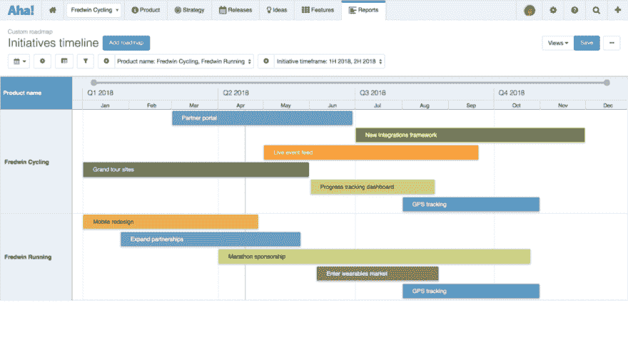](https://res.cloudinary.com/practicaldev/image/fetch/s--EN_K8pP7--/c_limit%2Cf_auto%2Cfl_progressive%2Cq_auto%2Cw_880/https://cdn-images-1.medium.com/max/1024/1%2AoKFfmrEpZBRFDN1TfSDUmA.png) 

<figcaption>功劳:[啊哈！](https://www.aha.io)</figcaption>

</figure>

<figure>[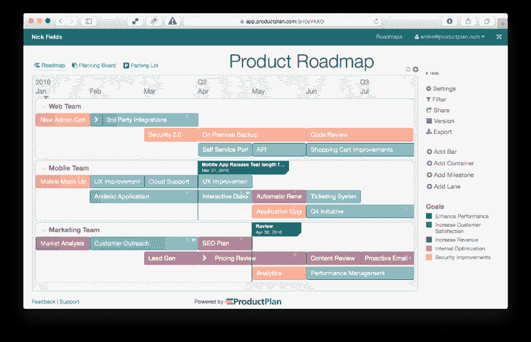](https://res.cloudinary.com/practicaldev/image/fetch/s--lfWjVOrJ--/c_limit%2Cf_auto%2Cfl_progressive%2Cq_auto%2Cw_880/https://cdn-images-1.medium.com/max/1024/1%2AMXfbO1SlT0hmoCCKIan2KQ.png) 

<figcaption>信用:[产品计划](https://www.productplan.com)</figcaption>

</figure>

<figure>[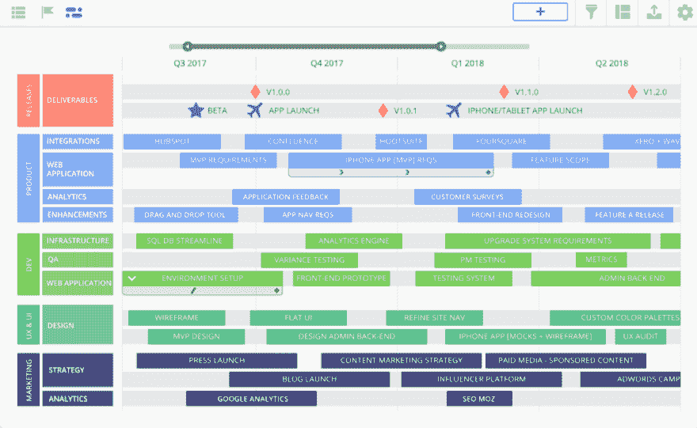](https://res.cloudinary.com/practicaldev/image/fetch/s--Ppmosu-x--/c_limit%2Cf_auto%2Cfl_progressive%2Cq_auto%2Cw_880/https://cdn-images-1.medium.com/max/1024/1%2Aj_YwDX12fUR3OgDGsOhUmA.png) 

<figcaption>功劳:[路霸](https://roadmunk.com)</figcaption>

</figure>

如果你读了我之前关于选择时间追踪软件的帖子，你可能已经注意到我更喜欢 T2 构建我的应用程序，而不是在一个软件的约束下工作。购买在某件事情上做得非常好的软件并没有错，但是你的产品可能会在开发周期中经历一些曲折，而这些曲折并不是你的软件所能处理的。

不要依赖软件公司的支持人员来帮助你调整软件，让我们看看如何在 Coda 中用 15 分钟或更少的时间从零开始建立一个产品计划或路线图。我们需要构建 3 个主要表格来使该应用程序正常工作，它们是:

1.  **People** —存储我们团队中的所有人及其角色/技能
2.  **特性** —我们将构建的所有产品特性
3.  **资源分配** —如何为我们的员工配备工作人员来完成产品功能

### 从你的团队开始

在我们进入特性、资源分配和工作之前，我们需要确定谁将负责这个产品。这可能意味着工程师、设计师和产品经理的混合。

[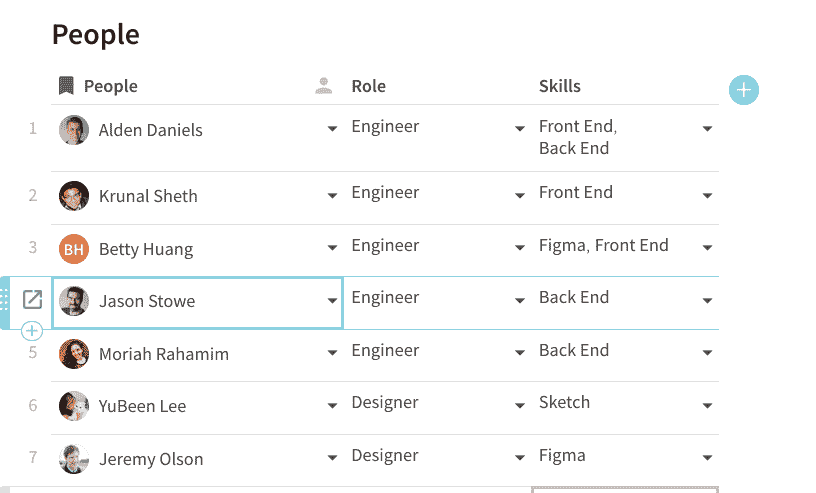](https://res.cloudinary.com/practicaldev/image/fetch/s--qDs-Buyh--/c_limit%2Cf_auto%2Cfl_progressive%2Cq_66%2Cw_880/https://cdn-images-1.medium.com/max/816/1%2AYQJuRW4GbGfyYfW_WKKk0w.gif)

在上表中，我有 3 列:人员、角色和技能。People 列是 Coda 中的 People [列类型](https://help.coda.io/organizing-your-doc/formatting-options-for-your-doc/overview-of-column-formats#types-of-column-formats),允许您选择您领域中的所有队友。包含选项工程师、设计师和产品经理的角色选择列表来自哪里？我创建了一个单独的“团队”表，其中有三个选项作为[显示列](https://help.coda.io/faq/editing-docs/what-is-the-display-column):

[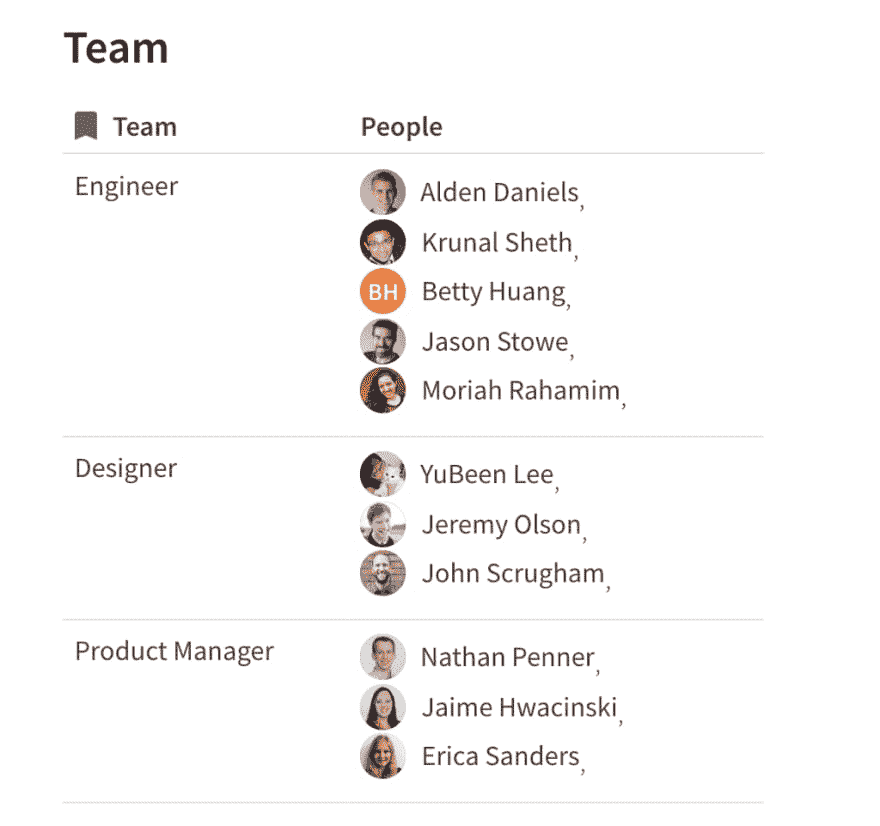](https://res.cloudinary.com/practicaldev/image/fetch/s--RdqMZ1X4--/c_limit%2Cf_auto%2Cfl_progressive%2Cq_auto%2Cw_880/https://cdn-images-1.medium.com/max/1024/1%2AZWUf_1w4UNkPea297drFNQ.png)

您会注意到“团队”表中的“人员”列包含了我的“人员”表中所有被正确分配到各自角色的团队成员。“团队”的人员栏中的公式为:

```
=Lookup(People, Role, thisRow).People 
```

Enter fullscreen mode Exit fullscreen mode

该公式查找“People”表，找到“People”表中角色与“Team”表中当前行匹配的行，并返回“People”列。这有点像在 Excel 中做 VLOOKUP，除了你可以从你的查找表中返回多个值而不是一个值。“People”表中的“skills”列允许您选择您的队友擅长的技能，该选择列表的值由一个名为“Skills”的小单列表确定:

[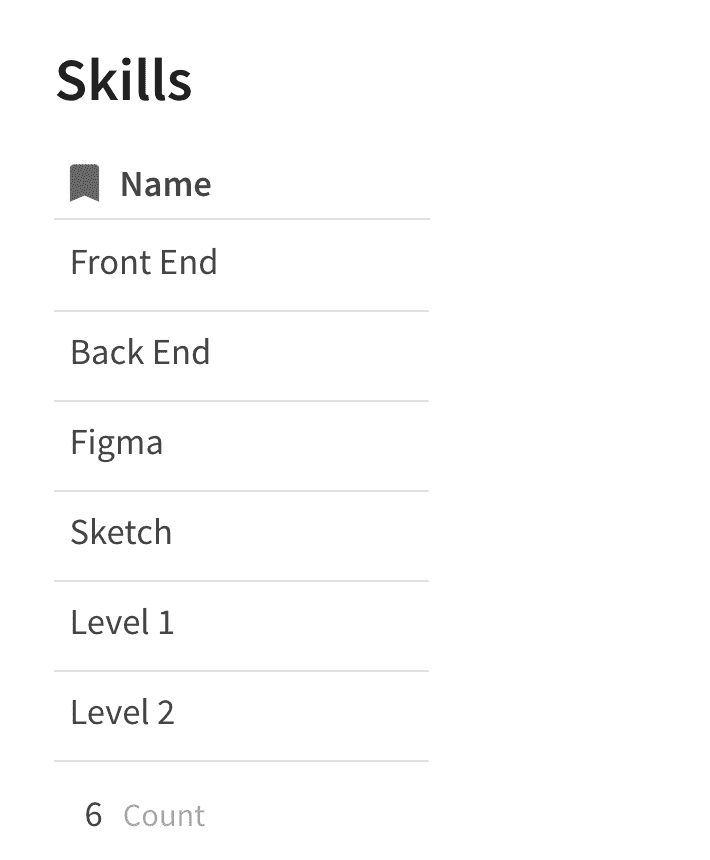](https://res.cloudinary.com/practicaldev/image/fetch/s--4uIZMYFg--/c_limit%2Cf_auto%2Cfl_progressive%2Cq_auto%2Cw_880/https://cdn-images-1.medium.com/max/710/1%2A-iFoK3iavft4K2mxJciu7Q.png)

现在我们已经有了团队的基本表格(“团队”、“人员”和“技能”)，是时候构建另外两个表格了:**特性**和**资源分配**。然后，我们将拥有创建我们自己的产品路线图应用程序所需的表格，该应用程序可根据我们的团队和产品发布进行灵活定制。

### 产品计划中的特性

这是您的团队可以存储您想要构建和发布的所有特定产品功能的主列表。我们将要添加的一些列包括:

*   特征
*   描述
*   领导(人)
*   开始日期
*   结束日期
*   工作日
*   努力
*   每天的工作量
*   代理人

您不需要在最终产品计划应用程序中包含所有这些列，但您可能会发现其中一些列很有用，这取决于您希望如何跟踪团队的资源分配。下面是我们最终的功能表:

[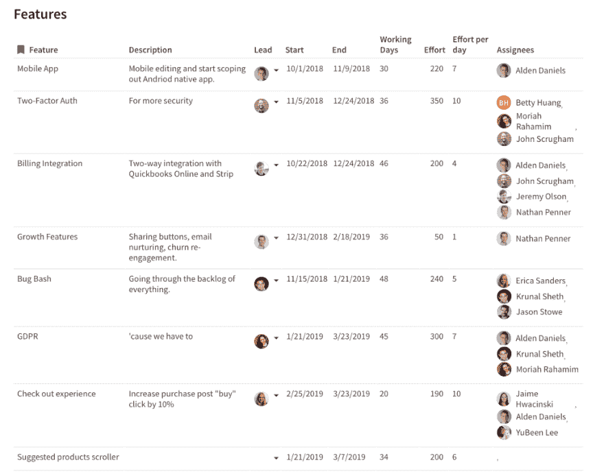](https://res.cloudinary.com/practicaldev/image/fetch/s--RU1DhJ1w--/c_limit%2Cf_auto%2Cfl_progressive%2Cq_auto%2Cw_880/https://cdn-images-1.medium.com/max/1024/1%2AWitVM9lm-OyGn2fzw5Z-RA.png)

特征和描述列采用文本格式，因此您可以在此输入自由格式的文本。在我们讨论了“资源分配”表之后，我们将再次讨论“领导”、“工作”、“每天工作”和“受托人”列。关于“功能”表，有几点需要注意:

[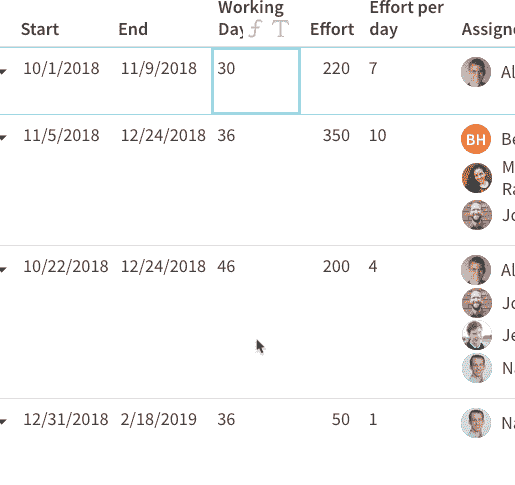](https://res.cloudinary.com/practicaldev/image/fetch/s--Y-A7mhwH--/c_limit%2Cf_auto%2Cfl_progressive%2Cq_66%2Cw_880/https://cdn-images-1.medium.com/max/515/1%2A1NkR8zSiedFJ1_nK6gGxFg.gif)

开始和结束表示功能开始和结束工作的日期。这些列采用日期格式，可打开日期选择器，让您为您的功能选择合适的日期。

工作日是一个表格公式，用于计算(您猜对了)开始日期和结束日期之间的工作日天数。使用[网络天数](https://coda.io/formulas#NetWorkingDays)公式来获得这个数字。这是我最喜欢的公式之一，因为它把周末排除在计算之外。

让我们进入最后一张表:**资源分配**。

### 故事点对比小时

在敏捷世界中，这是一个古老的争论，我们对你使用哪种方法来评估你的团队的工作没有意见。构建自己的产品规划应用程序的伟大之处在于:*你可以选择任何你想要的工作评估方法。*

我们的“资源分配”表应该做几件事:

1.  指派一名团队成员负责特定的产品功能(从我们的“功能”表中)
2.  让你能够完成工作评估(故事点、时间等)。)对一个人来说
3.  为使用该功能的人员关联功能开始日期和结束日期

可以想象，这个表与“Features”和“People”表紧密集成在一起。下面是我们最终的“资源分配”表:

[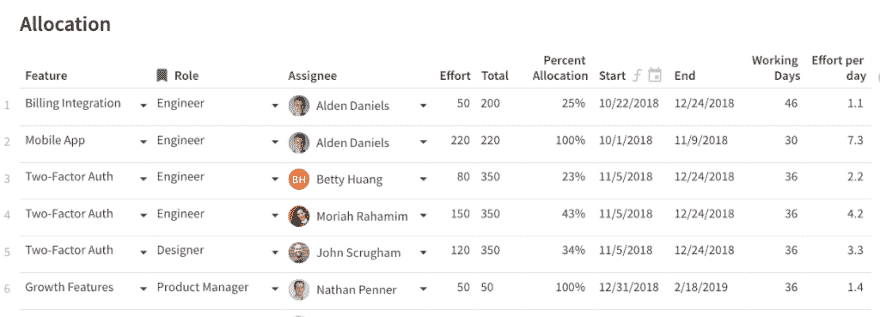](https://res.cloudinary.com/practicaldev/image/fetch/s--QN3CbRRY--/c_limit%2Cf_auto%2Cfl_progressive%2Cq_auto%2Cw_880/https://cdn-images-1.medium.com/max/1024/1%2AwYwqh3b6QGtJ_VEn4wKQgA.png)

这看起来是一个非常基本的表，但是让我们深入每一列，看看这个表如何与“Features”和“People”表联系起来。

[](https://res.cloudinary.com/practicaldev/image/fetch/s--4m7a2c78--/c_limit%2Cf_auto%2Cfl_progressive%2Cq_66%2Cw_880/https://cdn-images-1.medium.com/max/620/1%2AoQZDC0Rk8LftLxCzNHRB-w.gif)

Feature 列是从表中查找的[格式，它连接到“Features”表。一旦你创建了这个栏目，你可以在“特性”表中选择*任何*的特性。想要更多关于该特定功能的背景信息吗？只需将光标悬停在该功能上，您就会看到“功能”表中的所有其他列(如描述、开始、结束等。)](https://help.coda.io/formulas/using-lookups#how-to-use-lookup-columns)

Role 列也是一个查找，但是是对我们在创建“People”表时创建的“Team”表的查找。如果您还记得，“团队”表中也有一个“人员”列，因此我们可以通过编写公式=Role.People 来引用该列。我们在此处的“受理人”列中使用该公式:

[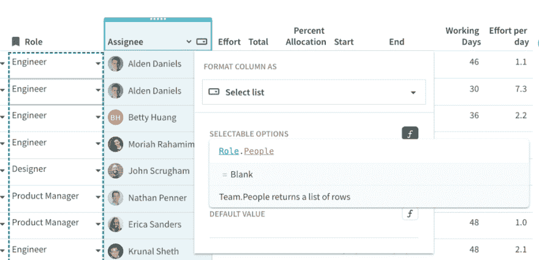](https://res.cloudinary.com/practicaldev/image/fetch/s--y_sXP2Ia--/c_limit%2Cf_auto%2Cfl_progressive%2Cq_auto%2Cw_880/https://cdn-images-1.medium.com/max/1024/1%2A22uHoNN462PVKSZgAOsrWw.png)

这意味着在“团队”表中职位为工程师的所有团队成员都将作为可选选项显示在 Assignee 下拉列表中:

[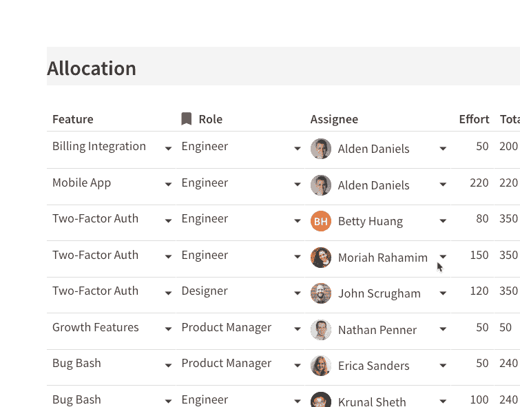](https://res.cloudinary.com/practicaldev/image/fetch/s--Q0LYAPrj--/c_limit%2Cf_auto%2Cfl_progressive%2Cq_66%2Cw_880/https://cdn-images-1.medium.com/max/755/1%2A7666u06Z2LJEo5tZwtlpYg.gif)

最后，让我们仔细看看其他一些列，如努力、开始和结束。因为我们的第一列——Feature 列——是对“Features”表的查找，所以我们也可以引用“Features”表中的其他列，如 Total Effort、Start、End 和 Working Days，只需用=Feature 开始我们的公式...

[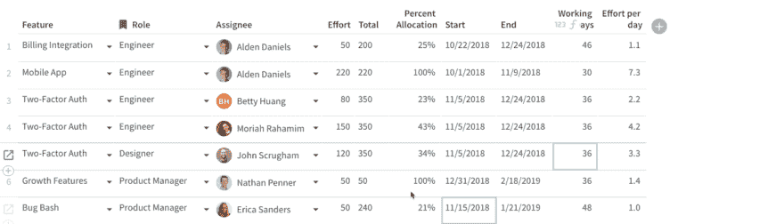](https://res.cloudinary.com/practicaldev/image/fetch/s--PuHAqbOI--/c_limit%2Cf_auto%2Cfl_progressive%2Cq_66%2Cw_880/https://cdn-images-1.medium.com/max/1024/1%2AGtmngK8bK3AtVdFOjGr8bA.gif)

如果我们现在重新访问“功能”表，查看这里的“工作”列，您会注意到它引用了“资源分配”表，以便用下面的公式来总结与功能相关的工作:

```
=[Resource Allocation].filter(Feature=thisRow).Effort.Sum() 
```

Enter fullscreen mode Exit fullscreen mode

[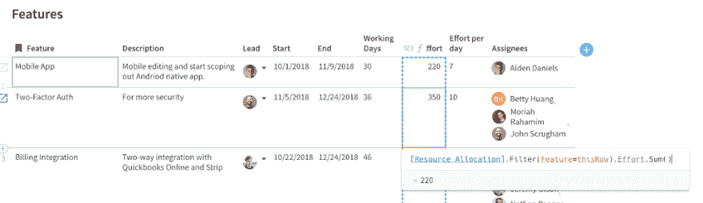](https://res.cloudinary.com/practicaldev/image/fetch/s--aXwGjhNb--/c_limit%2Cf_auto%2Cfl_progressive%2Cq_auto%2Cw_880/https://cdn-images-1.medium.com/max/1024/1%2Av_fYZoxJZZDILluRT2Mz9A.png)

特征。“资源分配”表中也使用了“努力”列(见前面的 gif)。您刚刚构建了一些非常复杂的逻辑来输入团队成员级别的工作量，但是工作量的总和也显示在两个表中。如果您必须在电子表格中获得相同的功能，您必须将 same 和 VLOOKUP 结合使用。

因此，我们已经构建了 3 个主表，让我们开始有趣的事情，即*可视化*我们的数据，以便我们可以看到哪些功能由谁来配备，哪些团队成员被过度分配，以及工作在团队中的分配情况。

### 产品功能路线图和时间表

让我们为我们的“Features”表构建一个简单的视图，它隐藏了几列，这样它只显示特性名称、描述、开始日期和结束日期。当您创建一个表的[视图时，就像创建该表的一个副本，但是您在视图中所做的所有更改也会影响到该表。](https://help.coda.io/organizing-your-doc/setup-best-practices/creating-a-view#why-views-matter)

[](https://res.cloudinary.com/practicaldev/image/fetch/s--67wUlyXD--/c_limit%2Cf_auto%2Cfl_progressive%2Cq_66%2Cw_880/https://cdn-images-1.medium.com/max/1024/1%2AGs3hAjcRygFjP6NnikWMMw.gif)

虽然“特性”表的这个视图看起来不错，但如果我们能看到这些特性如何相互叠加的瀑布图或时间线，那就更有用了。如果我们插入甘特图，Coda 会自动查看您的开始和结束日期来构建甘特图:

[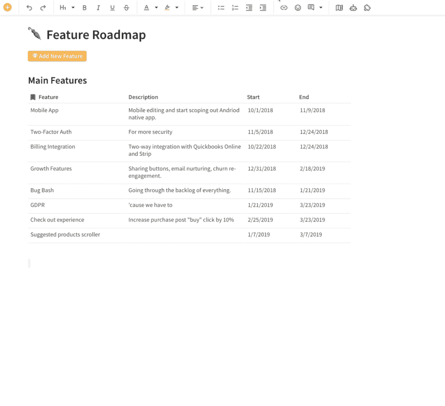](https://res.cloudinary.com/practicaldev/image/fetch/s--oFFzAr6x--/c_limit%2Cf_auto%2Cfl_progressive%2Cq_66%2Cw_880/https://cdn-images-1.medium.com/max/1024/1%2AphDDwAPOh8VofC9MwOr31w.gif)

您会注意到，当您移动甘特图中的条形图时，它也会改变“主要功能”*视图*中的日期。这是 Coda 的一个核心概念，所有的数据——不管是在表格还是图表中——都是相互关联的。

### 分配工作和估计工作量

既然您看到了我们如何从表中构建视图，那么让我们从“资源分配”表中构建一个视图。有了这个视图，我们可以通过 Feature 列进行分组，以有组织的方式快速查看团队成员在每个特性上的工作。如果我们改变我们的*视图*的“工作”列中的数字，它也会改变主“资源分配”*表*中的数字。

[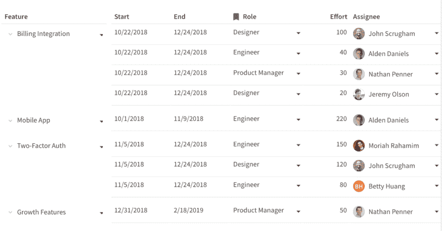](https://res.cloudinary.com/practicaldev/image/fetch/s--uhRWpiap--/c_limit%2Cf_auto%2Cfl_progressive%2Cq_66%2Cw_880/https://cdn-images-1.medium.com/max/1024/1%2AZOUgK2Wi-08kDCuiGNPcsA.gif)

### 按人资源利用率

没有什么比团队成员超负荷工作更糟糕的了，因此能够看到团队成员的利用率可以帮助您平衡负载。下面的图表是您的“资源分配”表的视图，但是*布局*是一个堆叠条形图。您可以根据团队成员的总工作量快速查看谁在超负荷工作:

[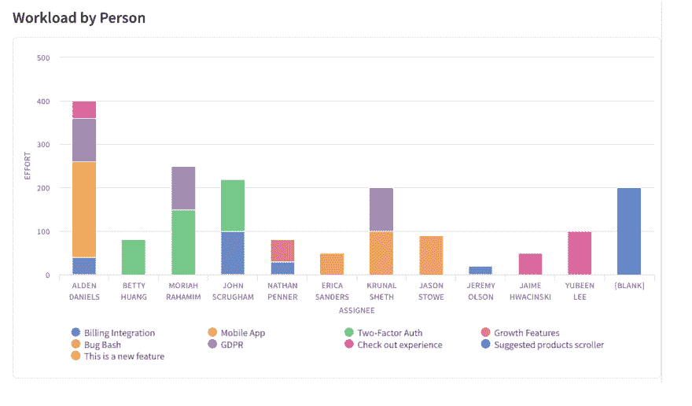](https://res.cloudinary.com/practicaldev/image/fetch/s--5-PguMk---/c_limit%2Cf_auto%2Cfl_progressive%2Cq_66%2Cw_880/https://cdn-images-1.medium.com/max/1024/1%2A4Ym0A6QhOF_GYGSAtXXsIw.gif)

也许您仍然希望以表格的形式查看您的团队是如何获得资源的，因此您可以为此创建一个视图。我最喜欢的布局之一是按人细分的甘特图，所以现在您可以看到按人划分的时间线，但您也可以深入了解该人正在处理的功能:

[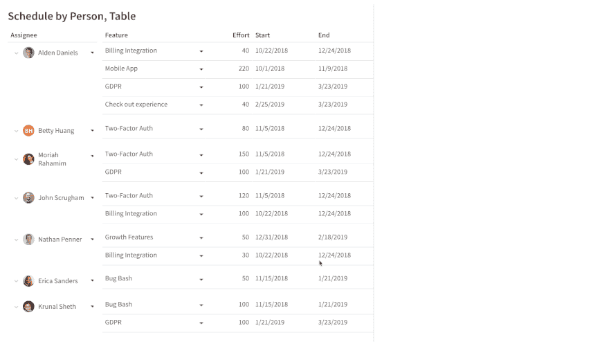](https://res.cloudinary.com/practicaldev/image/fetch/s--wd7vTHzo--/c_limit%2Cf_auto%2Cfl_progressive%2Cq_66%2Cw_880/https://cdn-images-1.medium.com/max/1024/1%2AES_rkjK2oadfly_oCjGJ9A.gif)

### 按特性划分的资源利用率

因为我们已经构建了“资源分配”主表，所以我们可以用多种方式查看数据。这类似于 Excel 中数据透视表的工作方式。在这个视图中，我们看到了按功能划分的时间表/甘特图，但是一旦我们深入下去，我们就会看到与该任务相关联的*团队成员*。这与您在之前的 gif 中看到的甘特图相反:

[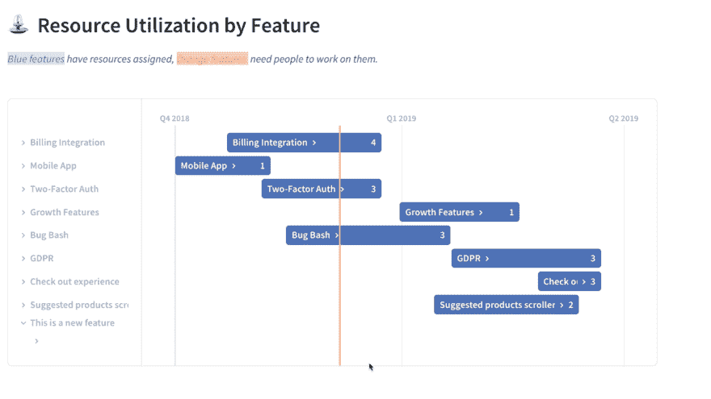](https://res.cloudinary.com/practicaldev/image/fetch/s--ONAa2lVJ--/c_limit%2Cf_auto%2Cfl_progressive%2Cq_66%2Cw_880/https://cdn-images-1.medium.com/max/1024/1%2AQM6gzh6EjaqJc1h9X4HpyQ.gif)

### 团队资源利用率

最后，我们的“资源分配”表的一个真正有用的视图是按团队对数据进行分组。由于我们已经输入了一个团队成员的所有工作，并且我们已经将团队成员映射到了各个团队，因此我们可以大致了解各个团队的总体估计工作:

[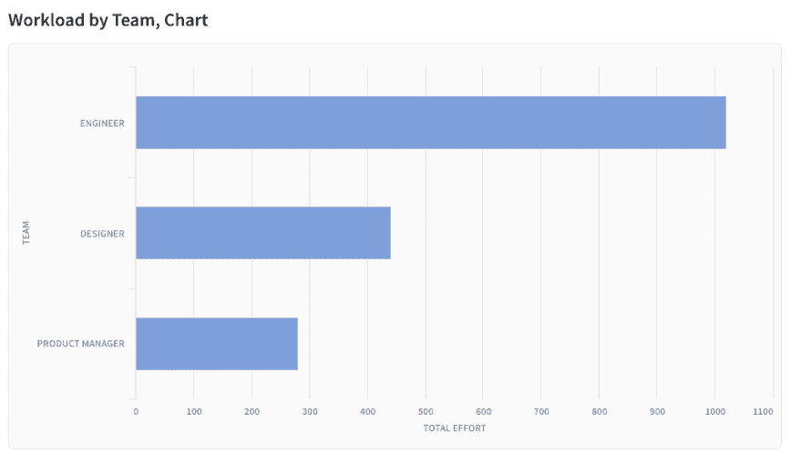](https://res.cloudinary.com/practicaldev/image/fetch/s--T1rbxJ5f--/c_limit%2Cf_auto%2Cfl_progressive%2Cq_auto%2Cw_880/https://cdn-images-1.medium.com/max/1024/1%2A8eBeIwmjI1ityDhSG3qO6A.png)

如果您还记得我们最初的“团队”表，它只有两列:团队和人员。该表中实际上隐藏了一些列，因此在下面的视图中，我们*取消隐藏*总工作量和平均工作量/人列，以查看每个团队的总时间或故事点:

[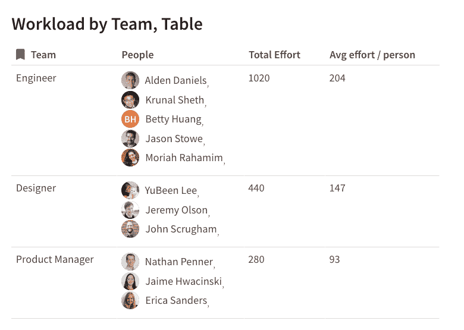](https://res.cloudinary.com/practicaldev/image/fetch/s--f6yofIx7--/c_limit%2Cf_auto%2Cfl_progressive%2Cq_auto%2Cw_880/https://cdn-images-1.medium.com/max/780/1%2AhkmNkbzSJVYgal3DNsqTMw.png)

平均工作量/人是一个公式，它将总工作量除以每个团队中的人数(由隐藏的[Num People]列表示)。现在我们可以看到，工程团队显然是为此次产品发布付出最多努力的团队。

[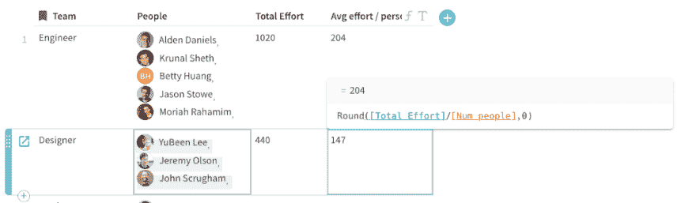](https://res.cloudinary.com/practicaldev/image/fetch/s--TG_Z7ya4--/c_limit%2Cf_auto%2Cfl_progressive%2Cq_auto%2Cw_880/https://cdn-images-1.medium.com/max/1024/1%2ATqfcuGIo6CfDm4Eh7iiT0w.png)

### 最后的想法

随着团队的成长，在 Excel 或 Google Sheets 中构建自己的产品路线图会变得复杂，并且您需要的功能需要额外的定制。另一方面，如果你买了一个专门的软件来管理产品规划或产品路线图，你就受限于该软件自己的功能集。

通过构建自己的看起来和感觉上都像真正的产品路线图软件的应用程序(不需要成为程序员)，您可以两全其美。

> 在画布上寻找自由。—鲍勃·罗斯

* * *