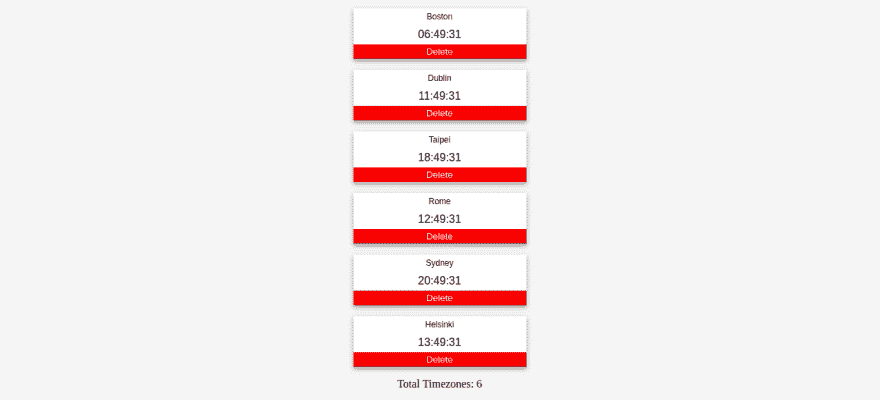

# 如何用 React 和 moment.js 构建世界时钟

> 原文：<https://dev.to/rossanodan/how-to-build-a-world-clock-with-react-and-moment-js-1d03>

GitHub 库:[https://github.com/RossanoDan/react-world-clocks](https://github.com/RossanoDan/react-world-clocks)。

[](https://res.cloudinary.com/practicaldev/image/fetch/s--8xKMUOYd--/c_limit%2Cf_auto%2Cfl_progressive%2Cq_auto%2Cw_880/https://thepracticaldev.s3.amazonaws.com/i/gzmrtoy7dl7e2w5kel3p.png)

在本地运行这个简单的项目

```
git clone https://github.com/RossanoDan/react-world-clocks.git
cd react-world-clocks
npm install
npm start 
```

Enter fullscreen mode Exit fullscreen mode

为了快速一瞥，我在 code sandbox[https://codesandbox.io/s/lh24w](https://codesandbox.io/s/lh24w)上复制了这个项目。