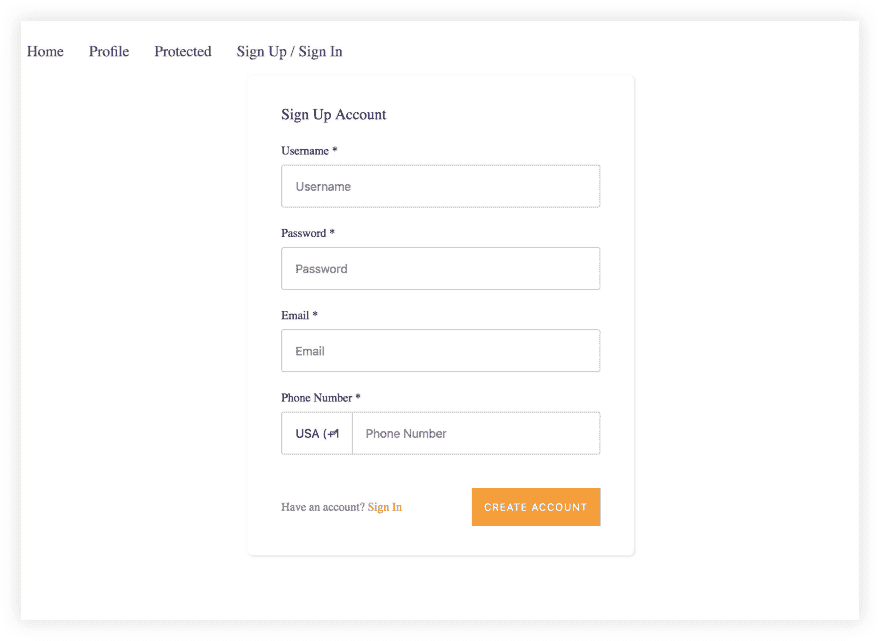
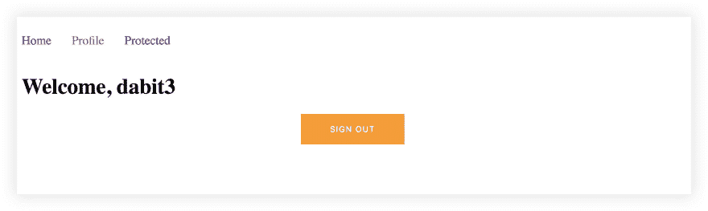
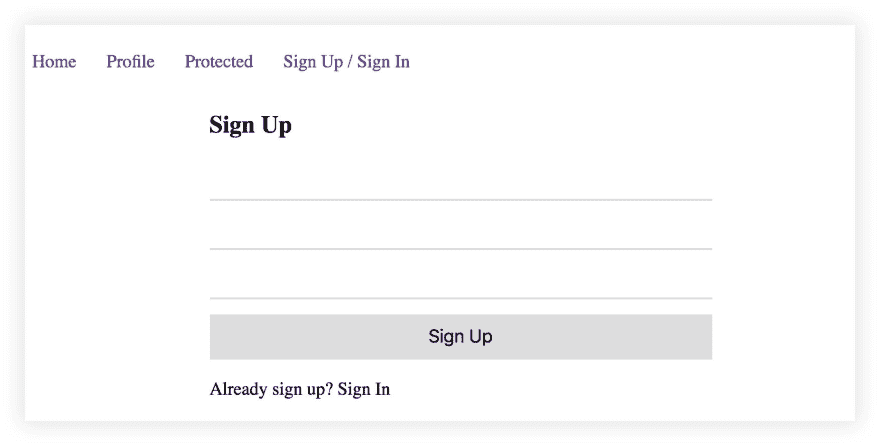

# 如何构建生产就绪的 Vue 认证

> 原文：<https://dev.to/dabit3/how-to-build-production-ready-vue-authentication-23mk>

[](https://res.cloudinary.com/practicaldev/image/fetch/s--1gXjOW5m--/c_limit%2Cf_auto%2Cfl_progressive%2Cq_auto%2Cw_880/https://thepracticaldev.s3.amazonaws.com/i/y99r9vv53zvu298c4mev.jpg)

> 要随时查看该项目的最终代码，请单击此处的。

在本教程中，您将学习如何使用 [Vue 路由器](https://router.vuejs.org/)、 [AWS Amplify](https://aws-amplify.github.io/) 、&、 [Amazon Cognito](https://aws.amazon.com/cognito/) 在您的 Vue 应用中构建一个真正的认证流程。虽然我们将使用的身份提供者是 Amazon Cognito 的 AWS，但我们应用程序的基本设计将是提供者不可知的，这意味着您应该能够使用您选择的提供者。

> 

### 认证概述

如果您曾经尝试过推出自己的身份认证服务和实现(包括前端和后端)，您应该已经意识到随之而来的痛苦。

谢天谢地，今天我们有许多了不起的身份服务&提供商为我们处理所有这一切。你可能已经熟悉了像 [Auth0](https://auth0.com/) 、 [Okta](https://www.okta.com/) 、& [Amazon Cognito](https://aws.amazon.com/cognito/) 这样的服务，它们在幕后做着艰苦的工作，所以你不必通过实现用户身份管理来完成，而这是大多数现代应用程序的必要要求。

在本教程中，你将学习如何管理从用户注册，用户登录，忘记密码，以及 MFA 的一切。您还将学习如何使用 Vue Router 实现受保护的客户端路由，这样您就可以定义哪些路由可以是公共的，哪些路由只需要为登录用户提供保护。

在本教程结束时，您将会很好地掌握构建和部署启用了企业级安全性和身份验证的 Vue 应用程序。

# 入门

### 创建 Vue 项目

我们要做的第一件事是使用 Vue CLI 搭建一个新的 Vue 应用程序。如果您尚未安装 Vue CLI，请单击此处的[按照安装说明进行操作。](https://cli.vuejs.org/guide/installation.html) 

```
~ vue create vue-auth

? Please pick a preset: default

cd vue-auth 
```

一旦项目被创建&你在目录里面，让我们使用 npm 或 yarn 安装我们需要的必要的依赖项:

```
~ yarn add vue-router aws-amplify @aws-amplify/ui-vue 
```

> 什么是`aws-amplify-vue`？AWS Amplify 具有特定于平台的组件，允许我们快速搭建&并运行重要功能，如认证流程、图像上传、&等。

#### 创建文件夹结构

现在，让我们创建将用于实现身份验证流的文件。在 **src** 目录下，创建以下文件:

```
~ touch router.js components/Auth.vue components/Home.vue components/Profile.vue components/Protected.vue 
```

# 使用放大器工作

### 安装 Amplify CLI

为了添加身份验证服务，我们将使用 AWS Amplify CLI。让我们现在就开始安装:

```
~ npm install -g @aws-amplify/cli 
```

接下来，我们需要配置 CLI。为此，运行以下命令:

```
~ amplify configure 
```

> 关于如何配置 CLI 的完整演练，请查看此视频。

现在我们已经创建了项目并安装了 CLI，我们可以创建将要使用的身份验证服务了。为此，我们将初始化一个新的 Amplify 项目&然后向它添加身份验证。

#### 初始化放大项目

要初始化一个新的 Amplify 项目，运行`init`命令:

```
~ amplify init 
```

> `init`将初始化项目&带你通过一些步骤来配置你的项目名称，&环境，其他构建设置。选择一个项目的&环境名称，&然后选择默认的剩余问题。

#### 添加认证服务

现在 Amplify 项目已经初始化，我们可以添加认证服务:

```
~ amplify add auth

? Do you want to use the default authentication and security configuration? Default configuration
? How do you want users to be able to sign in? Username
? Do you want to configure advanced settings? No

~ amplify push 
```

> 默认安全配置将为此项目提供智能默认值。如果您想要自定义配置，您可以选择`No`，或者您可以稍后运行`amplify update auth`。

在`amplify push`成功完成运行后，身份验证已成功创建&我们现在可以开始编写代码了！

你应该注意到在你的 **src** 目录&中有一个名为 **aws-exports.js** 的文件，在你的根目录中有一个名为 **amplify** 的文件夹(保存详细的项目配置&定制代码)。

# 编写代码

我们将以两种方式实现身份认证:

1.  第 1 部分——使用来自 AWS Amplify Vue 的预配置组件`amplify-authenticator`,快速启动我们的授权流&。
2.  第 2 部分——构建完全自定义的身份验证流程。

## 第 1 部分-使用预配置的`amplify-authenticator`组件

接下来，我们需要更新 **main.js** 来配置 Vue 项目，以便与我们新的 **aws-exports.js** 文件 Amplify &一起工作。我们还需要让我们的应用程序知道我们将在下一步创建的路由器。

#### src/main.js

```
// src/main.js
import Vue from 'vue'
import VueRouter from 'vue-router'
import Amplify from 'aws-amplify'
import '@aws-amplify/ui-vue'
import config from './aws-exports';

import App from './App'
import router from './router'

Amplify.configure(config)
Vue.use(VueRouter)
Vue.config.productionTip = false

new Vue({
  render: h => h(App),
  router
}).$mount('#app') 
```

接下来，我们将配置路由器。我们还将在这里放置受保护路由的自定义逻辑。

#### src/router.js

```
// src/router.js
import VueRouter from 'vue-router'
import { Auth } from 'aws-amplify'

import Home from './components/Home'
import Profile from './components/Profile'
import AuthComponent from './components/Auth'
import Protected from './components/Protected'

const routes = [
  { path: '/', component: Home },
  { path: '/auth', component: AuthComponent },
  { path: '/protected', component: Protected, meta: { requiresAuth: true} },
  { path: '/profile', component: Profile, meta: { requiresAuth: true} }
]

const router = new VueRouter({
  routes
})

router.beforeResolve((to, from, next) => {
  if (to.matched.some(record => record.meta.requiresAuth)) {
    Auth.currentAuthenticatedUser().then(() => {
      next()
    }).catch(() => {
      next({
        path: '/auth'
      });
    });
  }
  next()
})

export default router 
```

##### src/router . js 详情

1.  我们导入视图(v)
2.  我们进口将在我们的路线中使用的组件
3.  我们定义了一系列路线。我们添加了一个额外的元属性，通过使用一个名为`requiresAuth`的布尔值来指定需要认证的路由。
4.  我们创建路由器变量
5.  我们使用 Vue Router 的 [beforeResolve](https://router.vuejs.org/guide/advanced/navigation-guards.html#in-component-guards) guard 来检查用户是否通过了身份验证，它将在导航被确认之前被调用。如果他们通过认证，我们允许他们进入下一条路线。如果不是，我们会将他们重定向到注册页面( **/auth** )。

接下来，让我们创建身份验证组件。

#### src/components/Auth.vue

```
// src/components/Auth.vue
<template>
  <div class="auth">
    <amplify-authenticator></amplify-authenticator>
  </div>
</template>

<script>

export default {
  name: 'auth'
}
</script>

<style>
.auth {
  margin: 0 auto;
  width: 460px;
}
</style> 
```

#### src/components/auth . vue 的详情

这是一个非常基本的组件，在引擎盖下做了相当多的工作！`amplify-authenticator` Vue 组件实际上将为我们搭建整个认证流程(注册、登录、&忘记密码)。

现在我们将更新 **App** 组件。这个组件将做几件事情:

1.  显示导航链接
2.  渲染路由器
3.  持有大多数用于监听用户登录/注销的身份验证逻辑。

#### src/app . view

```
// src/App.vue
<template>
  <div id='app'>
    <div  class='nav'>
      <router-link tag="p" to="/">
        <a>Home</a>
      </router-link>
      <router-link tag="p" to="/profile">
        <a>Profile</a>
      </router-link>
      <router-link tag="p" to="/protected">
        <a>Protected</a>
      </router-link>
      <router-link tag="p" to="/auth" v-if="!signedIn">
        <a>Sign Up / Sign In</a>
      </router-link>
    </div>
    <router-view></router-view>
    <div class='sign-out'>
      <amplify-sign-out v-if="signedIn"></amplify-sign-out>
    </div>
  </div>
</template>

<script>
import { Auth, Hub } from 'aws-amplify'

export default {
  name: 'app',
  data() {
    return {
      signedIn: false
    }
  },
  beforeCreate() {
    Hub.listen('auth', data => {
      console.log('data:', data)
      const { payload } = data
      if (payload.event === 'signIn') {
        this.signedIn = true
        this.$router.push('/profile')
      }
      if (payload.event === 'signOut') {
        this.$router.push('/auth')
        this.signedIn = false
      }
    })
    Auth.currentAuthenticatedUser()
      .then(() => {
        this.signedIn = true
      })
      .catch(() => this.signedIn = false)
  }
}
</script>

<style>
.nav {
  display: flex;
}
.nav p {
  padding: 0px 30px 0px 0px;
  font-size: 18px;
  color: #000;
}
.nav p:hover {
  opacity: .7;
}
.nav p a {
  text-decoration: none;
}
.sign-out {
  width: 160px;
  margin: 0 auto;
}
</style> 
```

#### src/components/app . vue 详情

1.  如果用户已经登录，我们使用`amplify-sign-out`组件来呈现一个注销按钮。
2.  我们创建一个名为`signedIn` &的布尔值，在应用程序加载时将其设置为 false
3.  在`beforeCreate`生命周期方法中，我们通过使用`Hub` API 监听`authState`事件。如果我们检测到登录，我们会重定向他们查看他们的个人资料&设置`signedIn`为真。如果我们检测到一个标志，我们将他们重定向到`/auth`路线&设置`signedIn`为假。
4.  当应用程序加载时，我们也调用`Auth.currentAuthenticatedUser`来检查用户是否在&中登录，适当地设置`signedIn`变量。

接下来，让我们添加**概要文件**组件。

这个基本组件将显示用户的**用户名**，我们将使用 Amplify 检索该用户名。

#### src/components/profile . vue

```
// src/components/Profile.vue
<template>
  <h1>Welcome, {{user.username}}</h1>
</template>

<script>
import { Auth } from 'aws-amplify'

export default {
  name: 'Profile',
  data() {
    return {
      user: {}
    }
  },
  beforeCreate() {
    Auth.currentAuthenticatedUser()
      .then(user => {
        this.user = user
      })
      .catch(() => console.log('not signed in...'))
  }
}
</script> 
```

#### src/components/profile . vue 的详情

关于这个组件要注意的主要事情是，我们通过调用`Auth.currentAuthenticatedUser`方法来检索关于用户的信息。这个方法将返回一个包含关于登录用户的元数据的`user`对象，如果用户没有登录，这个方法将出错。

现在我们可以创建最后两个基本组件。

#### src/components/Home.vue

```
// src/components/Home.vue
<template>
  <h1>Home</h1>
</template>

<script>
export default {
  name: 'home',
}
</script> 
```

#### src/components/protected . vue

```
// src/components/Protected.vue
<template>
  <h1>Hello from protected route!</h1>
</template>

<script>

export default {
  name: 'protected',
}
</script> 
```

## 试探一下

我们的应用程序的第 1 部分已经完成，现在让我们来测试一下:

```
~ npm run serve 
```

当应用程序加载时，我们应该只能看到**家**的路线。如果我们尝试导航到受保护的路由之一，我们应该被重定向到身份验证屏幕。

[](https://res.cloudinary.com/practicaldev/image/fetch/s--GNsTjoNC--/c_limit%2Cf_auto%2Cfl_progressive%2Cq_auto%2Cw_880/https://thepracticaldev.s3.amazonaws.com/i/u5jwiokisa2hh811wnb1.jpg)

登录后，我们应该能够查看受保护的页面。

[](https://res.cloudinary.com/practicaldev/image/fetch/s--HLWaprEL--/c_limit%2Cf_auto%2Cfl_progressive%2Cq_auto%2Cw_880/https://thepracticaldev.s3.amazonaws.com/i/m9vdqggm4plbyzaesicm.jpg)

您会注意到用户被持久化了。这是由 Amplify 客户端库为您处理的。为了注销，您必须明确地单击我们呈现的注销按钮，或者使用 Auth 类别中的`Auth.signOut`方法。

现在我们已经启动并运行了，下一步是什么？嗯，`amplify-authenticator`组件可以在一定程度上进行定制，以控制呈现的字段和样式(要了解如何操作，请查看文档[这里是](https://aws-amplify.github.io/docs/js/vue#authenticator))但是如果我们想要一个完全定制的认证流程呢？我们现在就开始吧。

# 第 2 部分-构建自定义认证流程。

现在，我们已经让身份验证工作，让我们更新我们必须能够定制。现在，我们所有的授权功能都存储在 **Auth.vue** 中。在这个文件中，我们使用`amplify-authenticator`组件来搭建我们的整个认证流程。让我们更新我们的应用程序，以实现自定义身份验证。

我们需要做的第一件事是在我们的**组件**目录中创建两个新文件，一个用于在&中注册用户，另一个用于注册新用户。

```
touch src/components/SignIn.vue src/components/SignUp.vue 
```

接下来，让我们更新 **Auth.vue** 以使用新文件&添加一些新功能。在这个文件中，我们将根据一些组件状态呈现**注册** & **登录**组件。我们还将呈现一个链接，允许我们在注册&登录状态之间切换:

#### src/components/Auth.vue

```
// src/components/Auth.vue
<template>
  <div class="auth">
    <sign-up :toggle='toggle' v-if="formState === 'signUp'"></sign-up>
    <sign-in v-if="formState === 'signIn'"></sign-in>
    <p v-on:click="toggle" class="toggle">{{ formState === 'signUp' ?
      'Already sign up? Sign In' : 'Need an account? Sign Up'
      }}</p>
  </div>
</template>

<script>
import SignUp from './SignUp'
import SignIn from './SignIn'

export default {
  name: 'app',
  data() {
    return {
      formState: 'signUp'
    }
  },
  methods: {
    toggle() {
      this.formState === 'signUp' ? this.formState = 'signIn' : this.formState = 'signUp'
    }
  },
  components: {
    SignUp,
    SignIn
  }
}
</script>

<style>
.auth {
  margin: 0 auto;
  width: 460px;
}
.toggle {
  cursor: pointer;
  font-size: 18px;
}
</style> 
```

#### src/components/auth . vue 的详情

这里要考虑的主要事情是，我们正在导入两个新组件&基于`formState`布尔值来呈现它们中的任何一个。还没什么太有趣的。

接下来，让我们创建注册表单。

#### src/components/sign up . vue

```
// src/components/SignUp.vue
<template>
  <div>
    <h2>{{ formState === 'signUp' ? 'Sign Up' : 'Confirm Sign Up' }}</h2>
    <div class='formcontainer' v-if="formState === 'signUp'">
      <input placeholder="username" v-model='form.username' class='input' />
      <input placeholder="password" type='password' v-model='form.password' class='input' />
      <input placeholder="email" v-model='form.email' class='input' />
      <button v-on:click='signUp' class='button'>Sign Up</button>
    </div>
    <div class='formcontainer' v-if="formState === 'confirmSignUp'">
      <input placeholder="confirmation code" v-model='form.authCode' class='input' />
      <button v-on:click='confirmSignUp' class='button'>Confirm Sign Up</button>
    </div>
  </div>
</template>

<script>
import { Auth } from 'aws-amplify'

export default {
  name: 'home',
  props: ['toggle'],
  data() {
    return {
      formState: 'signUp',
      form: {
        username: '',
        password: '',
        email: ''
      }
    }
  },
  methods: {
    async signUp() {
      const { username, password, email } = this.form
      await Auth.signUp({
        username, password, attributes: { email }
      })
      this.formState = 'confirmSignUp'
    },
    async confirmSignUp() {
      const { username, authCode } = this.form
      await Auth.confirmSignUp(username, authCode)
      alert('successfully signed up! Sign in to view the app.')
      this.toggle()
    }
  }
}
</script>

<style>
.formcontainer {
  display: flex;
  flex-direction: column;
  width: 500px;
  margin: 0 auto;
}
.input {
  margin-bottom: 7px;
  height: 38px;
  border: none;
  outline: none;
  border-bottom: 2px solid #ddd;
  font-size: 20px;
}
.button {
  height: 45px;
  border: none;
  outline: none;
  background-color: #dddddd;
  margin-top: 8px;
  cursor: pointer;
  font-size: 18px;
}
.button:hover {
  opacity: .7
}
</style> 
```

#### src/components/sign up . vue 详情

1.  我们有两个单独的表格-一个用于注册，一个用于确认注册(MFA 确认)
2.  我们有一个`formState`布尔值，我们将使用它在两种形式之间切换。
3.  我们在数据对象上有一个表单属性，当新用户注册时，它将保持`username`、`password`、&、`email`。
4.  `signUp`方法调用 Amplify `Auth.signUp`方法，传递表单属性。
5.  `confirmSignUp`方法调用 Amplify `Auth.confirmSignUp`方法，传入`username` & `authCode`。一旦用户成功注册，我们切换视图显示**注册**组件。

最后，让我们看看**登录**组件。这个组件与**注册**非常相似，因为它有一个调用 Amplify `Auth`类方法的表单&。

#### src/components/sign in . vue

```
// src/components/SignIn.vue
<template>
  <div>
    <h2>Sign In</h2>
    <div class='formcontainer'>
      <input placeholder="username" v-model='form.username' class='input' />
      <input placeholder="password" type='password' v-model='form.password' class='input' />
      <button v-on:click='signIn' class='button'>Sign In</button>
    </div>
  </div>
</template>

<script>
import { Auth } from 'aws-amplify'
export default {
  name: 'home',
  data() {
    return {
      form: {
        username: '',
        password: ''
      }
    }
  },
  methods: {
    async signIn() {
      const { username, password } = this.form
      await Auth.signIn(username, password)
    }
  }
}
</script> 
```

#### src/组件/登录. vue 的详细信息

1.  我们有一个允许用户登录的表单
2.  我们在调用 Amplify `Auth.signIn`方法时给用户签名。
3.  在 **App.vue** 中，我们正在监听`signIn`事件，用户成功签到后会被路由到 **Profile** 路由。

## 试探一下

我们的应用程序的第 2 部分已经完成，让我们来试试吧！

```
~ npm run serve 
```

[](https://res.cloudinary.com/practicaldev/image/fetch/s--mUpUMVC9--/c_limit%2Cf_auto%2Cfl_progressive%2Cq_auto%2Cw_880/https://thepracticaldev.s3.amazonaws.com/i/tt2ltwhac7c8ed1snyjc.jpg)

现在，您应该看到您的应用加载了我们创建的新注册/登录表单。

## 下一步

[Amplify Auth class](https://aws-amplify.github.io/amplify-js/api/classes/authclass.html) 上面有超过 30 种不同的方法，包括像`forgotPassword`、`setPreferredMFA`、&、`signOut`这样的东西。使用这些方法，您可以继续定制您的身份验证流程，使其更加健壮。

为了避免这篇已经很长的博文变得过于冗长，我们使用了最小化的样式，但是因为你可以完全控制认证流程，所以你可以随心所欲地设计它。

Amplify authentication 还支持来自脸书、Twitter、谷歌和亚马逊等提供商的联合登录。要了解更多信息，请点击此处查看文档。

# 结论

要查看最终的回购和源代码，请点击[此处](https://github.com/dabit3/production-ready-vue-authentication)。

要了解更多关于 Amplify 的信息，请点击这里查看文档。

还可以查看[AWS Amplify Repo](https://github.com/dabit3/awesome-aws-amplify)获得更多教程& starter 项目。

> 我的名字是纳德·达比特。我是 Amazon Web Services 的开发人员，负责 AWS AppSync 和 AWS Amplify 等项目。我还专门从事跨平台应用程序开发。