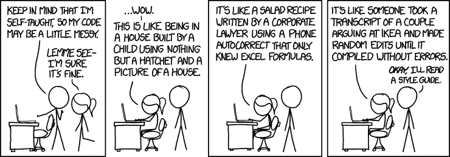
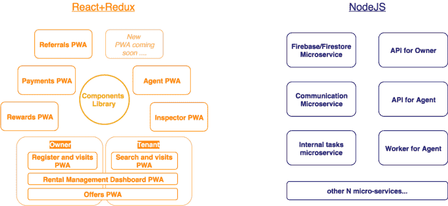
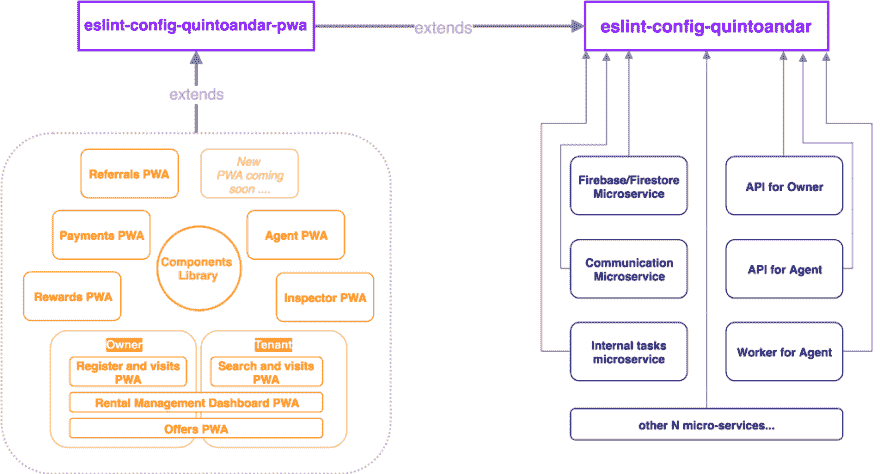

# 如何在 JavaScript 代码库中构建可伸缩的代码风格

> 原文：<https://dev.to/pamepeixinho/how-to-build-scalable-code-style-in-a-javascript-codebase-4iml>

> 从混乱的代码库到全公司一致质量的新时代

<figure> 

<figcaption>“我不会写乱七八糟的代码。”([参考](https://www.thecuriousdev.org/code-style/) )</figcaption>

</figure>

你曾经需要在混乱的代码库中进行开发吗？你有没有因为标准的不同而转换过项目而感到失落？

每个人可能都经历过这样的场景。我们也是，但是我们已经找到了提高整个公司代码风格一致性的方法。

这些是导致我们不得不应对的不一致代码库的主要挑战:

*   许多开发人员在一个独特的项目中
*   许多项目中的许多开发者
*   具体的公司需求(如要遵循的定制规则)

*首先，让我从一个故事开始……*

2017 年 9 月，我们发布了第一款[quinto andar](http://www.quintoandar.com.br)PWA(Progressive Web App)。这意味着我们基本上重写了以前存在的整个前端应用程序。

我是那个团队的一员，这是一次奇妙的经历！总有一天我会在另一个帖子里告诉你)

发布一年后，我们现在有大约 10 个 pwa。它们都使用相同的堆栈:React + Redux，并在项目之间重用代码。

我们已经看到，如果事情没有得到控制，我们的遗留网站会变得多么糟糕，我们绝对不希望我们闪亮的新项目走上同样的道路。

众所周知，JavaScript 是一种令人惊叹的编程语言，在世界各地有成千上万的库和不同的项目。但是，JS 世界并不是真的完美！但如果要我总结争论的要点:

> “javascript 最好和最差的地方是缺乏约束，让我们可以做任何我们想做的事情”

我们在 JS 上有这么多的“自由”，这很神奇，因为我们可以创造很多东西。然而，这也很危险！想象一下，许多开发人员能够在没有任何标准/一致性的情况下，在单个项目中为所欲为。

这可能会变得一团糟，因为这是我们以前的项目。杂乱的代码难以阅读、测试和维护。这使得项目更加“漏洞百出”,新开发人员也更难参与进来。

作为一名开发人员，**我不希望给予那种“自由”**，因为我们会有一点**太多的创造性**！

<figure> 

<figcaption>仅为说明目的</figcaption>

</figure>

**所以...我们如何避免在新项目中犯旧项目的同样错误？我们如何防止混乱的代码？**

我们给自己的“自由”设定了界限！我们对项目进行了约束，以使代码清晰一致。它帮助开发人员在针对问题的**解决方案**中**有创造力****而不是针对**代码风格**的**。

我们是如何设定界限的？

首先，我们在每个拉请求中至少强制一个代码审查者！不幸的是，这不是自动化的，因为它依赖于人，所以它不能扩展，一些错误和不一致将会过去！

对于自动化的任务，我们使用**代码棉条**来检查代码风格和最佳实践。这样，我们可以确保**一个项目中的所有 JS 文件**都将**一致**。

这提高了代码的可读性和可维护性。这也有助于发现语法错误并减少错误。使这个过程成为 CI 的一部分是确保在整个开发周期中保持标准的关键。

几乎任何编程语言都有代码 linters，在 JS 中，最流行的是 [Eslint](https://eslint.org/) *。

**如果你想知道它在内部是如何工作的，你可以在这里看到***，还有很多关于 eslint 的文章，你可以在这里看到*[_ T8】([【https://github.com/dustinspecker/awesome-eslint](https://github.com/dustinspecker/awesome-eslint))*。_**

 *现在你可能会想:

> 好了，林特..大家都知道..我为什么要看这篇文章？

我们不得不将这个解决方案扩展到几个项目和存储库，这可能会成为一个越来越大的难题。随着公司的成长，JS 中的项目数量也在增加，包括 NodeJS 中的后端。

**那么，如何为整个代码库保持相同的代码风格和代码质量呢？**

正如我之前所说，我们有 10 个 pwa 和一个 T2 内部组件库。最重要的是，我们在 NodeJS 中有几个微服务。正如我们在下图中看到的:

因此，我们真正理解试图在整个代码库中保持相同的代码风格和代码质量的痛苦。

尽管如此，你可能会认为这不是一个巨大的痛苦，因为我们可以在我们所有的项目**中**复制和粘贴**eslint 配置和规则。**

这是一个解决方案，但很明显，**这不是最好的方案！**

每一个新的配置或者新的规则，你都应该重复所有的项目。

这里真正的危险是，你可能会忘记在其中一个中应用一些更改，当你看到它时，我们不再遵循相同的代码风格= >不一致的代码库😑

对于这一点，最好的解决方法是使用 Eslint 的一个很酷的功能，叫做**可共享配置**。

### 可共享配置

项目的所有 eslint 配置都在一个名为. eslintrc 的文件中，这个文件是项目的重要组成部分，有时您可能希望与其他项目或人员共享它。

#### 怎么才能分享呢？

可共享配置允许您在 [npm 上发布您的配置设置。允许其他人下载并在他们的 ESLint 项目中使用它。](https://www.npmjs.com/)

您需要做的就是将它作为 dev-dependency 添加到您的项目中，并在 eslint 资源文件中扩展它。

正如我们在这里看到的，npm 中现在有许多可共享的配置。用的最多的一个是 Airbnb 的。这也是我们在 QuintoAndar 使用的，但是我们觉得有必要添加我们自己的设置。

因此，我们创建了可共享的配置包[*eslint-config-quinto andar*](https://github.com/quintoandar/eslint-config-quintoandar)。但是正如你所知道的，我们有专门的 PWA(前端)和一些微服务(后端)。这就是为什么我们创造了:

*   [**eslint-config-quinto andar-base**](https://www.npmjs.com/package/eslint-config-quintoandar-base)是 JS 中所有东西通用的 npm 包，使用 NodeJS ( [见 GitHub](https://github.com/quintoandar/eslint-config-quintoandar/tree/master/eslint-config-quintoandar-base) )。
*   [**eslint-config-quinto andar-pwa**](https://www.npmjs.com/package/eslint-config-quintoandar-pwa)是另一个 npm 包，它具有对应用程序做出反应的特定配置。它**扩展了**quinto andar 基础包(*eslint-config-quinto andar-base)*并添加了特定的东西([参见 GitHub](https://github.com/quintoandar/eslint-config-quintoandar/tree/master/eslint-config-quintoandar-pwa) )。

请随意使用我们的软件包，我们也欢迎投稿。一切都有记录。如果您想创建自己的，也可以使用作为参考。

在 QuintoAndar，我们仍在研究这些包和它们的用法。但是**结果是可见的**，有了这个工具，你可以保持同样的代码质量和应用程序质量，因为我们可以使用规则来帮助发现错误和提高性能。

例如，一个简单的规则可以帮助我们避免不必要的性能损失，强制不要在 React 组件的渲染中使用箭头函数或绑定，就像这样(第 8 行):*