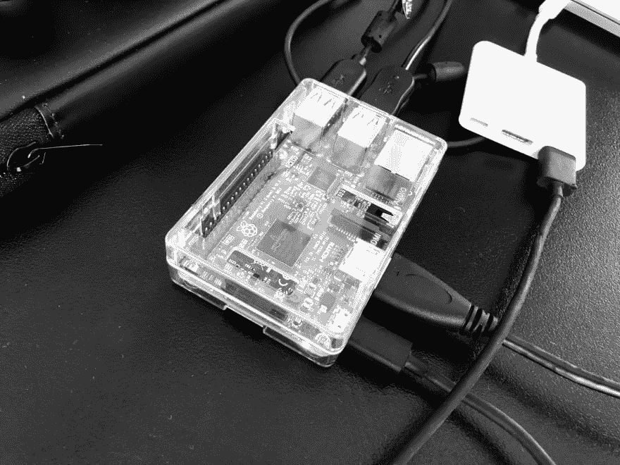
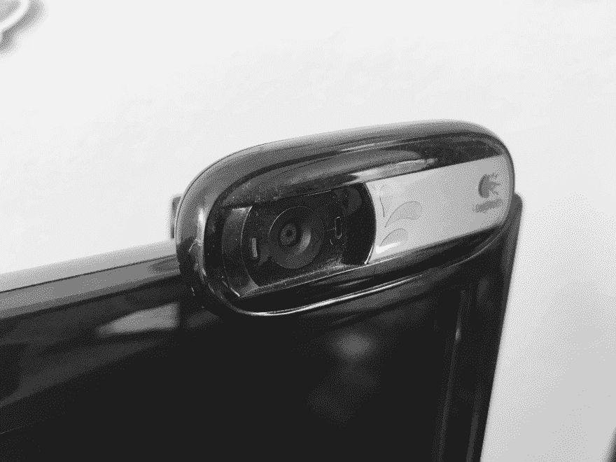
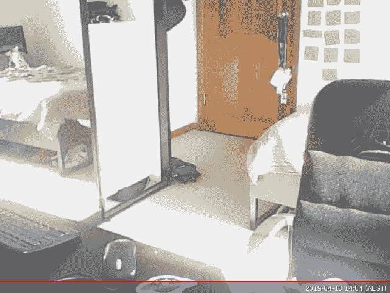

# 如何在不到一个小时的时间内用树莓派构建自己的原始监控系统🔥

> 原文：<https://dev.to/nickitax/how-to-build-your-own-primitive-surveillance-system-with-raspberry-pi-in-less-than-one-hour-5ggl>

最近，我从分类广告网站上花了大约 30 澳元买了一个树莓 Pi 3 B+。

[](https://res.cloudinary.com/practicaldev/image/fetch/s--ORaYSQ2u--/c_limit%2Cf_auto%2Cfl_progressive%2Cq_auto%2Cw_880/https://thepracticaldev.s3.amazonaws.com/i/w6s1dyy2mddf0taqdtl4.jpg)

并且马上决定做一些小项目来熟悉一个系统。第一个想法是利用我的旧 Logitech C170 相机，它在我的衣柜里积了很多年的灰尘。

[](https://res.cloudinary.com/practicaldev/image/fetch/s--aQeXTWKH--/c_limit%2Cf_auto%2Cfl_progressive%2Cq_auto%2Cw_880/https://thepracticaldev.s3.amazonaws.com/i/79zqn6kcm7rmlsxd30vt.jpg)

监视系统项目就是这么想出来的！

在本教程中，我将解释如何建立一个非常简单和原始的系统来拍摄你的房间并下载它们。

对于本教程，我们将只需要两个组件:树莓派和网络摄像头。

我的 Raspberry Pi 运行的是 Ubuntu Mate，但你可以根据自己的喜好安装任何其他发行版。

你可以在这里下载 Ubuntu Mate

一旦 Pi 连接并运行，让我们将摄像机连接到其中一个 USB 端口。

您可以通过运行`lsusb`命令来检查插入的设备，这将输出所有连接的设备:

```
Bus 001 Device 006: ID 046d:082b Logitech, Inc. Webcam C170
Bus 001 Device 005: ID 045e:00cb Microsoft Corp. Basic Optical Mouse v2.0
Bus 001 Device 004: ID 045e:07f8 Microsoft Corp. Wired Keyboard 600 (model 1576)
Bus 001 Device 003: ID 0424:ec00 Standard Microsystems Corp. SMSC9512/9514 Fast Ethernet Adapter
Bus 001 Device 002: ID 0424:9514 Standard Microsystems Corp. SMC9514 Hub
Bus 001 Device 001: ID 1d6b:0002 Linux Foundation 2.0 root hub 
```

在 Linux 环境中，可以从系统上的/dev 空间检查连接的摄像机硬件。

为了确保我们的摄像机已连接，运行`ls -lts /dev/ | grep video`命令:

```
0 crw-rw----  1 root video   238,   0 Apr 13 12:30 media0
0 crw-rw----+ 1 root video    81,   0 Apr 13 12:30 video0
0 crw-rw----  1 root video   240,   0 Jan 29  2018 vchiq
0 crw-rw----  1 root video   241,   0 Jan 29  2018 vcsm
0 crw-rw----  1 root video    29,   0 Jan 29  2018 fb0
0 crw-rw----  1 root video   245,   0 Jan 29  2018 vcio 
```

厉害了，`video0`还有！

耶！

现在我们需要找到一种方法，如何从我们的网络摄像头捕捉一张照片！

在本教程中，为了简单起见，我们不打算编写任何自定义的 Go 解决方案，而只是使用已经存在的工具`fswebcam`。

我们可以用`apt-get`(别忘了提前更新包):

`sudo apt-get install fswebcam`

现在，是时候拍第一张照片了！

```
fswebcam -r 640x480 --jpeg 100 -D 3 -S 13 /home/user/Desktop/picture.jpg -d /dev/video0 
```

上面的命令将捕捉 JPEG 格式的 VGA 分辨率图片，延迟 3 秒钟进行处理。

让我们看看我们有什么:

[](https://res.cloudinary.com/practicaldev/image/fetch/s--YfZNgdWS--/c_limit%2Cf_auto%2Cfl_progressive%2Cq_auto%2Cw_880/https://thepracticaldev.s3.amazonaws.com/i/8kcbl919gxql4eum4475.jpg)

...我确实需要打扫一下我的房间...但是无论如何...

我们拿到了。恭喜你！！！

但是我们如何远程实现呢？

当然，我们可以编写一个 API 来调用这个命令，并用 NGROK 或类似的工具公开它，但是让我们做一些更简单的事情。

在我家里，我可以访问路由器、WAN 地址和 NAT 配置。

WAN 地址代表一个广域网 IP 地址，可以从您的家庭本地网络之外到达。

网络地址转换(或 NAT)允许我们将传入的连接转换到特定的本地 IP 地址(在我们的例子中是 Raspberry Pi)。

第一步是为 Raspberry Pi 创建本地 IP 地址的永久租约。我们这样做是为了确保本地 IP 地址对于我们的 Pi 总是相同的。这种绑定是针对 MAC 地址的。

第二步是进行 NAT 转发。为了简单起见，我们可以使用端口 22 绑定来为我们的 Raspberry 启用安全外壳。

让我们检查一下它是否工作:

```
ssh user@raspberry_pi 
```

确实如此。但是它要求输入密码...

现在我们可以在世界任何地方对我们的树莓 Pi 进行 SSH 了。干得好！

为了确保我们不必为了连接而不断登录，生成公钥/私钥是一个很好的做法。

在连接到 Raspberry Pi 的主机上，生成一个公钥/私钥对:

```
ssh-keygen -t rsa -b 4096 -C “your@email.to" 
```

现在，您可以使用
将创建的密钥复制到您的 Raspberry Pi

```
ssh-copy-id user@raspberry_pi //of your raspberry pi 
```

瞧啊。现在我们可以通过一个密钥的帮助 SSH 到我们的 Pi，而不需要密码！太棒了。

最后，让我们尝试编写一个小脚本，它将 SSH 到我们的 Raspberry Pi，调用 capture image 命令并将其下载到主机。

```
echo “Executing picture capture on Raspberry Pi..."
ssh -t user@raspberry_pi 'bash fswebcam -r 640x480 --jpeg 100 -D 3 -S 13 /home/user/Desktop/picture.jpg -d /dev/video0'
echo "Copying picture from Raspberry Pi to host desktop..."
scp user@raspberry_pi:/home/user/Desktop/picture.jpg ~/Desktop/ 
```

创建`take_picture.sh`，把上面的内容放进去，执行一个脚本！

现在我们有了我们的远程图片:)

[](https://i.giphy.com/media/YTbZzCkRQCEJa/giphy.gif)

如果您有任何问题或建议，请随时提问！