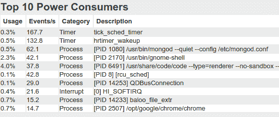

# 如何在 Linux 上检查哪个应用程序正在耗尽你的电池

> 原文：<https://dev.to/thamaraiselvam/how-to-check-which-application-is-draining-your-battery-on-linux-cbo>

[Powertop](https://en.wikipedia.org/wiki/PowerTOP) 是一款用于诊断功耗和电源管理问题的工具，有助于设置节能设置。

### 安装

#### Arch Linux:

```
sudo pacman -S powertop 
```

Enter fullscreen mode Exit fullscreen mode

#### 基于 Debian(Ubuntu，Mint，Raspbian..等等):

```
add-apt-repository ppa:eugenesan/ppa
apt-get update
apt-get install powertop -y 
```

Enter fullscreen mode Exit fullscreen mode

已经安装了 PowerTOP，您可以使用下面的命令来了解更多信息。

```
powertop --help 
```

Enter fullscreen mode Exit fullscreen mode

### 配置文件电池用法

以下命令将生成名为 powerreport.html 的 HTML 文件，在您喜欢的 web 浏览器中打开报告。

```
sudo powertop --html=powerreport.html 
```

Enter fullscreen mode Exit fullscreen mode

[](https://res.cloudinary.com/practicaldev/image/fetch/s--COWgDmp_--/c_limit%2Cf_auto%2Cfl_progressive%2Cq_auto%2Cw_880/https://cdn.hashnode.com/res/hashnode/image/upload/v1556126934031/gYALxkPr_.png)

### 调谐

```
sudo powertop 
```

Enter fullscreen mode Exit fullscreen mode

报告的**调整**选项卡显示了工具建议应用的实际参数，以节省功率

更多信息:[https://wiki.archlinux.org/index.php/powertop](https://wiki.archlinux.org/index.php/powertop)

这篇文章发表在 [Hashnode](https://thamaraiselvam.hashnode.dev/how-to-check-which-application-is-draining-your-battery-on-linux-cjuvh57ly000ufls1xyejkmex)