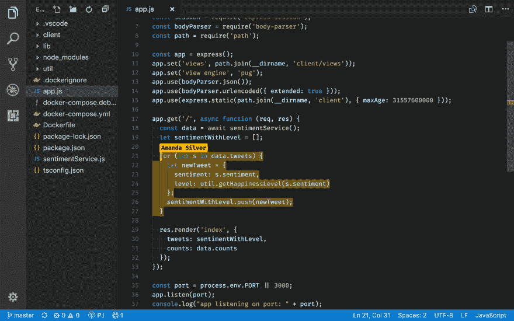
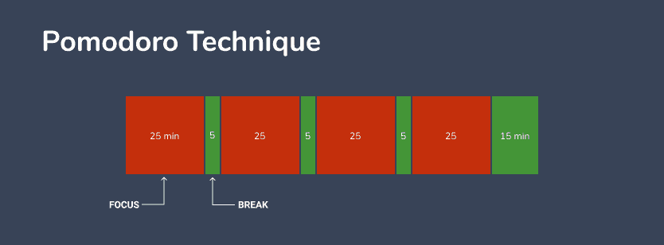
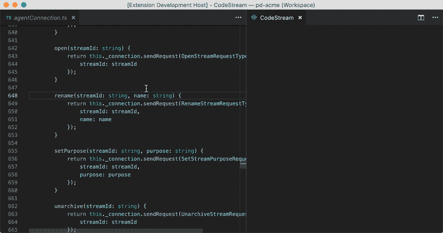
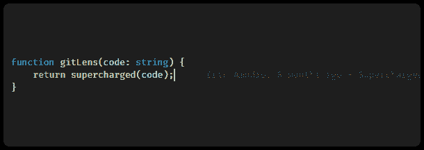
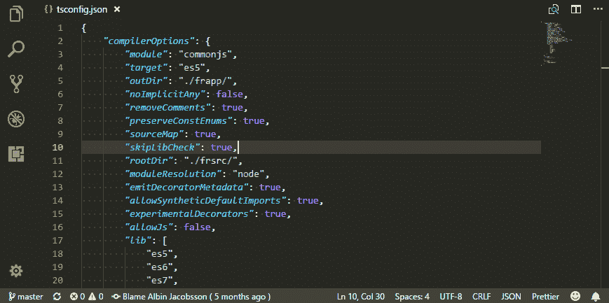
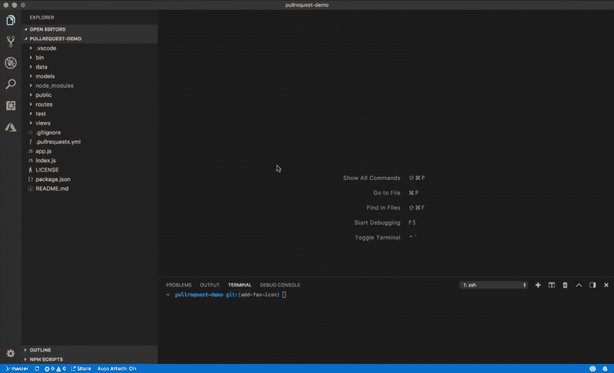
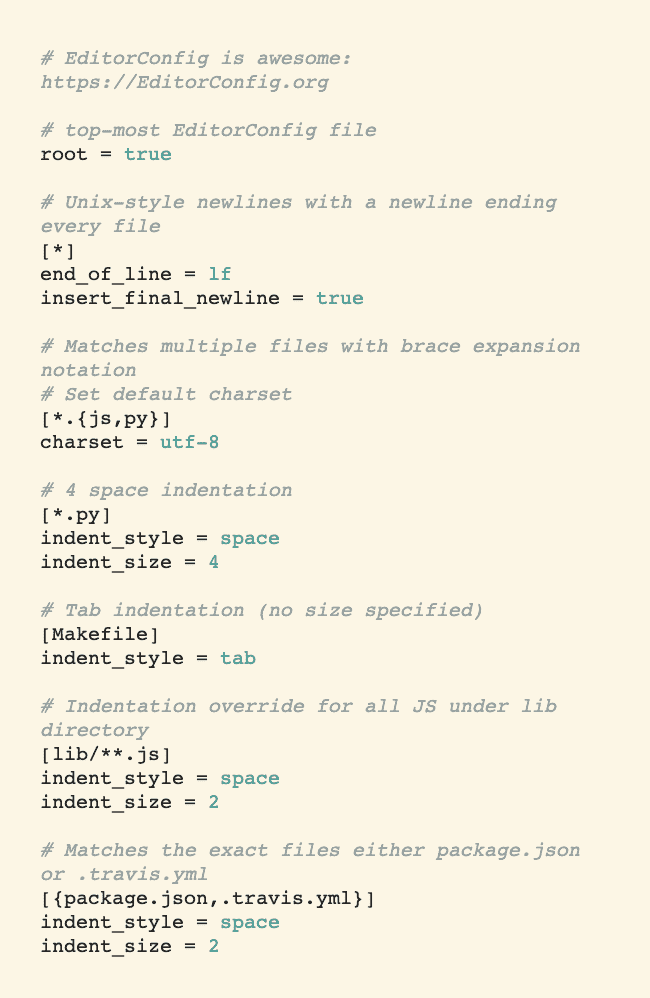
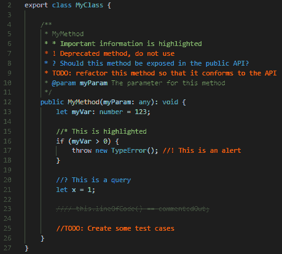
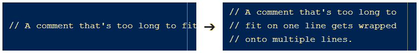

# 如何在 VS 代码中像专家一样协作

> 原文：<https://dev.to/thegeoffstevens/how-to-collaborate-like-a-pro-in-vs-code-4iaj>

开发通常是一项团队运动。代码不存在于筒仓中——它可以与不同团队成员在整个代码库中工作的开发人员微妙地交织在一起。

作为开发人员，我们如何作为一个团队更有效地工作？我们可以使用什么工具来更好地协作？

多年来，我们已经看到了许多软件开发框架的兴起，但是我们也构建了强大的开发工具，这些工具正在迎来一个新的协作黄金时代。VS 代码就是这些工具之一。

VS Code 有一个充满活力的开源扩展和定制的生态系统，可以增强您的团队更聪明地工作的能力。

## 流水线对编程和调试

一起编写和调试代码对于利用共同思维的力量是非常有益的。结对编程可以减少编码错误，促进团队成员之间的知识共享。

然而，代码协作通常需要屏幕共享，这限制了交互性，或者基于文本的消息传递，这变成了复制和粘贴代码片段并试图复制环境的笨拙混乱。

[VS 代码实时分享](https://marketplace.visualstudio.com/items?itemName=MS-vsliveshare.vsliveshare)让您无需离开自己的 VS 代码设置，即可实时协作编辑、调试和修复代码，消除了一起编写代码的摩擦。

Live Share 最好的特性之一是协作者保留他们个人的开发环境设置——队友可以从他们自己的工作空间跳转到您的代码。合作者可以查看和编辑您的代码，但仍然可以使用他们自己的个人文本编辑器的扩展、设置和定制——没有随意克隆 repos 或安装大量依赖项来帮助您的团队。

微软还提供了 [Live Share 扩展包](https://marketplace.visualstudio.com/items?itemName=MS-vsliveshare.vsliveshare-pack)，它通过包括两个额外的扩展，团队聊天和 VS Live Share Audio，以及核心的 Live Share 扩展，提供集成的语音通话和文本聊天。这个包值得下载以获得完整的体验。

如果你正在使用 Live Share，你也应该试试它的配套扩展 [Live Share Pomodoro](https://marketplace.visualstudio.com/items?itemName=lostintangent.vsls-pomodoro) 。番茄定时器是实施[番茄工作法](https://francescocirillo.com/pages/pomodoro-technique)的一个很好的方式，你的工作被分成若干间隔(通常长度为 25 分钟)，这些间隔被短暂的休息分开。

将 Pomodoro 技术集成到您的协作编码会话中可以使它们更加强大和高效。而且，如果你已经在使用番茄工作法，这是一个吸引你的同事尝试的好方法。

## 整合生产性沟通

有些开发人员更喜欢 VS 代码内部的通信工具，有些则不喜欢。我们经常被通知淹没(当我听到懈怠通知的敲击声时，我退缩了)。

工具必须在为你提供你需要的信息和保持你的关注和流动之间取得平衡。我认为下面列出的工具旨在尽可能减少干扰。

[CodeStream](https://marketplace.visualstudio.com/items?itemName=CodeStream.codestream) 允许你在 VS Code 中发表评论，提出问题，讨论你的代码库。它消除了试图从 Slack 中识别代码行和管理关于代码库不同部分的多线程的麻烦任务。通过消除这个工作流，您就消除了代价高昂的上下文切换。

Slack 非常适合关于特定主题的讨论，但是不太适合关于代码的对话。

然而，有时候，即使您已经离开了 VS 代码工作区，确保对话能够继续是很重要的。CodeStream 与 Slack 集成在一起，将必要的通道保持在循环中。

你们中的许多人也可能使用吉拉，Atlassian 的发展规划和管理解决方案。在吉拉代码和 VS 代码之间来回跳转可能会造成混乱。忘记你的团队给你分配了什么任务会更有破坏性。

使用[吉拉扩展](https://marketplace.visualstudio.com/items?itemName=gioboa.jira-plugin)你可以在 VS 代码中查看、搜索和过滤吉拉中的问题。需要的时候拉起扩展名快速查阅，不需要的时候忽略。您将避免一些不必要的浏览器检查吉拉，可以更快地访问您的团队的任务。

## 增强源码控制能力

Git 已经是每个团队都应该使用的强大工具，但是通过一些调整，您的团队可以增强它的 Git 超能力。

GitLens 是目前最流行的扩展，可以在 VS 代码中充分利用 Git 的能力。你可以用 GitLens 完成很多不同的任务(我建议通读整个[自述](https://github.com/eamodio/vscode-gitlens))，但是有几个值得注意的亮点:

*   当前行责备在每一行的末尾添加责备信息，在悬停上有更详细的信息
*   按需最近更改注释，以突出显示最近提交所更改的行
*   在文件或代码块顶部显示最近提交的作者身份代码镜头
*   状态栏注释显示当前行的作者和日期

通过将团队的 Git 信息引入 VS 代码，您可以更好地理解谁对代码库的变更负责，以及这些变更如何与代码的提交历史相关联。

如果你正在寻找一个更简单的 GitLens 版本，试试[git debit](https://marketplace.visualstudio.com/items?itemName=waderyan.gitblame)，它可以帮助你确定谁对什么变化负责，这样当你有问题时，你就能准确地知道该问哪个团队成员。

git kill 只是在你的 VS 代码工作区的状态栏中添加责备信息。

你的团队还必须管理 GitHub repos 的请求。确保有效地审查拉请求可以使您的团队能够更快地构建新特性和提高代码质量。

[GitHub Pull Requests](https://marketplace.visualstudio.com/items?itemName=GitHub.vscode-pull-request-github) 是一个官方的 GitHub 扩展，可以帮助你在 VS 代码中查看和管理 GitHub Pull 请求。

GitHub Pull Requests 允许您:

*   从 VS 代码中浏览 PRs
*   用编辑器内的注释从 VS 代码中检查 PRs
*   从 VS 代码内部验证 PRs，轻松检出

使用 Pull Requests 扩展，您可以更快、更轻松地审查代码更改，以保持事情顺利进行。

## 确保跨工作区的一致性

EditorConfig 确保你的团队在 VS 代码中使用一致的设置(以及跨其他 ide)。 [EditorConfig](https://editorconfig.org/) 允许您在`.editorconfig`文件中用自定义设置覆盖用户和工作区设置。

使用 EditorConfig，您可以:

*   设置缩进样式和宽度
*   配置默认选项卡宽度
*   控制字符集
*   修剪尾部空白
*   插入最后的换行符

下面是一个 EditorConfig 文件的示例，该文件调整 Python 和 JavaScript 文件的行尾和缩进样式:

EditorConfig 是一个强大而简单的工具。请注意如何使用通配符匹配来调整特定文件的格式。

保持文件格式可以确保任何团队成员在任何编辑器或 IDE 上都可以轻松阅读文件，并且只需一分钟即可设置完毕。而且，通过在您的 Git 存储库中包含一个`.editorconfig`文件，任何克隆或派生 repo 的人都将能够使用您预先配置的设置。

## 为你团队的评论增压

当进入队友的代码时，注释就像导航和理解代码的每个部分所扮演的角色的重要路标。写清楚、简洁和描述性的注释对于允许其他人阅读你的代码是很重要的。

如果你想写有用的评论，看看杰夫·阿特伍德的[代码告诉你如何，评论告诉你为什么](https://blog.codinghorror.com/code-tells-you-how-comments-tell-you-why/)和 freeCodeCamp 的[在代码中加入评论:好的、坏的和丑陋的](https://medium.freecodecamp.org/code-comments-the-good-the-bad-and-the-ugly-be9cc65fbf83)。

几个 VS 代码扩展可以帮助你增强你的评论。

[Todo Tree](https://marketplace.visualstudio.com/items?itemName=Gruntfuggly.todo-tree) 会在你的浏览器窗格中自动创建一个树来组织你的`TODO`和`FIXME`评论，这样你就可以快速跳转到代码库中需要修改的特定部分。当你打开一个文件时，它也会高亮显示每个`TODO`。

突出和组织团队的待办事项是一种很好的方式，可以确保你不会忽略任何需要完成的工作，并且你的团队成员可以很容易地找到他们可以在你的代码中提供帮助的地方。

如果你不想给你的浏览器窗格添加另一个图标， [Todo Highlight](https://marketplace.visualstudio.com/items?itemName=wayou.vscode-todo-highlight) 是一个更简单的扩展，它只是高亮显示`TODO`和`FIXME`注释，这样你就可以识别每个文件的位置。可以从命令选项板快速切换标记高亮显示。

除了改进您的`TODO`评论，您还可以为其他评论添加上下文，为您和您的团队提供视觉提示。

[更好的评论](https://marketplace.visualstudio.com/items?itemName=aaron-bond.better-comments)可以帮助您对评论进行注释，以便将其分类为提醒、查询、待办事项等。当您的整个团队都安装了扩展时，效果最好。

用颜色编码的注释是帮助其他人理解你的代码的好方法，但是如果你正在写一个长的注释，你也可以通过自动把它分成多行来让你的队友更容易阅读。Rewrap 会将您的评论换行到一个设定的行长度，这样您就不必担心在添加或删除信息时重新组织您的评论。

让你的同事保持理智——不再有水平滚动。

感谢阅读！你有没有使用什么工具让你和你的团队更容易合作？

我每周都会写一篇名为 [SRC](https://www.software.com/src) 的时事通讯——开发者需要知道的事情。没有垃圾邮件或绒毛。每封电子邮件都包含政府强制取消订阅的链接。