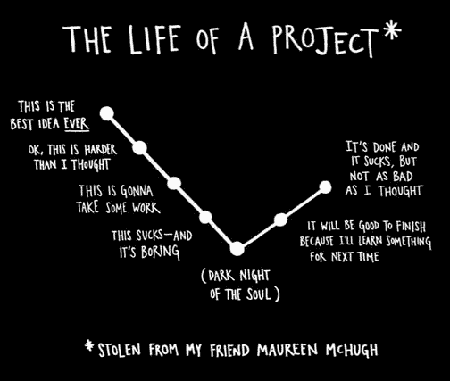

# 如何想出伟大的副业项目

> 原文：<https://dev.to/vintharas/how-to-come-up-with-great-side-projects-3kb>

*这篇文章最初发表在[野蛮人遇见编码时事通讯](https://www.barbarianmeetscoding.com/newsletter/)上。*

祝你愉快！本周的时事通讯回答了一位令人敬畏的读者的另一个问题:**你如何想出好的兼职项目来帮助你成为一名更好的工程师？**

## 如何拿出一个好的副业项目

我是这样想的:找到一个好的兼职项目的最佳时机是看所有这些元素的交集:

1.  一个你真正感兴趣的话题
2.  对你目前的工作有用的东西
3.  一项当前热门/新兴且正在兴起的技术

**为什么？**

1.  因为你将在你的空闲时间做这件事，你需要所有的热情来坚持下去。这就是为什么你觉得有趣的东西胜过所有其他要求。
2.  如果你的副业项目围绕着一些你可以在日常工作中使用的东西，那么你将获得协同作用的惊人力量:你将有一个地方可以将你学到的东西付诸实践，这将在短期和长期内对你的职业生涯产生积极的影响。
3.  同样，如果你的副业项目围绕着一个热门技术(比如 WebAssembly、Rust 等)，你将走出舒适区，发展一项对你的职业生涯有长期积极影响的技能，并能够作为这项新技术的专家重新定义你的职业生涯。

我觉得这些项目应该这样加权:

```
1 > 2 > 3 
```

也就是个人利益压倒一切。但这完全是个人问题。这可能意味着我觉得在我目前的领域有很多东西需要发现和学习。

> ### 协同的惊人力量
> 
> 协同描述的是这样一种情况，其中组合的元素的相互作用产生的整体效果大于其各部分的总和。
> 
> 当你在工作内外追求相似的目标时，你会发现这两种情况会产生协同作用。无论你在工作中取得了什么，都会对你的兼职项目产生积极的影响，无论你在兼职项目中取得了什么，都会对你的日常工作产生积极的影响。因此，在这两种情况下，您都将获得令人惊叹的结果。
> 
> 所以，要注意你什么时候可以在生活中利用这些协同作用，因为它们会让你事半功倍。

这些是我多年来做的一些兼职项目的例子:

*   我写的一个学习 ASP.NET MVC 2 的小 CMS。我想这是我第一次尝试严肃的 web 开发，我学到了很多东西:TDD、BDD、IoC、d I 和 ORMs。
*   我几乎没有启动过一个 Windows Phone 7 应用程序 [GymBuddy](https://www.barbarianmeetscoding.com/projects/gym-buddy/) ，作为健身伙伴。它让我开始了移动开发，我学会了在 PhotoShop 中制作漂亮的高保真模型。
*   Windows Phone 7 中的另一款游戏[星球之战](https://www.barbarianmeetscoding.com/projects/war-of-the-orbs/)才刚刚开始。它教会了我游戏开发的基础:游戏循环、精灵、精灵表、动画、用户交互、hud 等等。
*   [quiz 4 结合了一个 Windows Phone 应用程序，鼓励与你的另一半共度美好时光。从开始到结束，它教会了我很多关于移动开发、设计、用户体验和产品创造的知识。这是我完成并发布到窗口手机商店的第一个应用程序。我](https://www.barbarianmeetscoding.com/projects/quiz-4-couples/)[甚至为它做了一个网站](http://www.quiz4couples.com/)，它得到了[的好评](https://www.microsoft.com/en-us/p/quiz4couples/9nblggh090qc?rtc=1&activetab=pivot:reviewstab)。多亏了这个应用程序，很多爱在世界上传播。
*   我用一个[伪智能个人任务管理系统](https://www.barbarianmeetscoding.com/blog/2012/08/16/barbaric-august-building-a-pseudo-intelligent-personal-task-management-system)做了实验，并为[做了一个概念验证](https://www.barbarianmeetscoding.com/projects/the-ultimate-personal-task-management-system/)。我试图创造一个类似贾维斯的人。它教会了我更多关于 web 编程、自然语言和 DSL 的知识。
*   我开始制作另一款游戏，名为 [iO](https://www.barbarianmeetscoding.com/blog/2013/10/16/barbaric-october-writing-a-ios-game-with-spritekit) ，这一次是在 iOS 中使用 SpriteKit。这是学习 Objective-C 和为 iPhone 开发的好方法。
*   然后，我带着两个附带项目一头扎进了 JavaScript head:[ilPomodoro](https://www.barbarianmeetscoding.com/projects/ilpomodoro/)knockout . JS 中的 Pomodoro 技术应用程序和 [Serenity](http://vintharas.github.com/projects/serenity/) 一个基于 Firefly 宇宙的 HTML5/JS 太空射击游戏，我为它编写了一个小型游戏引擎。这两个项目都教会了我很多关于 JavaScript 的知识。

还有更多！就像[书](https://www.barbarianmeetscoding.com/books/)、[地球](https://www.barbarianmeetscoding.com/blog/2018/09/19/how-to-write-a-game-under-13k-while-taking-care-of-a-baby)、[婴儿-gotchi](https://www.barbarianmeetscoding.com/blog/2017/06/09/from-idea-to-reality-in-under-50-minutes-mostly-with-angular-and-firebase) 和许多其他我忘记了或从未有机会、时间或精力去写的书。(**对了，好酷的回头看所有这些项目**。)

如果你回顾所有这些项目，会发现有几个共同点:

*   对我来说，它们非常有趣
*   大部分我都没完成。我所说的*完成的*是指它们从未成为一个完成的、抛光的产品。其中一些功能非常有限，但大部分只是玩具。他们的核心目标是**在一个没有压力和紧张的环境中教会我一些东西**。(低风险环境)
*   我从他们每一个人身上学到了很多
*   他们中的大多数人在那时提升了我的工作和事业，我设法把我的兴趣和一个特定的工作需要联系起来。例如，我开发了一个游戏来学习 iOS 开发和 Objective-C，然后我用它为我当时的雇主开发了一个 iOS 应用程序。我还开发了 ilPomodoro 和 Serenity，以便更好地掌握 JavaScript，并在我的公司建造 SPA 时提高我的前端开发技能。

综上所述，**你如何挑选一个好的副业项目？**选择你感兴趣的、能与你的工作和职业联系起来的事情。然后一头扎进去，学很多东西。在工作中应用你所学的知识。一路写下来，启发别人。谁知道呢，你的[副业可能成为你的新工作](https://dev.to/)。

下面是一些关于你兼职项目的随机建议:

*   当开始一个新的副业时，设定一个可实现的目标。你期望从这个项目中得到什么？
*   将你的项目设定到一个特定的时间段(一个月)或者一个设定的小时数(20 小时)。当你知道事情有个结局时，你可以更好地专注于它。当时间到了，你可以反思你学到了什么，并决定你是否要继续或追求一个不同的项目。
*   在公共场合工作，分享你的进步、学习和发现。这对其他人来说是一个很好的教导和灵感的来源，它可以打开意想不到的机会，对你未来的自己也很好。
*   养成整理东西的习惯。事情会变得艰难，但如果你坚持到底，你会收获最多的回报。**完成一件事也感觉很棒**。
*   如果你没有完成它，也是可以的。善待自己。最重要的是学点东西。也许你会发现你一次尝试了太多的事情，或者你对某个话题不感兴趣，或者完全对其他事情不感兴趣。

[](https://res.cloudinary.com/practicaldev/image/fetch/s--HYbM_zSj--/c_limit%2Cf_auto%2Cfl_progressive%2Cq_auto%2Cw_880/https://www.barbarianmeetscoding.cimg/life-of-a-project.png) 
*像艺术家一样从书中窃取一个项目的生命。再坚持一会儿！事情会好起来的！:D*