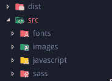
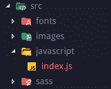
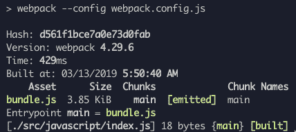

# Webpack 教程如何为基本网站从头开始配置 Webpack 4 或 5

> 原文：<https://dev.to/antonmelnyk/how-to-configure-webpack-from-scratch-for-a-basic-website-46a5>

# 🌼介绍

读者你好！🐱

你可能知道，配置 [Webpack](https://webpack.js.org/) 可能是一项令人沮丧的任务。尽管有很好的文档，但由于一些原因，这辆 bundler 并不是一匹舒适的马。

Webpack 团队工作非常努力，开发速度也相对较快，这是一件好事。然而，对于一个新的开发者来说，一次学习所有的东西是很难的。教程越来越老，一些插件打破，发现的例子可以混淆。有时候你可能会被一些琐碎的事情困扰，谷歌了很多，在 GitHub issues 中找到一些最终有用的短消息。

缺乏关于 Webpack 及其工作原理的介绍性文章，人们直接奔向像 *create-react-app* 或 *vue-cli* 这样的工具，但人们有时需要编写一些简单的普通 JavaScript 和 SASS，没有框架或任何花哨的东西。

本指南将介绍在没有任何框架的情况下，针对 ES6、SASS 和图像/字体的逐步 Webpack 配置。对于大多数简单的网站，开始使用 Webpack 或者把它作为进一步学习的平台，应该就足够了。尽管本指南需要一些关于 web 开发和 JavaScript 的先验知识，但它可能对某些人有用。至少在我刚开始用 Webpack 的时候遇到这样的事情我会很开心！

# 🎈我们的目标

我们将使用 Webpack 将 JavaScript、样式、图像和字体文件打包到一个 *dist* 文件夹中。

[](https://res.cloudinary.com/practicaldev/image/fetch/s--X7SLgQkY--/c_limit%2Cf_auto%2Cfl_progressive%2Cq_auto%2Cw_880/https://thepracticaldev.s3.amazonaws.com/i/9n9g3yr1v6lhjfg8roqc.png)

Webpack 将生成 1 个捆绑的 JavaScript 文件和 1 个捆绑的 CSS 文件。你可以简单地把它们添加到你的 HTML 文件中(当然，如果需要的话，你应该把路径改成 dist 文件夹):

```
<link rel="stylesheet" href="dist/bundle.css">
<script src="dist/bundle.js"></script> 
```

Enter fullscreen mode Exit fullscreen mode

你可以走了🍹

您可以查看本指南中已完成的示例:🔗[链接](https://github.com/heyanton/simple_webpack_boilerplate)。

注意:我最近更新了依赖关系。本指南适用于最新的 Webpack 5，但 config 仍然适用于 Webpack 4，以防您需要它！

# 🔧开始

#### 1。安装 web 包

我们使用 [npm](https://www.npmjs.com/) : `$ npm init`命令在一个项目文件夹中创建一个 *package.json* 文件，我们将把 JavaScript 依赖项放在这个文件夹中。然后我们可以用`$ npm i --save-dev webpack webpack-cli`安装 Webpack 本身。

#### 2。创建入口点文件

Webpack 从一个称为入口点的 JavaScript 文件开始工作。在 *javascript* 文件夹中创建 *index.js* 。你可以像`console.log('Hi')`一样在这里写一些简单的代码来确保它的工作。

[](https://res.cloudinary.com/practicaldev/image/fetch/s--YJfSM_wN--/c_limit%2Cf_auto%2Cfl_progressive%2Cq_auto%2Cw_880/https://thepracticaldev.s3.amazonaws.com/i/tlt38mn2u385i06y4vzn.png)

#### 3。创建网页包.配置. js

...在项目文件夹中。这里是所有✨魔法发生的地方。

```
// Webpack uses this to work with directories
const path = require('path');

// This is the main configuration object.
// Here, you write different options and tell Webpack what to do
module.exports = {

  // Path to your entry point. From this file Webpack will begin its work
  entry: './src/javascript/index.js',

  // Path and filename of your result bundle.
  // Webpack will bundle all JavaScript into this file
  output: {
    path: path.resolve(__dirname, 'dist'),
    publicPath: '',
    filename: 'bundle.js'
  },

  // Default mode for Webpack is production.
  // Depending on mode Webpack will apply different things
  // on the final bundle. For now, we don't need production's JavaScript 
  // minifying and other things, so let's set mode to development
  mode: 'development'
}; 
```

Enter fullscreen mode Exit fullscreen mode

#### 4。在 *package.json* 中添加 npm 脚本来运行 Webpack

要运行 Webpack，我们必须使用带有简单命令`webpack`的 npm 脚本和作为*配置*选项的配置文件。我们的 *package.json* 现在应该是这样的:

```
{
  "scripts": {
    "build": "webpack --config webpack.config.js"
  },
  "devDependencies": {
    "webpack": "^4.29.6",
    "webpack-cli": "^3.2.3"
  }
} 
```

Enter fullscreen mode Exit fullscreen mode

#### 5。运行 web 包

有了基本设置，您可以运行`$ npm run build`命令。Webpack 将查找我们的入口文件，解析其中所有的 [*导入*](https://developer.mozilla.org/en-US/docs/Web/JavaScript/Reference/Statements/import) 模块依赖，并将其捆绑成单个*。js* 文件在 *dist* 文件夹中。在控制台中，您应该会看到类似这样的内容:

[](https://res.cloudinary.com/practicaldev/image/fetch/s--EGqsi6y---/c_limit%2Cf_auto%2Cfl_progressive%2Cq_auto%2Cw_880/https://thepracticaldev.s3.amazonaws.com/i/8j9rn72esbfbvn27duz6.png)

如果你将`<script src="dist/bundle.js"></script>`添加到你的 HTML 文件中，你应该会在浏览器控制台中看到`Hi`！

# 🔬装载机

太好了！我们捆绑了标准的 JavaScript。但是，如果我们想使用 ES6(以及更高版本)的所有酷功能，并保持浏览器兼容性，该怎么办呢？我们应该如何告诉 Webpack 将我们的 ES6 代码转换(*trans file*)为浏览器兼容的代码？

这就是 Webpack **加载器**发挥作用的地方。加载器是 Webpack 的主要特性之一。他们对我们的代码进行某些转换。

让我们给 *webpack.config.js* 文件添加新选项 *module.rules* 。在这个选项中，我们将告诉 Webpack 它应该如何转换不同类型的文件。

```
entry: /* ... */,
output: /* ... */,

module: {
  rules: [
  ]
} 
```

Enter fullscreen mode Exit fullscreen mode

对于 JavaScript 文件，我们将使用:

### 1。[通天塔](https://github.com/babel/babel-loader)

Babel 是目前最好的 JavaScript transpiler。我们将告诉 Webpack 在捆绑之前使用它将我们的现代 JavaScript 代码转换为浏览器兼容的 JavaScript 代码。

巴别塔装载机正是这样做的。来装一下:
`$ npm i --save-dev babel-loader @babel/core @babel/preset-env`

现在我们要添加关于 JavaScript 文件的规则:

```
rules: [
    {
      test: /\.js$/,
      exclude: /(node_modules)/,
      use: {
        loader: 'babel-loader',
        options: {
          presets: ['@babel/preset-env']
        }
      }
    }
] 
```

Enter fullscreen mode Exit fullscreen mode

*   `test`是一个[正则表达式](https://developer.mozilla.org/en-US/docs/Web/JavaScript/Guide/Regular_Expressions)，用于我们将要转换的文件扩展名。在我们的例子中，它是 JavaScript 文件。
*   `exclude`是一个正则表达式，告诉 Webpack 在转换模块时应该忽略哪个路径。这意味着，如果我们将来从 npm 导入供应商库，我们不会转换它们。
*   `use`是主规则的选项。这里我们设置 loader，它将被应用到对应于`test` regexp 的文件(在本例中是 JavaScript 文件)
*   `options`可能因装载机而异。在这种情况下，我们为 Babel 设置默认预设，以考虑它应该转换哪些 ES6 功能，哪些不应该。这是一个独立的主题，如果你感兴趣，你可以深入研究，但是现在保持这样是安全的。

现在您可以安全地将 ES6 代码放在 JavaScript 模块中了！

### 2。 [sass-loader](https://github.com/webpack-contrib/sass-loader)

是时候使用样式了。通常，我们不想写普通的 CSS。我们经常使用 [SASS](https://sass-lang.com/) 预处理器。我们将 SASS 转换为 CSS，然后应用自动前缀和缩小。这是 CSS 的一种“默认”方法。让我们告诉 Webpack 这样做。

假设我们将主 SASS 文件 *sass/styles.scss* 导入到我们的 *javascripts/index.js* 入口点中。

```
import '../sass/styles.scss'; 
```

Enter fullscreen mode Exit fullscreen mode

但目前，Webpack 还不知道如何处理*。scss* 文件或除*以外的任何文件。js* 。我们需要添加适当的加载程序，这样 Webpack 就可以解析这些文件:
`$ npm i --save-dev sass sass-loader postcss-loader css-loader`

我们可以为 SASS 文件添加一个新规则，并告诉 Webpack 如何处理它们:

```
rules: [
    {
      test: /\.js$/,
      /* ... */
    },
    {
      // Apply rule for .sass, .scss or .css files
      test: /\.(sa|sc|c)ss$/,

      // Set loaders to transform files.
      // Loaders are applying from right to left(!)
      // The first loader will be applied after others
      use: [
             {
               // This loader resolves url() and @imports inside CSS
               loader: "css-loader",
             },
             {
               // Then we apply postCSS fixes like autoprefixer and minifying
               loader: "postcss-loader"
             },
             {
               // First we transform SASS to standard CSS
               loader: "sass-loader"
               options: {
                 implementation: require("sass")
               }
             }
           ]
    }
] 
```

Enter fullscreen mode Exit fullscreen mode

请在此处注意关于 Webpack 的重要事项。它可以连锁多个装载机；它们将在`use`数组中从最后一个到第一个逐一应用。

现在当 Webpack 在代码中遇到`import 'file.scss';`时，它知道该怎么做了！

#### PostCSS

我们应该如何告诉 *postcss-loader* 它必须应用哪些转换？我们创建了一个单独的配置文件`postcss.config.js`，并使用我们的风格所需的 postcss 插件。你可能会发现缩小和自动修复最基本和最有用的插件，以确保 CSS 为你真正的网站做好准备。

首先安装那些 postcss 插件:`$ npm i --save-dev autoprefixer cssnano`。

其次，将它们添加到 *postcss.config.js* 文件中，就像这样:

```
module.exports = {
    plugins: [
        require('autoprefixer'),
        require('cssnano'),
        // More postCSS modules here if needed
    ]
} 
```

Enter fullscreen mode Exit fullscreen mode

您可以更深入地研究 [PostCSS](https://github.com/postcss/postcss) ，找到更多适合您的工作流程或项目需求的插件。

在所有的 CSS 设置之后，只剩下一件事了。Webpack 将解析您的*。scss* 导入、转换它们，并...下一步是什么？它不会神奇地创造出一个*。css* 文件与你的风格捆绑在一起；我们必须告诉 Webpack 这样做。但是这项任务超出了装载机的能力。为此我们必须使用 Webpack 的**插件**。

# 🔌插件

他们的目的是做加载器做不到的任何事情。如果我们需要将所有转换后的 CSS 提取到一个单独的“bundle”文件中，我们必须使用一个插件。并且对于我们的情况有一个特殊的:*minicsextractplugin*:
`$ npm i --save-dev mini-css-extract-plugin`

我们可以在 *webpack.config.js* 文件的开头单独导入插件:

```
const MiniCssExtractPlugin = require("mini-css-extract-plugin"); 
```

Enter fullscreen mode Exit fullscreen mode

在我们设置加载器的`module.rules`数组之后，添加新的`plugins`代码，在这里我们用选项
激活插件

```
module: {
  rules: [
    /* ... */
  ]
},
plugins: [

  new MiniCssExtractPlugin({
    filename: "bundle.css"
  })

] 
```

Enter fullscreen mode Exit fullscreen mode

现在我们可以将这个插件链接到我们的 CSS 加载器中:

```
{
      test: /\.(sa|sc|c)ss$/,
      use: [
             {
               // After all CSS loaders, we use a plugin to do its work.
               // It gets all transformed CSS and extracts it into separate
               // single bundled file
               loader: MiniCssExtractPlugin.loader
             }, 
             {
               loader: "css-loader",
             },
             /* ... Other loaders ... */
           ]
} 
```

Enter fullscreen mode Exit fullscreen mode

搞定了。如果你跟着做，你可以运行`$ npm run build`命令并在你的 *dist* 文件夹中找到 *bundle.css* 文件。常规设置现在应该是这样的:

[](https://res.cloudinary.com/practicaldev/image/fetch/s--Ev5xY2Cl--/c_limit%2Cf_auto%2Cfl_progressive%2Cq_auto%2Cw_880/https://thepracticaldev.s3.amazonaws.com/i/ye1wwk5r7rvxcu9n0ylm.png)

Webpack 有大量不同用途的插件。你可以在你需要的时候在官方文档中探索它们。

# 🔬更多加载器:图像和字体

至此，您应该了解了 Webpack 的基本工作原理。但是我们还没有完成。大多数网站需要一些资产:我们通过 CSS 设置的图像和字体。多亏了 *css 加载器*，Webpack 可以解析`background-image: url(...)`行，但是它不知道如果你将 URL 设置为*该怎么办。png* 或 *jpg* 文件。

我们需要一个新的加载器来处理 CSS 中的文件，或者能够在 JavaScript 中导入它们。这就是:

### [文件加载器](https://github.com/webpack-contrib/file-loader)

用`$ npm i --save-dev file-loader`安装它，给我们的 *webpack.config.js* :
添加一个新规则

```
rules: [
    {
      test: /\.js$/,
      /* ... */
    },
    {
      test: /\.(sa|sc|c)ss$/,
      /* ... */
    },
    {
      // Now we apply rule for images
      test: /\.(png|jpe?g|gif|svg)$/,
      use: [
             {
               // Using file-loader for these files
               loader: "file-loader",

               // In options we can set different things like format
               // and directory to save
               options: {
                 outputPath: 'images'
               }
             }
           ]
    }
] 
```

Enter fullscreen mode Exit fullscreen mode

现在，如果你在你的 CSS 中使用这样的图片:

```
body {
  background-image: url('img/cat.jpg');
} 
```

Enter fullscreen mode Exit fullscreen mode

Webpack 将成功解决该问题。您将在 *dist/images* 文件夹中找到您的带有散列名称的图像。在 *bundle.css* 里面你会找到这样的东西:

```
body {
  background-image: url(images/e1d5874c81ec7d690e1de0cadb0d3b8b.jpg);
} 
```

Enter fullscreen mode Exit fullscreen mode

正如你所看到的，Webpack 非常智能——它正确地解析了你的 url 相对于 *dist* 文件夹的路径！

你也可以为字体添加一个规则，并像解析图像一样解析它们；将输出路径更改为*字体*文件夹以保持一致性:

```
rules: [
    {
      test: /\.js$/,
      /* ... */
    },
    {
      test: /\.(sa|sc|c)ss$/,
      /* ... */
    },
    {
      test: /\.(png|jpe?g|gif|svg)$/,
      /* ... */
    },
    {
      // Apply rule for fonts files
      test: /\.(woff|woff2|ttf|otf|eot)$/,
      use: [
             {
               // Using file-loader too
               loader: "file-loader",
               options: {
                 outputPath: 'fonts'
               }
             }
           ]
    }
] 
```

Enter fullscreen mode Exit fullscreen mode

# 🏆包扎

就是这样！经典网站的简单 Webpack 配置。我们讲述了**入口点**、**加载器**和**插件**的概念，以及 Webpack 如何转换和打包您的文件。

当然，这是一个非常简单的配置，旨在理解 Webpack 的一般概念。如果你需要的话，还可以添加很多东西:源代码映射、热重装、设置 JavaScript 框架以及 Webpack 可以做的所有其他事情，但我觉得这些事情超出了本指南的范围。

如果你还在纠结或者想了解更多，我鼓励你去查看 Webpack [官方文档](https://webpack.js.org/concepts)。捆绑愉快！