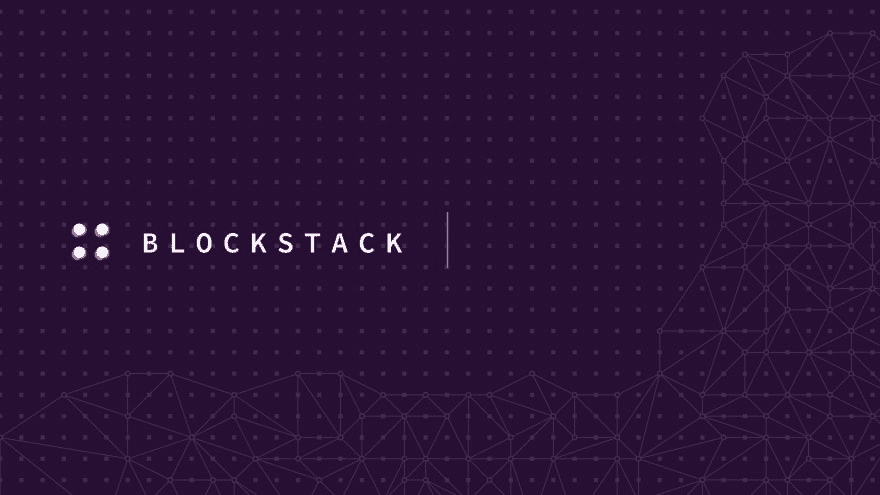

# 如何将 Blockstack 连接到您的后端 API

> 原文：<https://dev.to/robghchen/how-to-connect-blockstack-to-your-backend-api-2bo0>

### 三部分教程的第二部分

在第一部分中，[如何在 Blockstack](https://dev.to/robghchen/how-to-build-your-first-blockchain-app-on-blockstack-2n01) 上构建您的第一个区块链应用程序，我将向您展示如何设置 Blockstack 登录/注册。在本教程中，我们将访问者在 Blockstack 上创建的唯一用户名连接到您的后端。

**先决条件**:需要建立自己的 [API](https://dev.to/robghchen/launch-a-rails-database-in-under-5-minutes-1453) 的知识。在本教程中，我们还将使用 [React.js](http://reactjs.org/) 。

虽然您可能希望将电话号码和地址等私人信息发送到 [Gaia Storage](https://github.com/blockstack/gaia) (一个分散式存储系统)，但我将要向您展示的内容对于存储公共信息(如评论或帖子)非常有用，您可能希望这些信息在公共 API 上可用。

来自这个由三部分组成的教程系列的第一部分，这是 App.js 的样子: