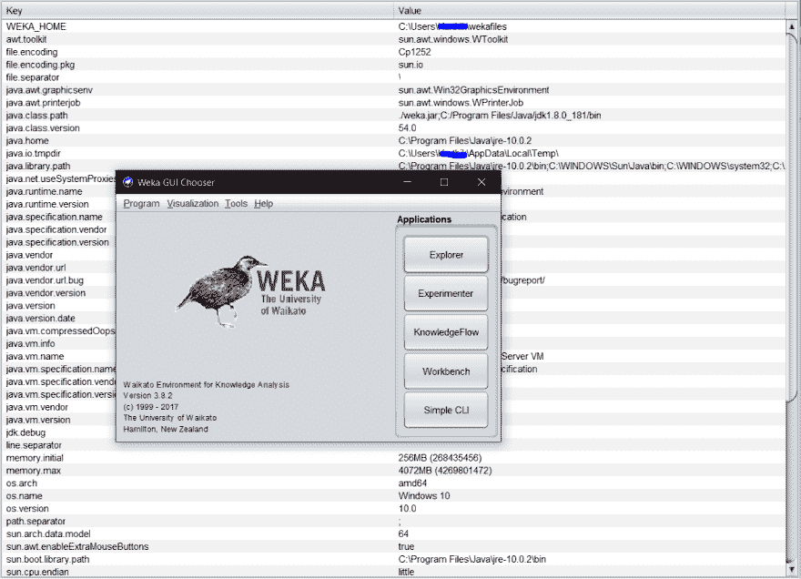
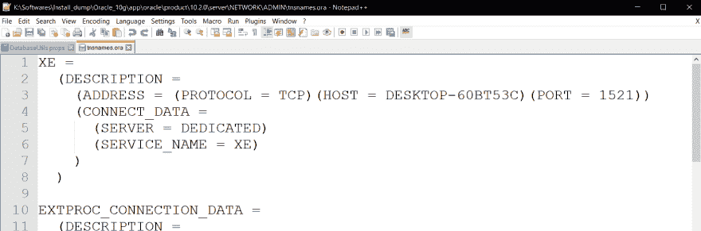
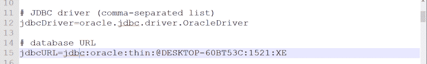
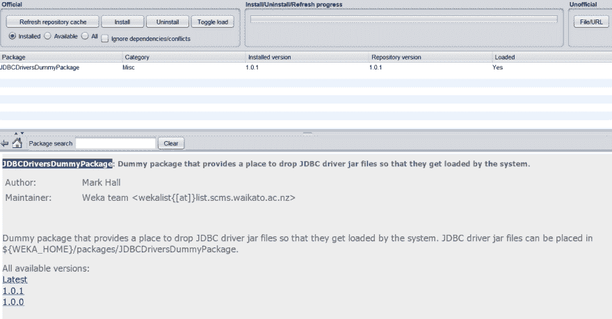
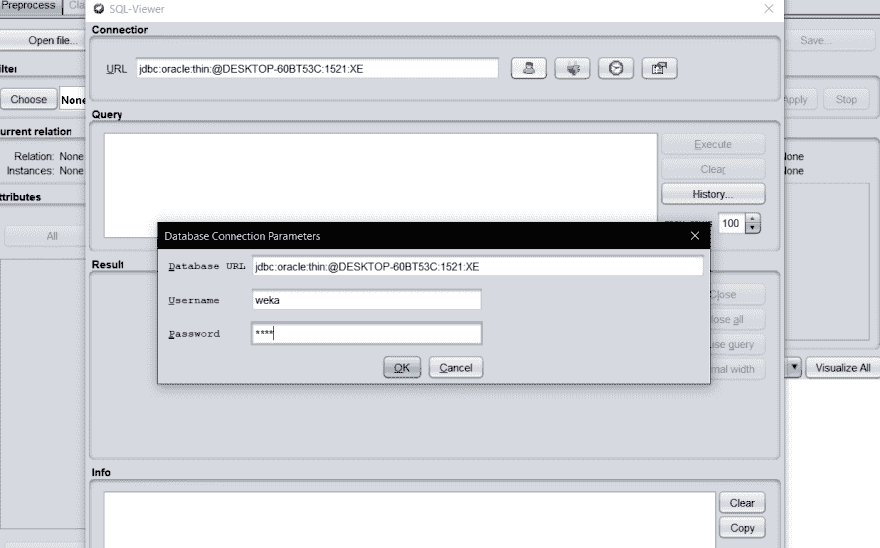
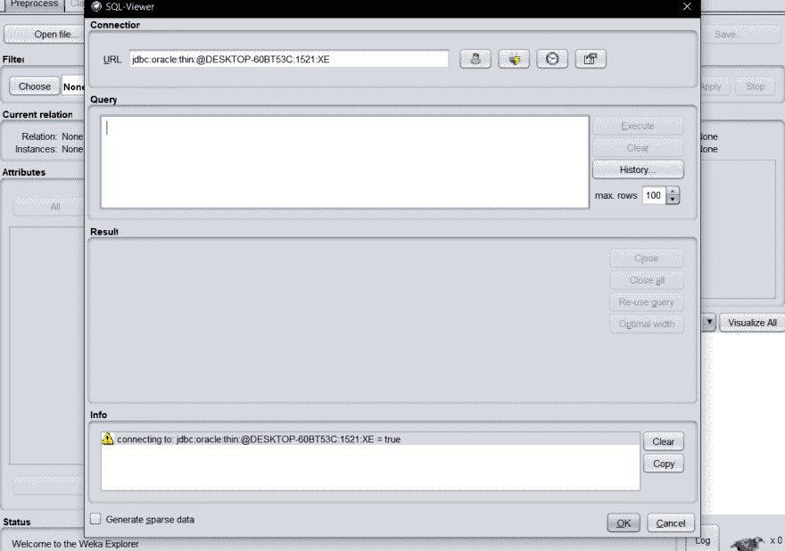

# 将 Oracle 10g 快捷版与 Weka 连接起来

> 原文：<https://dev.to/karthikchiru12/how-to-connect-oracle-10g-express-edition-with-weka-tool-2ipp>

### 要求:

1.  您需要在您的系统中下载并安装 Oracle 10g 快捷版。从[这里](https://www.downloadsource.net/1770835/oracle-database-10g-express-edition/)下载 Oracle 10g 快捷版
2.  您需要在系统中下载并安装 Weka 工具。从[这里](http://prdownloads.sourceforge.net/weka/weka-3-8-3-x64.exe)下载 weka 工具

### 程序:

为了用 weka 工具连接您的数据库(Oracle 10gXE ),您需要有 **DatabaseUtils.props** 文件。一般来说，这个文件应该放在你的 *WEKA_HOME* (大多是**C:/Users/% your username %/WEKA files/**)的 props 文件夹里面。DatabaseUtils.props 文件包含 weka 工具使用 JDBC 驱动程序连接数据库所需的配置。

打开 WEKA 工具，点击*帮助*菜单，然后选择*系统信息*选项，就可以知道你系统中的 WEKA_HOME 路径。这将打开一个新窗口，您可以在其中找到键和值表。然后记下您的 *WEKA_HOME* 路径值。

[](https://res.cloudinary.com/practicaldev/image/fetch/s--5tMPbqOb--/c_limit%2Cf_auto%2Cfl_progressive%2Cq_auto%2Cw_880/https://thepracticaldev.s3.amazonaws.com/i/hu5zrbzxr6n9i3b0vi3h.PNG)

现在创建一个名为 DatabaseUtils.props 的文件，这里是*。道具*是扩展。复制下面的文本并粘贴到 DatabaseUtils.props 文件中。然后保存文件。

```
 # Database settings for Oracle 10g Express Edition
#
# General information on database access can be found here:
# http://weka.wikispaces.com/Databases
#
# url:     http://www.oracle.com/
# jdbc:    http://www.oracle.com/technology/software/tech/java/sqlj_jdbc/
# author:  Fracpete (fracpete at waikato dot ac dot nz)
# version: $Revision$

# JDBC driver (comma-separated list)
jdbcDriver=oracle.jdbc.driver.OracleDriver

# database URL
jdbcURL=jdbc:oracle:thin:@server_name:1521:XE

# specific data types
# string, getString() = 0;    --> nominal
# boolean, getBoolean() = 1;  --> nominal
# double, getDouble() = 2;    --> numeric
# byte, getByte() = 3;        --> numeric
# short, getByte()= 4;        --> numeric
# int, getInteger() = 5;      --> numeric
# long, getLong() = 6;        --> numeric
# float, getFloat() = 7;      --> numeric
# date, getDate() = 8;        --> date
# text, getString() = 9;      --> string
# time, getTime() = 10;       --> date

VARCHAR2=0
NUMBER=2
DOUBLE_PRECISION=2
TIMESTAMP=8

# other options
CREATE_INT=INTEGER
CREATE_STRING=VARCHAR2(4000)
CREATE_DOUBLE=NUMBER
CREATE_DATE=TIMESTAMP
DateFormat=yyyy-MM-dd HH:mm:ss
checkUpperCaseNames=true
checkForTable=true

# All the reserved keywords for this database
# Based on the keywords listed at the following URL (2009-04-13):
# http://download.oracle.com/docs/cd/B19306_01/server.102/b14200/ap_keywd.htm
Keywords=\
  ACCESS,\
  ADD,\
  ALL,\
  ALTER,\
  AND,\
  ANY,\
  AS,\
  ASC,\
  AUDIT,\
  BETWEEN,\
  BY,\
  CHAR,\
  CHECK,\
  CLUSTER,\
  COLUMN,\
  COMMENT,\
  COMPRESS,\
  CONNECT,\
  CREATE,\
  CURRENT,\
  DATE,\
  DECIMAL,\
  DEFAULT,\
  DELETE,\
  DESC,\
  DISTINCT,\
  DROP,\
  ELSE,\
  EXCLUSIVE,\
  EXISTS,\
  FILE,\
  FLOAT,\
  FOR,\
  FROM,\
  GRANT,\
  GROUP,\
  HAVING,\
  IDENTIFIED,\
  IMMEDIATE,\
  IN,\
  INCREMENT,\
  INDEX,\
  INITIAL,\
  INSERT,\
  INTEGER,\
  INTERSECT,\
  INTO,\
  IS,\
  LEVEL,\
  LIKE,\
  LOCK,\
  LONG,\
  MAXEXTENTS,\
  MINUS,\
  MLSLABEL,\
  MODE,\
  MODIFY,\
  NOAUDIT,\
  NOCOMPRESS,\
  NOT,\
  NOWAIT,\
  NULL,\
  NUMBER,\
  OF,\
  OFFLINE,\
  ON,\
  ONLINE,\
  OPTION,\
  OR,\
  ORDER,\
  PCTFREE,\
  PRIOR,\
  PRIVILEGES,\
  PUBLIC,\
  RAW,\
  RENAME,\
  RESOURCE,\
  REVOKE,\
  ROW,\
  ROWID,\
  ROWNUM,\
  ROWS,\
  SELECT,\
  SESSION,\
  SET,\
  SHARE,\
  SIZE,\
  SMALLINT,\
  START,\
  SUCCESSFUL,\
  SYNONYM,\
  SYSDATE,\
  TABLE,\
  THEN,\
  TO,\
  TRIGGER,\
  UID,\
  UNION,\
  UNIQUE,\
  UPDATE,\
  USER,\
  VALIDATE,\
  VALUES,\
  VARCHAR,\
  VARCHAR2,\
  VIEW,\
  WHENEVER,\
  WHERE,\
  WITH

# The character to append to attribute names to avoid exceptions due to
# clashes between keywords and attribute names
KeywordsMaskChar=_

#flags for loading and saving instances using DatabaseLoader/Saver
nominalToStringLimit=50
idColumn=auto_generated_id 
```

现在将这个 DatabaseUtils.props 文件放在**C:/Users/% profile %/WEKA files/props/**中。

接下来，你需要找到你的主机名称。找到那个...
用记事本打开位于 oracle 安装目录下的 tnsnames.ora 文件。通常 tnsnames.ora 位于**% Oracle _ 10g %/app/Oracle/product/10 . 2 . 0/server/NETWORK/ADMIN/tnsnames . ora**中

[](https://res.cloudinary.com/practicaldev/image/fetch/s--L0e5zpEc--/c_limit%2Cf_auto%2Cfl_progressive%2Cq_auto%2Cw_880/https://thepracticaldev.s3.amazonaws.com/i/kkx9an19jvww1fxmftg6.PNG)

上图中我的主机值是 *DESKTOP-60BT53C* 。记下主机的值。
然后在 DatabaseUtils.props 文件中用 host 的值代替 *server_name* ，如下图所示。

[](https://res.cloudinary.com/practicaldev/image/fetch/s--GKlVKsEX--/c_limit%2Cf_auto%2Cfl_progressive%2Cq_auto%2Cw_880/https://thepracticaldev.s3.amazonaws.com/i/q763oqs67ngo9uaawfgr.PNG)

接下来，您需要将 JDBC 驱动程序添加到类路径中。为了简单地做到这一点，我们将在 weka 工具中下载一个包。
打开 weka 工具，点击**工具**菜单，选择**包管理器**。
一个新窗口打开，您可以在其中搜索并安装软件包 **JDBCDriversDummyPackage** 。
安装后，你会看到一个如下图所示的屏幕。

[](https://res.cloudinary.com/practicaldev/image/fetch/s--UdoLXTzT--/c_limit%2Cf_auto%2Cfl_progressive%2Cq_auto%2Cw_880/https://thepracticaldev.s3.amazonaws.com/i/j5ctf5l5jtqds9aau20t.PNG)

现在打开安装 Oracle 的目录。而且还会有*。该路径下的 jar* 文件**% Oracle _ 10g %/app/Oracle/product/10 . 2 . 0/server/JDBC/lib/OJ DBC 14 . jar**。
现在从这个路径复制文件 **ojdbc14.jar** 。并将 ojdbc14.jar 粘贴到% wek home/packages/%**C:/Users/% profile %/wek files/packages/JDBCDriversDummyPackage/OJ DBC 14 . jar**下的 jdbcdriversdummy package 文件夹中

现在打开 weka 工具，您可以使用 jdbc_URL 以及您在 Oracle_10g 的 *RunSQLCommandLine* 中使用的用户名和密码。

[](https://res.cloudinary.com/practicaldev/image/fetch/s--e0PX_Ti5--/c_limit%2Cf_auto%2Cfl_progressive%2Cq_auto%2Cw_880/https://thepracticaldev.s3.amazonaws.com/i/jjmsaftyqka7l9hsdeyi.PNG)

点击*连接*使用 weka 工具连接 Oracle 数据库。

[](https://res.cloudinary.com/practicaldev/image/fetch/s---k9LWDcP--/c_limit%2Cf_auto%2Cfl_progressive%2Cq_auto%2Cw_880/https://thepracticaldev.s3.amazonaws.com/i/sc7v8q6wci3pq1kjo649.PNG)