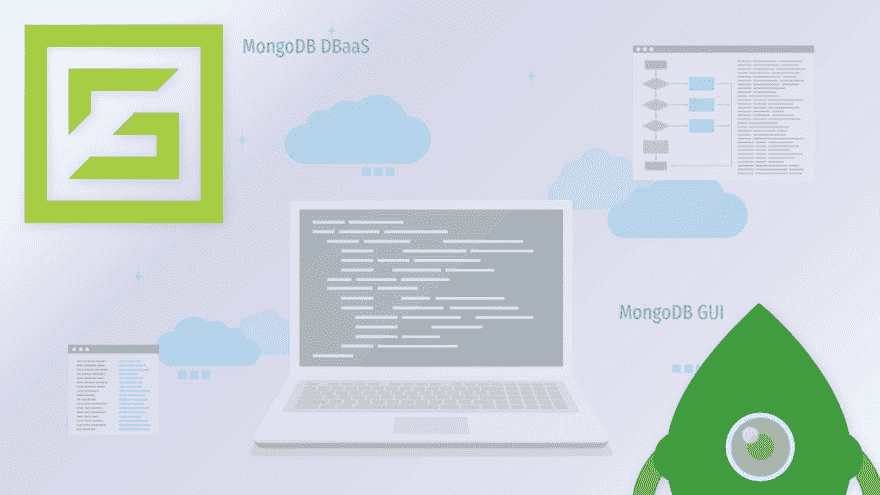
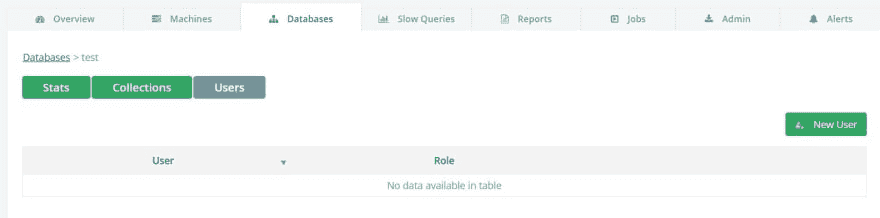
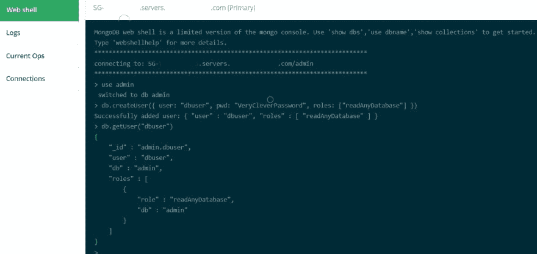
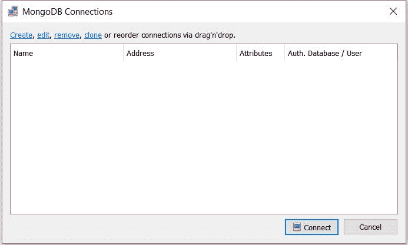
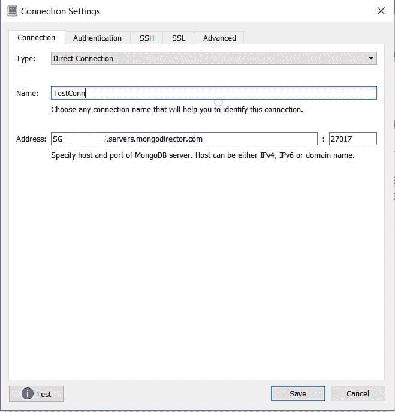
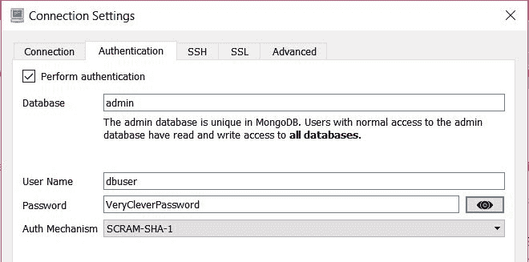
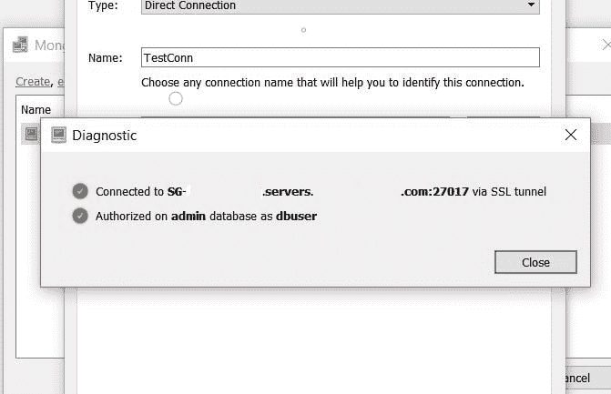
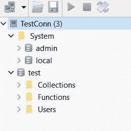
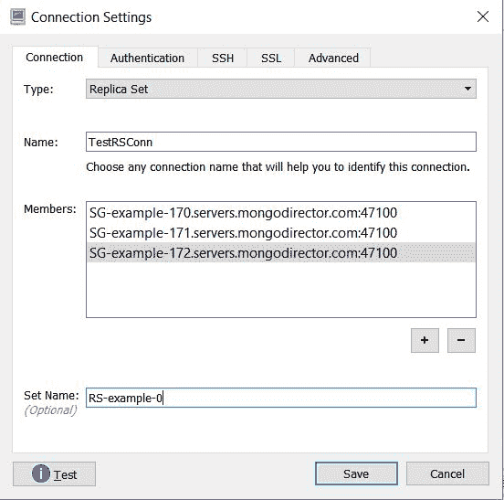
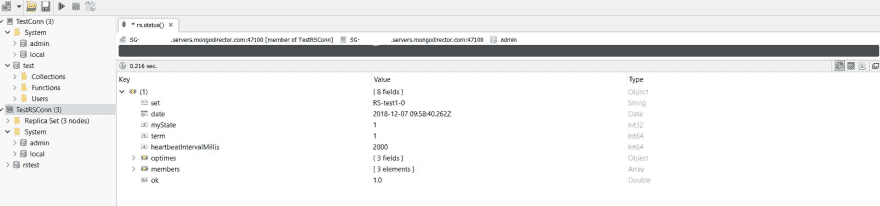

# 如何将您的 MongoDB 部署连接到 ScaleGrid 的 Robo 3T GUI

> 原文：<https://dev.to/scalegrid/how-to-connect-your-mongodb-deployments-to-robo-3t-gui-at-scalegrid-4ff5>

[](https://scalegrid.io/blog/how-to-connect-your-mongodb-deployments-to-robo-3t-gui-at-scalegrid/)

[Robo 3T](https://robomongo.org/) (以前的 Robomongo)是一个流行的桌面图形用户界面(GUI)，用于托管部署的 [MongoDB，允许您通过可视指示器而不是基于文本的界面与数据进行交互。这个开源工具具有跨平台支持，并且实际上在它的界面中嵌入了](https://scalegrid.io/mongodb.html) [mongo shell](https://docs.mongodb.com/manual/mongo/) ，以提供 shell 和基于 GUI 的交互。

作为我们的 MongoDB 托管客户所利用的一个非常受欢迎的 GUI，我们提供了这个教程，介绍如何快速地将您的 ScaleGrid 部署与 Robo 3T 连接起来。

## 先决条件

### 身份客户端机器

我们需要做的第一件事是确定一台机器来[安装 Robo 3T](https://robomongo.org/download) **。**您可以[创建一个新实例](https://help.scalegrid.io/docs/mongodb-new-cluster)，或者选择一个可以访问您想要连接的 ScaleGrid MongoDB 集群的现有实例。对于新的 ScaleGrid 用户，创建一个[免费 30 天试用帐户](https://console.scalegrid.io/users/register)，并设置您的第一个 MongoDB 集群(所有计划都支持 Robo 3T)。

*   对于我们未向互联网开放的 MongoDB [自带云](https://scalegrid.io/pricing.html#section_pricing_byoc) (BYOC) AWS 部署，这可能意味着选择一个允许连接到安全组并且还具有到虚拟私有云(VPC)的 VPN 连接的实例。
*   对于将其部署开放到互联网的 AWS 客户，这将涉及到将识别出的机器的 IP 地址添加到 ScaleGrid 集群的[白名单中。](https://help.scalegrid.io/docs/account-firewall-rules)

### 安装 Robo 3T

Robo 3T 可在此下载[。检查您的 ScaleGrid 部署非常重要，以确保您安装的 Robo 3T 版本支持部署的当前 MongoDB 版本，您可以查看此链接了解更多关于](https://robomongo.org/download) [Robo 3T 支持的平台](https://github.com/Studio3T/robomongo#supported-platforms)的信息。撰写本文时，Robo 3T 的最新版本是 1.2，支持 MongoDB[3.4](https://github.com/Studio3T/robomongo#about-robo-3t)之前的版本。

### 在 MongoDB 上创建 Robo 3T 用户

我们不建议使用 ScaleGrid 默认提供的“admin”用户连接到您的 MongoDB 部署。相反，创建一个具有适当客户端访问权限的新用户。您选择分配给用户的角色将取决于您的具体用例。

为了创建简单的、基于数据库的读写或只读用户，请登录到 [ScaleGrid 控制台](https://console.scalegrid.io)，导航到集群详细信息页面，然后单击数据库选项卡:

[](https://scalegrid.io/blog/wp-content/uploads/2018/12/StdDatabasesTab.jpg)

单击要在其上创建用户的数据库旁边的管理按钮，然后选择用户选项卡:

[](https://scalegrid.io/blog/wp-content/uploads/2018/12/New-User-button.jpg)

对于创建具有更高级角色和权限的用户，请参考 [MongoDB 添加用户教程](https://docs.mongodb.com/manual/tutorial/create-users/)、 [MongoDB 角色指南](https://docs.mongodb.com/manual/reference/built-in-roles/#built-in-roles)或[我们的指南](https://scalegrid.io/blog/creating-role-based-access-control-in-mongodb/)至 [MongoDB RBAC](https://scalegrid.io/blog/mongodb-basics-configuring-role-based-access-control-rbac/) 。

您还可以使用 Admin 选项卡上的 ScaleGrid web-shell 来创建这样的用户。对于这个例子，我将创建一个新用户，他对集群上的任何数据库都有读写权限:

[](https://scalegrid.io/blog/wp-content/uploads/2019/01/WebshellSmall.png)

具备了先决条件，我们现在可以转到 Robo 3T GUI，继续连接到我们的数据库部署。

## 连接到独立的 MongoDB 部署

我们的 [BYOC](https://scalegrid.io/pricing.html#section_pricing_byoc) 和[专用](https://scalegrid.io/pricing.html#section_pricing_dedicated)计划用户通常在 30 天免费试用期间从[独立](https://docs.mongodb.com/manual/reference/glossary/#term-standalone) MongoDB 部署开始，然后转移到[副本集](https://docs.mongodb.com/manual/reference/glossary/#term-replica-set)用于开发和生产环境。

您将需要数据库服务器名称和端口来启动，这可以在控制台中 MongoDB 集群详细信息页面上的连接字符串中找到:

[](https://scalegrid.io/blog/wp-content/uploads/2018/12/ConnString.png) 下面是一个如何从你的连接字符串中识别你的服务器名和端口的例子:

*   **连接字符串**:MongoDB://admin:【@SG-example-1234.servers.mongodirector.com:27017/admin T2】？ssl=true
*   **服务器名**:SG-example-1234.servers.mongodirector.com
*   **港口:** 27017

### 在 Robo 3T 上建立新连接

启动 Robo 3T 并打开“管理连接”窗口:

[](https://scalegrid.io/blog/wp-content/uploads/2018/12/ManageConnections.jpg)

单击“创建”来设置新的连接。

#### 独立连接设置

在“连接”选项卡中，选择“直接连接”作为“类型”，为连接命名，并在“地址”和“端口”字段中输入从 ScaleGrid MongoDB 集群详细信息页面中找到的连接字符串中选取的服务器名称和端口:

[](https://scalegrid.io/blog/wp-content/uploads/2018/12/StdScreen1.jpg)

#### 认证设置

在 Authentication 选项卡中，将数据库输入为“admin”(或者您在其上创建 MongoDB 用户的任何数据库)。然后，在其余字段中输入您的用户凭据:

[](https://scalegrid.io/blog/wp-content/uploads/2018/12/StdScreen2.jpg)

### SSL 设置

如果在 MongoDB 集群上启用了 SSL，那么需要在 SSL 选项卡上进行额外的配置，如下所示。默认情况下，ScaleGrid 提供自签名证书，但是您可以选择[自带 SSL 证书](https://scalegrid.io/blog/bring-your-own-ssl-certificates/)或要求我们代表您购买证书:

[](https://scalegrid.io/blog/wp-content/uploads/2018/12/StdSSLScreen3.jpg)

您现在已经设置好了！单击“测试”来测试连接。Robo 3T 应该可以成功连接。

[](https://scalegrid.io/blog/wp-content/uploads/2019/01/StdSuccess.png)

保存连接，然后双击它，您将看到您的数据库。

[](https://scalegrid.io/blog/wp-content/uploads/2018/12/StdDBList.jpg)

## 连接到 MongoDB 副本集部署

默认情况下，我们所有的[共享](https://scalegrid.io/pricing.html#section_pricing_shared)计划用户都在副本集上启动，尽管大多数生产工作负载都部署在([专用](https://scalegrid.io/pricing.html#section_pricing_dedicated)或 [BYOC](https://scalegrid.io/pricing.html#section_pricing_byoc) )副本集上。

将 ScaleGrid MongoDB 副本集连接到 Robo 3T 类似于连接独立部署。大多数设置都是相同的，只是我们需要指定一个服务器名称列表，而不是指定一个服务器名称。该列表可以从连接字符串中创建。

如果您的连接字符串看起来像:

```
mongodb://admin:@SG-example-170.servers.mongodirector.com:47100,SG-example-171.servers.mongodirector.com:47100,SG-example-172.servers.mongodirector.com:47100/admin?replicaSet=RS-example-0&ssl=true
```

那么，您的服务器和端口列表应该是:

*   SG-example-170.servers.mongodirector.com:47100，
*   SG-example-171.servers.mongodirector.com:47100
*   SG-example-172.servers.mongodirector.com:47100

副本集名称为:“RS-example-0”。

### 在 Robo 3T 上设置新的副本集连接

像以前一样，启动 Robo 3T 并打开“管理连接”窗口。然后单击“创建”来设置新的连接。

#### 副本集连接设置

选择“类型”为“副本集”，键入一个名称，然后输入您的服务器名称，如上例所示。您也可以输入副本集名称:

[](https://scalegrid.io/blog/wp-content/uploads/2018/12/RSScreen1.jpg)

“身份验证”和“SSL”选项卡上的配置与独立配置相同。

设置完成后，单击“测试”以验证连接，然后双击连接以建立连接。

[](https://scalegrid.io/blog/wp-content/uploads/2018/12/RSDbList.jpg)

## 解决纷争

如果您已经完成了 MongoDB 单机版或副本集部署的所有上述步骤，并且您的连接不工作，下面是一些可以尝试的事情:

1.  确保可以使用 mongo shell 从客户机连接到 MongoDB 服务器。连接语法可在标题为“命令行字符串”的概览选项卡中的 ScaleGrid [MongoDB 集群详细信息页面](https://console.scalegrid.io/application/mongoclusters)上找到。
2.  确保您使用的 Robo 3T 支持[MongoDB 版本](https://github.com/Studio3T/robomongo#supported-platforms)。
3.  请确保您用于连接的凭据是正确的。
4.  检查部署是否启用了 SSL，并且配置是否正确。

如果您有任何问题，请通过 [support@scalegrid.io](mailto:support@scalegrid.io) 与我们联系，我们很乐意为您提供帮助！