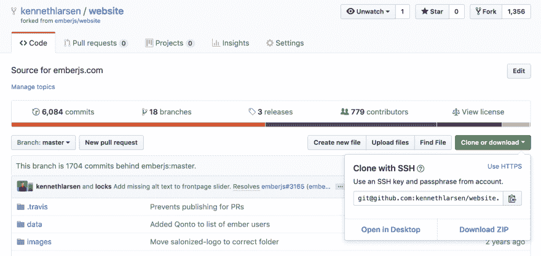

# 如何投稿:余烬时报

> 原文：<https://dev.to/kennethlarsen/how-to-contribute-ember-times-34a8>

开始为开源做贡献并不容易。通常，在开始投稿之前，我们需要理解一个全新的代码库。有时候有据可查，有时候没有。这就是为什么我总是建议人们先从文档开始，再从代码开始。这是一个不需要任何专门工具或知识就可以开始贡献的完美方式，通常，开源项目总是欢迎文档的更新。

我决定创建一个关于如何为 Ember 生态系统做贡献的指南，从甚至不需要编码的贡献开始，到更高级的贡献结束。这是第一部分。

* * *

《余烬时报》是一份由许多不同投稿人制作的每周时事通讯。他们中的一些人是核心团队的成员，他们中的一些人已经为《余烬时报》写了很长时间的文章，还有一些人会停下来贡献一两次。无论你属于哪一类，你的贡献总是令人难以置信的有帮助和被欣赏。

通常，《余烬时报》的撰稿人会选择一个主题，然后就这个特定的主题写一小段。像这样的投稿经常有一种误解，认为我们必须是专家才能写一个特定的主题。我可以向你保证，大多数贡献文档的人——包括我在内——并不完全了解他们将要记录的内容。

当我选择一个话题时，通常是关于一些我不太了解的事情，这很好。这是一个极好的学习机会。

## 第一步

首先要做的是确保你已经注册了[余烬不和谐聊天](https://discordapp.com/invite/zT3asNS)。有一个频道叫`#support-ember-times`。这是协调所有关于时事通讯的工作的地方。

如果你以前从未给《余烬时报》投稿，去打个招呼是个好主意。Ember Times 的人非常友好，如果你需要的话，他们会帮助你开始选择一个主题。

每周都有一个工作进展拉请求，其中包含新闻稿的草稿以及要包含的潜在主题列表。这个拉请求可以在 Discord 通道的通道主题中找到。

让我们来看看[个先前拉取请求](https://github.com/emberjs/website/pull/3807.)中的一个。

在这里，您可以看到我选择了“包含尖括号调用语法的新指南”这个主题这并不是因为我有关于尖括号调用语法的专门知识，而是因为我想了解更多。

当我决定了一个主题，我会在#support-ember-times 频道让其他人知道。

## 获取回购

使用开源存储库确实需要使用 Git。如果你以前没有使用过 Git，我建议你在继续之前先完成一个小的 Git 教程。

首先，访问[https://github.com/emberjs/website](https://github.com/emberjs/website)并按下`fork`按钮。这将创建一个您可以直接操作的存储库的分支。把这个想象成原始文件的复印件。你可以在影印件上画出你想要的任何东西，直到你对结果满意，并且不会损害原件。

一旦分叉，就该在终端进行一些工作了。在您的终端中，您需要克隆新分叉的存储库:

`git clone URL`

您可以在分叉的存储库中找到克隆 URL:

`cd website/`

现在，我们有了这个存储库的一个远程源，这是您新分支的存储库。这对于我们最终想要创建拉请求的时候非常有用。但是现在，我们想获取包含《Ember Times》杂志草稿的正在进行的 pull 请求。

让我们添加原始存储库作为远程源，并将其命名为`upstream`:

`git remote add upstream git@github.com:emberjs/website.git`

这意味着我们可以获取包含草稿的分支。可以在 GitHub UI 中找到正在进行的 pull 请求的分支名称。

`git fetch upstream blog/embertimes-85`

然后让我们看看那个分支:

`git checkout blog/embertimes-85`。

现在我们准备创建一个我们想要工作的分支。在我的例子中，我会这样命名它:

`git checkout -b angle-bracket-guides`

没有规则来命名你的分支，但是我喜欢包括一些它所包含的参考。

## 写作章节

技术设置已经完成，我们现在准备写一些内容。该部分的长度没有规定，但我认为平均在 100 字左右。理想情况下，我们希望保持简短和甜蜜。

尽管我将讨论尖括号调用语法，但我的目标是保持它的非技术性。任何重要的技术信息、代码样本或类似的东西都应该放在一个独立的指南或博客文章中，可以在 Ember Times 中引用。

在这种情况下，有一个包含这个新语法的 Ember 指南的新版本。

同样，没有关于如何做到这一点的规则，但这是我写作时的过程:

我首先马上宣布新闻，同时保持读者的兴趣。

“新版本的[余烬指南](https://guides.emberjs.com/release/)已经发布，它包含了一些令人兴奋的惊喜。”

现在，由于新指南包含两个新功能，我选择从简单的开始:

“首先，指南-源代码和指南-应用程序存储库已经成为**一个存储库* *。这使得维护和贡献更加方便。它现在还使用了 [Guidemaker](https://github.com/empress/guidemaker) 技术，这意味着 CLI-guides 和 Ember guides 使用的是相同的技术。”

最后是:

“现在有一个大惊喜:**新部署的指南现在包含尖括号调用语法* *。因此，如果你想在你的 Ember 应用程序中使用尖括号调用语法，指南是寻求帮助的地方。”

现在，正如您可能注意到的那样，这一小节并不要求我具备任何关于尖括号调用语法的技术方面的特殊知识，以便我能够编写有关更新的内容。

## 包装完毕

既然我们已经完成了这一部分，就只剩下几件事要做了。正如您在[我的拉取请求](https://github.com/emberjs/website/pull/3817/files)中注意到的，除了部分本身，我还添加了一些东西。

在最上面，我把自己的名字作为作者加了进去。每个为《泰晤士报》写专栏的人都应该被认为是作者。

接下来，我为我的部分添加了一句话的介绍。不要担心它会和其他的衔接，那会发生在最终的编辑中。

最后，我又在底部加了我的名字。

现在，您已经准备好提交所有内容，并将其推到您的岔口:

`git add blog-file-name`

`git commit -m "Added section on new guides"`

`git push origin angle-bracket-guides`

如果您访问您的分叉存储库，您现在将能够创建一个针对`blog/embertimes-85`的拉请求。

完成后，您应该在`#support-ember-times`频道中发布一个指向拉动请求的链接，团队成员之一将审核您的拉动请求。

## 你的行动

你准备好开始了吗？

*   转到时代频道，找到正在进行的拉请求。
*   挑个题目，让时代人知道。
*   派生并克隆存储库。
*   开始写一小段。
*   添加您的姓名和介绍。
*   送去审查。

如果你遇到困难或需要任何帮助，请联系时代频道不和谐频道的奇妙的烬时代的人们。

* * *

这就是开始向《余烬时报》投稿的原因。请继续关注本系列的下一篇文章，我们将一起为发布文章写一个章节。