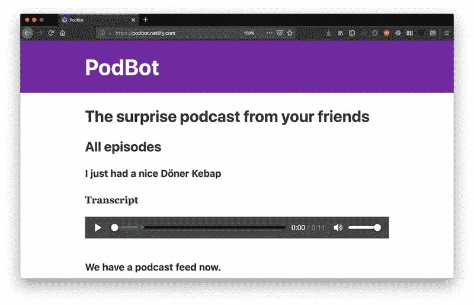
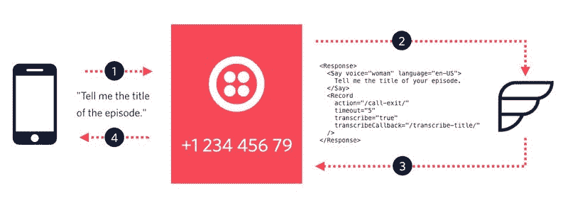
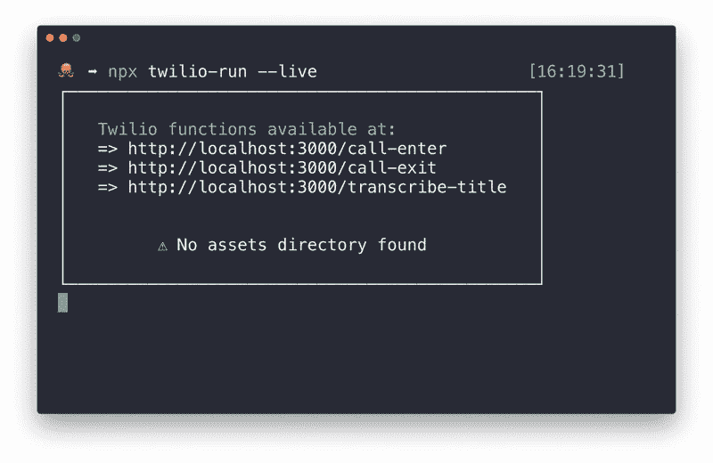
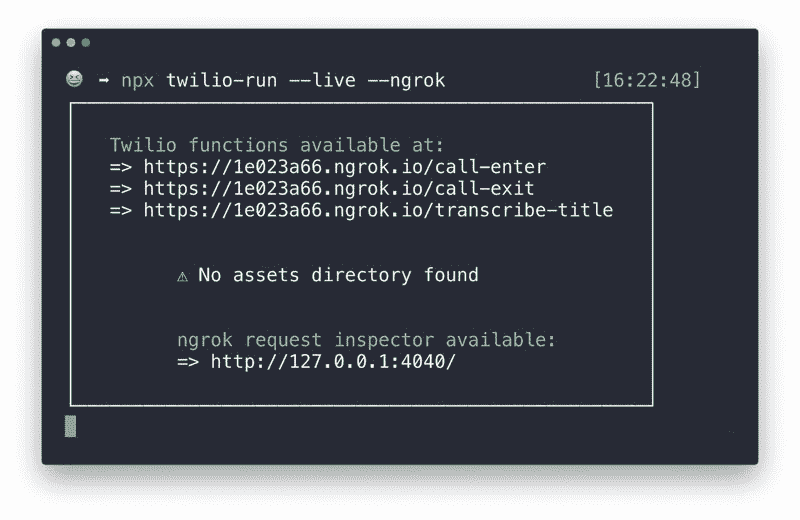
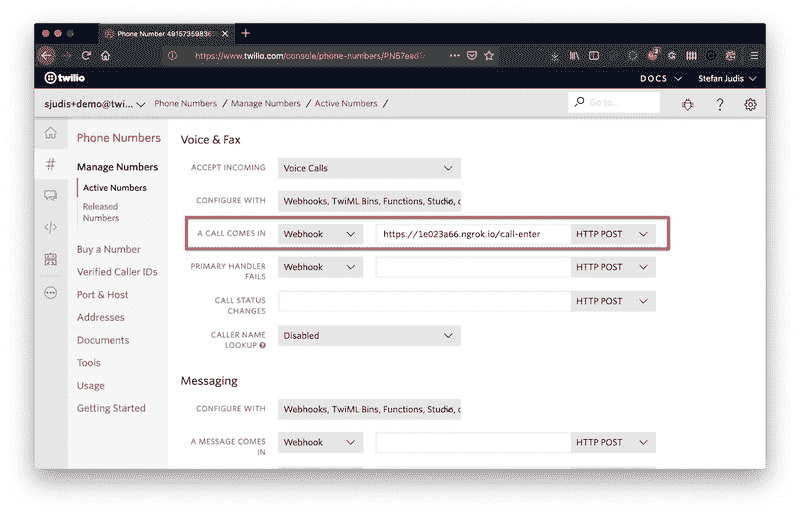
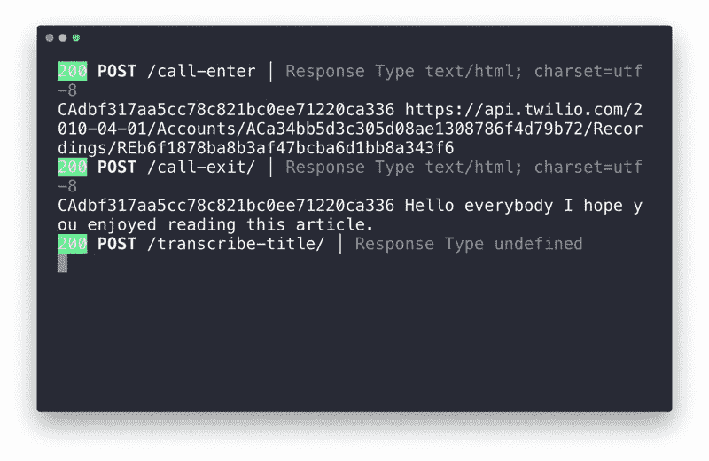
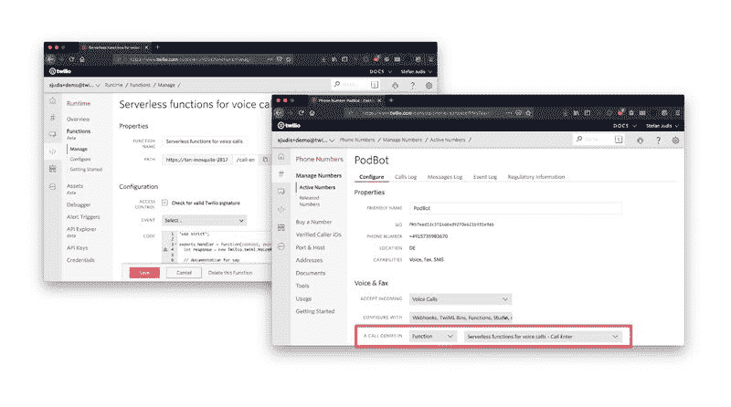

# 如何用 Node.js 无服务器函数控制和记录语音通话

> 原文：<https://dev.to/twilio/how-to-control-and-record-voice-messages-with-node-js-serverless-functions-272l>

有很多方法可以和你的朋友和家人交流。你可能会使用传统的短信、Whatsapp、电子邮件，当然还有电话。最近，我遇到了一种令人惊讶的新的交流方式。这一切都始于我的朋友米凯拉在推特上问了一个问题。

> 有没有可能从 Twilio 语音通话中生成一个 RSS 提要？

她在寻找的是一种将电话转换成引用电话录音的 RSS 提要的方法。为什么？因为她听很多播客，通过 Whatsapp 给她的一个朋友发很长的语音信息。由于这些消息通常不需要及时回复，他们都更喜欢所有的语音消息出现在他们的播客中，而不是 Whatsapp。

让我给你介绍一下[“PodBot——来自你朋友的惊喜播客”](https://podbot.netlify.com)的想法。

[](https://res.cloudinary.com/practicaldev/image/fetch/s--1AV3p0L5--/c_limit%2Cf_auto%2Cfl_progressive%2Cq_auto%2Cw_880/https://s3.amazonaws.com/com.twilio.prod.twilio-doimg/68he8yLdDsMp_AXDMeAZiQMsLe0wPJ5rK7Ov575PhY6PtT.width-800.jpg)

这个想法是这样的:要发布一个新的播客剧集，你所要做的就是打个电话。不需要麦克风设置，也不需要录制、存储或上传音频文件到播客平台。

## 对语音呼叫驱动的播客网站的要求

要创建一个电话驱动的播客网站，你需要几样东西。

您需要一个可以编程控制的电话号码。幸运的是， [Twilio Voice](https://www.twilio.com/voice) 提供了这一功能。

此外，您需要一种方法来存储信息和传入电话的转录。 [Google sheets](https://www.youtube.com/watch?v=UGN6EUi4Yio) 或云数据库可以与 Node.js 一起使用，因此可以提供用于 [Twilio 无服务器功能](https://www.twilio.com/functions)的快速数据存储。

此外，你需要一个网站托管者来为你的播客网站提供服务。

配置可编程语音通话、下载音频文件和建立一个包含所有信息的网站是一项繁重的工作。这就是为什么我们将构建 *PodBot* 及其所有任务分成几个教程。

在这第一个教程中，我们将使用 Twilio serverless 函数来接受和管理电话呼叫、录音和语音转录。在后面的教程中，我们将扩展函数以写入数据存储，并且我们将使用这些数据通过 [Gatsby](https://www.gatsbyjs.org/) 构建播客站点，包括强制 RSS 播客提要。听起来不错吧？那么，让我们开始编写函数吧！🎉

这是你今天需要的:

*   购买电话号码和接听电话的 Twilio 帐户
*   已安装 Node.js 和 npm

## 功能驱动语音呼叫救援

为了定义当有人拨打 Twilio 电话号码时会发生什么，您必须以基于 XML 的格式提供一些配置，称为 [TwiML](https://www.twilio.com/docs/glossary/what-is-twilio-markup-language-twiml) 。Twilio API 会在有呼叫时立即请求这个配置。你可以通过[TwiML bin](https://www.twilio.com/blog/2017/11/twiml-bins-a-serverless-and-codeless-way-to-try-twilio.html)提供 TwiML，通过 webhooks 或者无服务器功能提供你定制的应用。

在我们实现这个功能之前，让我们回顾并思考一下我们需要构建什么。当有人呼叫 *PodBot* 时，我们需要收集以下事件信息:

*   标题
*   录制 URL
*   插曲转录

幸运的是，Twilio 提供了检索所有呼叫信息的方法。下面你会看到 TwiML 配置来请求剧集标题，录制它并获得录制内容的副本。

[](https://res.cloudinary.com/practicaldev/image/fetch/s--BmTOmdyl--/c_limit%2Cf_auto%2Cfl_progressive%2Cq_auto%2Cw_880/https://s3.amazonaws.com/com.twilio.prod.twilio-doimg/sSm5imNV5rilVnwDdcchaXZnin3BhwF3rsVziYxcMhv_Cg.width-800.jpg)

我们来详细说说；当有人呼叫您的 Twilio 号码时(步骤 1)，Twilio 会向您定义的无服务器函数询问一些 TwiML 配置(步骤 2)。响应的 TwiML 定义询问剧集的标题并记录答案(步骤 3)。关于完整记录的信息应该被发送到一个`/call-exit/`端点。`/call-exit/`的响应将通过使用更多的 TwiML 来控制接下来发生的事情。最初的 TwiML 还指定生成的抄本应该发送给`/transcribe-title/`。

在 Twilio 收到这个初始的 TwiML 配置后，PodBot 对呼叫者说“告诉我你的剧集的标题。”(第四步)。然后，它等待并记录答案，直到五秒钟的沉默过去。魔法？神奇！

像上面这样的 TwiML 配置可以链接在一起。此选项可让您询问剧集标题并进行录制，然后采取另一个动作来结束通话或录制更多数据，如剧集本身。

让我们在一个新项目中设置呼叫处理。🎉

为了让本教程简洁明了，我们将只录制和转录剧集标题。您可以在本文末尾找到一个解决方案，您可以根据自己的需要进行调整，并在本地快速运行。

### 无服务器功能的创建

为这个项目创建一个新目录，同时在`functions`目录下创建三个 JavaScript 文件:`call-enter.js`、`transcribe-title.js`和`call-exit.js`。

```
$ mkdir podbot-functions
$ cd podbot-functions
$ mkdir functions
$ touch functions/call-enter.js functions/transcribe-title.js functions/call-exit.js 
```

Enter fullscreen mode Exit fullscreen mode

这些 JavaScript 文件中的每一个都代表一个 HTTP 端点。当 Twilio API 请求配置时，这些端点必须用 TwiML 进行响应。要构建 TwiML 响应，您可以使用 Twilio JS 客户端，它在 Twilio 函数中全局可用。

### 您电话的无服务器入口点

`call-enter.js`是某人呼叫您的号码时 Twilio 请求的第一个端点。

```
// File: /functions/call-enter.js
'use strict';

exports.handler = function(context, event, callback) {
  let response = new Twilio.twiml.VoiceResponse();

  // documentation for say
  // -> https://www.twilio.com/docs/voice/twiml/say 
  response.say(
    { voice: 'woman', language: 'en-US' },
    'Welcome to PodBot. Tell me the title of your episode.'
  ); 

  // documentation for record
  // -> https://www.twilio.com/docs/voice/twiml/record 
  response.record({
    action: '/call-exit',
    timeout: '5',
    transcribe: 'true',
    transcribeCallback: '/transcribe-title'
  }); 

  callback(null, response);
}; 
```

Enter fullscreen mode Exit fullscreen mode

上面定义的无服务器功能将用`context`、`event`和一个`callback` 来调用[。`context`对象提供关于当前执行环境的信息，`event`包含传递给函数的请求参数，您可以使用`callback`来响应请求。](https://www.twilio.com/docs/runtime/functions/invocation#handler-arguments)

通过将`null`作为第一个参数来调用`callback`，您发出了没有错误的信号。第二个参数是一个`VoiceResponse`，您可以使用全局`Twilio`对象创建它。

通过定义`Record`动词及其包含的`action`属性，第二个端点将在调用者沉默五秒钟后被调用。

此外，`transcribeCallback`定义了端点，以便在转录就绪时检索转录。

### 记录录音，说再见

在呼叫者给出剧集名称并保持沉默 5 秒后，下一个端点(`/call-exit/`)被呼叫以请求附加配置并继续电话呼叫。

```
// File: /functions/call-exit.js
'use strict';

exports.handler = function(context, event, callback) { 
  // do something with the data here 
  console.log(event.CallSid, event.RecordingUrl); 
  // CallSid: ‘CA3ac5f19...’
  // RecordingUrl: ‘https://api.twilio.com/2010-04-01/Accounts/ACa3.../Recordings/RE92...’ 

  const response = new Twilio.twiml.VoiceResponse();

  // documentation for say 
  // -> https://www.twilio.com/docs/voice/twiml/say 
  response.say({ voice: 'woman', language: 'en-US' }, 'Thanks');
  callback(null, response);
}; 
```

Enter fullscreen mode Exit fullscreen mode

上面你看到了在无服务器功能中记录电话呼叫的第一个重要部分。使用`event`对象，您可以访问请求中包含的数据 Twilio。`CallSid`是电话呼叫的唯一标识符。该标识符在三种功能的电话呼叫中保持不变。

录制 URL 也是可访问的。要请求 MP3 格式的录音，将`.mp3`追加到`event`对象的`RecordingUrl`属性中。

现在，这个函数只记录信息，但是有了`CallSid`和`RecordingUrl`，你可以将这些数据存储在数据库或其他存储器中。

要结束通话，请将`VoiceResponse`配置为说“谢谢”。

### 笔录录入

你需要的最后一个函数是`transcribe-title.js`。`/transcribe-title/`端点的唯一工作是记录剧集标题的抄本。它不必提供任何额外的配置。用`null`呼叫`callback`,表示没有错误，可以开始了。

```
// File: /functions/transcribe-title.js
'use strict';

exports.handler = function(context, event, callback) {
  // do something with the data here
  console.log(event.CallSid, event.TranscriptionText);
  // CallSid: ‘CA3ac5f19...’
  // RecordingUrl: “Hello everybody I hope...”
  callback(null);
}; 
```

Enter fullscreen mode Exit fullscreen mode

至此，您已经有了三个端点，它们可以接受和控制 Twilio 语音消息，并记录录音 URL 和抄本。有了这个设置，是时候用你的第一个电话来测试这些了。

## 本地运行 Twilio 函数

要在本地运行 Twilio 函数，可以使用 [twilio-run](https://www.npmjs.com/package/twilio-run) 。你可以把这个工具安装到你的项目中，但是多亏了最近版本的 npm 附带的 [npx](https://www.npmjs.com/package/npx) ，你所要做的就是在你的项目目录的根目录下运行一个命令。

```
$ npx twilio-run --live 
```

Enter fullscreen mode Exit fullscreen mode

如果您的环境中没有`npm-run`,这个命令会下载并运行它。`twilio-run`查找您已经准备好的`functions`目录。`--live`标志确保当本地服务器启动时函数不会被缓存。此标志允许您编写函数，而不需要重新启动命令。

[](https://res.cloudinary.com/practicaldev/image/fetch/s--v43baM7v--/c_limit%2Cf_auto%2Cfl_progressive%2Cq_auto%2Cw_880/https://s3.amazonaws.com/com.twilio.prod.twilio-doimg/RHC243fddMbVU_UtU0crMb8sQyXm1yl3RrB8WYgkENpPJf.width-800.jpg)

运行该命令后，本地服务器将启动来调试和测试您的功能。不幸的是，您的本地主机无法在互联网上访问。这就是为什么`twilio-run`有另一个漂亮的配置。如果您使用`--ngrok`标志运行它，它会自动旋转一个公开可用的 URL，将所有请求通过隧道发送到您的本地机器。

```
$ npx twilio-run --live --ngrok 
```

Enter fullscreen mode Exit fullscreen mode

[](https://res.cloudinary.com/practicaldev/image/fetch/s--mpIsxh6x--/c_limit%2Cf_auto%2Cfl_progressive%2Cq_auto%2Cw_880/https://s3.amazonaws.com/com.twilio.prod.twilio-doimg/v5d1UZF7vPtFh8QC_6o3oXoD33MMnq3EEgYu9B2jQR9x9c.width-800.jpg)

提供的 URL 是您最终设置呼叫处理所需要的。

## 将您的 Twilio 号码与无服务器功能连接

[购买一个](https://support.twilio.com/hc/en-us/articles/223135247-How-to-Search-for-and-Buy-a-Twilio-Phone-Number-from-Console)号码后，你可以设置它在来电时使用你的本地功能。在特定号码的配置页面上，您可以找到来电设置。为来电选择 webhook 选项，并复制/粘贴`/call-enter/`的公共 URL。打

“保存”并拨打您的号码。

[](https://res.cloudinary.com/practicaldev/image/fetch/s--AnY5MWoj--/c_limit%2Cf_auto%2Cfl_progressive%2Cq_auto%2Cw_880/https://s3.amazonaws.com/com.twilio.prod.twilio-doimg/4dNh107dx4IMF69hk-8XwCFg8zyflUGZ7ZKI0hv2ZE1NWn.width-800.jpg)

当你拨打你的号码并告诉 PodBot 播客的标题时，你应该会看到`CallSid`、`RecordingUrl`和`TranscriptionText`记录在你的终端上。

[](https://res.cloudinary.com/practicaldev/image/fetch/s--WC8GA1cT--/c_limit%2Cf_auto%2Cfl_progressive%2Cq_auto%2Cw_880/https://s3.amazonaws.com/com.twilio.prod.twilio-doimg/jwO03-JbTJzDz3jr3bVyP0fS4eDqrsxp3IUwlEsUAR39-1.width-800.jpg)

使用`twilio-run`您可以直接从命令行在您的本地环境中开发功能。如果你对本地函数的功能感到满意，你可以将它们移到你的 Twilio 控制台中的[功能区，并调整你的数字以使用你的函数而不是 webhooks。](https://www.twilio.com/console/runtime/functions/manage)

[](https://res.cloudinary.com/practicaldev/image/fetch/s--tfhOf3XO--/c_limit%2Cf_auto%2Cfl_progressive%2Cq_auto%2Cw_880/https://s3.amazonaws.com/com.twilio.prod.twilio-doimg/ucLO49bM_aJpSEOgGZwPHPbGRZMe0vAhFBS8OuXUdoPYqi.width-800.jpg)

在将功能转移到 Twilio 并调整来电处理后，您就有了一个在云中运行的语音机器人，它可以随时记录信息以供进一步使用。此时，您将不再需要本地设置。

本教程是构建 PodBot 的第一步。有了这三个功能，你就可以使用 Twilio 管理和记录电话。如果你想玩玩它，你可以在 GitHub 上看看我的 [podbot-functions](https://github.com/stefanjudis/podbot-functions) repo 或者看看[的函数文档](https://www.twilio.com/docs/runtime/functions)。

如果你想开始自己的播客业务，或者只是想说声“嗨”，你可以通过下面的社交渠道联系我。