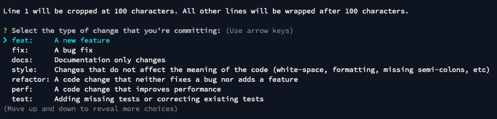
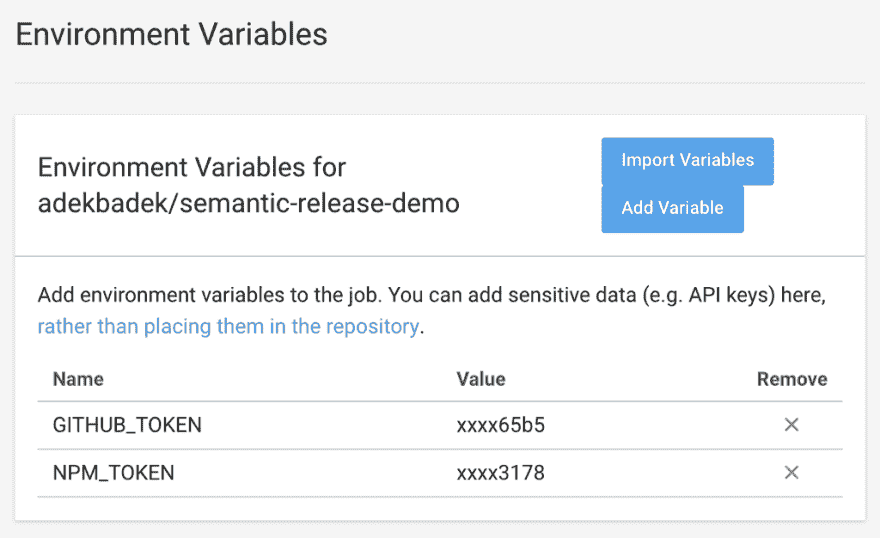

# 如何用语义发布&朋友来控制你的部署和版本控制

> 原文：<https://dev.to/bnevilleoneill/how-to-control-your-deployments-and-versioning-with-semantic-release-friends-2a09>

*不再猜测项目历史*

[](https://res.cloudinary.com/practicaldev/image/fetch/s--TH4Z2jka--/c_limit%2Cf_auto%2Cfl_progressive%2Cq_auto%2Cw_880/https://cdn-images-1.medium.com/max/1024/1%2A-0hawDLsHJI19yFsuGHU9Q.jpeg)

当谈到软件开发的生产力时，知识就是力量。项目管理工具行业——帮助开发团队了解他们所处的位置——是巨大的。但是软件开发人员有一个未被充分利用的工具，可以用来提供更多的信息——**版本控制。**

软件项目的生命被*发布*打断。在开放源码中，它们可以发布给包管理器。在软件商店中，我们通常谈论的是生产服务器的部署。

不管它们是什么，对于发布来说非常有用的知识是*它们何时*发生以及*它们包含了什么*。在一个足够大的项目中，保留变更日志和标记发布是很常见的，但是当你不得不[尽早发布并且经常发布](https://en.wikipedia.org/wiki/Release_early,_release_often)的时候，谁有时间做这些呢？

通常，它看起来像这样:

上一次发布发生在一周前，现在我们已经完成了一个新的、必要的特性，让我们再做一个。

还有什么发生了变化，总体变化的规模/影响有多大，这个问题仍然没有答案。实质上，我们只是希望我们没有忘记任何重要的事情。

[](https://logrocket.com/signup/)

### 因此，让我们将这一切自动化吧

这一切都始于一条**提交消息**。结构化提交消息将是自动化过程的基础。另一个使用的 git 实体是一个**标签**——它将标记每个版本。根据自上一个版本以来提交消息中的信息，将准备下一个版本——或者不准备，如果自上一个版本以来的更改不需要它。整洁，对不对？

*以下所有内容在该存储库中均可用:*

[adekbadek/semantic-release-demo](https://github.com/adekbadek/semantic-release-demo)

#### [步骤 1](https://github.com/adekbadek/semantic-release-demo/commit/7de4583e2f3288fcc55ec10190d40525988a660e) :结构化提交消息

首先，帮助构建提交消息:[提交](https://commitizen.github.io/cz-cli/)。用$ npm i -D commitizen 安装它，然后设置它使用[常规变更日志](https://github.com/conventional-changelog/conventional-changelog):$ npx commit izen init cz-conventi on-changelog-D-E。然后添加一个将调用 git-cz(commit izen 的二进制文件)的 npm 脚本，在 git 中暂存更改后，运行它。现在您应该会看到这个欢迎提示:

[](https://res.cloudinary.com/practicaldev/image/fetch/s--WfNun-Vx--/c_limit%2Cf_auto%2Cfl_progressive%2Cq_auto%2Cw_880/https://cdn-images-1.medium.com/max/814/1%2Ai-C_2JpIMgaRbVeaL3qa8g.png)

#### 第二步:确保符合 git 挂钩

很好。但是和其他人以及你未来的自己一起工作意味着有人可能会忘记使用 commitizen 并破坏整个系统。幸运的是，git 提供了一个叫做[钩子](https://git-scm.com/book/en/v2/Customizing-Git-Git-Hooks)的东西！如果你调查。git/hooks 一个新的存储库，你会看到一堆*。样本文件——钩子只是 bash 脚本，当某些动作发生时就会触发。但是当你有 npm 的时候，谁会在 bash 中编码呢？只需$ npm i -D husky 并观察 hooks 文件夹中填充了您不必编写脚本。 [Husky](https://github.com/typicode/husky) 是一个基于 package.json 中的 config 做挂钩业务的工具

现在让我们为这些提交消息获取一个 linter。首先安装它—$ NPM I-D[@ commit link](http://twitter.com/commitlint)/{ config-conventi on，cli}。然后，创建 commit list . config . js 配置文件:

```
module.exports = {extends: ['[@commitlint/config-conventional](http://twitter.com/commitlint/config-conventional)']} 
```

之后，在 package.json 中为 husky 提供一些信息:

```
“husky”: {
  “hooks”: {
    “commit-msg”: “commitlint -E HUSKY\_GIT\_PARAMS”
  } 
} 
```

就是这样！尝试将文件添加到 git staging 中，并使用一条莫名其妙的提交消息提交——husky 要咬人了！

#### 第三步:持续集成

现在我们保证了提交消息是有意义的(或者至少是格式化的)。本教程主角时间:输入语义-发布:$ npm i -D 语义-发布。与此同时，添加一个 npm 脚本来调用它(只是“语义发布”:“语义发布”)。

默认情况下，该工具旨在在 npm 上发布——如果您的计划中没有，那么必须执行一些默认配置覆盖。在 package.json 中添加一个“release”键，内容如下:

```
"plugins": [
  "[@semantic](http://twitter.com/semantic)-release/commit-analyzer",
  "[@semantic](http://twitter.com/semantic)-release/release-notes-generator",
  [
    "[@semantic](http://twitter.com/semantic)-release/npm",
    {
      "npmPublish": false
    }
  ],
  "[@semantic](http://twitter.com/semantic)-release/github"
] 
```

Semantic-release 将在 GitHub(和 npm)中完成它的工作，从 CI 服务器运行——在本例中是 CircleCI。因此，它需要通过*令牌*访问 GitHub 和 npm，这些令牌必须添加到 CI 的设置中:

[](https://res.cloudinary.com/practicaldev/image/fetch/s--jqHii0iJ--/c_limit%2Cf_auto%2Cfl_progressive%2Cq_auto%2Cw_880/https://cdn-images-1.medium.com/max/1024/1%2AUU1v3xMShYEaK0jq2zix3w.png) 

<figcaption>(不打算在 NPM 上发布就忽略 NPM _ TOKEN)</figcaption>

如您所见，令牌需要作为名为 GITHUB_TOKEN 和 NPM_TOKEN 的环境变量可用。现在让我们为 CircleCI 添加一个名为。circle ci/config . yml——它有点臃肿，所以你可以从这里复制它。

一切都准备好了！如果 CI 看到一个应该触发发布的 commit 消息(就像那些以 feat 或 fix 开始的消息)，所有这些都会自动发生。GitHub 上将发布一个版本和标签，除非有不同的配置，npm 上将发布一个新的包版本。

很好。

#### 第四步:生成*变更日志*

但是，有一个问题。实际上是两个。在发布之后，package.json 中的 version 字段保持不变，那么对以后有帮助的变更日志在哪里呢？别担心，只差两个变化:

首先安装一些额外的包:$ NPM I-D[@ semantic](http://twitter.com/semantic)-release/changelog[@ semantic](http://twitter.com/semantic)-release/git。然后，将这个配置添加到 package.json:
的“release”部分

```
"prepare": [
   "[@semantic](http://twitter.com/semantic)-release/changelog",
   "[@semantic](http://twitter.com/semantic)-release/npm",
   {
    "path": "[@semantic](http://twitter.com/semantic)-release/git",
     "assets": [
      "package.json",
      "package-lock.json",
      "CHANGELOG.md"
    ],
    "message": "chore(release): ${nextRelease.version} [skip ci]\n\n${nextRelease.notes}"
  }
] 
```

这将告诉 semantic-release 生成一个变更日志，然后在版本发布完成后添加一个提交。你可以在这个部分调整更多的设置，更多信息请访问[语义发布文档](https://semantic-release.gitbook.io/semantic-release/)。

有了这样的设置，发布将不会是一时兴起，而是基于代码的变化。当它发生时，将会生成一个变更日志，这样每个人都知道*在随后的版本中*发生了什么，以及*什么时候*发生了。

### 这些版本号是什么意思？

正如你可能注意到的，一个发布被标记为*版本*。使用语义发布，版本中的数字遵循一个叫做[语义版本化](https://semver.org/)(又名 SemVer)的系统。简而言之，这些表示**大调**、**小调**和**补丁**版本。当添加向后兼容的错误修复时，补丁号会增加，次要:向后兼容的功能，主要:重大更改(与之前的版本不兼容)。

语义版本化对于你的用户(或者客户)来说是很重要的——这样他们就知道他们对一个新版本有什么期望，以及自从他们最后一次使用/看到这个项目以来有什么变化。如果某人使用的上一个版本是 1.0.1，而当前版本是 1.1.42，那么他们知道在此期间，错误修复比添加的功能要多得多。

语义版本化可以与[情感版本化](http://sentimentalversioning.org/)相对，在情感版本化中，版本号以不一致的方式递增，实际上它们没有任何意义。

### 有何不可？

所有这些设置可能看起来有点大材小用，对于由一个人维护的小型项目来说可能是这样。但是我已经感谢过自己很多次了，因为我在一开始就设置了它，我确信我会尽可能地再次使用它。在 git 中拥有如此多的信息非常令人放心，因为它不会过时，并且与代码紧密相关。

至于其他疑虑:

> 我只需要看一眼 git log diff 就可以了。

从本质上来说，日志不应该被完整地阅读。它的信噪比很弱。

> 结构化提交消息实在是太烦人了！

有一个不可读的提交历史更是如此。尝试在没有任何关于何时引入了 bug 的信息的情况下进行调试。

> 我很习惯无意义的提交消息…

必须指定提交的内容会让开发人员对提交的更改三思而行。如果您不确定提交的类型，可能更改也不是很清楚？

感谢阅读！

### Plug: [LogRocket](https://logrocket.com/signup/) ，一款适用于网络应用的 DVR

[](https://logrocket.com/signup/)

<figcaption>[https://logrocket.com/signup/](https://logrocket.com/signup/)</figcaption>

LogRocket 是一个前端日志工具，可以让你回放问题，就像它们发生在你自己的浏览器中一样。LogRocket 不需要猜测错误发生的原因，也不需要向用户询问截图和日志转储，而是让您重放会话以快速了解哪里出错了。它可以与任何应用程序完美配合，不管是什么框架，并且有插件可以记录来自 Redux、Vuex 和@ngrx/store 的额外上下文。

除了记录 Redux 操作和状态，LogRocket 还记录控制台日志、JavaScript 错误、堆栈跟踪、带有头+正文的网络请求/响应、浏览器元数据和自定义日志。它还使用 DOM 来记录页面上的 HTML 和 CSS，甚至为最复杂的单页面应用程序重新创建像素级完美视频。

免费试用。

* * *